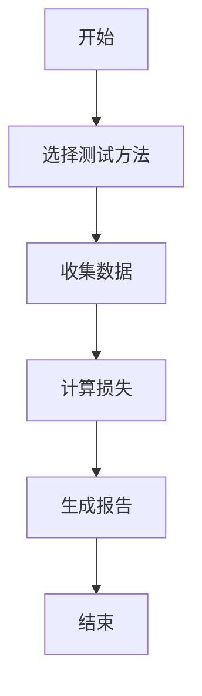
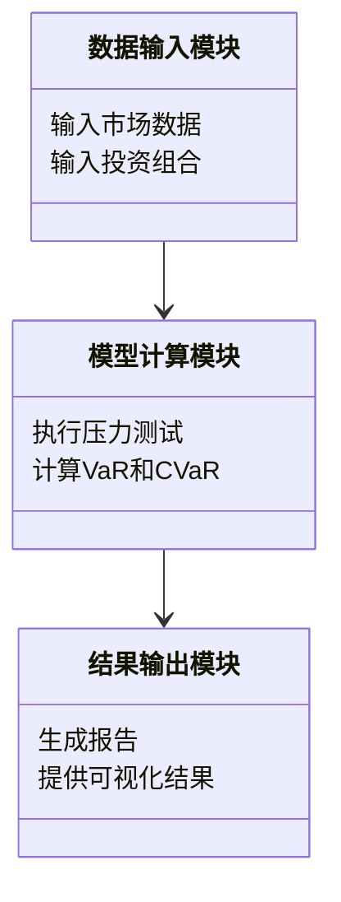

                 


# 投资组合压力测试：评估极端市场情况下的风险

---

## 关键词：
- 投资组合压力测试
- 极端市场风险
- 金融风险管理
- VaR（Value at Risk）
- CVaR（Conditional Value at Risk）

---

## 摘要：
投资组合压力测试是评估投资组合在极端市场条件下的潜在损失的重要工具。本文详细探讨了压力测试的核心概念、方法论、系统架构及实际应用，帮助读者理解如何在极端市场中管理投资组合风险。

---

## 第一部分：投资组合压力测试概述

### 第1章：投资组合压力测试的定义与目的

#### 1.1 投资组合压力测试的定义
压力测试是一种评估投资组合在极端市场条件下的潜在损失的方法，旨在帮助投资者识别和应对潜在风险。

#### 1.2 压力测试的目的
- **识别风险**：发现投资组合在极端情况下的潜在损失。
- **制定应对策略**：通过模拟极端市场，制定风险管理措施。
- **评估资本充足性**：确保投资组合在极端情况下有足够的资本支持。

#### 1.3 压力测试的重要性
在2008年金融危机后，压力测试成为金融机构风险管理的核心工具，帮助机构更好地应对市场波动。

---

### 第2章：投资组合压力测试的核心概念

#### 2.1 投资组合风险
- **系统性风险**：市场整体波动带来的风险。
- **非系统性风险**：特定资产或行业带来的风险。

#### 2.2 极端市场情况的定义
- **市场崩盘**：市场急剧下跌。
- **黑天鹅事件**：低概率、高影响的事件。
- **灰犀牛事件**：高概率、高影响的事件。

#### 2.3 压力测试的指标
- **VaR**：在特定置信水平下，投资组合的最大可能损失。
- **CVaR**：在VaR的基础上，考虑超过VaR的潜在损失。

---

## 第二部分：压力测试的算法原理

### 第3章：压力测试的主要方法

#### 3.1 历史模拟法
- **步骤**：
  1. 收集历史市场数据。
  2. 计算投资组合在历史数据中的表现。
  3. 确定极端情况下的损失。
- **优点**：基于实际数据，结果可靠。
- **缺点**：无法预测未发生的情况。

#### 3.2 蒙特卡洛模拟法
- **步骤**：
  1. 假设资产回报的分布模型。
  2. 生成大量模拟市场情景。
  3. 计算投资组合在不同情景下的表现。
- **优点**：可以模拟未发生的情况。
- **缺点**：依赖模型假设。

#### 3.3 情景分析法
- **步骤**：
  1. 定义极端市场情景。
  2. 计算投资组合在不同情景下的表现。
- **优点**：灵活性高。
- **缺点**：情景定义主观。

---

### 第4章：压力测试的数学模型

#### 4.1 VaR模型
$$VaR = \text{在置信水平}\alpha\text{下，投资组合的最大损失}$$
- 计算方法：基于历史数据或假设分布。

#### 4.2 CVaR模型
$$CVaR = \text{超过VaR的平均损失}$$
- 用于衡量尾部风险。

#### 4.3 算法流程图


---

## 第三部分：压力测试的系统架构

### 第5章：系统架构设计

#### 5.1 系统模块
- 数据输入模块：收集市场数据。
- 模型计算模块：执行压力测试。
- 结果输出模块：生成报告。

#### 5.2 系统架构图


#### 5.3 接口设计
- 数据接口：API调用。
- 报告接口：生成PDF或Excel报告。

---

## 第四部分：项目实战

### 第6章：压力测试的Python实现

#### 6.1 环境安装
```bash
pip install numpy pandas matplotlib
```

#### 6.2 核心代码
```python
import numpy as np
import pandas as pd

def calculate_var(portfolio_returns, confidence_level=0.95):
    sorted_returns = np.sort(portfolio_returns)
    var_index = int(len(sorted_returns) * (1 - confidence_level))
    var = sorted_returns[var_index]
    return var

def calculate_cvar(portfolio_returns, confidence_level=0.95):
    var = calculate_var(portfolio_returns, confidence_level)
    mask = portfolio_returns <= var
    cvar = np.mean(portfolio_returns[mask])
    return cvar

# 示例数据
returns = pd.Series(np.random.normal(0, 1, 1000))
var_95 = calculate_var(returns, 0.95)
cvar_95 = calculate_cvar(returns, 0.95)

print(f"VaR at 95% confidence: {var_95}")
print(f"CVaR at 95% confidence: {cvar_95}")
```

---

## 第五部分：最佳实践

### 第7章：压力测试的注意事项

#### 7.1 注意事项
- 数据质量：确保数据准确性和完整性。
- 模型选择：根据具体情况选择合适的方法。
- 结果解读：结合市场背景分析。

#### 7.2 小结
压力测试是投资组合风险管理的重要工具，通过合理选择方法和模型，可以有效评估和应对极端市场风险。

---

## 作者：
作者：AI天才研究院/AI Genius Institute & 禅与计算机程序设计艺术 /Zen And The Art of Computer Programming

