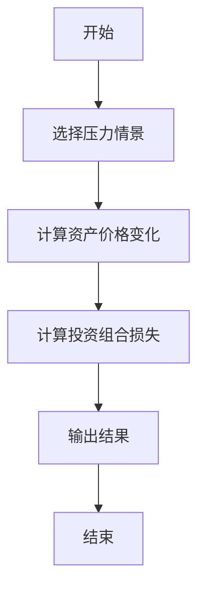

                 


# 投资组合压力测试：评估极端情景下的风险敞口

> 关键词：投资组合压力测试，风险管理，极端情景，风险敞口，VaR，CVaR，系统架构

> 摘要：本文深入探讨了投资组合压力测试的核心概念、数学模型、系统架构及实际应用。通过分析极端情景下的风险敞口，我们介绍了压力测试的定义、原理、常用方法及其实现过程。文章结合理论与实践，为读者提供了全面的理解和实用的指导。

---

## 第一部分: 投资组合压力测试概述

### 第1章: 投资组合压力测试的背景与重要性

#### 1.1 投资组合压力测试的定义与目标

投资组合压力测试是一种评估在极端市场条件下投资组合可能承受的损失的方法。其目标在于识别潜在风险，确保投资组合在不利情景下仍能保持稳健。压力测试通过模拟极端市场环境，帮助投资者和机构制定有效的风险管理策略。

- **定义**：压力测试是对投资组合在极端市场条件下的表现进行模拟，以评估其承受损失的能力。
- **目标**：识别潜在风险，评估投资组合的稳定性，制定风险管理措施。

#### 1.2 压力测试的适用场景

压力测试广泛应用于金融行业的风险管理，尤其是在金融危机期间，机构通过压力测试评估其资本充足性。此外，压力测试还用于投资组合优化和资产配置决策。

- **金融危机中的应用**：2008年金融危机后，压力测试成为监管机构评估银行资本充足性的标准工具。
- **机构内部风险控制**：机构通过压力测试评估投资组合在极端市场条件下的表现，制定风险管理策略。

#### 1.3 压力测试的边界与外延

压力测试的应用范围和限制需明确，同时与其他风险管理工具如VaR、CVaR等进行对比分析，以全面理解其作用和适用性。

- **适用范围**：评估极端市场条件下的投资组合风险。
- **局限性**：假设极端情景可能无法完全反映实际市场情况，且模型依赖历史数据和假设条件。

---

### 第2章: 投资组合压力测试的核心概念与联系

#### 2.1 压力测试的核心原理

压力测试基于假设极端市场情景，如市场崩盘、利率骤升等，模拟投资组合在这些情景下的表现，评估其承受的损失。

- **风险敞口的定义**：投资组合在特定市场条件下的潜在损失。
- **压力情景的构建**：通过历史数据或假设情景，模拟极端市场条件。

#### 2.2 核心概念对比分析

压力测试与其他风险度量方法如VaR、CVaR有何不同？以下表格对比分析：

| 指标 | VaR | CVaR | 压力测试 |
|------|-----|------|----------|
| 定义 | 在一定置信水平下，可能的损失 | 在一定置信水平下，平均损失 | 模拟极端情景下的损失 |
| 优势 | 明确损失边界 | 更全面的风险度量 | 评估极端情况下的风险 |
| 局限 | 假设市场正常 | 计算复杂 | 情景假设可能不准确 |

#### 2.3 实体关系图


---

### 第3章: 投资组合压力测试的数学模型与算法

#### 3.1 波动率与风险度量

波动率是衡量资产价格变动程度的重要指标，常用于计算VaR。

- **VaR计算公式**：
  $$ VaR = \mu + z \times \sigma $$
  其中，$\mu$ 是均值，$z$ 是标准正态分布的分位数，$\sigma$ 是标准差。

#### 3.2 压力测试的算法流程



#### 3.3 CVaR模型

- **CVaR的定义**：在VaR的基础上，计算在超过VaR值情况下的平均损失。
- **CVaR计算公式**：
  $$ CVaR = \frac{1}{1-\alpha} \int_{\alpha}^{1} VaR(\alpha) d\alpha $$

---

## 第二部分: 投资组合压力测试的系统架构与实现

### 第4章: 系统架构设计

#### 4.1 系统功能设计

压力测试系统包括数据采集、情景模拟、风险计算和结果分析等功能模块。

- **数据采集模块**：收集历史市场数据、资产组合信息等。
- **情景模拟模块**：生成极端市场情景，如市场崩盘、利率骤升等。
- **风险计算模块**：计算投资组合在不同情景下的风险敞口。
- **结果分析模块**：生成报告，提供风险管理建议。

#### 4.2 系统架构图


---

## 第三部分: 项目实战与案例分析

### 第5章: 项目实战

#### 5.1 环境配置

- **工具安装**：安装Python、NumPy、Pandas等工具。
- **数据获取**：从金融数据源获取历史数据。

#### 5.2 核心代码实现

```python
import numpy as np
import pandas as pd

def compute VaR(returns, confidence_level):
    return np.percentile(returns, confidence_level)

# 示例数据
returns = np.random.normal(0, 0.1, 1000)
confidence_level = 95
VaR = compute VaR(returns, confidence_level)
print(f"VaR at {confidence_level}%: {VaR}")
```

---

### 第6章: 案例分析与结果解读

#### 6.1 案例分析

模拟市场崩盘情景，计算投资组合的VaR和CVaR，评估风险敞口。

#### 6.2 结果解读

通过分析结果，调整投资组合配置，降低潜在风险。

---

## 第四部分: 最佳实践与总结

### 第7章: 最佳实践

#### 7.1 实践总结

压力测试是评估极端情景下投资组合风险的重要工具，需结合历史数据和假设情景进行综合分析。

#### 7.2 注意事项

- 数据质量：确保数据准确可靠。
- 情景假设：合理选择极端情景，避免过度简化。
- 结果解读：结合实际情况，制定相应风险管理策略。

#### 7.3 拓展阅读

推荐相关书籍和文献，深入学习压力测试方法和风险管理技术。

---

## 作者

作者：AI天才研究院/AI Genius Institute & 禅与计算机程序设计艺术 /Zen And The Art of Computer Programming

---

通过以上结构和内容，我们系统地介绍了投资组合压力测试的概念、方法、实现和应用，帮助读者全面理解和应用这一重要的风险管理工具。

