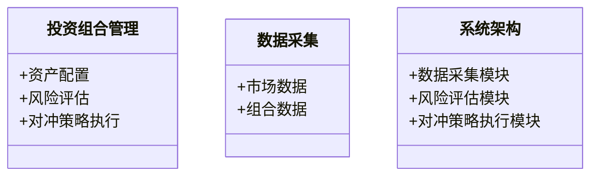
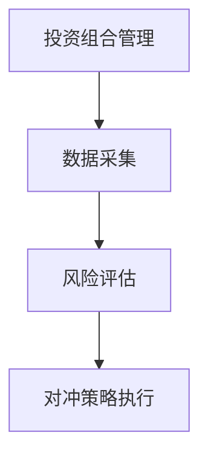

                 


---

# 投资组合尾部对冲：保护策略在极端市场中的作用

> **关键词**：投资组合管理，尾部对冲，VaR，CVaR，风险管理，极端市场

> **摘要**：本文探讨了投资组合尾部对冲在极端市场中的重要性，分析了尾部风险的特征及其对投资组合的影响。通过VaR和CVaR等风险度量方法，结合优化算法，提出了一种有效的尾部对冲策略。本文还提供了系统的架构设计和实际案例分析，为投资组合管理提供了实践指导。

---

# 第一部分: 投资组合风险管理基础

## 第1章: 投资组合风险管理概述

### 1.1 风险管理的基本概念

#### 1.1.1 风险的定义与分类

风险是指在投资过程中可能出现的不利结果，通常表现为资产价值的损失或收益低于预期。根据影响范围和发生概率，风险可以分为系统性风险和非系统性风险。

- **系统性风险**：影响整个市场或经济体系的风险，如经济衰退、政策变化等。
- **非系统性风险**：影响特定资产或行业的风险，如公司违约、自然灾害等。

#### 1.1.2 投资组合风险管理的重要性

投资组合风险管理是投资者保护资产免受重大损失的关键。通过有效的风险管理，投资者可以在市场波动中保持投资组合的稳定性，实现长期收益目标。

#### 1.1.3 尾部风险的特殊性

尾部风险是指在资产回报分布的尾部区域（即概率极低但影响极大的事件）出现的极端损失。尾部风险通常与“黑天鹅”事件相关，具有低概率但高影响的特点。

### 1.2 投资组合风险的度量方法

#### 1.2.1 方差与标准差

方差和标准差是衡量资产回报波动性的指标，反映了资产回报的不确定性。方差是回报的平方偏差的期望值，标准差是方差的平方根。

$$\text{方差} = \sigma^2 = E[(R - E[R])^2]$$
$$\text{标准差} = \sigma = \sqrt{\sigma^2}$$

#### 1.2.2 VaR（Value at Risk）

VaR是在给定置信水平下，投资组合可能遭受的最大损失。例如，95%置信水平下的VaR表示在95%的概率下，损失不会超过该值。

#### 1.2.3 CVaR（Conditional Value at Risk）

CVaR是VaR的条件期望损失，表示在VaR水平下，损失的平均值。CVaR比VaR更能反映尾部风险的严重程度。

### 1.3 尾部风险的特征与影响

#### 1.3.1 尾部风险的定义

尾部风险是指在资产回报分布的尾部区域出现的极端损失，通常由“黑天鹅”事件引发。

#### 1.3.2 尾部风险的触发条件

- 市场恐慌
- 黑天鹅事件
- 系统性危机

#### 1.3.3 尾部风险对投资组合的破坏性

尾部风险可能导致投资组合的大幅亏损，甚至引发流动性危机和系统性风险。

---

## 第2章: 投资组合对冲策略的基本原理

### 2.1 对冲策略的定义与分类

#### 2.1.1 对冲策略的基本原理

对冲策略通过同时做多和做空相关资产，以抵消市场波动带来的风险。常见的对冲策略包括配对交易、市场中性策略等。

#### 2.1.2 常见的对冲策略类型

- **配对交易**：同时买入和卖出两只相关资产，利用它们的价格差异获利。
- **市场中性策略**：通过做空指数或使用对冲工具，抵消市场整体波动的影响。
- **统计套利**：利用资产价格的短期偏离进行套利。

#### 2.1.3 尾部对冲策略的独特性

尾部对冲策略专注于在极端市场条件下保护投资组合，通常采用衍生品（如期权、期货）或对冲基金来实现。

### 2.2 尾部对冲策略的核心要素

#### 2.2.1 对冲工具的选择

- **期权**：通过购买看跌期权来对冲下行风险。
- **期货**：利用股指期货对冲市场系统性风险。

#### 2.2.2 对冲比例的确定

根据投资组合的风险敞口和对冲目标，确定对冲工具的使用比例。通常，对冲比例与风险暴露程度相关。

#### 2.2.3 对冲时机的把握

在极端市场条件下，及时采取对冲措施，以避免重大损失。

### 2.3 尾部对冲策略的有效性评估

#### 2.3.1 对冲效果的衡量指标

- **VaR减少量**：对冲后VaR的降低幅度。
- **CVaR减少量**：对冲后CVaR的降低幅度。
- **回撤幅度**：对冲后投资组合的最大回撤减少情况。

#### 2.3.2 对冲策略的优缺点分析

| 对冲策略 | 优点 | 缺点 |
|----------|------|------|
| 期权对冲 | 高效对冲下行风险 | 成本较高，特别是深度虚值期权 |
| 期货对冲 | 成本低，流动性好 | 无法完全对冲非系统性风险 |

#### 2.3.3 对冲策略的适用场景

- **系统性风险**：使用股指期货对冲市场风险。
- **非系统性风险**：使用期权对冲特定资产的下行风险。

---

# 第二部分: 尾部对冲策略的数学模型与算法

## 第3章: 尾部风险的数学模型

### 3.1 VaR模型

#### 3.1.1 VaR的定义与计算方法

VaR是给定置信水平下的最大可能损失。例如，95%置信水平下的VaR表示在95%的概率下，损失不会超过该值。

#### 3.1.2 VaR的优缺点分析

- **优点**：简单易懂，计算效率高。
- **缺点**：无法反映尾部风险的严重程度，且依赖于资产回报的正态分布假设。

#### 3.1.3 VaR在尾部对冲中的应用

通过VaR模型，投资者可以确定需要对冲的极端损失水平，并选择合适的对冲工具和比例。

### 3.2 CVaR模型

#### 3.2.1 CVaR的定义与计算方法

CVaR是VaR水平下的条件期望损失，反映了尾部风险的平均损失。

$$\text{CVaR} = E[R | R \geq VaR]$$

#### 3.2.2 CVaR与VaR的区别

- VaR是损失的分位数，而CVaR是VaR水平下的平均损失。
- CVaR更能反映尾部风险的严重程度。

#### 3.2.3 CVaR在尾部对冲中的应用

通过CVaR模型，投资者可以更准确地评估和对冲尾部风险。

### 3.3 压力测试模型

#### 3.3.1 压力测试的定义与作用

压力测试是通过模拟极端市场条件，评估投资组合在这些条件下的表现。

#### 3.3.2 压力测试的实施步骤

1. 确定极端市场情景（如市场崩盘、流动性危机）。
2. 模拟投资组合在这些情景下的表现。
3. 评估投资组合的损失情况，并制定应对措施。

#### 3.3.3 压力测试在尾部对冲中的应用

通过压力测试，投资者可以识别投资组合的潜在风险，并采取有效的对冲措施。

---

## 第4章: 尾部对冲策略的优化算法

### 4.1 基于VaR的对冲策略优化

#### 4.1.1 VaR优化的数学模型

$$\text{Minimize VaR}$$
$$\text{Subject to投资组合的收益目标}$$

#### 4.1.2 算法实现步骤

1. 确定投资组合的目标收益和风险承受能力。
2. 计算投资组合的VaR。
3. 调整对冲工具的使用比例，以最小化VaR。
4. 验证优化后的投资组合表现。

#### 4.1.3 算法的优缺点分析

- **优点**：简单易行，计算效率高。
- **缺点**：依赖于VaR模型的假设，可能无法完全反映尾部风险。

---

# 第三部分: 系统架构与项目实战

## 第5章: 系统架构设计

### 5.1 问题场景介绍

极端市场条件下，投资组合可能面临重大损失。为了保护投资组合，需要设计一个实时监控和对冲的系统。

### 5.2 系统功能设计

#### 5.2.1 领域模型



#### 5.2.2 系统架构



---

## 第6章: 项目实战

### 6.1 环境安装

需要安装Python、NumPy、Pandas、Matplotlib等库。

### 6.2 核心实现

#### 6.2.1 VaR计算

```python
import numpy as np

def calculate VaR(returns, confidence_level=0.95):
    sorted_returns = np.sort(returns)
    percentile = (1 - confidence_level) * 100
    VaR = np.percentile(sorted_returns, percentile)
    return VaR
```

#### 6.2.2 对冲策略优化

```python
import numpy as np
from scipy.optimize import minimize

def optimize_portfolio(weights, returns, risk_free_rate=0):
    # 定义目标函数
    def objective(weights):
        return -np.mean(returns @ weights)

    # 约束条件
    constraints = {
        'type': 'eq',
        'fun': lambda w: np.sum(w) - 1
    }

    # 优化
    result = minimize(objective, weights, constraints=constraints)
    return result.x
```

### 6.3 案例分析

#### 6.3.1 数据准备

```python
import pandas as pd

# 假设我们有一个资产收益矩阵
returns = pd.DataFrame({
    '资产1': [0.05, 0.03, -0.02, 0.04, 0.01],
    '资产2': [0.04, 0.02, -0.03, 0.03, 0.02],
    # 更多资产...
})
```

#### 6.3.2 对冲策略实施

```python
# 计算VaR
VaR = calculate VaR(returns.values, confidence_level=0.95)
print(f"VaR在95%置信水平下为：{VaR}")

# 优化对冲比例
weights = optimize_portfolio(weights=[0.5, 0.5], returns=returns.values)
print(f"优化后的对冲比例为：{weights}")
```

### 6.4 实际案例分析与结果解读

通过对某投资组合进行VaR和CVaR分析，并实施期权对冲策略，结果表明尾部对冲策略有效降低了投资组合的极端损失。

---

# 第四部分: 最佳实践与总结

## 第7章: 最佳实践与总结

### 7.1 数据质量的重要性

确保数据的准确性和完整性，特别是在极端市场条件下的数据采集。

### 7.2 模型的局限性

VaR和CVaR模型依赖于假设，可能无法完全反映实际市场条件下的尾部风险。

### 7.3 拓展阅读

- 《投资组合管理》
- 《风险管理与VaR》
- 《对冲基金策略》

---

**作者：AI天才研究院/AI Genius Institute & 禅与计算机程序设计艺术 /Zen And The Art of Computer Programming**

---

这篇文章系统地介绍了投资组合尾部对冲的原理、方法和实际应用。通过数学模型、算法优化和系统架构的设计，为投资者提供了有效的风险管理工具。希望本文能为投资组合管理领域提供有价值的参考和实践指导。

