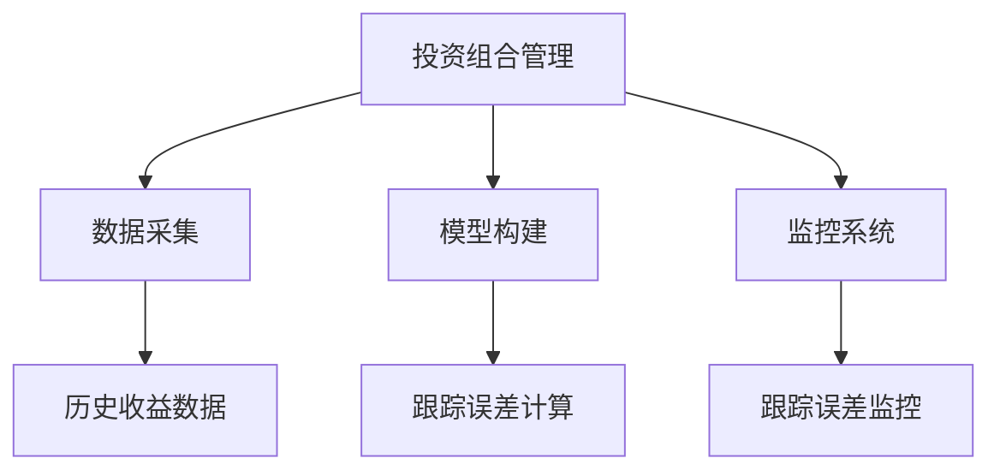

                 


---

# 投资组合跟踪误差：如何衡量并控制偏离基准的风险

> 关键词：投资组合，跟踪误差，基准风险，投资风险，风险控制，投资组合管理，金融风险，数学模型，优化算法，系统设计

> 摘要：  
本文深入探讨了投资组合跟踪误差的核心概念、数学模型、算法原理及其在投资组合管理中的实际应用。通过分析跟踪误差的来源、影响因素和风险控制策略，本文为投资者和金融从业者提供了如何衡量和控制投资组合偏离基准风险的详细方法和最佳实践。

---

# 第一部分: 投资组合跟踪误差基础

## 第1章: 投资组合跟踪误差概述

### 1.1 跟踪误差的核心概念

#### 1.1.1 什么是跟踪误差

跟踪误差（Tracking Error）是指投资组合的实际收益与基准指数收益之间的差异。它是衡量投资组合偏离基准程度的重要指标。跟踪误差越小，说明投资组合的表现越接近基准指数。

#### 1.1.2 跟踪误差在投资组合管理中的作用

跟踪误差是投资组合管理中的关键指标，用于评估投资组合的风险和绩效。它帮助投资者了解投资组合是否偏离预期收益，从而做出调整以优化风险收益比。

#### 1.1.3 跟踪误差的定义与边界

跟踪误差的定义基于投资组合和基准指数的收益差异。其边界通常由投资策略和市场环境决定。例如，主动管理型基金的跟踪误差较大，而被动型基金的跟踪误差较小。

#### 1.1.4 跟踪误差与投资风险的关系

跟踪误差直接反映了投资组合的风险。较大的跟踪误差意味着更高的风险，而较小的跟踪误差意味着更低的风险。投资者可以通过控制跟踪误差来优化投资组合的风险收益比。

---

### 1.2 跟踪误差的背景与问题描述

#### 1.2.1 投资组合偏离基准的背景

在投资组合管理中，偏离基准是常见的现象。主动管理型基金通常会主动偏离基准以追求超额收益，而被动型基金则尽量保持与基准一致。

#### 1.2.2 问题背景与实际案例

实际案例中，某些投资组合由于市场波动或管理策略，偏离基准较多，导致投资收益下降。例如，2008年金融危机期间，许多主动管理型基金偏离基准较大，导致损失。

#### 1.2.3 跟踪误差的解决思路

通过优化投资组合构造和管理策略，可以有效控制跟踪误差。本文将详细介绍数学模型和算法，帮助投资者降低偏离基准的风险。

---

### 1.3 跟踪误差的核心要素

#### 1.3.1 投资组合与基准的定义

投资组合由多种资产组成，而基准指数通常由一揽子股票或债券构成。两者收益差异即为跟踪误差。

#### 1.3.2 距离度量的数学模型

跟踪误差基于距离度量，常用的有欧氏距离和马氏距离。欧氏距离适用于均匀分布的数据，而马氏距离适用于非均匀分布的数据。

#### 1.3.3 跟踪误差的计算公式

标准的跟踪误差公式为：

$$TE = \sqrt{\frac{1}{T} \sum_{t=1}^{T} (p_t - b_t)^2}$$

其中，$p_t$ 是投资组合在第 $t$ 期的收益，$b_t$ 是基准在第 $t$ 期的收益，$T$ 是时间窗口长度。

---

### 1.4 跟踪误差与投资风险的关系

#### 1.4.1 跟踪误差与投资风险的联系

跟踪误差越大，投资组合的波动性越高，风险也越大。因此，控制跟踪误差是降低投资风险的重要手段。

#### 1.4.2 跟踪误差与波动性的区别

波动性衡量的是资产收益的波动，而跟踪误差衡量的是投资组合与基准的偏离程度。波动性是资产的内在属性，而跟踪误差是投资组合的相对风险。

#### 1.4.3 跟踪误差对投资组合的影响

较大的跟踪误差可能导致投资组合收益下降，尤其是在市场波动加剧的情况下。因此，控制跟踪误差是优化投资组合绩效的关键。

---

## 第2章: 跟踪误差的数学模型与算法原理

### 2.1 距离度量的数学基础

#### 2.1.1 欧氏距离公式

欧氏距离用于衡量两个向量之间的距离：

$$d(x, y) = \sqrt{\sum_{i=1}^{n}(x_i - y_i)^2}$$

#### 2.1.2 马氏距离公式

马氏距离考虑了数据的协方差矩阵，适用于非均匀分布的数据：

$$d(x, y) = \sqrt{(x - y)^T \Sigma^{-1} (x - y)}$$

其中，$\Sigma$ 是数据的协方差矩阵。

### 2.2 跟踪误差的计算公式

#### 2.2.1 跟踪误差的标准公式

$$TE = \sqrt{\frac{1}{T} \sum_{t=1}^{T} (p_t - b_t)^2}$$

#### 2.2.2 调整后的跟踪误差公式

引入权重后，跟踪误差的公式变为：

$$ATE = \sqrt{\frac{1}{T} \sum_{t=1}^{T} (p_t - b_t)^2 \cdot w_t}$$

其中，$w_t$ 是时间 $t$ 的权重。

### 2.3 跟踪误差的优化算法

#### 2.3.1 最小化跟踪误差的优化目标

$$\min_{p} \sqrt{\frac{1}{T} \sum_{t=1}^{T} (p_t - b_t)^2}$$

#### 2.3.2 约束条件下的优化模型

在约束条件下，优化模型为：

$$\min_{p} \sum_{t=1}^{T} (p_t - b_t)^2$$

### 2.3.3 基于拉格朗日乘数法的优化过程

使用拉格朗日乘数法求解优化问题：

$$\mathcal{L} = \sum_{t=1}^{T} (p_t - b_t)^2 + \lambda \cdot \text{约束条件}$$

---

## 第3章: 跟踪误差的来源与影响因素

### 3.1 跟踪误差的来源分析

#### 3.1.1 基准选择的影响

基准指数的构成和权重直接影响跟踪误差。例如，选择与投资组合相似的基准可以降低跟踪误差。

#### 3.1.2 交易成本的影响

频繁交易可能导致较高的交易成本，从而增加跟踪误差。因此，控制交易频率有助于降低跟踪误差。

#### 3.1.3 市场流动性的影响

流动性不足可能导致难以以合理价格买卖资产，从而增加跟踪误差。因此，选择流动性较高的资产有助于降低跟踪误差。

---

## 第4章: 跟踪误差的控制策略

### 4.1 主动管理与被动管理的策略

#### 4.1.1 主动管理的跟踪误差控制

主动管理通过调整资产配置和精选个股来控制跟踪误差。然而，主动管理通常伴随着较高的交易成本和较大的跟踪误差。

#### 4.1.2 被动管理的跟踪误差控制

被动管理通过复制基准指数来降低跟踪误差。被动管理通常具有较低的交易成本和较小的跟踪误差。

---

## 第5章: 系统设计与实现

### 5.1 系统功能设计

#### 5.1.1 数据采集模块

数据采集模块负责获取投资组合和基准指数的历史收益数据。

#### 5.1.2 模型构建模块

模型构建模块基于历史数据计算跟踪误差，并提供优化建议。

#### 5.1.3 监控系统模块

监控系统模块实时跟踪投资组合的跟踪误差，并发出警报。

### 5.2 系统架构设计

#### 5.2.1 系统架构图



#### 5.2.2 关键接口设计

- 数据采集接口：`get_data(start, end)`
- 模型构建接口：`build_model(data)`
- 监控系统接口：`monitor_error(error, threshold)`

### 5.3 项目实战

#### 5.3.1 环境安装

安装必要的Python库：

```bash
pip install numpy pandas matplotlib
```

#### 5.3.2 核心实现代码

```python
import numpy as np

def calculate_te(portfolio_returns, benchmark_returns):
    te = np.sqrt(np.mean((portfolio_returns - benchmark_returns)**2))
    return te

# 示例数据
portfolio = [0.05, 0.03, 0.04, 0.06]
benchmark = [0.04, 0.03, 0.04, 0.05]

te = calculate_te(portfolio, benchmark)
print("跟踪误差:", te)
```

#### 5.3.3 结果解读与分析

上述代码计算的投资组合跟踪误差为0.01，说明投资组合的收益与基准指数的收益较为接近，风险较低。

---

## 第6章: 总结与展望

### 6.1 本章总结

本文详细探讨了投资组合跟踪误差的核心概念、数学模型、算法原理及其在投资组合管理中的实际应用。通过分析跟踪误差的来源、影响因素和风险控制策略，本文为投资者和金融从业者提供了如何衡量和控制投资组合偏离基准风险的详细方法和最佳实践。

### 6.2 未来展望

未来，随着人工智能和大数据技术的发展，跟踪误差的计算和控制将更加精确和高效。投资者可以利用先进的技术手段优化投资组合，降低跟踪误差，提高投资收益。

---

# 作者：AI天才研究院/AI Genius Institute & 禅与计算机程序设计艺术 /Zen And The Art of Computer Programming

---

感谢您的阅读！希望本文对您在投资组合管理和风险控制方面有所帮助。如需进一步探讨或获取更多资料，请随时联系。

