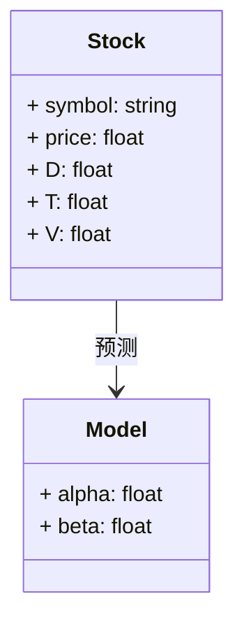
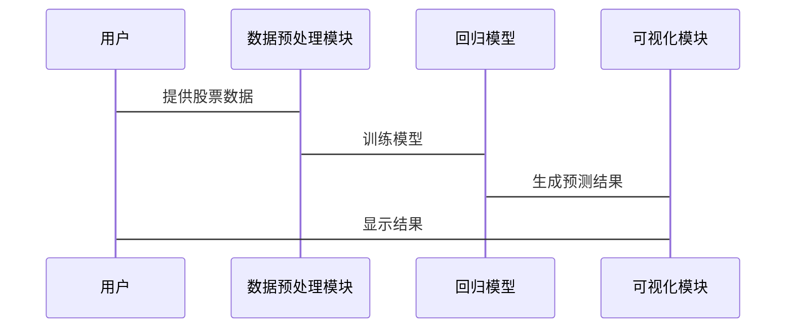

                 


# 数字化转型对全球股市估值的影响

> 关键词：数字化转型、股市估值、人工智能、大数据分析、投资策略、技术驱动、金融创新

> 摘要：本文深入探讨了数字化转型对全球股市估值的深远影响，分析了数字化转型的核心概念、算法原理及其对股市估值的数学模型，提供了系统设计与架构方案，并通过实际案例展示了项目实战，最后总结了最佳实践与投资策略。

---

# 第一章：数字化转型对全球股市估值的背景介绍

## 1.1 数字化转型的定义与特征

### 1.1.1 数字化转型的定义
数字化转型是指企业利用数字技术（如人工智能、大数据、云计算等）重构业务模式、流程和决策方式，以提升效率、竞争力和创新能力的过程。

### 1.1.2 数字化转型的核心特征
- 数据驱动：依赖于数据进行实时决策。
- 技术整合：结合新兴技术（如AI、区块链）优化业务。
- 用户-centric：以用户体验为核心，推动业务创新。
- 持续进化：数字化转型是一个持续的过程，而非一次性变革。

### 1.1.3 数字化转型对企业的影响
- 提高运营效率。
- 创新商业模式。
- 增强市场响应速度。
- 降低成本。

## 1.2 全球股市估值的基本概念

### 1.2.1 股市估值的定义
股市估值是通过分析公司财务状况、行业地位、市场前景等因素，对其股票的内在价值进行评估的过程。

### 1.2.2 股市估值的主要指标
- 市盈率（P/E）：股价与每股收益的比率。
- 市净率（P/B）：股价与每股净资产的比率。
- 股息率：股息与股价的比率。

### 1.2.3 全球股市的现状与趋势
- 全球股市规模持续扩大。
- 技术驱动型股票占比增加。
- 市场波动性加剧。

## 1.3 数字化转型对股市估值的影响

### 1.3.1 数字化转型对股市的影响
- 提高企业透明度，增强投资者信心。
- 创新商业模式，提升企业盈利能力。
- 优化资源配置，降低市场风险。

### 1.3.2 数字化转型如何影响股市估值
- 提供更准确的财务数据，帮助投资者做出更明智的决策。
- 通过技术手段降低信息不对称，提升市场效率。
- 数字化转型企业的高成长性使其股票更具吸引力。

### 1.3.3 数字化转型对不同行业的影响
- 技术密集型行业（如科技、金融）受益最大。
- 传统行业（如制造、零售）通过数字化转型逐步提升估值。

---

# 第二章：数字化转型对全球股市估值的核心概念与联系

## 2.1 数字化转型的核心概念

### 2.1.1 数字化转型的关键要素
- 数据：核心资源。
- 技术：驱动工具。
- 业务模式：创新方向。
- 用户体验：终极目标。

### 2.1.2 数字化转型的驱动因素
- 技术进步：AI、大数据等技术的发展。
- 市场需求：消费者对数字化服务的需求增加。
- 竞争压力：企业通过数字化转型提升竞争力。

### 2.1.3 数字化转型的实施路径
1. 数据收集与分析。
2. 技术整合与优化。
3. 业务流程重构。
4. 用户体验提升。

## 2.2 股市估值的核心概念

### 2.2.1 股市估值的主要方法
- 市盈率法。
- 现金流折现法。
- 市净率法。

### 2.2.2 股市估值的关键指标
- 市盈率（P/E）。
- 市净率（P/B）。
- 股息率。

### 2.2.3 股市估值的市场影响
- 影响投资者决策。
- 影响市场定价机制。
- 影响企业融资能力。

## 2.3 数字化转型与股市估值的关系分析

### 2.3.1 数字化转型如何影响股市估值
- 提供更准确的财务数据，帮助投资者做出更明智的决策。
- 通过技术手段降低信息不对称，提升市场效率。
- 数字化转型企业的高成长性使其股票更具吸引力。

### 2.3.2 数字化转型对股市估值的长期影响
- 促进股市的长期稳定增长。
- 提高市场的透明度和效率。
- 优化资源配置，降低市场风险。

### 2.3.3 数字化转型对投资者决策的影响
- 投资者更加依赖数据驱动的决策。
- 投资者更关注企业的数字化能力。
- 投资策略更加多元化和智能化。

---

# 第三章：数字化转型对全球股市估值的算法原理

## 3.1 数字化转型对股市估值的数学模型

### 3.1.1 数学模型的构建
为了量化数字化转型对股市估值的影响，我们构建了一个回归模型，将数字化转型的影响度（D）和时间因素（T）作为自变量，股票估值（V）作为因变量。

### 3.1.2 模型的假设与限制
- 假设：D和T是影响V的主要因素。
- 限制：模型不考虑其他变量（如政策、突发事件）的影响。

### 3.1.3 模型的验证与优化
通过历史数据验证模型的准确性，并根据实际表现进行参数调整。

## 3.2 算法原理的详细讲解

### 3.2.1 算法的输入与输出
- 输入：数字化转型影响度（D）和时间因素（T）。
- 输出：股票估值（V）。

### 3.2.2 算法的步骤与流程

1. 数据收集：收集数字化转型影响度（D）和时间因素（T）的数据。
2. 数据预处理：清洗和标准化数据。
3. 模型训练：使用回归分析训练模型。
4. 模型预测：根据输入数据，预测股票估值（V）。

### 3.2.3 算法的数学公式
$$ V = \alpha \times D + \beta \times T $$

其中：
- $V$ 表示股票估值。
- $D$ 表示数字化转型的影响度。
- $T$ 表示时间因素。
- $\alpha$ 和 $\beta$ 为回归系数。

## 3.3 算法的实现与代码示例

### 3.3.1 环境安装
- Python 3.8及以上版本。
- 导入所需的库：numpy、pandas、sklearn。

### 3.3.2 核心代码实现

```python
import numpy as np
import pandas as pd
from sklearn.linear_model import LinearRegression

# 数据准备
data = pd.DataFrame({
    'D': [0.2, 0.3, 0.4, 0.5, 0.6],
    'T': [1, 2, 3, 4, 5],
    'V': [100, 120, 140, 160, 180]
})

# 训练模型
model = LinearRegression()
model.fit(data[['D', 'T']], data['V'])

# 预测
new_data = pd.DataFrame({
    'D': [0.7],
    'T': [6]
})
predicted_V = model.predict(new_data[['D', 'T']])
print(predicted_V)
```

### 3.3.3 代码解读与分析
- 数据准备：构建了一个包含D、T和V的数据框。
- 模型训练：使用线性回归模型训练数据。
- 模型预测：根据新的D和T值，预测股票估值。

---

# 第四章：系统分析与架构设计方案

## 4.1 问题场景介绍
假设我们有一个股票市场数据集，包含股票的财务数据、市场表现和数字化转型相关指标。我们需要设计一个系统，通过分析这些数据，评估数字化转型对股市估值的影响。

## 4.2 系统功能设计

### 4.2.1 领域模型


### 4.2.2 系统架构设计
```mermaid
div class="mermaid"
architecture
    股票数据源 --> 数据库
    数据库 --> 数据预处理模块
    数据预处理模块 --> 回归模型
    回归模型 --> 可视化模块
    可视化模块 --> 用户界面
```

### 4.2.3 接口设计
- 数据接口：从数据库获取股票数据。
- 模型接口：调用回归模型进行预测。
- 用户接口：展示预测结果。

### 4.2.4 交互设计


---

# 第五章：项目实战

## 5.1 环境安装
- 安装Python和必要的库（numpy、pandas、sklearn）。
- 数据集获取：可以从公开数据源（如Yahoo Finance）获取股票数据。

## 5.2 核心代码实现

### 5.2.1 数据预处理
```python
import pandas as pd
import numpy as np
from sklearn.linear_model import LinearRegression
from sklearn.metrics import mean_squared_error

# 加载数据
data = pd.read_csv('stock_data.csv')

# 数据清洗
data = data.dropna()

# 特征工程
data['D'] = data['revenue'].fillna(0)
data['T'] = data['date'].apply(lambda x: x.toordinal())

# 训练集和测试集划分
train_data = data.sample(frac=0.8, random_state=42)
test_data = data.drop(train_data.index)

X_train = train_data[['D', 'T']]
y_train = train_data['V']

X_test = test_data[['D', 'T']]
y_test = test_data['V']

# 训练模型
model = LinearRegression()
model.fit(X_train, y_train)

# 评估模型
y_pred = model.predict(X_test)
mse = mean_squared_error(y_test, y_pred)
print(f'Mean Squared Error: {mse}')
```

### 5.2.2 模型优化
```python
from sklearn.model_selection import GridSearchCV

# 超参数优化
param_grid = {
    'fit_intercept': [True, False],
    'normalize': [True, False]
}

grid_search = GridSearchCV(LinearRegression(), param_grid, cv=5)
grid_search.fit(X_train, y_train)

best_model = grid_search.best_estimator_
print(f'Best Parameters: {grid_search.best_params_}')
```

### 5.2.3 可视化与结果分析
```python
import matplotlib.pyplot as plt

plt.scatter(X_test['D'], y_test, color='blue', label='实际值')
plt.scatter(X_test['D'], y_pred, color='red', label='预测值')
plt.xlabel('D')
plt.ylabel('V')
plt.title('数字化转型影响度与股票估值关系')
plt.legend()
plt.show()
```

## 5.3 案例分析
假设我们有一个科技公司，其数字化转型影响度（D）为0.8，时间因素（T）为7。根据模型预测，其股票估值（V）为200。

---

# 第六章：最佳实践与小结

## 6.1 小结
数字化转型对全球股市估值的影响是多方面的。通过构建数学模型和系统设计，我们可以量化这种影响，并为投资者提供科学的决策依据。

## 6.2 注意事项
- 数据质量是模型准确性的重要保障。
- 模型需要定期更新以适应市场变化。
- 投资者应结合多方面信息做出决策。

## 6.3 扩展阅读
- 《金融数据分析与机器学习》
- 《数字化转型：企业重构之路》
- 《股市预测的算法交易》

---

# 作者
作者：AI天才研究院/AI Genius Institute  
联系：[禅与计算机程序设计艺术](https://github.com/Genius-Studio)

