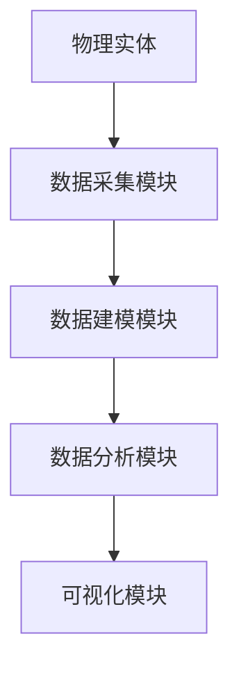
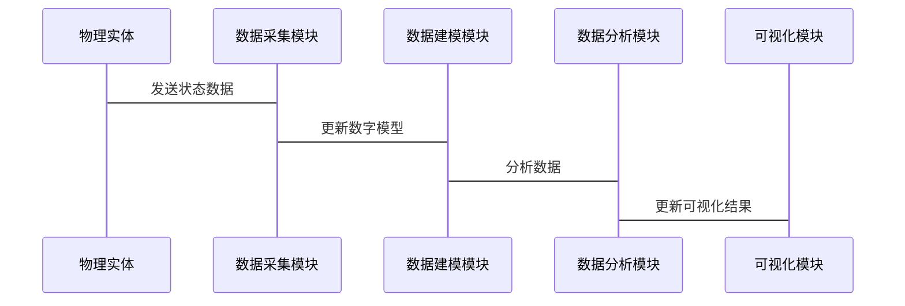

                 


# 数字孪生技术在工业领域的应用与投资机会

## 关键词：数字孪生，工业应用，投资机会，智能制造，数字建模，数据驱动

## 摘要：数字孪生技术通过在数字空间中创建物理实体的虚拟模型，实现了对工业系统的实时监控、优化和预测。本文详细探讨了数字孪生的核心概念、关键技术及其在工业领域的广泛应用，并分析了其背后的投资机会和市场潜力。通过案例分析和系统设计，本文为读者提供了深入的技术解读和商业洞察。

---

# 第1章：数字孪生技术概述

## 1.1 数字孪生的定义与背景

### 1.1.1 数字孪生的定义

数字孪生（Digital Twin）是指在数字空间中创建物理实体的虚拟模型，并通过实时数据更新，实现对物理实体的动态仿真、分析和优化。这种技术通过将物理世界与数字世界无缝连接，为工业系统提供了全新的管理和决策方式。

### 1.1.2 数字孪生的起源与发展

数字孪生的概念最早可以追溯到20世纪90年代的计算机仿真技术，但真正的发展始于物联网（IoT）和大数据技术的兴起。随着工业4.0和智能制造的推进，数字孪生逐渐成为工业数字化转型的核心技术之一。

### 1.1.3 数字孪生的核心特点

- **实时性**：数字孪生能够实时反映物理实体的状态和行为。
- **交互性**：用户可以通过数字模型与物理实体进行交互，实现远程控制和优化。
- **数据驱动**：数字孪生依赖于多源数据的采集和分析，能够基于数据进行动态决策。

## 1.2 数字孪生的关键技术

### 1.2.1 数据采集技术

数字孪生的核心是数据的实时采集与传输，主要技术包括：

- **传感器技术**：用于采集物理实体的状态数据（如温度、压力、位置等）。
- **通信协议**：如MQTT、HTTP等，用于数据的实时传输。
- **边缘计算**：在靠近物理实体的边缘设备上进行数据预处理和分析。

### 1.2.2 数据建模技术

数字孪生需要建立高精度的虚拟模型，主要包括：

- **几何建模**：使用CAD等工具进行三维建模。
- **数据驱动建模**：基于历史数据进行统计建模。
- **混合建模**：结合几何和数据驱动方法，构建更复杂的模型。

### 1.2.3 数据分析与可视化技术

- **数据分析**：使用机器学习、深度学习等技术对数据进行分析和预测。
- **数据可视化**：通过图表、3D视图等方式直观展示数据和模型。

---

# 第2章：数字孪生的核心概念与体系架构

## 2.1 数字孪生的体系架构

数字孪生的体系架构通常包括以下几部分：

### 2.1.1 物理实体与数字模型的关系

- **物理实体**：实际存在的工业设备、生产线等。
- **数字模型**：在数字空间中表示物理实体的虚拟模型。

### 2.1.2 数据流与信息交互机制

- **数据流**：从物理实体到数字模型的数据流动。
- **信息交互**：数字模型与物理实体之间的双向通信。

### 2.1.3 系统集成与协同工作模式

- **系统集成**：将数字孪生与其他工业系统（如ERP、MES）集成。
- **协同工作**：数字孪生与工业自动化系统协同优化生产流程。

## 2.2 数字孪生的关键技术对比

### 2.2.1 数据采集技术对比

- **传感器技术**：基于不同的传感器类型（如温度、压力传感器）进行数据采集。
- **通信协议**：不同的通信协议适用于不同的场景（如低功耗、高实时性）。

### 2.2.2 数据建模技术对比

- **几何建模**：适用于需要高精度几何模型的场景。
- **数据驱动建模**：适用于数据充足但缺乏几何信息的场景。

### 2.2.3 数据分析与可视化技术对比

- **数据分析**：基于统计分析和机器学习的方法进行预测。
- **数据可视化**：通过不同的可视化工具（如Tableau、3D建模工具）展示数据。

## 2.3 数字孪生与相关技术的关系

### 2.3.1 数字孪生与物联网

- **物联网**：数字孪生依赖于物联网实现数据的实时采集和传输。
- **关系**：数字孪生是物联网技术在工业领域的高级应用。

### 2.3.2 数字孪生与大数据

- **大数据**：数字孪生需要处理海量数据，依赖于大数据技术进行存储和分析。
- **关系**：大数据是数字孪生的基础技术之一。

### 2.3.3 数字孪生与人工智能

- **人工智能**：数字孪生可以通过AI技术进行预测和优化。
- **关系**：人工智能为数字孪生提供了智能化的分析能力。

---

# 第3章：数字孪生技术实现

## 3.1 数据采集技术

### 3.1.1 传感器数据采集

- **传感器类型**：如温度传感器、压力传感器等。
- **数据采集方法**：通过传感器采集物理实体的状态数据。

### 3.1.2 数据采集协议

- **协议选择**：如MQTT、HTTP等，根据场景选择合适的协议。

### 3.1.3 数据预处理

- **数据清洗**：去除噪声数据，确保数据质量。
- **数据格式化**：将数据转换为适合后续分析的格式。

## 3.2 数据建模技术

### 3.2.1 几何建模方法

- **三维建模**：使用CAD工具创建物理实体的三维模型。
- **模型精度**：根据需求选择高精度或低精度模型。

### 3.2.2 数据驱动的建模方法

- **统计建模**：基于历史数据建立统计模型。
- **机器学习建模**：使用回归、分类等算法进行建模。

### 3.2.3 混合建模方法

- **结合几何与数据驱动**：将几何模型与数据驱动模型结合，构建更复杂的模型。

## 3.3 数据分析与可视化技术

### 3.3.1 数据分析方法

- **统计分析**：如均值、方差等。
- **机器学习分析**：如聚类、分类、回归等。
- **深度学习分析**：如神经网络、循环神经网络等。

### 3.3.2 数据可视化工具

- **工具选择**：如Matplotlib、Tableau、3D建模工具等。
- **可视化效果**：通过图表、3D视图等方式展示数据和模型。

### 3.3.3 可视化效果评估

- **直观性**：可视化是否直观反映数据特征。
- **交互性**：用户是否能够与可视化结果进行交互。

---

# 第4章：数字孪生在工业领域的应用

## 4.1 制造业中的数字孪生应用

### 4.1.1 智能工厂的数字孪生

- **智能工厂**：通过数字孪生实现工厂的智能化管理。
- **应用案例**：如西门子的数字孪生工厂。

### 4.1.2 生产过程优化

- **实时监控**：通过数字孪生实时监控生产过程。
- **优化策略**：基于数据分析优化生产参数。

### 4.1.3 设备维护与预测性维护

- **预测性维护**：基于数字孪生预测设备故障，提前进行维护。

## 4.2 能源行业的数字孪生应用

### 4.2.1 智能电网的数字孪生

- **智能电网**：通过数字孪生实现电网的智能化管理。
- **应用案例**：如国家电网的数字孪生电网。

### 4.2.2 能源设备的数字孪生

- **设备监控**：实时监控能源设备的运行状态。
- **优化管理**：基于数据分析优化能源设备的运行效率。

### 4.2.3 能源管理

- **能源消耗分析**：通过数字孪生分析能源消耗情况。
- **节能优化**：基于数据分析提出节能优化策略。

---

# 第5章：数字孪生技术的投资机会

## 5.1 数字孪生的市场潜力

- **市场规模**：全球数字孪生市场预计在未来几年内快速增长。
- **增长驱动**：工业4.0、智能制造等趋势推动数字孪生技术的发展。

## 5.2 数字孪生的商业模式

- **软件即服务（SaaS）**：提供数字孪生平台的订阅服务。
- **解决方案销售**：为企业提供定制化的数字孪生解决方案。

## 5.3 数字孪生的投资风险

- **技术风险**：数字孪生技术尚处于发展初期，存在技术不成熟的风险。
- **市场竞争**：市场竞争激烈，存在被替代的风险。

## 5.4 成功案例分析

- **案例1**：西门子的数字孪生工厂。
- **案例2**：国家电网的数字孪生电网。

---

# 第6章：数字孪生系统的架构设计

## 6.1 系统功能设计

### 6.1.1 系统模块划分

- **数据采集模块**：负责采集物理实体的状态数据。
- **数据建模模块**：负责建立数字模型。
- **数据分析模块**：负责对数据进行分析和预测。
- **可视化模块**：负责数据和模型的可视化展示。

### 6.1.2 功能描述

- **数据采集**：实时采集物理实体的状态数据。
- **数据建模**：建立高精度的数字模型。
- **数据分析**：基于数据进行预测和优化。
- **可视化**：直观展示数据和模型。

## 6.2 系统架构设计

### 6.2.1 系统架构图



### 6.2.2 接口设计

- **数据采集接口**：如HTTP接口、MQTT接口。
- **数据建模接口**：如REST API。
- **数据分析接口**：如机器学习模型接口。

## 6.3 系统交互设计

### 6.3.1 系统交互流程图



---

# 第7章：数字孪生项目的实战

## 7.1 项目背景

- **项目目标**：构建一个简单的数字孪生系统，用于监控和优化生产过程。
- **项目需求**：实时采集设备状态数据，建立数字模型，进行数据分析和可视化。

## 7.2 项目环境安装

- **硬件环境**：安装必要的传感器和通信设备。
- **软件环境**：安装Python、数据可视化工具、机器学习框架等。

## 7.3 核心实现

### 7.3.1 数据采集模块

```python
import paho.mqtt.client as mqtt

def on_connect(client, userdata, flags, rc):
    print("Connected with result code " + str(rc))
    client.subscribe("topic")

def on_message(client, userdata, msg):
    print("Received message: " + msg.payload.decode())

client = mqtt.Client()
client.on_connect = on_connect
client.on_message = on_message
client.connect("mqttBroker", 1883, 60)
client.loop_forever()
```

### 7.3.2 数据建模模块

```python
import numpy as np
from sklearn import linear_model

X = np.array([[1, 1], [2, 2], [3, 3]])
y = np.array([2, 4, 6])

model = linear_model.LinearRegression()
model.fit(X, y)
print(model.predict([[4, 4]]))  # 输出：[[8.]]
```

### 7.3.3 数据分析与可视化

```python
import matplotlib.pyplot as plt

x = [1, 2, 3, 4]
y = [2, 4, 6, 8]

plt.plot(x, y)
plt.xlabel('X')
plt.ylabel('Y')
plt.title('Simple Linear Regression')
plt.show()
```

## 7.4 项目总结

- **项目成果**：成功构建了一个简单的数字孪生系统。
- **经验总结**：数字孪生技术的应用需要多领域的知识和技术支持。

---

# 附录

## 术语表

- **数字孪生（Digital Twin）**：在数字空间中创建物理实体的虚拟模型。
- **物联网（IoT）**：通过互联网连接物理设备，实现数据的采集和传输。

## 参考文献

- [1] IBM. "Digital Twin Overview". IBM, 2023.
- [2] Siemens. "Digital Twin in Industry". Siemens, 2023.

---

# 小结

数字孪生技术正在改变工业领域的管理模式和决策方式。通过实时数据的采集与分析，数字孪生为企业提供了更高效、更智能的解决方案。随着技术的不断发展，数字孪生将在更多领域发挥重要作用，带来更多的投资机会和商业价值。

