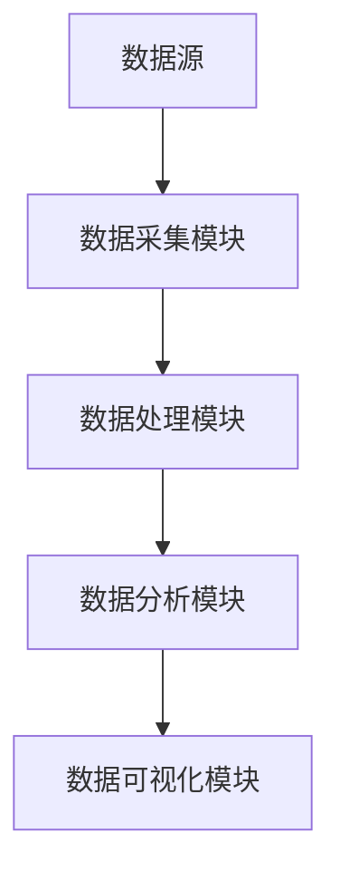

                 


# 数字经济时代的投资机遇识别

> 关键词：数字经济，投资机遇，数字资产，投资分析，风险评估，人工智能

> 摘要：本文深入探讨了数字经济时代下的投资机遇识别方法，结合技术分析、市场趋势和风险评估，为投资者提供系统化的投资策略。文章通过详细的技术分析和案例研究，揭示了如何利用数字技术捕捉市场机会。

---

# 第一部分: 数字经济与投资机遇概述

## 第1章: 数字经济的背景与核心概念

### 1.1 数字经济的定义与特征

#### 1.1.1 数字经济的定义
数字经济是指以数字技术为核心驱动力，通过数据的生成、处理、传输和应用，形成的新型经济形态。其核心是数据的流通和价值创造。

#### 1.1.2 数字经济的核心特征
- **数据驱动**：数据是数字经济的核心资源。
- **技术创新**：依赖大数据、人工智能、区块链等技术。
- **跨界融合**：数字经济打破了传统行业界限。
- **高效便捷**：通过数字化手段提升效率。

#### 1.1.3 数字经济与传统经济的对比
- **生产方式**：从劳动密集型转向技术驱动型。
- **价值创造**：从物质产品转向数据服务。
- **增长模式**：从线性增长转向指数级增长。

### 1.2 投资机遇的核心概念

#### 1.2.1 投资机遇的定义
投资机遇是指在特定市场和环境下，具备高增长潜力和投资价值的商业机会。

#### 1.2.2 数字经济时代投资机遇的特征
- **技术驱动**：依赖新兴技术实现价值。
- **数据依赖**：数据是核心资源。
- **快速迭代**：技术更新快，市场变化快。

#### 1.2.3 投资机遇的识别框架
- **技术评估**：评估技术的可行性和创新性。
- **市场分析**：分析市场需求和竞争状况。
- **商业模式**：评估商业模式的可持续性和盈利潜力。

### 1.3 数字经济的主要技术基础

#### 1.3.1 大数据技术
大数据技术通过海量数据的分析和处理，为企业提供决策支持。

#### 1.3.2 人工智能技术
人工智能通过模拟人类认知过程，实现自动化决策和优化。

#### 1.3.3 区块链技术
区块链通过分布式账本技术，实现数据的安全和透明。

#### 1.3.4 云计算技术
云计算通过弹性计算资源，降低企业 IT 成本。

### 1.4 数字经济时代的投资逻辑

#### 1.4.1 数字经济对投资的影响
- **数据价值化**：数据成为核心资产。
- **技术驱动收益**：技术创新带来超额收益。
- **生态系统构建**：投资需要考虑生态协同效应。

#### 1.4.2 投资者如何抓住机遇
- **关注技术创新**：投资具备技术壁垒的企业。
- **分析市场需求**：选择符合发展趋势的领域。
- **评估商业模式**：关注企业的盈利能力和可持续性。

#### 1.4.3 投资风险的初步分析
- **技术风险**：技术更新快，存在被替代的风险。
- **市场风险**：市场需求波动大，可能影响企业收益。
- **政策风险**：政策变化可能影响行业环境。

---

# 第二部分: 数字经济时代的核心技术与投资机会

## 第2章: 数字经济的核心技术与投资机会

### 2.1 大数据技术的应用与投资机会

#### 2.1.1 大数据的定义与特征
大数据指数据量大、类型多样、处理速度快的海量数据。

#### 2.1.2 大数据在金融领域的应用
- **信用评估**：通过大数据分析用户的信用状况。
- **风险管理**：利用大数据预测和防范金融风险。
- **投资决策**：通过大数据分析市场趋势。

#### 2.1.3 大数据企业的投资价值
- **数据采集能力**：企业能否高效采集数据。
- **数据处理能力**：企业是否具备强大的数据处理能力。
- **数据分析能力**：企业是否能从数据中提取价值。

### 2.2 人工智能技术的应用与投资机会

#### 2.2.1 人工智能的定义与特征
人工智能是模拟人类智能的计算机系统。

#### 2.2.2 人工智能在医疗领域的应用
- **疾病诊断**：通过AI技术辅助医生诊断疾病。
- **药物研发**：利用AI加速新药研发过程。
- **健康管理**：为用户提供个性化的健康管理方案。

#### 2.2.3 人工智能企业的投资价值
- **技术壁垒**：企业的核心技术是否具备竞争优势。
- **应用场景**：企业是否拥有明确的市场应用场景。
- **数据积累**：企业是否具备丰富的数据积累。

### 2.3 区块链技术的应用与投资机会

#### 2.3.1 区块链的定义与特征
区块链是去中心化的分布式账本技术。

#### 2.3.2 区块链在供应链管理中的应用
- **透明化**：通过区块链技术实现供应链的透明化管理。
- **防篡改**：区块链数据难以被篡改，确保数据安全。
- **效率提升**：通过区块链技术提高供应链效率。

#### 2.3.3 区块链企业的投资价值
- **技术创新**：企业的区块链技术是否具备创新性。
- **应用场景**：企业是否拥有明确的区块链应用场景。
- **生态建设**：企业是否积极参与区块链生态建设。

### 2.4 云计算技术的应用与投资机会

#### 2.4.1 云计算的定义与特征
云计算是通过互联网提供计算资源的模式。

#### 2.4.2 云计算在企业数字化转型中的应用
- **资源弹性扩展**：企业可以根据需求弹性扩展计算资源。
- **成本降低**：通过云计算降低企业的 IT 成本。
- **高效管理**：通过云计算实现高效的资源管理。

#### 2.4.3 云计算企业的投资价值
- **基础设施**：企业的云计算基础设施是否完善。
- **服务模式**：企业的云计算服务模式是否具备竞争优势。
- **客户粘性**：企业是否具备较高的客户粘性。

---

# 第三部分: 数字经济时代投资机遇的识别方法

## 第3章: 投资机会识别的方法论

### 3.1 数据驱动的投资分析方法

#### 3.1.1 数据采集与处理
- **数据源选择**：选择可靠的数据源。
- **数据清洗**：对数据进行清洗和预处理。
- **数据建模**：建立数据分析模型。

#### 3.1.2 数据分析与可视化
- **数据可视化**：通过图表展示数据。
- **数据挖掘**：从数据中提取有用信息。
- **数据预测**：利用数据分析模型进行预测。

#### 3.1.3 数据驱动的决策支持
- **投资决策**：通过数据分析支持投资决策。
- **风险控制**：利用数据分析控制投资风险。
- **机会发现**：通过数据分析发现投资机会。

### 3.2 技术驱动的投资分析方法

#### 3.2.1 技术评估
- **技术可行性**：评估技术的可行性和成熟度。
- **技术优势**：评估技术的竞争优势。
- **技术壁垒**：评估技术的壁垒高度。

#### 3.2.2 技术创新与投资机会
- **技术创新**：关注具备技术创新的企业。
- **技术应用**：关注技术在实际场景中的应用。
- **技术趋势**：关注技术发展的趋势。

### 3.3 市场驱动的投资分析方法

#### 3.3.1 市场需求分析
- **市场需求预测**：预测市场的未来需求。
- **市场容量评估**：评估市场的容量和潜力。
- **市场趋势分析**：分析市场的趋势和变化。

#### 3.3.2 市场竞争分析
- **竞争对手分析**：分析竞争对手的优势和劣势。
- **市场进入壁垒**：评估市场进入的壁垒高度。
- **市场集中度分析**：分析市场的集中度。

### 3.4 综合驱动的投资分析方法

#### 3.4.1 技术与市场的结合
- **技术驱动市场**：技术如何推动市场需求。
- **市场驱动技术**：市场需求如何推动技术创新。
- **技术与市场的协同**：技术与市场的协同效应。

#### 3.4.2 技术与商业模式的结合
- **商业模式创新**：通过技术创新实现商业模式创新。
- **商业模式优化**：优化商业模式以适应市场变化。
- **商业模式与技术的协同**：商业模式与技术的协同效应。

---

# 第四部分: 数字经济时代投资机会的系统架构设计

## 第4章: 投资机会识别的系统架构设计

### 4.1 系统功能设计

#### 4.1.1 数据采集模块
- **功能描述**：从多个数据源采集数据。
- **技术选型**：使用分布式爬虫技术。
- **实现思路**：通过API接口或网络爬虫采集数据。

#### 4.1.2 数据处理模块
- **功能描述**：对采集到的数据进行清洗和预处理。
- **技术选型**：使用Python的Pandas库。
- **实现思路**：通过数据清洗和特征工程处理数据。

#### 4.1.3 数据分析模块
- **功能描述**：对数据进行分析和建模。
- **技术选型**：使用机器学习算法。
- **实现思路**：通过训练模型实现数据预测和分类。

#### 4.1.4 数据可视化模块
- **功能描述**：将分析结果可视化。
- **技术选型**：使用Matplotlib或Seaborn。
- **实现思路**：通过图表展示数据分析结果。

### 4.2 系统架构设计

#### 4.2.1 系统架构图


#### 4.2.2 系统功能模块
- **数据采集模块**：负责数据的采集和存储。
- **数据处理模块**：负责数据的清洗和预处理。
- **数据分析模块**：负责数据的建模和分析。
- **数据可视化模块**：负责数据的可视化展示。

### 4.3 系统接口设计

#### 4.3.1 数据接口设计
- **输入接口**：接收外部数据源的数据。
- **输出接口**：输出数据处理后的结果。
- **API接口**：提供API接口供其他系统调用。

#### 4.3.2 系统交互设计
- **用户交互**：用户通过界面输入数据。
- **系统反馈**：系统通过界面反馈处理结果。
- **日志记录**：系统记录操作日志。

---

# 第五部分: 数字经济时代投资机会的项目实战

## 第5章: 投资机会识别的项目实战

### 5.1 项目背景与需求分析

#### 5.1.1 项目背景
- **项目目标**：识别数字经济时代下的投资机会。
- **项目需求**：通过技术手段实现投资机会的识别。
- **项目范围**：涵盖大数据、人工智能、区块链等领域。

#### 5.1.2 需求分析
- **功能需求**：实现数据采集、处理、分析和可视化。
- **性能需求**：系统需要具备高效率和稳定性。
- **用户需求**：用户需要直观的投资机会识别结果。

### 5.2 项目系统设计

#### 5.2.1 系统功能设计
- **数据采集模块**：负责采集数据。
- **数据处理模块**：负责处理数据。
- **数据分析模块**：负责分析数据。
- **数据可视化模块**：负责展示结果。

#### 5.2.2 系统架构设计


### 5.3 项目核心实现

#### 5.3.1 数据采集实现
- **代码实现**：
  ```python
  import requests
  def fetch_data(url):
      response = requests.get(url)
      return response.json()
  ```

#### 5.3.2 数据处理实现
- **代码实现**：
  ```python
  import pandas as pd
  def process_data(data):
      df = pd.DataFrame(data)
      df.dropna(inplace=True)
      return df
  ```

#### 5.3.3 数据分析实现
- **代码实现**：
  ```python
  from sklearn.model_selection import train_test_split
  def train_model(data):
      X = data.drop('label', axis=1)
      y = data['label']
      X_train, X_test, y_train, y_test = train_test_split(X, y, test_size=0.2)
      return X_train, X_test, y_train, y_test
  ```

#### 5.3.4 数据可视化实现
- **代码实现**：
  ```python
  import matplotlib.pyplot as plt
  def visualize_data(data):
      plt.plot(data['x'], data['y'])
      plt.show()
  ```

### 5.4 项目测试与优化

#### 5.4.1 测试计划
- **单元测试**：测试每个模块的功能。
- **集成测试**：测试系统整体功能。
- **性能测试**：测试系统的性能。

#### 5.4.2 优化措施
- **算法优化**：优化数据分析算法。
- **系统优化**：优化系统架构设计。
- **性能优化**：优化系统的运行效率。

---

# 第六部分: 数字经济时代投资机会的案例分析

## 第6章: 投资机会识别的案例分析

### 6.1 投资案例分析

#### 6.1.1 案例背景
- **行业选择**：选择一个具有潜力的行业。
- **企业选择**：选择一家具有代表性的企业。
- **案例分析**：分析企业的投资价值。

#### 6.1.2 数据分析与预测
- **数据分析**：对企业的数据进行分析。
- **数据预测**：预测企业的未来表现。
- **投资建议**：基于数据分析提出投资建议。

### 6.2 投资机会的总结与启示

#### 6.2.1 投资机会总结
- **成功经验**：总结投资成功的经验。
- **失败教训**：总结投资失败的教训。
- **经验启示**：总结投资过程中的经验启示。

---

# 第七部分: 数字经济时代投资机会的系统优化与扩展

## 第7章: 数字经济时代投资机会的系统优化

### 7.1 系统优化方案

#### 7.1.1 技术优化
- **算法优化**：优化数据分析算法。
- **系统优化**：优化系统的运行效率。
- **架构优化**：优化系统的架构设计。

#### 7.1.2 业务优化
- **流程优化**：优化业务流程。
- **模式优化**：优化商业模式。
- **策略优化**：优化投资策略。

### 7.2 系统扩展方案

#### 7.2.1 功能扩展
- **新功能开发**：开发新的功能模块。
- **功能优化**：优化现有功能模块。
- **功能扩展**：扩展系统功能覆盖范围。

#### 7.2.2 性能扩展
- **性能提升**：提升系统的运行性能。
- **扩展性设计**：设计系统的扩展性。
- **负载均衡**：实现系统的负载均衡。

---

# 第八部分: 数字经济时代投资机会的总结与展望

## 第8章: 数字经济时代投资机会的总结与展望

### 8.1 投资机会识别的总结

#### 8.1.1 总结核心观点
- **数据价值化**：数据是数字经济的核心资源。
- **技术创新驱动**：技术创新是投资机会的核心驱动力。
- **生态协同效应**：生态协同是投资成功的的关键因素。

### 8.2 数字经济时代投资机会的展望

#### 8.2.1 未来发展趋势
- **技术融合**：技术的融合将进一步加速。
- **数据共享**：数据共享将成为主流趋势。
- **智能决策**：智能决策将更加普及。

#### 8.2.2 投资者应对策略
- **持续学习**：投资者需要持续学习新的技术和知识。
- **灵活调整**：投资者需要灵活调整投资策略。
- **风险控制**：投资者需要加强风险控制能力。

---

# 作者信息

作者：AI天才研究院/AI Genius Institute & 禅与计算机程序设计艺术 /Zen And The Art of Computer Programming

---

以上是《数字经济时代的投资机遇识别》的技术博客文章的完整内容，涵盖从基础概念到系统设计、项目实战、案例分析等多个方面，旨在为投资者提供系统化的投资策略和方法。

