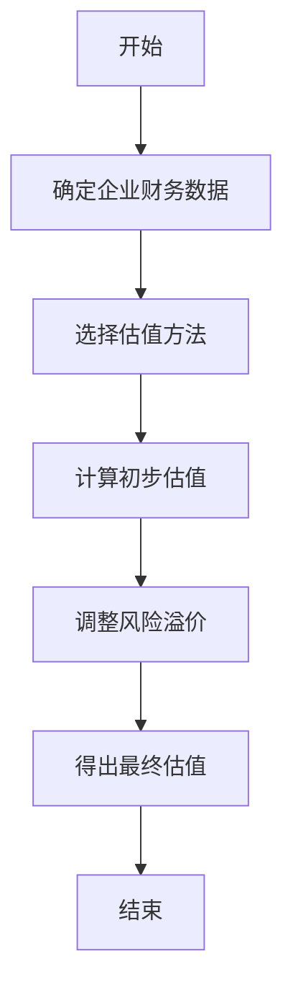
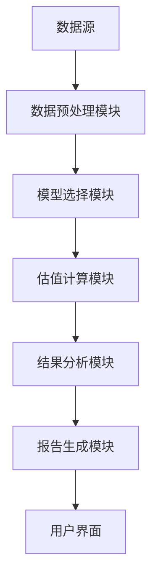
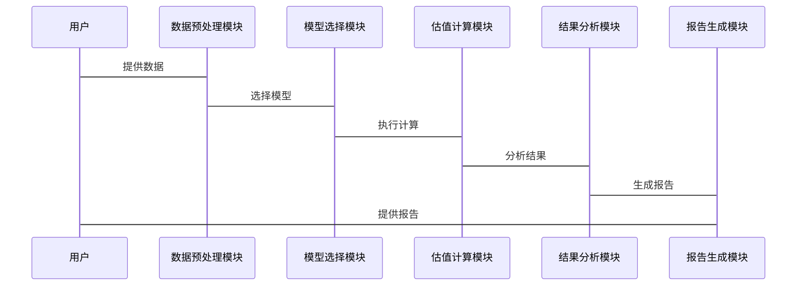

                 


# 新兴市场企业估值的特殊考虑

> 关键词：新兴市场、企业估值、特殊因素、经济环境、政策影响

> 摘要：本文探讨了在新兴市场中进行企业估值时的特殊考虑因素，包括经济波动、政策风险、数据不透明等。通过分析传统估值方法的改进、特殊算法的设计以及实际案例的应用，本文为企业估值提供了新的视角和方法。

---

## 第1章 新兴市场的定义与特点

### 1.1 新兴市场的定义与分类

- **1.1.1 新兴市场的定义**
  - 新兴市场是指经济快速增长但尚未完全发达的国家或地区。
  - 这些市场通常具有较大的发展潜力，但也伴随着较高的风险。

- **1.1.2 新兴市场的分类与特征**
  - 按地区划分：亚洲（如中国、印度）、拉丁美洲（如巴西）、东欧（如波兰）等。
  - 按经济规模划分：大型新兴市场（如中国、印度）和小型新兴市场（如泰国、越南）。

- **1.1.3 新兴市场与发达市场的对比**
  - 经济结构：新兴市场多为混合经济，发达市场多为市场经济。
  - 市场流动性：新兴市场流动性较低，发达市场流动性较高。
  - 政策环境：新兴市场政策变化较大，发达市场政策相对稳定。

### 1.2 企业估值的基本概念

- **1.2.1 企业估值的定义**
  - 企业估值是对企业价值的评估，通常包括企业资产、收益、现金流等的评估。
  - 企业估值是投资决策的重要依据。

- **1.2.2 企业估值的主要方法**
  - 市盈率法（P/E）
  - 市净率法（P/B）
  - 现金流折现法（DCF）

- **1.2.3 企业估值的核心要素**
  - 财务数据：收入、利润、现金流等。
  - 市场因素：行业竞争、市场需求等。
  - 宏观经济因素：GDP增长率、通货膨胀率等。

### 1.3 新兴市场企业估值的特殊性

- **1.3.1 经济环境的不确定性**
  - 新兴市场通常面临较大的经济波动，如货币波动、通货膨胀等。
  - 经济政策的变化对企业估值的影响较大。

- **1.3.2 政策环境的影响**
  - 新兴市场国家的政策变化频繁，如税收政策、外汇管制等。
  - 政策不确定性可能影响企业的经营和估值。

- **1.3.3 市场流动性差异**
  - 新兴市场流动性较低，可能导致企业估值的偏差。
  - 市场流动性不足可能导致企业估值难以准确反映其真实价值。

### 1.4 本章小结

本章介绍了新兴市场的定义、分类及其与发达市场的对比，探讨了企业估值的基本概念和核心要素，并重点分析了新兴市场企业估值的特殊性。

---

## 第2章 新兴市场企业估值的核心概念

### 2.1 企业估值的关键要素

- **2.1.1 财务指标的重要性**
  - 财务指标是企业估值的基础，如收入、利润、现金流等。
  - 财务指标的准确性直接影响企业估值的准确性。

- **2.1.2 非财务因素的影响**
  - 行业竞争、市场需求、管理团队等非财务因素对估值的影响。
  - 非财务因素难以量化，但对企业价值的影响不容忽视。

- **2.1.3 行业特点的特殊性**
  - 不同行业在新兴市场中的表现差异较大。
  - 行业特点需要在估值过程中予以特别考虑。

### 2.2 新兴市场估值的特殊因素

- **2.2.1 经济周期的影响**
  - 经济周期波动对企业的盈利能力和估值的影响。
  - 在新兴市场，经济周期波动对估值的影响更为显著。

- **2.2.2 政治风险的评估**
  - 政治风险是新兴市场估值中的重要因素。
  - 政治风险可能影响企业的经营环境和估值结果。

- **2.2.3 市场结构的差异**
  - 新兴市场市场结构差异较大，如集中度、竞争程度等。
  - 市场结构差异需要在估值过程中予以调整。

### 2.3 核心概念的联系与对比

- **2.3.1 核心概念的属性特征对比表格**
  | 比较项          | 财务指标 | 非财务因素 | 行业特点 |
  |-----------------|----------|------------|----------|
  | 定量与定性      | 定量     | 定性与定量 | 定性     |
  | 可控性          | 不可控   | 部分可控   | 不可控   |
  | 对估值影响       | 直接     | 间接       | 直接     |

- **2.3.2 ER实体关系图架构**

```mermaid
erd
  customer
  has_order
  order
  has_product
  product
  belongs_to_company
  company
  has_financial_indicator
  financial_indicator
  influenced_by_market_structure
  market_structure
  influenced_by_political_risk
  political_risk
```

### 2.4 本章小结

本章分析了企业估值的关键要素，探讨了新兴市场估值的特殊因素，并通过对比表格和ER实体关系图，展示了核心概念之间的联系。

---

## 第3章 新兴市场企业估值的算法原理

### 3.1 传统估值方法的改进

- **3.1.1 DCF模型的调整**
  - DCF模型是企业估值的常用方法，但在新兴市场中需要调整折现率和现金流预测。
  - 新兴市场的高风险需要使用更高的折现率。

- **3.1.2 市场比较法的优化**
  - 市场比较法通过比较同类企业进行估值。
  - 在新兴市场中，需要选择具有可比性的企业，并考虑市场差异。

- **3.1.3 相对估值法的适用性**
  - 相对估值法通过比较市场指标（如P/E、P/B）进行估值。
  - 在新兴市场中，相对估值法需要考虑市场流动性差异。

### 3.2 新兴市场估值的特殊算法

- **3.2.1 风险调整模型**
  - 风险调整模型通过调整企业价值以反映风险因素。
  - 新兴市场的政策风险和经济风险需要特别考虑。

- **3.2.2 市场流动性调整**
  - 市场流动性调整用于修正因流动性不足导致的估值偏差。
  - 在流动性较低的新兴市场，需要适当调整估值结果。

- **3.2.3 经济周期敏感性分析**
  - 经济周期敏感性分析评估企业价值对经济周期的敏感程度。
  - 在新兴市场中，经济周期波动较大，敏感性分析尤为重要。

### 3.3 算法原理的数学模型

- **3.3.1 DCF模型公式**
  $$DCF = \sum_{t=1}^{n} \frac{CF_t}{(1+r)^t}$$
  - 其中，CF_t为第t年的现金流，r为折现率，n为估值期限。

- **3.3.2 风险调整公式**
  $$Risk\ Adjusted\ Value = Value \times (1 - Risk\ Premium)$$
  - 其中，Risk Premium为风险溢价，反映新兴市场的额外风险。

### 3.4 举例说明与流程图

- **3.4.1 示例计算**
  - 假设某新兴市场企业的现金流为100万，折现率为10%，估值期限为5年。
  - 计算DCF模型的值，并根据风险溢价进行调整。

- **3.4.2 算法流程图**



### 3.5 本章小结

本章探讨了传统估值方法在新兴市场的应用，并提出了风险调整模型和市场流动性调整等特殊算法，通过数学公式和流程图详细阐述了算法原理。

---

## 第4章 新兴市场企业估值的系统架构

### 4.1 问题场景介绍

- 新兴市场企业估值需要考虑的因素较多，包括经济环境、政策风险、市场流动性等。
- 系统架构需要能够整合多方面的数据，支持复杂的估值模型。

### 4.2 系统功能设计

- **4.2.1 数据收集模块**
  - 收集企业的财务数据、市场数据、政策数据等。
  - 数据来源包括企业财报、市场研究报告等。

- **4.2.2 模型选择模块**
  - 根据企业的特点选择合适的估值模型。
  - 支持DCF模型、市场比较法、相对估值法等多种模型。

- **4.2.3 结果分析模块**
  - 对估值结果进行分析，生成报告。
  - 包括敏感性分析、风险评估等内容。

### 4.3 系统架构设计

- **4.3.1 系统架构图**



- **4.3.2 系统交互图**



### 4.4 本章小结

本章设计了一个适用于新兴市场企业估值的系统架构，包括数据收集、模型选择、结果分析等模块，并通过系统架构图和交互图展示了系统的整体设计。

---

## 第5章 新兴市场企业估值的项目实战

### 5.1 环境安装与数据准备

- **5.1.1 环境安装**
  - 安装必要的软件和工具，如Excel、Python、Matplotlib等。
  - 确保数据来源的可靠性和准确性。

- **5.1.2 数据准备**
  - 收集目标企业的财务数据、市场数据、政策数据等。
  - 数据清洗和预处理，确保数据的完整性和一致性。

### 5.2 系统核心实现

- **5.2.1 代码实现**

```python
# 示例代码：DCF模型的实现
def calculate_dcf(cash_flows, discount_rate, period):
    dcf = 0
    for t in range(period):
        dcf += cash_flows[t] / (1 + discount_rate) ** t
    return dcf

# 示例代码：风险调整
def risk_adjusted_value(value, risk_premium):
    return value * (1 - risk_premium)
```

- **5.2.2 代码解读与分析**
  - DCF模型代码实现了现金流的折现计算。
  - 风险调整代码根据风险溢价调整企业价值。

### 5.3 案例分析与详细讲解

- **5.3.1 案例选择**
  - 选择一个典型的新兴市场企业，如中国的某科技公司。
  - 收集该公司的财务数据和市场数据。

- **5.3.2 应用与分析**
  - 使用DCF模型计算企业的初步估值。
  - 根据风险溢价进行调整，得到最终估值。
  - 对比市场比较法和相对估值法的结果，分析差异原因。

### 5.4 本章小结

本章通过实际案例展示了新兴市场企业估值的全过程，从数据准备到模型选择，再到结果分析，详细讲解了每个步骤的操作和注意事项。

---

## 第6章 新兴市场企业估值的小结与展望

### 6.1 小结

- 本文系统地探讨了新兴市场企业估值的特殊考虑因素。
- 提出了适用于新兴市场的估值方法和系统架构。
- 通过实际案例展示了估值过程的应用。

### 6.2 展望

- 随着新兴市场的不断发展，企业估值的方法和工具也将不断改进。
- 未来的研究可以进一步探讨新兴市场中不同类型企业的估值差异。
- 可能的方向包括大数据分析、人工智能在估值中的应用等。

---

## 作者：AI天才研究院/AI Genius Institute & 禅与计算机程序设计艺术/Zen And The Art of Computer Programming

---

感谢您的耐心阅读！如果对本文有任何疑问或建议，欢迎留言讨论。

