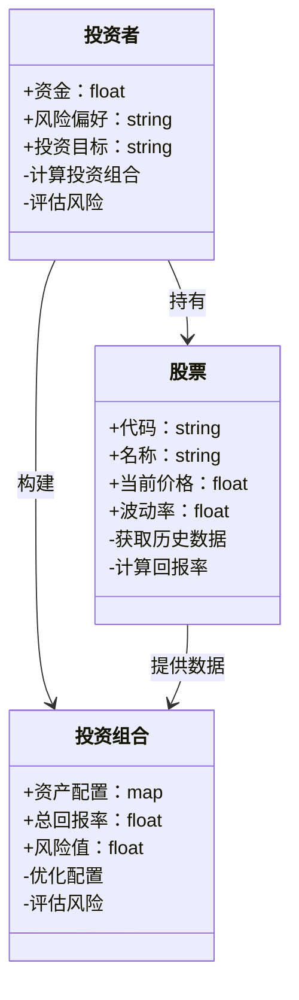

                 


# 新兴市场投资：高风险高回报的机遇与挑战

## 关键词：新兴市场，高风险，高回报，投资策略，风险管理，经济增长

## 摘要：  
新兴市场作为全球经济的重要组成部分，具有高风险和高回报的双重特性。本文将深入探讨新兴市场的定义、特点、投资机会和风险挑战，结合技术分析和投资策略，帮助投资者在复杂的市场环境中找到平衡点。通过系统化的分析框架和实际案例，本文将为读者提供在新兴市场中实现稳健投资的策略和方法。

---

## 第1章: 新兴市场的定义与特点

### 1.1 新兴市场的定义

#### 1.1.1 新兴市场的概念  
新兴市场是指那些经济快速发展、但尚未完全工业化的国家或地区。这些市场通常具有较大的增长潜力，但也伴随着较高的不确定性。

#### 1.1.2 新兴市场的基本特征  
- 经济结构多元化：包括制造业、服务业和农业等多种产业。  
- 市场规模逐步扩大：人口基数大，消费潜力巨大。  
- 政治经济环境复杂：政策变化快，法律体系不完善。  

#### 1.1.3 新兴市场与发达市场的对比  
| 特征          | 新兴市场                          | 发达市场                          |  
|---------------|----------------------------------|------------------------------------|  
| 经济增速      | 高增长                            | 低增长或稳定增长                  |  
| 市场成熟度    | 不成熟                            | 成熟                              |  
| 投资风险      | 高                                | 低                                |  
| 投资回报      | 高                                | 中等                              |  

---

### 1.2 新兴市场的形成与发展

#### 1.2.1 新兴市场的历史演变  
新兴市场的发展始于20世纪末，随着全球化进程的加速，许多发展中国家开始吸引外资，推动经济增长。

#### 1.2.2 经济全球化对新兴市场的影响  
- 技术转移：发达国家的技术溢出促进了新兴市场的产业升级。  
- 资本流动：国际资本的流入为新兴市场提供了资金支持。  
- 市场整合：全球化的推动使得新兴市场与世界经济更加紧密相连。  

#### 1.2.3 新兴市场的区域分布  
主要集中在亚洲、拉丁美洲和东欧地区，其中以中国、印度和巴西为代表。

---

### 1.3 新兴市场的投资价值与挑战

#### 1.3.1 新兴市场的经济增长潜力  
- 人口红利：新兴市场国家的年轻人比例较高，为经济增长提供了劳动力支持。  
- 消费升级：随着收入水平的提高，中产阶级的崛起推动了消费市场的扩张。  

#### 1.3.2 新兴市场的制度性挑战  
- 法律体系不完善：投资保护不足，政策变化频繁。  
- 基础设施落后：物流、通信等基础设施建设不足，影响投资效率。  

#### 1.3.3 新兴市场的竞争格局  
- 市场准入门槛高：外资企业需要面对本地企业的激烈竞争。  
- 价格敏感性：消费者对价格敏感，企业利润率较低。  

---

## 第2章: 高风险高回报的机遇与挑战

### 2.1 高风险的来源

#### 2.1.1 经济波动风险  
- 外汇波动：新兴市场货币容易受到国际资本流动的影响。  
- 通货膨胀：高通胀率可能侵蚀投资回报。  

#### 2.1.2 政治风险  
- 政策变化：政府换届或政策调整可能影响投资环境。  
- 地缘政治：区域冲突或贸易摩擦可能引发市场波动。  

#### 2.1.3 市场流动性风险  
- 交易量低：部分新兴市场交易不活跃，可能影响资产变现能力。  
- 资金撤离：投资者信心下降可能导致资金快速流出。  

---

### 2.2 高回报的潜力

#### 2.2.1 新兴市场的经济增长潜力  
- 人均GDP增长快：新兴市场国家的人均GDP增速高于发达市场。  
- 产业升级：技术进步和工业化推动经济增长。  

#### 2.2.2 创新驱动的投资机会  
- 数字经济：新兴市场在电子商务、金融科技等领域具有较大的发展空间。  
- 新能源：绿色能源的投资需求快速增长。  

#### 2.2.3 未被充分开发的市场潜力  
- 城市化进程：新兴市场国家的 urbanization 提供了大量投资机会。  
- 中小企业融资：金融体系不完善，但中小企业融资需求旺盛。  

---

### 2.3 风险与回报的平衡

#### 2.3.1 投资者的风险偏好  
- 风险厌恶型投资者：倾向于选择低风险、低回报的投资标的。  
- 风险偏好型投资者：愿意承担高风险以追求高回报。  

#### 2.3.2 投资组合的优化配置  
- 资产配置：通过分散投资降低整体风险。  
- 行业选择：选择具有抗周期性的行业，如公用事业、医疗等。  

#### 2.3.3 风险管理的重要性  
- 设置止损点：避免单次投资的重大损失。  
- 定期再平衡：根据市场变化调整投资组合。  

---

## 第3章: 新兴市场投资的核心概念与分析框架

### 3.1 投资者行为与市场动态

#### 3.1.1 理性投资者与非理性投资者  
- 理性投资者：基于基本面分析做出决策。  
- 非理性投资者：受情绪影响，可能导致市场泡沫或恐慌性抛售。  

#### 3.1.2 市场情绪与投资决策  
- 市场情绪指数：通过投资者情绪分析工具（如VIX指数）衡量市场风险。  
- 市场周期：投资者需识别市场的牛熊周期，避免在高点追涨或低点杀跌。  

---

### 3.2 市场动态分析

#### 3.2.1 市场周期的识别  
- 牛市：市场上涨，投资者信心充足。  
- 熊市：市场下跌，投资者信心不足。  

#### 3.2.2 市场趋势的预测  
- 技术分析：通过K线图、均线等工具预测短期走势。  
- 基本面分析：通过宏观经济指标预测长期趋势。  

#### 3.2.3 市场波动的传染效应  
- 羊群效应：投资者的集体行为可能导致市场剧烈波动。  
- 传染效应：一个市场的波动可能影响其他相关市场。  

---

## 第4章: 风险评估与回报分析

### 4.1 风险评估方法

#### 4.1.1 风险因素的识别  
- 经济因素：通货膨胀、利率变化等。  
- 政治因素：政策变化、地缘政治等。  
- 市场因素：流动性风险、价格波动等。  

#### 4.1.2 风险的量化与度量  
- 风险值（VaR）：衡量投资组合的最大潜在损失。  
- 标准差：衡量资产回报的波动性。  

#### 4.1.3 风险矩阵的构建  
通过将风险因素和影响程度进行矩阵匹配，帮助投资者制定风险应对策略。

---

### 4.2 报酬率与投资回报

#### 4.2.1 投资回报的计算方法  
- 单利计算：$$回报率 = \frac{最终价值 - 初始价值}{初始价值} \times 100\%$$  
- 复利计算：$$最终价值 = 初始价值 \times (1 + 报酬率)^n$$  

#### 4.2.2 报酬率与风险的权衡  
- 风险溢价：$$E(r) = r_f + \beta \times (E(r_m) - r_f)$$  

#### 4.2.3 投资组合的夏普比率  
$$夏普比率 = \frac{E(r_p) - r_f}{\sigma_p}$$  

---

## 第5章: 投资策略与实践

### 5.1 投资策略的制定与实施

#### 5.1.1 投资策略的分类  
- 股票投资策略：价值投资、成长投资等。  
- 债券投资策略：利率套利、信用套利等。  
- 多元化投资策略：分散投资以降低风险。  

#### 5.1.2 投资策略的实施步骤  
1. 确定投资目标：明确投资期限、风险承受能力和收益目标。  
2. 进行市场分析：结合基本面和技术面分析选择投资标的。  
3. 构建投资组合：根据风险偏好分散投资。  
4. 定期调整组合：根据市场变化和自身情况优化投资组合。  

---

## 第6章: 系统分析与架构设计方案

### 6.1 问题场景介绍

#### 6.1.1 问题背景  
投资者需要在新兴市场中找到高回报的投资机会，同时需要控制风险。

#### 6.1.2 项目介绍  
构建一个新兴市场投资分析系统，帮助投资者进行风险评估、投资组合优化和市场动态监控。

---

### 6.2 系统功能设计

#### 6.2.1 领域模型（Mermaid 类图）  



---

### 6.3 系统架构设计（Mermaid 架构图）


---

## 第7章: 项目实战

### 7.1 环境安装

#### 7.1.1 安装Python环境  
```bash
pip install numpy pandas matplotlib
```

---

### 7.2 系统核心实现源代码

#### 7.2.1 风险评估模块  
```python
import numpy as np

def calculate VaR(returns, confidence_level=0.95):
    sorted_returns = np.sort(returns)
    index = int(len(sorted_returns) * (1 - confidence_level))
    VaR = -sorted_returns[index]
    return VaR
```

---

### 7.3 代码应用解读与分析

#### 7.3.1 风险评估模块  
- 输入：投资组合的历史回报率。  
- 输出：在给定置信水平下的VaR值。  

---

## 第8章: 总结与展望

### 8.1 总结  
新兴市场投资具有高风险和高回报的双重特性，投资者需要结合市场分析、风险管理等多方面因素制定合理的投资策略。

### 8.2 展望  
随着全球经济的进一步发展，新兴市场将继续成为投资者关注的重点。未来，人工智能和大数据技术将在新兴市场投资中发挥更大的作用。

---

## 作者：AI天才研究院/AI Genius Institute & 禅与计算机程序设计艺术 /Zen And The Art of Computer Programming

---

**本文是对新兴市场投资的系统性分析，通过理论与实践的结合，帮助投资者在复杂的市场环境中找到平衡点。**

