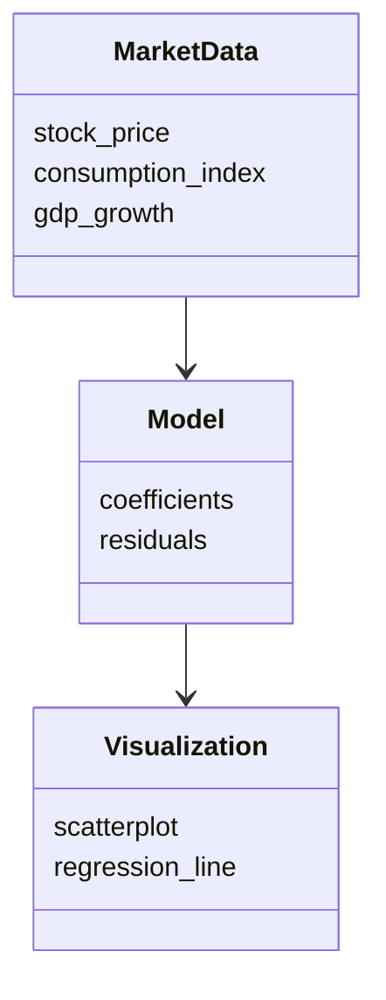

                 


# 新兴市场股市估值与中产阶级消费的关系

## 关键词：
新兴市场、股市估值、中产阶级消费、经济关系、数据分析、投资策略、投资组合优化

## 摘要：
本文探讨新兴市场股市估值与中产阶级消费之间的关系，通过数据分析和算法建模，分析中产阶级消费对股市估值的影响，并提出投资策略优化的方法。文章内容涵盖背景介绍、核心概念、算法原理、数学模型、系统架构设计、项目实战及总结，旨在为投资者和研究者提供有价值的参考。

---

## 第一章：背景介绍

### 1.1 新兴市场的定义与特点
- 新兴市场的定义：指经济快速增长、金融市场逐步完善的国家，如中国、印度、巴西等。
- 新兴市场的特点：
  - 经济结构多元化
  - 人口基数大，年轻化
  - 政策支持经济转型
- 新兴市场股市的特点：
  - 市场波动性较大
  - 市盈率和市净率较高
  - 受政策和国际环境影响较大

### 1.2 中产阶级的定义与特征
- 中产阶级的定义：收入稳定、消费能力较强的群体。
- 中产阶级的特征：
  - 消费结构升级，从必需品转向高端产品
  - 对金融产品的投资意愿增强
  - 受教育程度较高，注重品牌和品质
- 中产阶级在经济中的作用：
  - 推动内需增长
  - 影响消费趋势和投资行为

### 1.3 股市估值与中产阶级消费的关系
- 股市估值的基本概念：通过市盈率、市净率等指标衡量股市的高低。
- 中产阶级消费对股市的影响：
  - 消费增长推动企业盈利，进而提升股市估值
  - 中产阶级的投资行为直接影响股市资金流动
- 股市与消费的双向互动：
  - 股市上涨增强消费信心
  - 消费升级推动企业盈利，进而提升股市估值

---

## 第二章：核心概念与联系

### 2.1 股市估值的核心概念与模型
- 股市估值的关键指标：
  - 市盈率（P/E）：$$ \text{P/E} = \frac{\text{股价}}{\text{每股收益}} $$
  - 市净率（P/B）：$$ \text{P/B} = \frac{\text{股价}}{\text{每股净资产}} $$
  - 市销率（P/S）：$$ \text{P/S} = \frac{\text{股价}}{\text{每股收入}} $$
- 股市估值模型：
  - 现金流折现模型（DCF）
  - 市盈率模型
  - 市净率模型

### 2.2 中产阶级消费的核心特征
- 消费结构的分析：
  - 必需品消费趋于稳定
  - 可选消费品（如电子产品、汽车、旅游）增长显著
- 消费行为的影响因素：
  - 收入水平
  - 消费信贷的普及
  - 品牌偏好
- 消费对经济的推动作用：
  - 刺激内需
  - 提高GDP增长率

### 2.3 股市估值与中产阶级消费的关系模型
- 模型的构建：
  - 通过回归分析，研究消费指数对股市估值的影响
  - 变量：消费指数（CPI）、GDP增长率、股市估值指标（如P/E）
- 模型的变量分析：
  - 自变量：中产阶级消费指数
  - 因变量：股市估值指标
  - 控制变量：国际油价、汇率波动、政策变化
- 模型的验证与应用：
  - 使用历史数据进行回测
  - 模型的优度检验（R²、调整R²）

---

## 第三章：算法原理讲解

### 3.1 线性回归模型
- 线性回归的定义：
  - 通过最小二乘法拟合最佳回归线
  - $$ y = \beta_0 + \beta_1 x + \epsilon $$
- 算法步骤：
  1. 数据预处理：标准化、缺失值处理
  2. 模型训练：使用最小二乘法求解系数
  3. 模型验证：计算残差、R²值
  4. 模型优化：处理多重共线性、异常值

### 3.2 中产阶级消费对股市的影响分析
- 消费数据的收集与处理：
  - 数据来源：政府统计数据、市场调研报告
  - 数据清洗：处理异常值、填补缺失值
- 消费对股市的滞后效应：
  - 短期消费增长推动股市上涨
  - 长期消费趋势影响股市估值
- 模型的优化与改进：
  - 引入滞后变量（如滞后一期的消费指数）
  - 考虑政策变量的调节作用

### 3.3 算法实现与代码示例
```python
import pandas as pd
import numpy as np
from sklearn.linear_model import LinearRegression
from sklearn.metrics import mean_squared_error

# 数据预处理
data = pd.read_csv('emerging_markets.csv')
X = data[['consumption_index', 'gdp_growth']]
y = data['market_valuation']

# 模型训练
model = LinearRegression()
model.fit(X, y)

# 模型预测
y_pred = model.predict(X)

# 模型评估
mse = mean_squared_error(y, y_pred)
r_squared = model.score(X, y)

print(f'Mean Squared Error: {mse}')
print(f'R-squared: {r_squared}')
print(f'Coefficients: {model.coef_}')
```

---

## 第四章：数学模型与公式详解

### 4.1 股市估值的数学模型
- 市盈率公式：$$ \text{P/E} = \frac{\text{股价}}{\text{每股收益}} $$
- 市净率公式：$$ \text{P/B} = \frac{\text{股价}}{\text{每股净资产}} $$
- 现金流折现模型：$$ \text{企业价值} = \sum_{t=1}^{n} \frac{\text{现金流}}{(1 + r)^t} $$
- 消费对股市的影响力：$$ \text{股市收益} = \alpha \times \text{消费指数} + \beta \times \text{政策变量} + \gamma \times \text{国际环境变量} $$

### 4.2 消费指数与股市估值的关系
- 消费指数的构建：
  - 包括可选消费品指数、必需品指数、服务消费指数
- 消费指数与股市估值的关系公式：
  $$ \text{股市估值} = \beta_0 + \beta_1 \times \text{消费指数} + \beta_2 \times \text{政策变量} + \epsilon $$

---

## 第五章：系统分析与架构设计

### 5.1 问题场景介绍
- 数据来源：政府统计数据、市场调研、上市公司财报
- 问题目标：建立消费指数与股市估值的关系模型，优化投资组合

### 5.2 系统功能设计
- 领域模型：使用Mermaid类图


- 系统架构设计：使用Mermaid架构图


---

## 第六章：项目实战

### 6.1 环境安装
- 安装Python、Pandas、NumPy、Scikit-learn
- 数据库连接工具：Pymysql或MongoDB

### 6.2 核心实现源代码
```python
import pandas as pd
import numpy as np
from sklearn.linear_model import LinearRegression
from sklearn.metrics import mean_squared_error

# 数据加载与预处理
data = pd.read_csv('emerging_markets.csv')
X = data[['consumption_index', 'gdp_growth']]
y = data['market_valuation']

# 线性回归模型训练
model = LinearRegression()
model.fit(X, y)

# 模型评估
mse = mean_squared_error(y, model.predict(X))
r_squared = model.score(X, y)

print(f'Mean Squared Error: {mse}')
print(f'R-squared: {r_squared}')
```

### 6.3 实际案例分析
- 数据来源：新兴市场国家的消费指数和股市估值数据
- 案例分析：以中国为例，分析消费指数对股市估值的影响

### 6.4 项目小结
- 通过线性回归模型，验证了消费指数对股市估值的正向影响
- 模型在实际中的应用价值

---

## 第七章：总结与展望

### 7.1 总结
- 中产阶级消费对新兴市场股市估值有显著影响
- 线性回归模型能够有效捕捉这种关系
- 投资者可以根据消费趋势优化投资组合

### 7.2 展望
- 结合机器学习模型（如随机森林、XGBoost）进行更复杂的分析
- 研究消费结构升级对股市的影响
- 探讨国际环境对股市估值的长期影响

### 7.3 小结
- 中产阶级消费是推动新兴市场股市增长的重要因素
- 投资者应关注消费趋势和政策变化

---

## 作者：AI天才研究院 & 禅与计算机程序设计艺术

---

这篇文章通过系统化的分析，详细探讨了新兴市场股市估值与中产阶级消费之间的关系，结合数据分析和算法建模，为投资者和研究者提供了有价值的参考。

