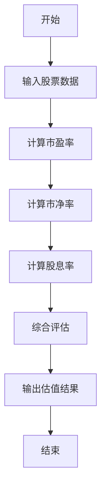
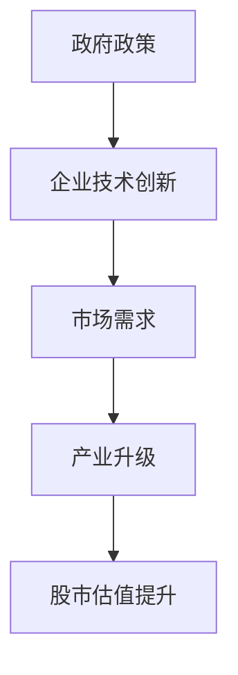
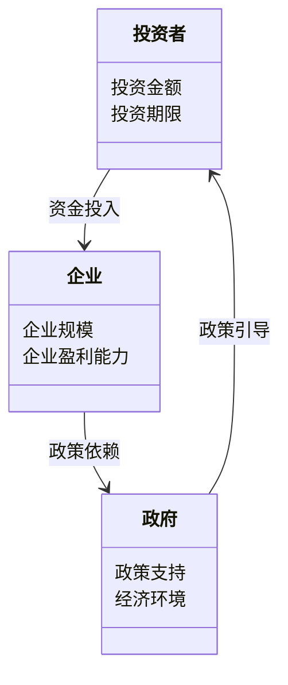
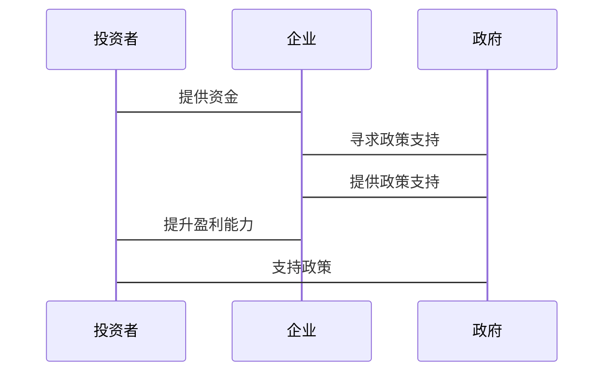

                 


# 新兴市场股市估值与产业升级的互动

## 关键词：新兴市场、股市估值、产业升级、互动关系、经济分析、投资策略

## 摘要：本文探讨了新兴市场股市估值与产业升级之间的互动关系，分析了产业升级对股市估值的影响，以及如何通过股市估值来驱动产业升级。文章从背景、核心概念、算法原理、系统架构、项目实战等多个方面进行详细阐述，为投资者和企业管理者提供理论支持和实践指导。

---

## 第一部分：新兴市场股市估值与产业升级的背景与核心概念

### 第1章：新兴市场股市估值与产业升级的背景概述

#### 1.1 问题背景与问题描述
- **新兴市场的定义与特征**：新兴市场是指经济快速发展、产业结构逐步优化、资本市场逐渐成熟的国家或地区。其特点是经济增长潜力大、市场机制逐步完善、但同时也面临较高的不确定性和风险。
- **股市估值的核心问题**：股市估值的核心问题是如何准确评估上市公司的内在价值，以便做出合理的投资决策。
- **产业升级的必要性与挑战**：产业升级是推动经济高质量发展的关键，但新兴市场在产业升级过程中面临技术、资金、人才等多方面的挑战。

#### 1.2 核心概念与问题解决
- **股市估值的基本原理**：股市估值主要通过基本面分析、技术分析等方法，评估公司的盈利能力、成长潜力等指标。
- **产业升级的驱动因素**：产业升级的驱动因素包括技术创新、政策支持、市场需求等。
- **问题解决的思路与方法**：通过分析股市估值与产业升级之间的互动关系，找到两者相互促进的机制。

#### 1.3 核心概念的边界与外延
- **股市估值的边界条件**：包括市场流动性、政策环境、全球经济形势等因素。
- **产业升级的外延范围**：包括技术创新、管理优化、产业结构调整等多个方面。
- **两者互动的机制与特点**：产业升级推动企业盈利增长，进而提升股市估值；股市估值的合理引导促进企业进一步优化产业结构。

#### 1.4 核心概念结构与组成要素
- **股市估值的组成要素**：包括市盈率、市净率、股息率等。
- **产业升级的核心要素**：包括技术创新、人才引进、政策支持等。
- **两者互动的系统结构**：包括企业、投资者、政府等多个主体的协同作用。

### 第2章：新兴市场股市估值与产业升级的核心概念对比

#### 2.1 核心概念的属性特征对比
| 核心概念   | 属性特征                     |
|------------|------------------------------|
| 股市估值   | 基于公司基本面，注重财务指标 |
| 产业升级   | 基于技术创新，注重产业结构优化 |

#### 2.2 核心概念的ER实体关系图
```mermaid
erDiagram
    actor 投资者 {
        <属性> 投资金额
        <属性> 投资期限
    }
    actor 企业 {
        <属性> 企业规模
        <属性> 企业盈利能力
    }
    actor 政府 {
        <属性> 政策支持
        <属性> 经济环境
    }
    投资者 --> 投资企业 : 资金投入
    企业 --> 政府 : 政策依赖
    政府 --> 投资者 : 政策引导
```

---

## 第二部分：新兴市场股市估值与产业升级的算法与数学模型

### 第3章：股市估值的算法原理

#### 3.1 股市估值的流程图


#### 3.2 股市估值的数学模型
- **市盈率模型**：$$ P/E = \frac{P}{E} $$
  其中，\( P \) 为股票价格，\( E \) 为每股收益。
- **市净率模型**：$$ P/B = \frac{P}{B} $$
  其中，\( P \) 为股票价格，\( B \) 为每股净资产。
- **股息率模型**：$$ D/R = \frac{D}{R} $$
  其中，\( D \) 为股息，\( R \) 为股票价格。

#### 3.3 股市估值的Python代码实现
```python
import pandas as pd
import numpy as np

def calculate_valuation_ratios(df):
    df['PE'] = df['Price'] / df['Earnings']
    df['PB'] = df['Price'] / df['Book Value']
    df['Dividend Yield'] = df['Dividends'] / df['Price']
    return df

# 示例数据
data = {
    'Company': ['Company A', 'Company B', 'Company C'],
    'Price': [50, 60, 70],
    'Earnings': [10, 15, 20],
    'Book Value': [20, 25, 30],
    'Dividends': [2, 3, 4]
}
df = pd.DataFrame(data)
valuated_df = calculate_valuation_ratios(df)
print(valuated_df)
```

---

### 第4章：产业升级的驱动模型

#### 4.1 产业升级的驱动模型
- **技术创新驱动**：$$ I = aT + bP + cM $$
  其中，\( I \) 为产业升级指数，\( T \) 为技术创新投入，\( P \) 为政策支持强度，\( M \) 为市场需求。

#### 4.2 产业升级的系统架构


---

## 第三部分：系统分析与架构设计方案

### 第5章：系统分析与架构设计

#### 5.1 领域模型设计


#### 5.2 系统架构设计


#### 5.3 系统交互设计


---

## 第四部分：项目实战

### 第6章：项目实战

#### 6.1 环境安装
- 安装Python和必要的库（如pandas、numpy）。
- 安装mermaid和相关工具。

#### 6.2 核心代码实现
```python
import pandas as pd
import numpy as np

def calculate_valuation_ratios(df):
    df['PE'] = df['Price'] / df['Earnings']
    df['PB'] = df['Price'] / df['Book Value']
    df['Dividend Yield'] = df['Dividends'] / df['Price']
    return df

# 示例数据
data = {
    'Company': ['Company A', 'Company B', 'Company C'],
    'Price': [50, 60, 70],
    'Earnings': [10, 15, 20],
    'Book Value': [20, 25, 30],
    'Dividends': [2, 3, 4]
}
df = pd.DataFrame(data)
valuated_df = calculate_valuation_ratios(df)
print(valuated_df)
```

#### 6.3 案例分析
- 以某新兴市场为例，分析产业升级对企业估值的影响。
- 使用代码计算企业的市盈率、市净率等指标，评估企业的估值情况。

#### 6.4 项目小结
- 总结项目实现的过程和成果。
- 提出改进建议和未来发展方向。

---

## 第五部分：结论与展望

### 第7章：结论与展望

#### 7.1 研究总结
- 总结全文的主要内容和研究成果。
- 强调股市估值与产业升级互动的重要性。

#### 7.2 未来展望
- 提出未来的研究方向，如更复杂的模型、多因素分析等。
- 展望产业升级与股市估值互动的更多可能性。

---

## 作者：AI天才研究院/AI Genius Institute & 禅与计算机程序设计艺术 /Zen And The Art of Computer Programming

