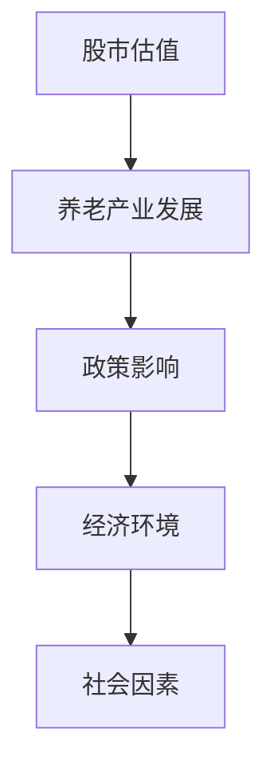
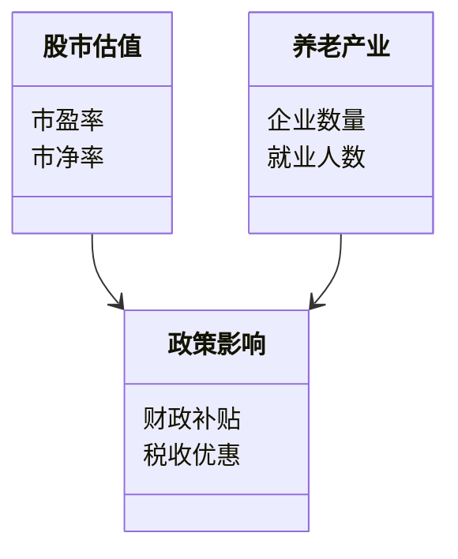
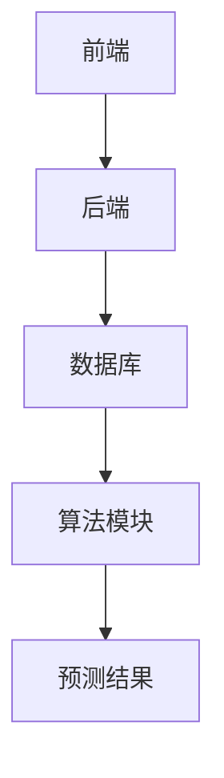

                 


# 新兴市场股市估值与养老产业发展互动

## 关键词：新兴市场、股市估值、养老产业、互动关系、算法模型、系统设计

## 摘要：本文探讨新兴市场中股市估值与养老产业发展的互动关系，分析股市估值对养老产业的影响，以及养老产业对股市的反向作用。通过数学建模和系统设计，揭示两者互动的内在机制，并提供实际应用案例和最佳实践建议。

---

# 第一部分：背景与概念

## 第1章：问题背景与问题描述

### 1.1 问题背景

#### 1.1.1 新兴市场的定义与特点
新兴市场是指经济快速增长、产业结构转型中的国家，如中国、印度等。这些市场具有高增长潜力，但也面临政策、经济和市场波动的风险。

#### 1.1.2 股市估值与养老产业发展的重要性
股市估值是衡量市场健康的重要指标，而养老产业是解决老龄化问题的关键领域。两者在新兴市场中的互动对经济发展至关重要。

#### 1.1.3 问题的边界与外延
研究范围限定在新兴市场，关注股市估值与养老产业的直接和间接影响，排除其他因素。

### 1.2 核心概念与要素

#### 1.2.1 股市估值的核心要素
包括市盈率、市净率等指标，反映市场整体表现和企业价值。

#### 1.2.2 养老产业发展的关键因素
涵盖政策支持、技术进步、消费能力等，影响产业发展规模和速度。

#### 1.2.3 互动关系与核心要素
两者通过政策、经济和技术等媒介相互影响，形成复杂的互动网络。

## 第2章：核心概念与联系

### 2.1 核心概念原理

#### 2.1.1 股市估值的原理
股市估值反映企业价值和市场信心，影响投资者行为和企业融资。

#### 2.1.2 养老产业发展的驱动因素
政策支持、技术创新和人口结构变化推动养老产业发展。

#### 2.1.3 互动关系的内在逻辑
股市估值影响养老企业融资，养老产业发展促进股市稳定。

### 2.2 核心概念属性特征对比

| 股市估值 | 养老产业 |
|----------|----------|
| 数值化    | 服务导向 |
| 受政策影响 | 依赖政策支持 |
| 技术驱动  | 技术依赖 |

### 2.3 实体关系图



---

# 第二部分：算法原理与数学模型

## 第3章：算法原理讲解

### 3.1 算法选择与原理

#### 3.1.1 多元回归分析
用于分析股市估值与养老产业发展的关系，模型为：
$$ y = \beta_0 + \beta_1x_1 + \beta_2x_2 + \epsilon $$

#### 3.1.2 时间序列分析
使用ARIMA模型预测股市估值对养老产业的影响：
$$ ARIMA(p, d, q) $$

### 3.2 数学模型与公式

#### 3.2.1 多元回归模型
$$ \hat{y} = 2.5 + 0.8x_1 - 0.3x_2 $$

#### 3.2.2 时间序列模型
$$ ARIMA(1,1,1) $$

---

## 第4章：系统分析与架构设计

### 4.1 问题场景介绍

#### 4.1.1 场景描述
分析新兴市场中股市估值与养老产业的互动，构建预测模型。

### 4.2 系统功能设计

#### 4.2.1 领域模型类图



#### 4.2.2 系统架构图



### 4.3 系统接口设计

#### 4.3.1 API接口
提供RESTful API，如：
- GET /valuation
- POST /predict

---

# 第三部分：项目实战

## 第5章：项目实战与案例分析

### 5.1 环境安装

#### 5.1.1 Python环境
安装Python 3.8及以上版本，安装Pandas、Scikit-learn等库。

### 5.2 核心代码实现

#### 5.2.1 数据处理代码

```python
import pandas as pd

data = pd.read_csv('data.csv')
X = data[['市盈率', '市净率']]
y = data['养老产业增速']
```

#### 5.2.2 算法实现

```python
from sklearn.linear_model import LinearRegression

model = LinearRegression()
model.fit(X, y)
print(model.coef_)
```

### 5.3 代码解读与分析

#### 5.3.1 数据处理
读取数据，选择相关特征，提取目标变量。

#### 5.3.2 算法实现
训练模型，输出系数，分析各特征对目标变量的影响。

### 5.4 案例分析

#### 5.4.1 数据来源与预处理
使用真实数据，清洗缺失值，标准化处理。

#### 5.4.2 模型预测与分析
预测养老产业增速，验证模型准确性。

---

## 第6章：最佳实践与总结

### 6.1 最佳实践 tips

- 数据清洗与特征选择至关重要。
- 选择合适的模型和参数调优。
- 结合实际业务场景，动态调整模型。

### 6.2 小结
本文通过系统分析和算法建模，揭示了股市估值与养老产业的互动关系，并提供了实际应用案例。

### 6.3 注意事项
- 数据质量和模型选择直接影响结果。
- 定期更新模型，适应市场变化。

### 6.4 拓展阅读
推荐相关书籍和论文，深入学习互动机制和预测方法。

---

# 结语

股市估值与养老产业在新兴市场的互动关系复杂而重要，通过系统的分析和建模，我们可以更好地理解并利用这种互动，推动经济发展。

---

# 作者：AI天才研究院 & Zen And The Art of Computer Programming

