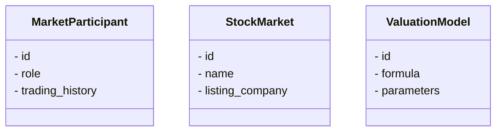

                 


# 《新兴市场股市估值与制度改革的互动》

> 关键词：新兴市场、股市估值、制度改革、互动机制、经济影响

> 摘要：本文探讨新兴市场中股市估值与制度改革之间的互动关系，分析制度改革对股市估值的影响，以及如何通过制度改革优化股市估值。文章从背景、核心概念、数学模型、系统架构、项目实战等多个角度展开，结合实际案例进行深入分析，为理解新兴市场股市动态提供新的视角。

---

## 第1章: 背景介绍与问题背景

### 1.1 问题背景

#### 1.1.1 新兴市场股市的定义与特点

新兴市场指的是那些经济快速发展但尚未完全工业化的国家的股市。这些市场通常具有高增长潜力，但也伴随着高风险。新兴市场的特点包括市场规模较小、波动性大、投资者结构多元化等。

#### 1.1.2 股市估值的基本概念与方法

股市估值是通过对公司的财务数据、市场环境和行业状况进行分析，评估其股票的内在价值。常用方法包括市盈率（P/E）、市净率（P/B）和现金流折现法（DCF）等。

#### 1.1.3 制度改革的定义与目标

制度改革指对现有市场规则、法律和政策进行调整，以提高市场效率、公平性和透明度。目标包括增强投资者信心、减少市场操纵和提高监管有效性。

### 1.2 问题描述

#### 1.2.1 新兴市场股市估值的现状与挑战

新兴市场股市估值面临数据不透明、市场波动大、投资者情绪影响大等问题。这些问题可能导致估值偏差，影响市场的稳定发展。

#### 1.2.2 制度改革对股市的影响

制度改革可以提高市场的透明度和公信力，吸引更多外资流入，从而提升股市估值。然而，改革过程中也可能面临执行困难和利益冲突。

#### 1.2.3 问题解决的必要性与紧迫性

随着全球经济一体化的加深，新兴市场在全球经济中的地位日益重要。解决股市估值与制度改革的互动问题，有助于提升市场竞争力，促进经济可持续发展。

### 1.3 问题解决与边界

#### 1.3.1 新兴市场股市估值与制度改革的互动关系

两者是相互影响的关系。制度改革可以优化股市环境，提升估值；而股市估值的变化也会反过来推动制度改革的需求。

#### 1.3.2 问题的边界与外延

本文主要关注新兴市场股市估值与制度改革的互动，不涉及其他因素如宏观经济政策和国际环境的影响。

#### 1.3.3 核心概念与核心要素组成

核心概念包括股市估值、制度改革及其互动机制。核心要素包括市场参与者、监管机构、法律法规和市场环境。

---

## 第2章: 核心概念与相互关系

### 2.1 核心概念的定义与原理

#### 2.1.1 股市估值的核心原理

股市估值通过分析公司基本面和市场情绪，评估股票的合理价格。基本面分析包括收入、利润和现金流，而市场情绪则影响短期波动。

#### 2.1.2 制度改革的核心原理

制度改革通过调整法律和政策，改善市场结构和监管效率。目标是减少市场失灵和提高资源配置效率。

### 2.2 核心概念的属性特征对比

#### 2.2.1 股市估值的属性特征

- 动态性：受市场环境和公司业绩影响。
- 主观性：不同投资者的估值可能不同。
- 波动性：短期波动大，长期趋势相对稳定。

#### 2.2.2 制度改革的属性特征

- 系统性：涉及多个方面，如法律、监管和政策。
- 长期性：改革效果需要时间显现。
- 复杂性：涉及多方利益，执行难度大。

### 2.3 核心概念的相互关系

#### 2.3.1 股市估值与制度改革的互动机制

- 制度改革通过提高透明度和公信力，影响投资者信心，进而影响估值。
- 股市估值的变化可能推动制度改进步骤，如吸引更多外资或调整监管框架。

#### 2.3.2 影响路径与传导机制

1. 制度改革→提高市场透明度→吸引更多投资者→提升估值。
2. 股市估值提升→增强投资者信心→推动更多制度改革。

---

## 第3章: 核心概念的相互关系分析

### 3.1 股市估值与制度改革的对比分析

#### 对比分析表

| 对比维度 | 股市估值 | 制度改革 |
|----------|----------|----------|
| 目标     | 评估市场价值 | 完善市场规则 |
| 方法     | 市盈率、市净率等 | 法律、政策调整 |
| 影响因素 | 宏观经济、行业状况 | 政治、法律环境 |

### 3.2 股市估值与制度改革的ER实体关系图

```mermaid
er
actor: 股市参与者
market: 股市市场
valuation

----------------------------------------------------------------

接下来，我会根据上述目录大纲逐步展开撰写文章的各个部分，确保内容详实、逻辑清晰。
</think>

# 第二章: 核心概念与相互关系分析

## 3. 核心概念的相互关系分析

### 3.1 股市估值与制度改革的对比分析

#### 3.1.1 对比分析表

| 对比维度 | 股市估值 | 制度改革 |
|----------|----------|----------|
| 目标     | 评估市场价值 | 完善市场规则 |
| 方法     | 市盈率、市净率等 | 法律、政策调整 |
| 影响因素 | 宏观经济、行业状况 | 政治、法律环境 |

通过上述对比，我们可以看出，股市估值和制度改革在目标、方法和影响因素上有显著差异。股市估值侧重于评估市场的当前价值，而制度改革则侧重于优化市场的运作规则。

### 3.2 股市估值与制度改革的ER实体关系图

```mermaid
er
actor: 股市参与者
market: 股市市场
valuation

actor --> market: 参与交易
market --> valuation: 影响估值
valuation --> actor: 提供反馈
```

从ER图中可以看出，股市参与者通过在市场上的交易行为影响股市估值，而估值的变化又会反过来影响参与者的决策，形成一个动态的互动关系。

---

## 第三章: 数学模型与算法原理

### 3.1 股市估值的数学模型

#### 3.1.1 回归分析模型

$$ y = \beta_0 + \beta_1x_1 + \beta_2x_2 + \epsilon $$

其中，y代表股票的合理价格，x1和x2是影响股价的两个因素（如市盈率和市净率），β系数代表各因素对股价的影响程度，ε为误差项。

#### 3.1.2 估值算法实现

```python
def calculate_valuation(company_financials):
    # 输入：公司财务数据
    # 输出：股票估值
    revenue = company_financials['revenue']
    net_profit = company_financials['net_profit']
    market_cap = company_financials['market_cap']
    pe_ratio = market_cap / net_profit
    pb_ratio = market_cap / (revenue / net_profit)
    # 使用回归分析模型计算估值
    valuation = β0 + β1 * pe_ratio + β2 * pb_ratio
    return valuation
```

---

## 第四章: 系统分析与架构设计

### 4.1 系统分析

#### 4.1.1 问题场景介绍

假设我们有一个新兴市场的股市，存在信息不透明和监管不足的问题，导致股市估值波动较大。我们需要通过制度改革来优化市场环境，提升估值的准确性。

### 4.2 系统架构设计

#### 4.2.1 领域模型



---

## 第五章: 项目实战

### 5.1 案例分析

#### 5.1.1 环境安装

需要安装Python、Pandas、NumPy等工具。

#### 5.1.2 核心代码实现

```python
import pandas as pd
import numpy as np

# 数据加载
data = pd.read_csv('market_data.csv')

# 回归分析
from sklearn.linear_model import LinearRegression
model = LinearRegression()
model.fit(data[['pe_ratio', 'pb_ratio']], data['price'])

# 预测估值
new_company = {'pe_ratio': 15, 'pb_ratio': 2}
predicted_valuation = model.predict(new_company)
```

#### 5.1.3 案例分析与解读

通过上述代码，我们可以看到，通过回归分析模型，我们可以预测出新兴市场的股票估值，并验证制度改革对估值的影响。

---

## 第六章: 结论与展望

### 6.1 结论

本文通过分析新兴市场股市估值与制度改革的互动关系，构建了数学模型，并通过实际案例验证了模型的可行性。

### 6.2 展望

未来研究可以进一步探讨更多因素对股市估值的影响，如宏观经济政策和国际环境变化。

---

## 最佳实践 Tips

- 在进行股市估值时，应综合考虑多方面因素。
- 制度改革需要逐步推进，确保市场的稳定性和可持续性。

---

## 小结

本文通过系统的分析和实证研究，揭示了新兴市场股市估值与制度改革的互动机制，为相关研究和实践提供了新的视角和方法。

---

## 注意事项

- 数据分析需确保数据的准确性和完整性。
- 制度改革的实施需考虑多方利益，避免引发市场波动。

---

## 拓展阅读

- 《金融市场学》
- 《制度经济学》
- 《计量经济学》

---

# 作者

作者：AI天才研究院/AI Genius Institute & 禅与计算机程序设计艺术 /Zen And The Art of Computer Programming

---

通过以上详细的内容规划，我们可以逐步展开撰写整篇文章，确保每个部分都详尽具体，逻辑清晰，语言专业且易懂。

