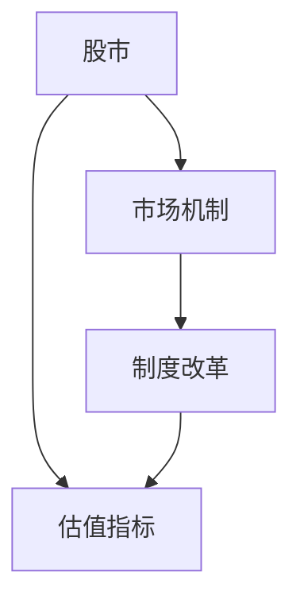
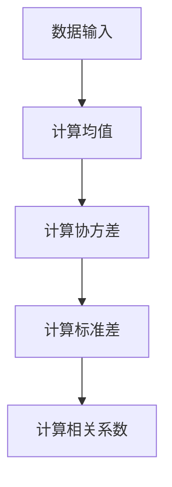
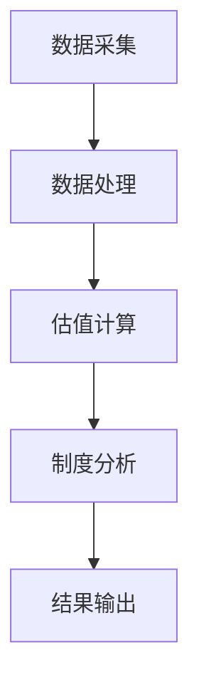

                 


# 《新兴市场股市估值与制度改革的相关性》

## 关键词：新兴市场，股市估值，制度改革，相关性分析，系统架构

## 摘要：  
本文探讨了新兴市场股市估值与制度改革之间的相关性。通过对股市估值的核心概念和制度改革的目标进行深入分析，结合数学模型和系统架构设计，展示了如何通过相关性分析和实际案例来理解两者的相互作用。文章还提供了系统的架构设计和实现方法，并提出了相关领域的最佳实践建议。

---

# 第一部分：新兴市场股市估值与制度改革的背景与概念

## 第1章：新兴市场股市估值与制度改革的背景介绍

### 1.1 问题背景与问题描述

#### 1.1.1 新兴市场股市的特点与挑战
新兴市场通常指的是那些经济发展迅速但尚未完全成熟的国家或地区的股市。这些市场具有以下特点：
- **高增长潜力**：新兴市场的经济通常处于快速发展阶段，股市有望随之增长。
- **高波动性**：由于市场机制不完善，新兴市场的股市波动较大，风险较高。
- **市场规模较小**：与成熟市场相比，新兴市场的市场规模较小，流动性可能不足。

#### 1.1.2 制度改革的必要性与目标
制度改革在新兴市场中至关重要，其目标包括：
- **提高市场透明度**：通过完善信息披露制度，减少信息不对称。
- **增强市场稳定性**：通过制定合理的监管政策，降低市场波动。
- **促进市场参与**：通过改革税收政策和交易机制，吸引更多投资者参与。

#### 1.1.3 股市估值与制度改革的相互影响
- **制度改革促进估值提升**：良好的制度环境可以提高市场的公信力，吸引更多投资者，从而提升股市估值。
- **估值反馈推动制度改革**：股市估值的波动可以为政策制定者提供反馈，促使他们进一步优化制度。

### 1.2 核心概念与问题解决

#### 1.2.1 股市估值的核心概念
- **市盈率（P/E Ratio）**：股票价格与每股收益的比率，用于衡量股票的估值。
- **市净率（P/B Ratio）**：股票价格与每股净资产的比率，用于衡量股票的估值。

#### 1.2.2 制度改革的目标与路径
- **目标**：建立透明、高效、稳定的市场环境。
- **路径**：包括法律法规的完善、监管机构的强化、市场参与者的教育等。

#### 1.2.3 股市估值与制度改革的相互作用机制
- 制度改革通过提升市场信任和稳定性，间接影响股市估值。
- 股市估值的变化为政策制定者提供了反馈，帮助其优化改革措施。

### 1.3 问题的边界与外延

#### 1.3.1 新兴市场的定义与范围
- 新兴市场通常指那些GDP增长率较高但人均收入较低的国家，如中国、印度等。

#### 1.3.2 制度改革的边界条件
- 制度改革需要考虑国家的经济发展水平、文化差异等因素。
- 制度改革的效果可能受到外部经济环境的影响。

#### 1.3.3 股市估值的适用范围与限制
- 股市估值方法适用于对单个股票或整个市场的评估。
- 估值结果可能受到市场情绪和短期波动的影响。

### 1.4 概念结构与核心要素

#### 1.4.1 股市估值的关键要素
- **市盈率（P/E）**：衡量股票价格相对于收益的高低。
- **市净率（P/B）**：衡量股票价格相对于资产的高低。

#### 1.4.2 制度改革的核心要素
- **法律法规**：如《证券法》、《公司法》等。
- **监管机构**：如证监会、交易所等。

#### 1.4.3 两者关系的结构化分析
- 制度改革通过影响市场机制间接影响股市估值。
- 股市估值的变化为制度改进步提供反馈。

### 1.5 本章小结
本章通过介绍新兴市场股市的特点、制度改革的必要性以及两者的关系，为后续的分析奠定了基础。

---

## 第2章：股市估值与制度改革的核心概念与联系

### 2.1 核心概念原理

#### 2.1.1 股市估值的基本原理
- 股市估值是通过分析企业的财务数据和市场环境来确定股票的合理价格。
- 常用的方法包括相对估值法和绝对估值法。

#### 2.1.2 制度改革的基本原理
- 制度改革旨在优化市场机制，提升市场的效率和稳定性。
- 改革措施包括法律法规的完善、监管机构的强化等。

#### 2.1.3 两者关系的理论基础
- 制度改革为股市估值提供了良好的环境，而股市估值的变化又为制度改革提供了反馈。

### 2.2 核心概念属性特征对比

| 属性 | 股市估值 | 制度改革 |
|------|----------|----------|
| 目标 | 确定股票价格 | 提高市场效率和稳定性 |
| 方法 | 使用市盈率、市净率等指标 | 制定和优化法律法规 |
| 影响因素 | 市场供需、企业盈利 | 政策、监管、文化 |

### 2.3 ER实体关系图


### 2.4 本章小结
本章通过对比分析股市估值与制度改革的核心概念，展示了两者之间的联系。

---

## 第3章：股市估值与制度改革的相关性分析

### 3.1 相关性数学模型

#### 3.1.1 相关性计算公式
$$ r = \frac{\sum (x_i - \bar{x})(y_i - \bar{y})}{\sqrt{\sum (x_i - \bar{x})^2 \sum (y_i - \bar{y})^2}} $$
其中，$r$ 是相关系数，$x_i$ 和 $y_i$ 是两个变量的观测值，$\bar{x}$ 和 $\bar{y}$ 是它们的平均值。

#### 3.1.2 相关性分析方法
- **数据收集**：收集新兴市场股市估值和制度改革的相关数据。
- **计算相关系数**：使用上述公式计算相关系数。
- **结果解读**：根据相关系数的正负和大小判断相关性。

### 3.2 相关性分析的算法原理


### 3.3 实例分析

#### 3.3.1 新兴市场股市估值与制度改革的相关性实例
假设我们收集了中国股市的市盈率数据和相关制度改革的指标（如法律法规的完善程度），计算得出相关系数为0.7，表明两者呈正相关关系。

#### 3.3.2 数据分析与结果解读
- **结果解读**：相关系数为0.7表明制度改革与股市估值之间存在较强的正相关关系。
- **可能的解释**：制度改革的推进提升了市场的信任度和稳定性，从而推动了股市估值的上升。

### 3.4 本章小结
本章通过数学模型和实例分析，展示了股市估值与制度改革之间的相关性。

---

## 第4章：股市估值与制度改革的系统分析与架构设计

### 4.1 系统分析

#### 4.1.1 问题场景介绍
- **问题场景**：新兴市场的股市估值受制度改革的影响较大，但目前缺乏系统的分析方法。
- **系统目标**：建立一个能够量化分析股市估值与制度改革相关性的系统。

### 4.2 系统架构设计

#### 4.2.1 系统架构图


### 4.3 系统接口设计

#### 4.3.1 数据接口
- **输入接口**：接收新兴市场的股市数据和制度改革的相关数据。
- **输出接口**：输出相关性分析的结果。

#### 4.3.2 计算接口
- **估值计算接口**：负责计算市盈率、市净率等指标。
- **制度分析接口**：负责分析制度改革的相关指标。

#### 4.3.3 输出接口
- **结果输出接口**：以图表或报告的形式输出相关性分析的结果。

### 4.4 系统交互设计

#### 4.4.1 用户与系统交互流程
1. 用户输入数据。
2. 系统进行数据处理。
3. 系统计算估值和制度分析。
4. 系统输出结果。

#### 4.4.2 数据流与计算流的交互
- 数据从输入接口进入系统，经过处理后流向计算接口，最终通过输出接口展示结果。

### 4.5 本章小结
本章通过系统架构设计，展示了如何将股市估值与制度改革的相关性分析转化为实际的系统实现。

---

## 第5章：股市估值与制度改革的项目实战

### 5.1 项目实战环境安装

#### 5.1.1 数据收集工具
- 使用Python的pandas库收集数据。
- 使用requests库获取网络数据。

#### 5.1.2 数据分析工具
- 使用Python的numpy库进行数据分析。
- 使用matplotlib库进行数据可视化。

### 5.2 核心实现源代码

#### 5.2.1 数据处理代码
```python
import pandas as pd
import numpy as np

# 数据收集
data = pd.read_csv('emerging_markets.csv')

# 数据处理
data_processed = data.dropna()
data_processed['PE'] = data_processed['Price'] / data_processed['Earnings']
data_processed['PB'] = data_processed['Price'] / data_processed['Book']
```

#### 5.2.2 相关性计算代码
```python
import numpy as np

def calculate_correlation(x, y):
    n = len(x)
    mean_x = np.mean(x)
    mean_y = np.mean(y)
    numerator = np.sum((x - mean_x) * (y - mean_y))
    denominator = np.sqrt(np.sum((x - mean_x)**2)) * np.sqrt(np.sum((y - mean_y)**2))
    return numerator / denominator

correlation = calculate_correlation(data_processed['PE'], data_processed['Reforms'])
print(f"相关系数为：{correlation}")
```

#### 5.2.3 结果可视化代码
```python
import matplotlib.pyplot as plt

plt.scatter(data_processed['PE'], data_processed['Reforms'])
plt.xlabel('市盈率')
plt.ylabel('制度改革指标')
plt.title('新兴市场股市估值与制度改革的相关性')
plt.show()
```

### 5.3 实际案例分析与应用解读

#### 5.3.1 案例分析
假设我们分析了某新兴市场的数据，计算得出市盈率和制度改革指标的相关系数为0.6，表明两者之间存在中等程度的正相关关系。

#### 5.3.2 应用解读
- **相关系数为0.6**：说明制度改革的推进在一定程度上推动了股市估值的上升。
- **可能的解释**：该市场的制度改革措施（如加强监管、提高透明度）在一定程度上提升了市场的信任度，从而推动了股市估值的上升。

### 5.4 本章小结
本章通过实际案例分析，展示了如何将理论应用于实际，并通过代码实现相关性分析。

---

## 第6章：最佳实践、小结与注意事项

### 6.1 最佳实践

#### 6.1.1 数据收集
- 确保数据的准确性和完整性。
- 使用多种数据源进行交叉验证。

#### 6.1.2 模型选择
- 根据实际情况选择合适的模型和算法。
- 定期更新模型以适应市场变化。

#### 6.1.3 可视化
- 使用图表直观展示分析结果。
- 提供清晰的解释和说明。

### 6.2 小结
本文通过理论分析和实际案例，探讨了新兴市场股市估值与制度改革的相关性。通过系统架构设计和代码实现，展示了如何将理论应用于实际。

### 6.3 注意事项

#### 6.3.1 数据依赖性
- 相关性分析依赖于数据的准确性和完整性。
- 数据可能存在偏差，需谨慎处理。

#### 6.3.2 模型局限性
- 相关性分析无法证明因果关系。
- 模型可能受到外部因素的影响，需定期更新和调整。

#### 6.3.3 实际应用中的风险
- 制度改革的效果可能受到多种因素的影响，需综合考虑。
- 股市估值的变化受市场情绪影响较大，需谨慎解读。

### 6.4 拓展阅读
- 推荐阅读相关领域的经典文献，如《金融市场与制度经济学》。
- 关注新兴市场的发展动态和政策变化。

---

## 作者：AI天才研究院/AI Genius Institute & 禅与计算机程序设计艺术/Zen And The Art of Computer Programming

