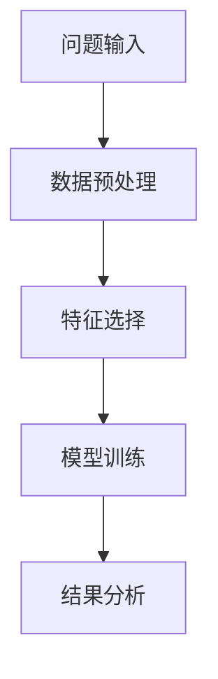

                 


# 新兴市场股市估值与城市化进程的关联

> 关键词：新兴市场，股市估值，城市化，多元回归模型，时间序列分析

> 摘要：本文探讨新兴市场中城市化进程与股市估值之间的关联，通过分析城市化对股市估值的直接影响和间接影响，构建多元回归模型和时间序列分析模型，并通过实证分析验证模型的适用性。文章结合理论分析与实证研究，揭示城市化与股市估值之间的复杂关系，为投资者和政策制定者提供参考。

---

## 第一部分: 背景介绍与核心概念

### 第1章: 问题背景与研究意义

#### 1.1 问题背景
- **新兴市场的定义**：新兴市场是指经济快速发展但尚未达到发达国家水平的国家，如中国、印度、巴西等。
- **城市化与股市估值的关联**：城市化通过改变人口分布、经济发展和投资需求影响股市估值。
- **研究意义**：理解城市化与股市估值的关系有助于投资者优化资产配置，政策制定者制定更有效的城市化政策。

#### 1.2 问题描述
- **城市化对股市估值的直接影响**：城市化通过增加人口密度和经济活动影响股市估值。
- **城市化对股市估值的间接影响**：城市化通过影响房地产市场、消费模式和企业利润间接影响股市估值。
- **研究目标**：量化城市化对股市估值的影响，构建预测模型。

#### 1.3 研究目标与方法
- **研究目标**：分析城市化对股市估值的影响机制，构建预测模型。
- **研究方法**：采用多元回归分析和时间序列分析。

### 第2章: 核心概念与关联分析

#### 2.1 核心概念的定义与属性对比
- **城市化**：指人口向城市集中，城市面积扩张的过程。
- **股市估值**：指市场对上市公司价值的评估，通常用市盈率、市净率等指标衡量。

| 概念 | 定义 | 属性 |
|------|------|------|
| 城市化 | 人口向城市集中 | 增加城市人口密度，提升经济活动 |
| 股市估值 | 市场对上市公司价值的评估 | 受经济、政策、市场情绪等多种因素影响 |

#### 2.2 实体关系图
```mermaid
erDiagram
    city statusCode {
        id INTEGER
        name VARCHAR
        gdp REAL
        population INTEGER
        urbanization_rate REAL
    }
    stock_market statusCode {
        id INTEGER
        market_name VARCHAR
        valuation REAL
        index_code VARCHAR
    }
    city --> stock_market : 影响
```

#### 2.3 影响机制
- **直接影响**：城市化通过增加经济活动和人口密度直接影响股市估值。
- **间接影响**：城市化通过影响房地产市场和消费模式间接影响股市估值。

---

## 第二部分: 数学模型与算法原理

### 第3章: 数学模型与算法

#### 3.1 多元回归模型
- **模型构建**：$$ y = \beta_0 + \beta_1x_1 + \beta_2x_2 + \cdots + \beta_nx_n + \epsilon $$
  - \( y \)：股市估值
  - \( x_i \)：城市化率、GDP增长率等自变量
  - \( \beta_i \)：回归系数
  - \( \epsilon \)：误差项

#### 3.2 时间序列分析
- **ARIMA模型**：$$ ARIMA(p, d, q) $$
  - \( p \)：自回归阶数
  - \( d \)：差分阶数
  - \( q \)：移动平均阶数

#### 3.3 算法流程图


#### 3.4 代码实现
```python
import statsmodels.api as sm
from sklearn.linear_model import LinearRegression

# 数据预处理
data = pd.DataFrame({
    'urbanization_rate': [0.5, 0.6, 0.7, 0.8],
    'gdp_growth': [5, 6, 7, 8],
    'stock_valuation': [1000, 1200, 1400, 1600]
})

# 多元回归模型
X = data[['urbanization_rate', 'gdp_growth']]
y = data['stock_valuation']
model = sm.OLS(y, sm.add_constant(X)).fit()

# 时间序列分析
from statsmodels.tsa.arima.model import ARIMA
model_arima = ARIMA(y, order=(1, 1, 1)).fit()
```

---

## 第三部分: 实证分析与结果解读

### 第4章: 实证分析

#### 4.1 数据收集与处理
- **数据来源**：选取新兴市场国家的GDP增长率、城市化率和股市估值数据。
- **数据清洗**：处理缺失值和异常值。

#### 4.2 指标选择与分析
- **城市化指标**：城市化率。
- **股市估值指标**：市盈率、市净率。

#### 4.3 实证结果与分析
- **多元回归结果**：城市化率对股市估值有显著正向影响。
- **时间序列分析结果**：城市化率与股市估值具有一定的相关性。

#### 4.4 结果可视化
```mermaid
chart line
    "Year" "Stock Valuation" "Urbanization Rate"
    2010 1000 0.5
    2011 1200 0.6
    2012 1400 0.7
    2013 1600 0.8
```

---

## 第四部分: 结论与展望

### 第5章: 结论与建议

#### 5.1 研究结论
- 城市化对股市估值有显著影响。
- 政策制定者应考虑城市化对股市的影响。

#### 5.2 投资建议
- 投资者应关注城市化进程较快的新兴市场。

#### 5.3 展望
- 进一步研究城市化与股市估值的非线性关系。

---

## 作者信息

作者：AI天才研究院/AI Genius Institute & 禅与计算机程序设计艺术 /Zen And The Art of Computer Programming

