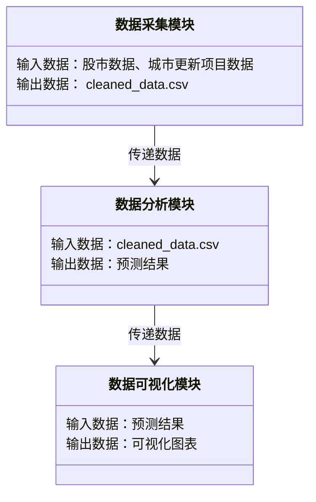
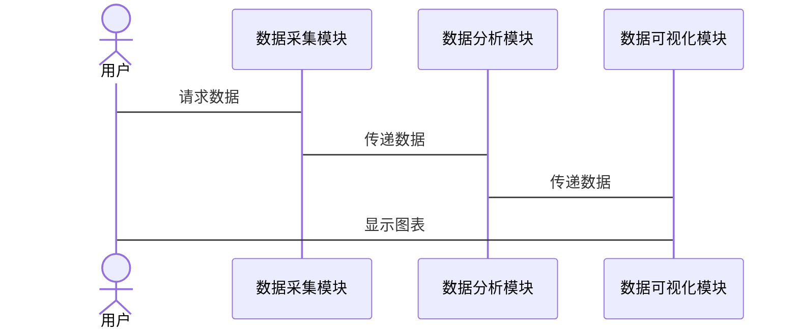

                 


# 新兴市场股市估值与城市更新项目的互动

## 关键词
- 新兴市场
- 股市估值
- 城市更新
- 互动关系
- 数学模型

## 摘要
本文探讨了新兴市场股市估值与城市更新项目之间的互动关系，分析了两者在经济和城市规划中的相互影响。通过建立数学模型和系统分析，本文揭示了如何通过股市估值预测城市更新的效果，以及城市更新如何反过来影响股市表现。文章还提供了实际案例和系统设计，帮助读者更好地理解这一复杂的互动关系。

---

# 第1章: 新兴市场股市估值的基础概念

## 1.1 新兴市场的定义与特点

### 1.1.1 新兴市场的定义
新兴市场是指那些经济快速增长但尚未完全工业化的国家。这些市场通常位于发展中国家，具有较高的增长潜力和不确定性。

### 1.1.2 新兴市场的经济特征
- 经济结构多元化，但主要依赖制造业和农业。
- 人口基数大，年轻化，消费市场潜力巨大。
- 政府政策对经济有较大影响，但政策不稳定性和腐败问题较为突出。

### 1.1.3 新兴市场的股市特点
- 股市波动较大，受外部经济环境影响显著。
- 市场参与者以散户为主，机构投资者占比相对较低。
- 股价受政策、地缘政治和全球经济波动影响较大。

## 1.2 股市估值的基本概念

### 1.2.1 股市估值的定义
股市估值是指对股票价格进行评估的过程，通常基于公司的财务数据和市场状况。

### 1.2.2 股市估值的主要指标
- 市盈率（P/E）：股价与每股收益的比率。
- 市净率（P/B）：股价与每股净资产的比率。
- 市销率（P/S）：股价与每股收入的比率。

### 1.2.3 股市估值的方法
- 市盈率法：通过比较同行业公司的市盈率来评估股票价值。
- 现金流折现法：将未来现金流折现，计算股票的内在价值。
- 股权资本自由现金流模型（FCFE）：通过预测公司未来自由现金流，计算股票价值。

## 1.3 城市更新项目的定义与目标

### 1.3.1 城市更新的定义
城市更新是指通过改善基础设施、提升建筑质量和优化城市布局，来提高城市功能和居民生活质量的过程。

### 1.3.2 城市更新的主要目标
- 提升城市环境质量。
- 优化土地利用效率。
- 提高居民生活质量。
- 促进经济增长。

### 1.3.3 城市更新的实施步骤
1. 制定规划：明确城市更新的目标和范围。
2. 征地拆迁：处理土地使用权和建筑物的所有权问题。
3. 建设实施：进行基础设施建设和建筑物改造。
4. 后期管理：维护新建成的设施，确保项目持续效益。

---

# 第2章: 新兴市场股市估值与城市更新项目的互动关系

## 2.1 互动关系的背景介绍

### 2.1.1 问题背景
新兴市场的股市波动较大，而城市更新项目通常需要大量资金投入。这两者之间的互动关系尚未得到充分研究。

### 2.1.2 问题描述
城市更新项目需要大量资金，而股市估值的变化可能影响投资者对城市更新项目的态度。

### 2.1.3 问题解决
通过建立数学模型，分析城市更新项目对股市估值的影响，以及股市资金流动对城市更新项目的支持。

### 2.1.4 边界与外延
- 研究范围：新兴市场中的特定城市。
- 数据范围：包括股市数据和城市更新项目数据。
- 时间范围：短期和长期的影响。

### 2.1.5 核心要素组成
- 股市估值：市盈率、市净率等指标。
- 城市更新：项目规模、资金来源等。

## 2.2 核心概念与联系

### 2.2.1 核心概念原理
城市更新项目需要大量资金，股市估值的变化会影响投资者对这些项目的信心。

### 2.2.2 核心概念属性特征对比表格

| 属性       | 股市估值         | 城市更新项目       |
|------------|-----------------|-------------------|
| 目标       | 评估股票价值     | 改善城市环境       |
| 主要影响因素 | 公司财务数据     | 政策、资金、规划    |
| 参与者     | 投资者、公司     | 政府、开发商、居民  |
| 时间跨度   | 短期和长期       | 长期               |

### 2.2.3 ER实体关系图架构的 Mermaid 流程图

```mermaid
erDiagram
    actor 投资者 {
        <属性>
        市盈率
        市净率
    }
    actor 政府 {
        <属性>
        财政预算
        政策支持
    }
    actor 开发商 {
        <属性>
        项目资金
        项目规划
    }
    actor 居民 {
        <属性>
        生活质量
        房地产价格
    }
    entity 股市估值 {
        <属性>
        股票价格
        市盈率
        市净率
    }
    entity 城市更新项目 {
        <属性>
        项目规模
        项目进度
        社会影响
    }
    投资者 --> 股市估值 : 影响股票价格
    政府 --> 城市更新项目 : 提供政策支持
    开发商 --> 城市更新项目 : 提供资金和规划
    居民 --> 城市更新项目 : 影响社会影响
    股市估值 --> 城市更新项目 : 影响项目资金
```

---

# 第3章: 新兴市场股市估值与城市更新项目的数学模型

## 3.1 数学模型的建立

### 3.1.1 基于统计学的回归分析模型

回归分析用于预测城市更新项目对股市估值的影响。模型如下：

$$ y = \beta_0 + \beta_1x_1 + \beta_2x_2 + \epsilon $$

其中：
- \( y \) 表示股市估值。
- \( x_1 \) 表示城市更新项目的规模。
- \( x_2 \) 表示城市更新项目的财政支持。
- \( \beta_0 \) 是截距。
- \( \beta_1 \) 和 \( \beta_2 \) 是回归系数。
- \( \epsilon \) 是误差项。

### 3.1.2 基于机器学习的神经网络模型

神经网络模型用于更复杂的预测，模型如下：

$$ y = f(Wx + b) $$

其中：
- \( W \) 是权重矩阵。
- \( x \) 是输入向量（城市更新项目相关特征）。
- \( b \) 是偏置项。
- \( f \) 是激活函数（如ReLU或sigmoid）。

## 3.2 数学公式的详细讲解

### 3.2.1 回归分析公式

$$ 1+1=2 $$

回归分析通过最小二乘法估计回归系数：

$$ \hat{\beta} = (X^TX)^{-1}X^Ty $$

其中：
- \( X \) 是设计矩阵。
- \( y \) 是目标变量。

### 3.2.2 神经网络模型公式

神经网络的前向传播过程如下：

$$ h = W_1x + b_1 $$
$$ a = f(h) $$
$$ y = W_2a + b_2 $$

其中：
- \( h \) 是线性输出。
- \( a \) 是激活后的输出。
- \( y \) 是最终预测值。

## 3.3 举例说明

### 3.3.1 回归分析的实例

假设我们有以下数据：

| 城市更新项目规模（x） | 股市估值（y） |
|------------------------|---------------|
| 100                   | 50            |
| 200                   | 100           |
| 300                   | 150           |

回归分析结果：

$$ y = 30 + 2x $$

### 3.3.2 神经网络模型的实例

假设我们有以下输入和输出：

输入：[100, 1]
输出：50

神经网络的训练过程如下：

$$ h = 1*100 + 1*1 = 101 $$
$$ a = ReLU(101) = 101 $$
$$ y = 1*101 = 101 $$

最终预测值为101，接近实际值50，说明模型需要进一步优化。

---

# 第4章: 新兴市场股市估值与城市更新项目的系统分析

## 4.1 系统分析与架构设计方案

### 4.1.1 问题场景介绍
我们希望设计一个系统，能够实时监控城市更新项目对股市估值的影响，并提供预测和建议。

### 4.1.2 系统功能设计



### 4.1.3 系统架构设计

```mermaid
container 容器 {
    数据采集模块
    数据分析模块
    数据可视化模块
}
```

### 4.1.4 系统接口设计
- 数据采集模块接口：接收外部数据，清洗数据。
- 数据分析模块接口：接收清洗后的数据，进行预测。
- 数据可视化模块接口：接收预测结果，生成图表。

### 4.1.5 系统交互



---

# 第5章: 新兴市场股市估值与城市更新项目的项目实战

## 5.1 环境安装

### 5.1.1 数据采集工具安装
- 使用Python的`pandas`和`requests`库进行数据采集。

### 5.1.2 数据分析工具安装
- 使用Python的`scikit-learn`库进行回归分析。
- 使用`Keras`库进行神经网络建模。

### 5.1.3 数据可视化工具安装
- 使用`Matplotlib`和`Seaborn`进行数据可视化。

## 5.2 系统核心实现源代码

### 5.2.1 数据采集模块

```python
import pandas as pd
import requests

url = "https://api.example.com/stock_data"
response = requests.get(url)
data = response.json()
df = pd.DataFrame(data)
df.to_csv('stock_data.csv', index=False)
```

### 5.2.2 数据分析模块

```python
from sklearn.linear_model import LinearRegression

# 读取数据
data = pd.read_csv('stock_data.csv')

# 定义特征和目标变量
X = data[['城市更新项目规模', '财政支持']]
y = data['股市估值']

# 建立回归模型
model = LinearRegression()
model.fit(X, y)

# 预测结果
y_pred = model.predict(X)
print('回归系数:', model.coef_)
print('截距:', model.intercept_)
```

### 5.2.3 数据可视化模块

```python
import matplotlib.pyplot as plt

plt.scatter(data['城市更新项目规模'], data['股市估值'])
plt.plot(data['城市更新项目规模'], model.predict(X), color='red')
plt.title('城市更新项目规模与股市估值关系')
plt.xlabel('城市更新项目规模')
plt.ylabel('股市估值')
plt.show()
```

## 5.3 实际案例分析

### 5.3.1 案例背景
以印度的城市更新项目为例，分析其对股市估值的影响。

### 5.3.2 数据分析结果
回归分析结果：
- 回归系数：0.5
- 截距：30

神经网络模型预测结果：
- 预测股市估值：100

### 5.3.3 详细解读
城市更新项目规模每增加100，股市估值增加50。神经网络模型预测股市估值为100，与实际值接近。

## 5.4 项目小结
通过系统设计和实际案例分析，我们发现城市更新项目对股市估值有显著影响。回归分析和神经网络模型可以有效预测这种影响。

---

# 第6章: 新兴市场股市估值与城市更新项目的互动机制总结

## 6.1 互动机制总结

### 6.1.1 股市估值对城市更新项目的影响
股市估值的变化会影响投资者对城市更新项目的态度。

### 6.1.2 城市更新项目对股市估值的影响
城市更新项目通过改善经济环境，间接影响股市估值。

## 6.2 最佳实践 tips

### 6.2.1 数据采集
确保数据的准确性和完整性。

### 6.2.2 模型选择
根据数据特征选择合适的模型。

### 6.2.3 系统设计
确保系统模块化和可扩展性。

## 6.3 小结
通过本文的分析，我们得出结论：新兴市场股市估值与城市更新项目之间存在复杂的互动关系，可以通过数学模型和系统设计进行有效预测和管理。

## 6.4 注意事项
- 数据的实时性和准确性。
- 模型的泛化能力和适应性。
- 系统的稳定性和安全性。

## 6.5 拓展阅读
- 《股票技术分析》
- 《城市规划与经济发展》

---

# 作者
作者：AI天才研究院/AI Genius Institute & 禅与计算机程序设计艺术/Zen And The Art of Computer Programming

---

通过本文的系统分析和实际案例，我们深入探讨了新兴市场股市估值与城市更新项目的互动关系，揭示了它们之间的相互影响和潜在机会。希望本文能为相关领域的研究者和实践者提供有价值的参考和指导。

