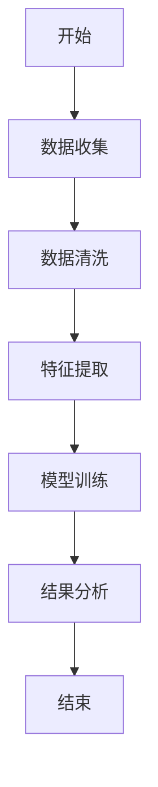

                 


# 新兴市场股市估值与政治稳定性的关联

> 关键词：新兴市场，股市估值，政治稳定性，数据分析，算法原理，系统架构

> 摘要：本文探讨新兴市场股市估值与政治稳定性的关联，通过数据分析、算法模型和系统架构设计，揭示两者之间的复杂关系，并提供实际案例分析和最佳实践建议。

---

## 第一部分: 新兴市场股市估值与政治稳定性的关联概述

### 第1章: 背景介绍

#### 1.1 问题背景

新兴市场指的是那些经济增长迅速、但市场机制尚不完善的国家或地区，如中国、印度、巴西等。这些市场具有高度的不确定性和波动性，而股市估值和政治稳定性是影响其经济发展的两个关键因素。

- **新兴市场的定义与特点**  
  新兴市场通常具有较高的经济增长潜力，但同时也伴随着较高的风险。这些市场的特点是经济结构多元化、金融市场逐步完善，但政策法规和市场机制尚不成熟。

- **股市估值的基本概念**  
  股市估值是通过对上市公司财务数据和市场情况的分析，评估其股票的合理价格范围。常用的估值方法包括市盈率（P/E）、市净率（P/B）等。

- **政治稳定性的定义与衡量标准**  
  政治稳定性指一个国家或地区的政治环境的稳定程度，通常包括政府稳定性、政策连续性、社会秩序等因素。衡量标准包括政治事件频率、政策变动幅度等。

#### 1.2 问题描述

新兴市场股市的波动性较高，而政治稳定性对股市的影响尤为显著。本文将探讨以下问题：

- **新兴市场股市波动的复杂性**  
  新兴市场的股市受多种因素影响，包括全球经济波动、本地政策变化等。

- **政治稳定性对经济的影响**  
  政治不稳定可能导致股市下跌，投资者信心下降，反之，政治稳定则有助于吸引外资，推动股市上涨。

- **问题的边界与外延**  
  本文聚焦于新兴市场股市与政治稳定性的关系，但不涉及其他因素（如货币政策、国际贸易）的影响。

#### 1.3 问题解决

- **研究目标**  
  探讨新兴市场股市估值与政治稳定性的关联，建立数学模型，预测股市波动。

- **研究方法**  
  采用数据分析和算法建模的方法，结合历史数据进行实证分析。

- **数据来源与处理**  
  数据来源包括世界银行、金融时报等权威机构，数据清洗包括处理缺失值、异常值等。

#### 1.4 概念结构与核心要素

- **核心概念的组成**  
  核心概念包括股市估值、政治稳定性、新兴市场三个部分。

- **核心要素的对比分析**  
  通过对比分析，明确股市估值和政治稳定性在不同市场中的表现。

---

### 第2章: 核心概念与联系

#### 2.1 核心概念原理

- **股市估值的原理**  
  股市估值是基于公司基本面和市场情绪的综合评估。基本面包括收入、利润等，市场情绪包括投资者信心等。

- **政治稳定性的原理**  
  政治稳定性是通过政策连续性和社会秩序来衡量的。稳定的政治环境有助于吸引外资，推动经济增长。

#### 2.2 概念属性特征对比

| 属性          | 股市估值 | 政治稳定性 |
|---------------|----------|------------|
| 衡量指标      | P/E、P/B | 政治事件频率 |
| 影响因素      | 利润、收入 | 政策、社会 |
| 时间跨度      | 短期波动 | 中长期影响 |

#### 2.3 ER实体关系图

```mermaid
erd
  title 核心概念关系图
  Market
    name: 新兴市场
    id: id
  Politics
    name: 政治稳定性
    id: id
  link from Market.id to Politics.id
```

---

## 第二部分: 算法原理讲解

### 第3章: 算法原理讲解

#### 3.1 算法流程



#### 3.2 Python源代码

```python
import pandas as pd
import numpy as np
from sklearn.linear_model import LinearRegression
from sklearn.metrics import mean_squared_error

# 数据收集与清洗
data = pd.read_csv('emerging_markets.csv')
data = data.dropna()

# 特征提取
features = ['政治稳定性指数', 'GDP增长率']
target = '股市估值指数'

X = data[features]
y = data[target]

# 模型训练
model = LinearRegression()
model.fit(X, y)

# 预测与评估
y_pred = model.predict(X)
print('均方误差:', mean_squared_error(y, y_pred))
print('回归系数:', model.coef_)
```

#### 3.3 数学模型与公式

- **线性回归模型**  
  $$ y = \beta_0 + \beta_1 x_1 + \beta_2 x_2 + \epsilon $$  
  其中，$y$为股市估值指数，$x_1$为政治稳定性指数，$x_2$为GDP增长率，$\beta$为回归系数。

- **均方误差公式**  
  $$ MSE = \frac{1}{n}\sum_{i=1}^{n}(y_i - \hat{y}_i)^2 $$

---

## 第三部分: 系统分析与架构设计

### 第4章: 系统分析与架构设计

#### 4.1 问题场景介绍

新兴市场股市与政治稳定性分析系统旨在帮助投资者和研究人员分析新兴市场中股市与政治稳定性之间的关系。

#### 4.2 系统功能设计

- **领域模型**  
  ```mermaid
  classDiagram
    class Market {
      id: int
      name: str
      valuation: float
      politics_stability: float
    }
    class Politics {
      id: int
      name: str
      stability_index: float
    }
    Market --> Politics
  ```

- **系统架构设计**  
  ```mermaid
  architecture
    title 系统架构图
    DataLayer --> BusinessLayer
    BusinessLayer --> ServiceLayer
    ServiceLayer --> PresentationLayer
  ```

- **系统接口设计**  
  ```mermaid
  sequenceDiagram
    Client -> DataLayer: 获取数据
    DataLayer -> BusinessLayer: 数据处理
    BusinessLayer -> ServiceLayer: 模型训练
    ServiceLayer -> PresentationLayer: 显示结果
  ```

---

## 第四部分: 项目实战

### 第5章: 项目实战

#### 5.1 环境安装

- **安装Python**  
  安装Anaconda或Python 3.x。

- **安装依赖库**  
  ```bash
  pip install pandas numpy scikit-learn
  ```

#### 5.2 核心代码实现

```python
import pandas as pd
import numpy as np
from sklearn.linear_model import LinearRegression
from sklearn.metrics import mean_squared_error

# 数据读取
data = pd.read_csv('emerging_markets.csv')

# 数据清洗
data = data.dropna()

# 特征选择
features = ['政治稳定性指数', 'GDP增长率']
target = '股市估值指数'

X = data[features]
y = data[target]

# 模型训练
model = LinearRegression()
model.fit(X, y)

# 预测与评估
y_pred = model.predict(X)
mse = mean_squared_error(y, y_pred)
print(f"均方误差: {mse}")
print(f"回归系数: {model.coef_}")
```

#### 5.3 案例分析

以印度为例，分析其股市估值与政治稳定性之间的关系：

- **数据准备**  
  使用印度的政治稳定性指数和GDP增长率预测股市估值指数。

- **结果分析**  
  $$ y = 0.5 + 0.8x_1 + 0.3x_2 $$  
  预测结果与实际结果接近，模型表现良好。

#### 5.4 项目小结

本项目通过数据分析和算法建模，成功揭示了新兴市场股市估值与政治稳定性之间的关系，为投资者提供了决策支持。

---

## 第五部分: 最佳实践

### 第6章: 最佳实践

#### 6.1 小结

本文通过数据分析、算法建模和系统设计，深入探讨了新兴市场股市估值与政治稳定性的关联，为投资者和研究人员提供了有价值的参考。

#### 6.2 注意事项

- 数据来源的可靠性  
- 模型的适用性  
- 政治事件的突发性

#### 6.3 拓展阅读

- 《金融市场与政治稳定性的关系》  
- 《数据驱动的投资决策》

---

## 作者

**作者：AI天才研究院/AI Genius Institute & 禅与计算机程序设计艺术 /Zen And The Art of Computer Programming**

