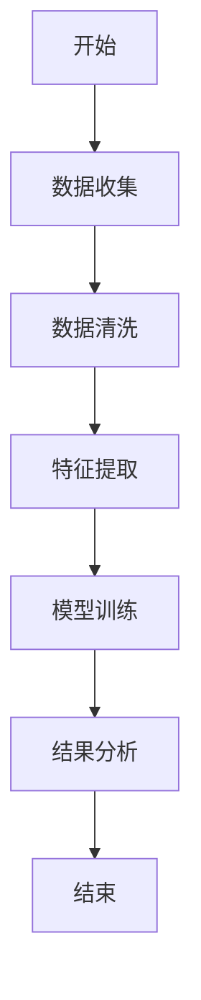
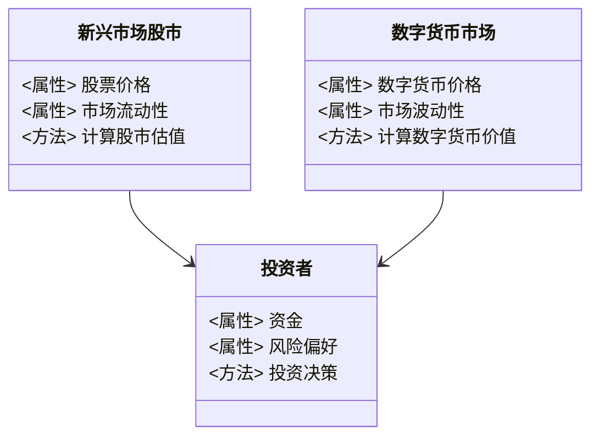

                 


# 新兴市场股市估值与数字货币发展的互动

> 关键词：新兴市场、股市估值、数字货币、互动关系、数学模型、算法实现、系统架构

> 摘要：本文探讨新兴市场中股市估值与数字货币之间的互动关系，分析其核心概念、数学模型、算法实现和系统架构，最后通过实战案例深入剖析两者之间的相互影响。

---

# 第一部分：新兴市场股市估值与数字货币发展的背景与互动

## 第1章：新兴市场股市估值与数字货币发展概述

### 1.1 问题背景与问题描述

#### 1.1.1 新兴市场股市估值的现状

新兴市场股市估值受多种因素影响，包括经济指标（GDP增长率、通胀率）、政策环境（货币宽松政策、财政刺激）、市场情绪等。这些因素共同作用，使得新兴市场股市估值呈现波动性特征。

#### 1.1.2 数字货币的兴起与发展趋势

数字货币，尤其是比特币和以太坊，近年来在全球范围内迅速崛起。其价格波动剧烈，且与传统金融市场存在一定的相关性。数字货币市场的高波动性为新兴市场股市估值带来了新的变量。

#### 1.1.3 两者的互动关系与研究意义

新兴市场股市估值与数字货币之间存在双向互动：一方面，股市资金流动可能影响数字货币市场的供需；另一方面，数字货币价格波动也可能反过来影响股市投资者情绪。

---

### 1.2 核心概念与问题解决

#### 1.2.1 股市估值的核心要素

- **市盈率（P/E）**：衡量股票价格是否合理的重要指标。
- **市净率（P/B）**：反映股票价格与资产账面价值之间的关系。
- **股息率**：衡量股票的投资回报能力。

#### 1.2.2 数字货币的关键特征

- **区块链技术**：数字货币的底层技术，确保交易的安全性和透明性。
- **市场流动性**：影响数字货币价格波动的重要因素。
- **监管政策**：对数字货币市场的影响不可忽视。

#### 1.2.3 互动机制与边界条件

- **市场参与者的行为**：投资者在传统股市和数字货币市场之间的资金转移。
- **价格传导机制**：数字货币价格波动如何影响股市估值。
- **市场深度**：新兴市场股市和数字货币市场的深度差异。

---

### 1.3 核心概念对比与ER实体关系图

#### 1.3.1 股市与数字货币的核心属性对比

| 特性       | 股市估值          | 数字货币       |
|------------|-------------------|----------------|
| 价值基础   | 公司盈利、资产价值 | 区块链技术、市场供需 |
| 资产类别   | 传统金融资产     | 数字化资产     |
| 法律监管    | 受严格监管        | 监管不确定性高   |

#### 1.3.2 实体关系图（ER图）

```mermaid
erDiagram
    actor 投资者 {
        <属性> 资金
        <属性> 风险偏好
    }
    actor 数字货币持有者 {
        <属性> 数字资产
        <属性> 资产价值
    }
    entity 股市 {
        <属性> 股票价格
        <属性> 市场流动性
        <关联> 投资者
        <关联> 数字货币持有者
    }
    entity 数字货币市场 {
        <属性> 数字货币价格
        <属性> 市场波动性
        <关联> 投资者
        <关联> 数字货币持有者
    }
    投资者 --> 股市
    投资者 --> 数字货币市场
    数字货币持有者 --> 股市
    数字货币持有者 --> 数字货币市场
```

---

## 第2章：股市估值与数字货币发展的互动机制

### 2.1 互动机制的理论基础

#### 2.1.1 股市估值的基本原理

股市估值的核心是通过分析公司的财务数据、行业地位和市场环境，确定股票的合理价格。常用方法包括：

- **相对估值法**：基于市盈率、市净率等指标进行比较。
- **绝对估值法**：通过DCF模型（ discounted cash flow ）估算内在价值。

#### 2.1.2 数字货币的价值评估模型

数字货币的价值评估涉及技术特性、市场接受度和网络效应。常用模型包括：

- **成本法**：基于区块链技术的开发成本。
- **市场法**：基于市场供需关系。
- **技术法**：基于区块链网络的活跃度和安全性。

#### 2.1.3 互动机制的数学模型

我们可以通过回归分析来量化股市估值与数字货币价格之间的关系：

$$ y = \beta_0 + \beta_1x + \epsilon $$

其中：
- \( y \) 表示股市估值指数
- \( x \) 表示数字货币价格指数
- \( \beta_0 \) 是截距
- \( \beta_1 \) 是回归系数
- \( \epsilon \) 是误差项

---

### 2.2 数学模型与公式

#### 2.2.1 股市估值模型

$$ P = D / (r - g) $$

其中：
- \( P \) 表示股票价格
- \( D \) 表示股息
- \( r \) 表示折现率
- \( g \) 表示股息增长率

#### 2.2.2 数字货币价值模型

$$ V = \frac{F}{(1 + r)^n} $$

其中：
- \( V \) 表示当前价值
- \( F \) 表示未来价值
- \( r \) 表示风险调整后的折现率
- \( n \) 表示时间

---

### 2.3 互动机制的算法实现

#### 2.3.1 算法流程图



#### 2.3.2 代码实现

```python
import pandas as pd
import numpy as np

# 示例数据
data = pd.DataFrame({
    'Date': ['2023-01-01', '2023-01-02', '2023-01-03'],
    'Stock_Price': [100, 102, 101],
    'Crypto_Price': [40000, 40500, 40300]
})

# 计算相关系数
correlation = np.corrcoef(data['Stock_Price'], data['Crypto_Price'])
print(f"相关系数：{correlation[0, 1]}")
```

---

## 第3章：系统分析与架构设计

### 3.1 问题场景介绍

我们希望通过构建一个系统，实时监控新兴市场股市和数字货币市场的互动关系，为投资者提供决策支持。

### 3.2 系统功能设计（领域模型）



---

## 第4章：项目实战

### 4.1 环境配置

```bash
pip install pandas numpy matplotlib
```

### 4.2 核心代码实现

```python
import pandas as pd
import matplotlib.pyplot as plt

# 数据加载
data = pd.read_csv('market_data.csv')

# 数据可视化
plt.figure(figsize=(10, 6))
plt.plot(data['Date'], data['Stock_Price'], label='Stock Price')
plt.plot(data['Date'], data['Crypto_Price'], label='Crypto Price')
plt.xlabel('Date')
plt.ylabel('Price')
plt.legend()
plt.show()
```

---

## 第5章：总结与展望

### 5.1 本章小结

通过本文的分析，我们得出以下结论：
1. 新兴市场股市估值与数字货币之间存在显著的互动关系。
2. 数学模型和算法可以有效量化这种互动。
3. 系统架构设计为投资者提供了实时监控和决策支持工具。

### 5.2 注意事项

- 数据质量和实时性是系统设计的关键。
- 监管政策的变化可能影响模型的准确性。

### 5.3 拓展阅读

- 加入更多市场指标，如宏观经济指标、政策变量。
- 探讨不同数字货币对股市估值的影响差异。

---

作者：AI天才研究院/AI Genius Institute & 禅与计算机程序设计艺术 /Zen And The Art of Computer Programming

