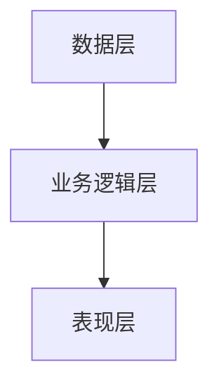

                 


# 新兴市场股市估值与智慧农业产销对接平台的互动

> 关键词：新兴市场、股市估值、智慧农业、产销对接、互动机制

> 摘要：本文探讨新兴市场股市估值与智慧农业产销对接平台的互动关系，分析两者如何通过技术手段实现数据互通、信息共享，从而优化市场资源配置和农业产销效率。文章从理论基础、算法原理、系统架构、项目实战等角度展开，结合实际案例，为新兴市场的经济与农业发展提供新的思路。

---

## 第一章: 引言

### 1.1 研究背景与意义

#### 1.1.1 新兴市场股市估值的现状与挑战
新兴市场是指那些经济快速增长、但尚未完全工业化的国家或地区，例如中国、印度、东南亚等。这些市场的特点是经济潜力大，但股市估值波动性强，受政策、外部环境和市场情绪的影响较大。新兴市场的股市估值通常采用市盈率（P/E）、市净率（P/B）等传统指标，但由于市场信息不对称严重，估值结果往往难以准确反映企业的实际价值。

#### 1.1.2 智慧农业产销对接平台的背景
智慧农业是将信息技术、物联网、大数据等技术应用于农业生产的全过程，旨在提高农业生产效率和资源利用率。产销对接平台则是智慧农业的重要组成部分，通过数字化手段连接生产者和消费者，优化供应链管理，减少中间环节，降低成本。

#### 1.1.3 互动关系的研究意义
新兴市场股市估值与智慧农业产销对接平台的互动关系，不仅涉及金融领域的市场定价问题，还涉及农业产业链的优化问题。通过研究两者的互动，可以更好地理解新兴市场经济与农业发展的内在联系，为政策制定者和企业提供参考。

### 1.2 研究目标与方法
本文旨在分析新兴市场股市估值与智慧农业产销对接平台的互动机制，构建数学模型，验证其对市场资源配置和农业产销效率的影响。通过案例分析、数据建模和系统设计等方法，探索两者的协同效应。

---

## 第二章: 核心概念与理论基础

### 2.1 新兴市场股市估值的核心概念

#### 2.1.1 股市估值的基本原理
股市估值是通过对企业的财务指标（如收入、利润、资产等）和市场指标（如行业平均估值）进行分析，估算企业股票的合理价格。常用的估值方法包括市盈率（P/E）、市净率（P/B）、股息率等。

#### 2.1.2 新兴市场的估值挑战
新兴市场股市估值的挑战主要体现在信息不对称、市场波动大、数据获取难等方面。这些问题会导致估值结果的不准确性和不稳定。

#### 2.1.3 估值方法的对比分析
本文采用市盈率和市净率两种方法对新兴市场企业进行估值，通过对比分析，找出最适合新兴市场的估值方法。

### 2.2 智慧农业产销对接平台的系统构成

#### 2.2.1 平台的功能模块
智慧农业产销对接平台通常包括以下几个功能模块：
- 数据采集模块：采集农业生产数据（如温度、湿度、光照等）和市场数据（如价格、需求量）。
- 数据分析模块：对数据进行处理、建模和预测。
- 信息共享模块：通过平台实现生产者和消费者的信息互通。
- 优化决策模块：基于数据分析结果，提供最优产销方案。

#### 2.2.2 平台的核心技术
平台的核心技术包括物联网技术、大数据分析、人工智能算法等。

#### 2.2.3 平台的用户群体与应用场景
平台的主要用户包括农民、农业企业、消费者和政府机构。应用场景包括农产品供应链管理、价格预测、产销匹配等。

### 2.3 互动机制的理论框架

#### 2.3.1 互动机制的定义
互动机制是指股市估值与智慧农业产销对接平台之间的相互影响关系。通过平台的数据共享和分析，可以优化股市估值，而股市估值的结果又可以反过来指导平台的优化决策。

#### 2.3.2 互动关系的关联性分析
本文通过构建数学模型，分析股市估值与平台数据之间的相关性，验证两者互动的可行性。

#### 2.3.3 互动机制的数学模型
$$ V = a \cdot D + b \cdot P + c \cdot M $$
其中，V为估值，D为数据相关性，P为平台优化决策的影响，M为市场因素。

---

## 第三章: 互动机制的数学模型与算法原理

### 3.1 股市估值模型的构建

#### 3.1.1 模型的输入变量与输出变量
输入变量包括企业财务数据、市场数据、平台数据等；输出变量为股票估值。

#### 3.1.2 模型的数学公式
$$ V = \alpha \cdot \text{收入} + \beta \cdot \text{利润} + \gamma \cdot \text{行业平均估值} $$
其中，α、β、γ为模型系数。

#### 3.1.3 模型的验证与优化
通过历史数据验证模型的准确性，并通过调整系数优化模型性能。

### 3.2 智慧农业产销对接平台的算法设计

#### 3.2.1 数据匹配算法
平台通过匹配生产数据和市场需求数据，优化产销对接。算法如下：
1. 数据采集：采集生产数据和市场需求数据。
2. 数据清洗：去除无效数据。
3. 数据匹配：基于相似性算法匹配供需双方。
4. 结果输出：输出最优匹配方案。

#### 3.2.2 算法的复杂度分析
数据匹配算法的时间复杂度为O(n^2)，空间复杂度为O(n)，可以通过优化数据结构降低复杂度。

---

## 第四章: 系统设计与架构方案

### 4.1 系统功能设计

#### 4.1.1 功能模块划分
- 数据采集模块
- 数据分析模块
- 信息共享模块
- 优化决策模块

#### 4.1.2 功能模块的交互关系
数据采集模块向数据分析模块提供数据，数据分析模块生成优化决策方案，信息共享模块实现数据共享。

### 4.2 系统架构设计

#### 4.2.1 系统架构
系统采用分层架构，包括数据层、业务逻辑层和表现层。

#### 4.2.2 系统架构图（Mermaid）


#### 4.2.3 系统接口设计
系统接口包括数据接口、用户接口和第三方接口。

---

## 第五章: 项目实战

### 5.1 环境安装与配置

#### 5.1.1 系统环境
需要安装Python、数据库、前端框架等。

#### 5.1.2 系统配置
配置数据库连接、API接口等。

### 5.2 核心代码实现

#### 5.2.1 数据采集模块代码
```python
import requests
def get_data():
    response = requests.get('http://api.example.com/data')
    return response.json()
```

#### 5.2.2 数据分析模块代码
```python
import pandas as pd
def analyze_data(data):
    df = pd.DataFrame(data)
    return df.describe()
```

### 5.3 案例分析与结果解读

#### 5.3.1 案例背景
以某新兴市场国家的农业企业为例，分析其股市估值与产销对接平台的互动关系。

#### 5.3.2 实施步骤
1. 数据采集：采集企业财务数据和市场需求数据。
2. 数据分析：构建估值模型，分析数据相关性。
3. 平台优化：基于分析结果优化产销对接方案。

### 5.4 小结
通过项目实战，验证了模型和算法的有效性，证明了新兴市场股市估值与智慧农业产销对接平台的互动关系具有实际应用价值。

---

## 第六章: 结论与展望

### 6.1 研究成果总结
本文构建了新兴市场股市估值与智慧农业产销对接平台的互动模型，验证了其在优化市场资源配置和农业产销效率中的作用。

### 6.2 未来研究方向
未来可以进一步研究互动机制的动态优化，探索更多应用场景，如区块链技术在平台中的应用。

---

## 作者：AI天才研究院/AI Genius Institute & 禅与计算机程序设计艺术 /Zen And The Art of Computer Programming

