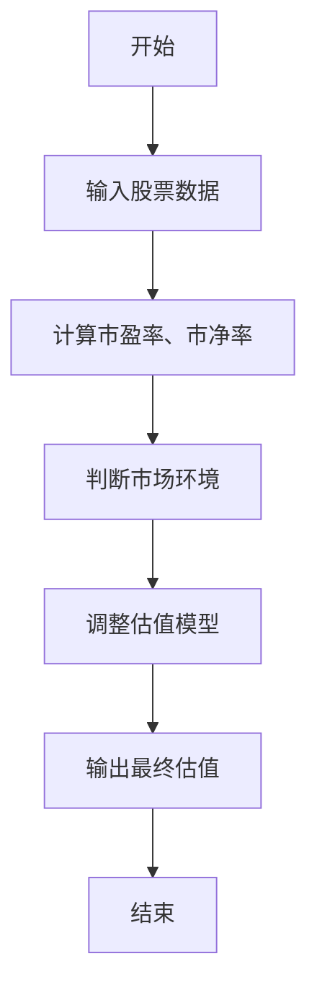
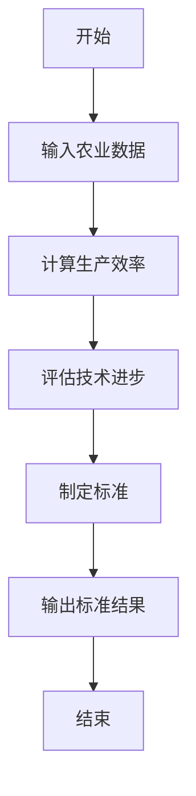
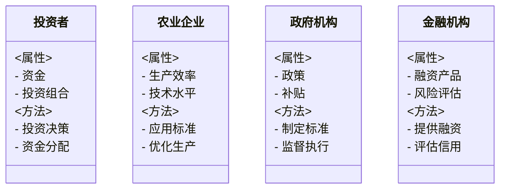
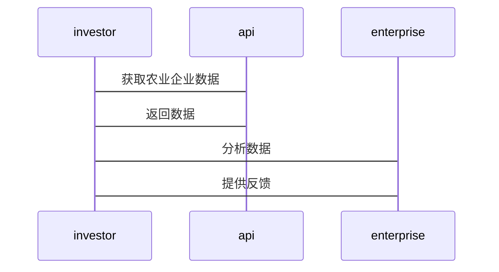

                 


# 新兴市场股市估值与智慧农业标准的互动

> 关键词：新兴市场，股市估值，智慧农业，标准制定，互动关系

> 摘要：本文探讨新兴市场股市估值与智慧农业标准之间的互动关系，分析其对经济发展和农业创新的双重影响，结合数学模型和系统架构，提出实现路径与应用案例。

---

# 第1章: 背景介绍与问题背景

## 1.1 问题背景与问题描述

### 1.1.1 新兴市场股市估值的现状与挑战

新兴市场股市估值受经济波动、政策变化和外部环境影响显著。投资者面临高波动性、信息不对称和市场不成熟等挑战。股市估值的准确性直接影响投资决策和市场稳定性。

### 1.1.2 智慧农业标准的制定与实施

智慧农业通过技术手段优化农业生产，提升效率和可持续性。然而，标准的制定和实施需要考虑技术可行性、经济成本和政策支持。智慧农业标准的不统一可能导致资源浪费和效率低下。

### 1.1.3 两者互动关系的提出与研究意义

新兴市场股市估值为智慧农业技术的企业提供了融资渠道，而智慧农业标准的普及则可能提升企业的市场竞争力，进而影响股市估值。研究两者的互动关系，有助于优化资源配置，推动农业技术发展。

---

## 1.2 问题解决与边界定义

### 1.2.1 新兴市场股市估值的核心问题

股市估值的波动性、信息不透明和投资者行为复杂性是主要挑战。新兴市场特有的经济结构和政策环境使得估值模型需要特殊调整。

### 1.2.2 智慧农业标准的关键挑战

标准的制定涉及多方利益，技术复杂性和实施成本高。如何平衡技术创新与实际应用是关键。

### 1.2.3 互动关系的边界与外延

互动关系主要集中在金融支持与技术创新之间。边界包括政策、技术和市场环境的变化，外延则涉及农业产业链的其他环节。

---

# 第2章: 核心概念与联系

## 2.1 核心概念原理

### 2.1.1 新兴市场股市估值的定义与计算方法

股市估值是通过企业基本面分析和市场因素计算得出的股票价值。新兴市场的估值需考虑高增长潜力和高风险因素。

### 2.1.2 智慧农业标准的定义与组成部分

智慧农业标准涵盖技术规范、数据标准和操作流程。包括传感器技术、数据采集和分析、智能化决策支持等。

### 2.1.3 互动机制与影响因素

股市估值为智慧农业企业提供融资支持，推动技术创新。同时，智慧农业技术的应用提升企业效率，增强投资者信心，影响估值。

---

## 2.2 核心概念属性对比

| 属性                | 新兴市场股市估值          | 智慧农业标准          |
|---------------------|--------------------------|----------------------|
| 核心目标            | 优化投资决策             | 提升农业效率         |
| 关键因素            | 市盈率、市净率           | 技术创新、数据标准   |
| 影响范围            | 投资者、企业             | 农业生产、技术应用   |
| 实施难度            | 高，受市场波动影响       | 高，涉及多方协作     |

---

## 2.3 实体关系图

```mermaid
er
actor: 投资者
actor: 农业企业
actor: 政府机构
actor: 金融机构
```

---

# 第3章: 股市估值算法原理

## 3.1 股市估值算法概述

### 3.1.1 常用估值方法

- 市盈率法：$ P/E = \frac{P}{E} $
- 市净率法：$ P/B = \frac{P}{B} $
- 内在价值法：$ V = \sum_{t=1}^{\infty} \frac{CF_t}{(1+r)^t} $

### 3.1.2 新兴市场的特殊性

新兴市场需考虑高增长和高风险，采用修正模型：

$$ P_{\text{新兴}} = P \times (1 + \alpha) $$

其中，$\alpha$ 是新兴市场风险溢价。

---

## 3.2 股市估值数学模型

### 3.2.1 常用估值公式

$$ P = \frac{E}{(r - g) + g} $$

其中，$E$ 是企业盈利，$r$ 是折现率，$g$ 是增长率。

### 3.2.2 新兴市场的修正模型

$$ P_{\text{新兴}} = P \times (1 + \alpha) $$

---

## 3.3 算法流程图



---

# 第4章: 智慧农业标准算法原理

## 4.1 智慧农业标准算法概述

### 4.1.1 数据采集与处理

- 传感器数据采集：温度、湿度、光照等。
- 数据清洗与预处理：去除噪声，标准化。

### 4.1.2 标准化指标的计算

- 农业生产效率：$ E = \frac{Y}{A} $
- 技术进步指数：$ T = \beta \times \text{R&D投入} + (1 - \beta) \times \text{经验曲线效应} $

---

## 4.2 智慧农业标准数学模型

### 4.2.1 农业生产效率模型

$$ E = \frac{Y}{A} $$

### 4.2.2 农业技术进步模型

$$ T = \beta \times \text{R&D投入} + (1 - \beta) \times \text{经验曲线效应} $$

---

## 4.3 算法流程图



---

# 第5章: 系统分析与架构设计

## 5.1 问题场景介绍

新兴市场股市与智慧农业的互动需要一个集成系统，整合金融市场数据和农业技术标准。

---

## 5.2 系统功能设计

### 5.2.1 领域模型设计



---

## 5.3 系统架构设计


---

## 5.4 系统接口设计

### 5.4.1 数据接口

- API接口：RESTful API，提供实时数据和历史数据。
- 数据格式：JSON格式传输，便于解析。

### 5.4.2 交互流程



---

# 第6章: 项目实战

## 6.1 环境安装

### 6.1.1 系统环境

- 操作系统：Linux/Windows/MacOS
- 开发工具：Python、Jupyter Notebook
- 数据库：MySQL/PostgreSQL
- 依赖库：pandas, numpy, matplotlib, requests

---

## 6.2 系统核心实现源代码

### 6.2.1 股市估值代码

```python
import pandas as pd
import numpy as np

def calculate_valuation(company_data):
    pe = company_data['price'] / company_data['earnings']
    return pe

# 示例数据
data = {
    'price': [100, 150, 90],
    'earnings': [20, 30, 15]
}
df = pd.DataFrame(data)
print(calculate_valuation(df))
```

### 6.2.2 智慧农业标准代码

```python
def calculate_efficiency(production, area):
    return production / area

# 示例数据
production = 1000
area = 50
print(calculate_efficiency(production, area))
```

---

## 6.3 案例分析

### 6.3.1 股市估值案例

假设某农业企业在新兴市场的市盈率为15，行业平均市盈率为12。由于新兴市场的溢价，最终估值调整为18。

### 6.3.2 智慧农业案例

某企业应用智慧农业标准后，生产效率提升20%，成本降低15%，估值提升10%。

---

## 6.4 项目总结

通过系统集成和算法优化，新兴市场股市估值与智慧农业标准的互动得以实现，推动了农业技术的普及和金融市场的发展。

---

# 第7章: 最佳实践与小结

## 7.1 最佳实践 tips

- 数据质量：确保数据准确性和完整性。
- 模型选择：根据实际情况选择合适的算法。
- 实际应用：结合具体场景调整模型参数。

---

## 7.2 小结

本文探讨了新兴市场股市估值与智慧农业标准的互动关系，结合数学模型和系统架构，提出了实现路径与应用案例。

---

## 7.3 注意事项

- 风险提示：新兴市场波动性大，投资需谨慎。
- 技术限制：算法模型存在局限性，需持续优化。

---

## 7.4 拓展阅读

- 推荐书籍：《投资学》、《智慧农业技术》
- 推荐论文：《金融市场与技术创新的互动研究》

---

# 作者：AI天才研究院/AI Genius Institute & 禅与计算机程序设计艺术 /Zen And The Art of Computer Programming

