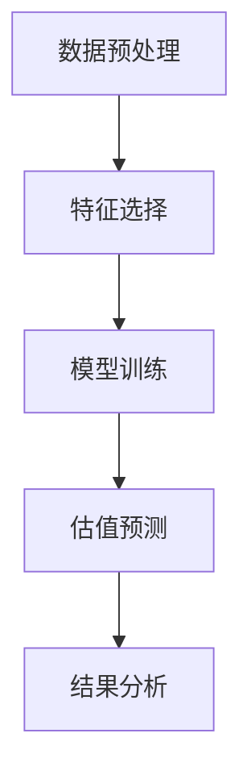
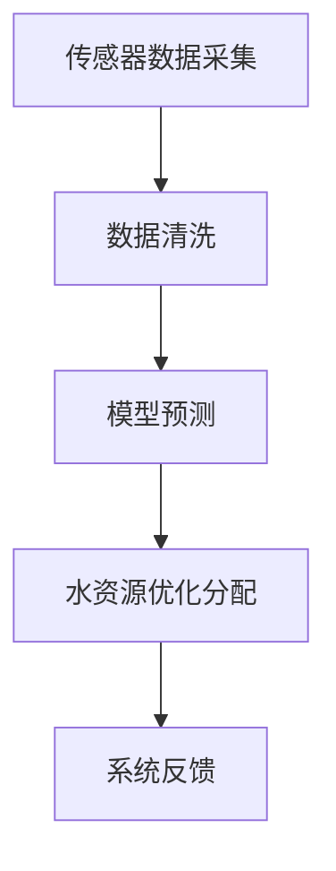
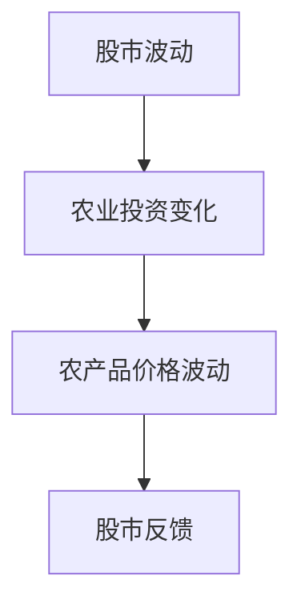
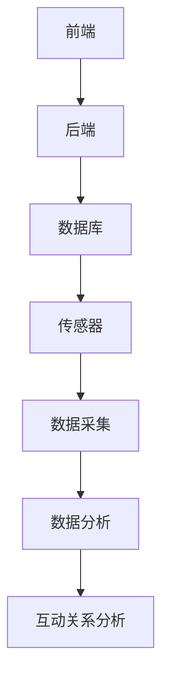
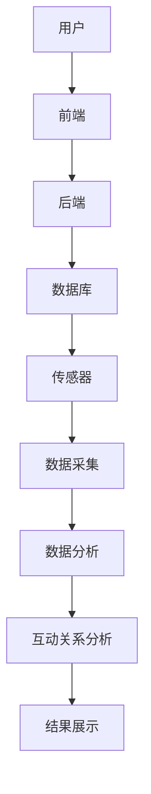

                 


# 新兴市场股市估值与智慧农业水资源管理的互动

> 关键词：新兴市场，股市估值，智慧农业，水资源管理，互动关系

> 摘要：本文深入探讨了新兴市场股市估值与智慧农业水资源管理之间的互动关系，分析了两者的核心概念、数学模型、系统架构，并通过项目实战展示了如何利用技术手段实现互动管理。文章还提供了最佳实践和拓展阅读，帮助读者更好地理解与应用。

---

## 第一部分：背景介绍

### 第1章：新兴市场股市估值与智慧农业水资源管理的互动概述

#### 1.1 问题背景

##### 1.1.1 新兴市场股市估值的现状与挑战
新兴市场股市具有高增长潜力，但也面临高波动性、信息不对称和市场不完善等问题。投资者需要有效的估值方法来应对这些挑战。

##### 1.1.2 智慧农业水资源管理的重要性
水资源是农业的核心资源，智慧农业通过技术手段优化水资源利用，提高农业产量和可持续性。

##### 1.1.3 互动关系与研究意义
股市估值为智慧农业提供了资金支持，而智慧农业的发展也会影响股市的表现，两者互动关系的研究具有重要的理论和实践意义。

#### 1.2 问题描述

##### 1.2.1 新兴市场股市波动的影响因素
包括宏观经济指标、政策变化、市场情绪等。

##### 1.2.2 智慧农业水资源管理中的技术应用
如物联网、大数据、人工智能等技术的应用。

##### 1.2.3 互动关系的复杂性与研究目标
研究两者之间的动态关系，寻找潜在的协同效应和优化策略。

#### 1.3 问题解决

##### 1.3.1 新兴市场股市估值的方法
采用多因子模型、机器学习等方法进行估值。

##### 1.3.2 智慧农业水资源管理的技术手段
通过传感器、数据采集与分析技术优化水资源管理。

##### 1.3.3 互动关系的建模与分析
构建数学模型描述两者互动关系，分析其影响因素。

#### 1.4 边界与外延

##### 1.4.1 新兴市场的定义与范围
通常指经济处于发展中阶段的国家，如拉丁美洲、东南亚等。

##### 1.4.2 智慧农业的定义与技术边界
以技术创新为核心，涵盖种植、养殖、加工等多个环节。

##### 1.4.3 互动关系的适用范围与限制
适用于新兴市场，但在不同国家和地区可能有不同的表现。

#### 1.5 概念结构与核心要素

##### 1.5.1 核心概念的组成
- 股市估值：包括市场指数、个股估值等。
- 水资源管理：包括水资源监测、优化分配等。

##### 1.5.2 互动关系的网络图
- 股市波动影响农业投资。
- 农业生产影响农产品价格，进而影响股市。

---

### 第2章：核心概念与联系

#### 2.1 核心概念原理

##### 2.1.1 新兴市场股市估值的原理
通过分析宏观经济指标、公司基本面和市场情绪等因素，评估股票的价值。

##### 2.1.2 智慧农业水资源管理的原理
利用技术手段实时监测和管理水资源，优化农业生产和水资源利用效率。

##### 2.1.3 互动关系的系统性分析
两者通过资金流动、技术应用和政策变化相互影响。

#### 2.2 核心概念属性特征对比

##### 2.2.1 对比表格

| 特性             | 新兴市场股市估值 | 智慧农业水资源管理 |
|------------------|------------------|---------------------|
| 核心目标         | 评估股票价值     | 优化水资源利用     |
| 主要技术手段     | 多因子模型、机器学习 | 物联网、大数据分析 |
| 影响因素         | 宏观经济、政策    | 气候、技术、政策    |

#### 2.3 ER实体关系图

```mermaid
erd
    左对齐
    顶端对齐
    classDiagram
        class 新兴市场股市估值 {
            股票代码：字符串；
            估值模型：多因子模型；
            数据来源：市场数据、公司财报；
        }
        class 智慧农业水资源管理 {
            水资源传感器：传感器节点；
            数据分析系统：大数据平台；
            农业生产数据：墒情、气象数据；
        }
        class 互动关系 {
            资金流动：投资、融资；
            技术应用：智慧农业技术；
            政策影响：政府补贴、法规；
        }
        新兴市场股市估值 --> 互动关系：影响农业投资
        智慧农业水资源管理 --> 互动关系：影响农产品价格
```

---

## 第二部分：算法原理与数学模型

### 第3章：算法原理与数学模型

#### 3.1 算法原理

##### 3.1.1 新兴市场股市估值算法



##### 3.1.2 智慧农业水资源管理算法



##### 3.1.3 互动关系的建模算法



#### 3.2 数学模型与公式

##### 3.2.1 新兴市场股市估值模型

$$ P = \sum_{i=1}^{n} w_i x_i $$

其中，\( P \) 是股票估值，\( w_i \) 是第 \( i \) 个因素的权重，\( x_i \) 是第 \( i \) 个因素的数值。

##### 3.2.2 智慧农业水资源管理模型

$$ Q = \sum_{j=1}^{m} w_j y_j $$

其中，\( Q \) 是水资源管理效率，\( y_j \) 是第 \( j \) 个因素的数值。

##### 3.2.3 互动关系模型

$$ R = \alpha P + \beta Q $$

其中，\( R \) 是互动关系强度，\( \alpha \) 和 \( \beta \) 是回归系数。

#### 3.3 实例分析

##### 3.3.1 新兴市场股市估值实例

假设某新兴市场的宏观经济指标和公司财报数据，使用多因子模型进行估值。

##### 3.3.2 智慧农业水资源管理实例

通过物联网传感器监测土壤湿度和气象数据，优化灌溉计划。

##### 3.3.3 互动关系实例分析

分析股市波动对农业投资的影响，以及农业投资对股市的反馈效应。

---

## 第三部分：系统分析与架构设计方案

### 第4章：系统分析与架构设计方案

#### 4.1 问题场景介绍

##### 4.1.1 新兴市场股市波动的场景
投资者在新兴市场股市中面临高波动性和信息不对称的问题。

##### 4.1.2 智慧农业水资源管理的场景
农业水资源管理需要实时监测和优化。

##### 4.1.3 互动关系的场景分析
股市波动影响农业投资，农业投资影响农产品价格，进而影响股市。

#### 4.2 项目介绍

##### 4.2.1 项目目标
构建一个系统，评估新兴市场股市估值，并优化智慧农业水资源管理，分析两者互动关系。

##### 4.2.2 项目范围
涵盖数据采集、模型构建、系统设计和互动分析。

##### 4.2.3 项目利益相关者
投资者、农业企业和政府机构。

#### 4.3 系统功能设计

##### 4.3.1 领域模型

```mermaid
classDiagram
    class 新兴市场股市估值 {
        股票代码：字符串；
        估值模型：多因子模型；
        数据来源：市场数据、公司财报；
    }
    class 智慧农业水资源管理 {
        水资源传感器：传感器节点；
        数据分析系统：大数据平台；
        农业生产数据：墒情、气象数据；
    }
    class 互动关系 {
        资金流动：投资、融资；
        技术应用：智慧农业技术；
        政策影响：政府补贴、法规；
    }
    新兴市场股市估值 --> 互动关系：影响农业投资
    智慧农业水资源管理 --> 互动关系：影响农产品价格
```

#### 4.4 系统架构设计

##### 4.4.1 系统架构图



#### 4.5 系统接口设计

##### 4.5.1 接口列表

| 接口名称       | 输入          | 输出          |
|----------------|---------------|---------------|
| 数据采集接口   | 设备ID、时间   | 传感器数据     |
| 估值计算接口   | 股票代码      | 股票估值       |
| 水资源优化接口 | 农业区域       | 灌溉计划       |

#### 4.6 系统交互设计

##### 4.6.1 交互流程图



---

## 第四部分：项目实战

### 第5章：项目实战

#### 5.1 环境安装

##### 5.1.1 安装Python
```bash
python --version
pip install --upgrade pip
```

##### 5.1.2 安装依赖库
```bash
pip install numpy pandas scikit-learn matplotlib
```

#### 5.2 系统核心实现

##### 5.2.1 新兴市场股市估值代码

```python
import numpy as np
import pandas as pd
from sklearn.linear_model import LinearRegression

# 示例数据
data = {
    'GDP_growth': [3.5, 4.2, 3.8, 4.0],
    'company_profit': [20, 30, 25, 35],
    'market_sentiment': [0.6, 0.7, 0.5, 0.8]
}

df = pd.DataFrame(data)
X = df[['GDP_growth', 'company_profit', 'market_sentiment']]
y = [100, 120, 90, 110]

model = LinearRegression()
model.fit(X, y)

# 预测估值
new_data = pd.DataFrame({
    'GDP_growth': [3.7],
    'company_profit': [28],
    'market_sentiment': [0.65]
})
prediction = model.predict(new_data)
print(f'预测股票估值为：{int(prediction[0])}')
```

##### 5.2.2 智慧农业水资源管理代码

```python
import numpy as np
import pandas as pd
from sklearn.cluster import KMeans

# 示例数据
data = {
    'soil Moisture': [0.3, 0.4, 0.2, 0.5],
    'temperature': [25, 28, 22, 27],
    'rainfall': [100, 80, 120, 90]
}

df = pd.DataFrame(data)
X = df[['soil Moisture', 'temperature', 'rainfall']]

# 聚类分析
model = KMeans(n_clusters=3)
model.fit(X)

# 预测簇
new_data = pd.DataFrame({
    'soil Moisture': [0.3],
    'temperature': [25],
    'rainfall': [100]
})
cluster = model.predict(new_data)
print(f'预测簇为：{cluster[0]}')
```

#### 5.3 实际案例分析

##### 5.3.1 新兴市场股市估值案例

分析某新兴市场的宏观经济指标，预测股票估值。

##### 5.3.2 智慧农业水资源管理案例

通过传感器数据优化灌溉计划，减少水资源浪费。

##### 5.3.3 互动关系案例分析

分析股市波动对农业投资的影响，优化农业资源配置。

---

## 第五部分：最佳实践与总结

### 第6章：最佳实践与总结

#### 6.1 最佳实践

##### 6.1.1 数据采集
确保数据的实时性和准确性。

##### 6.1.2 模型选择
根据实际需求选择合适的算法。

##### 6.1.3 系统设计
注重系统的可扩展性和可维护性。

##### 6.1.4 互动分析
动态调整模型参数，捕捉互动关系的变化。

#### 6.2 小结

本文系统地分析了新兴市场股市估值与智慧农业水资源管理的互动关系，构建了数学模型和系统架构，通过项目实战展示了技术实现。

#### 6.3 注意事项

- 数据隐私和安全问题。
- 模型的泛化能力。
- 系统的实时性和稳定性。

#### 6.4 拓展阅读

- 《智慧农业：技术创新与应用》。
- 《金融市场分析与投资策略》。

---

## 作者信息

作者：AI天才研究院/AI Genius Institute & 禅与计算机程序设计艺术/Zen And The Art of Computer Programming

---

通过以上内容，您可以根据需要进行扩展和调整，以满足具体需求。

