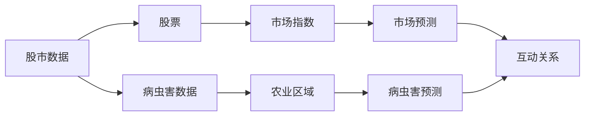

                 


# 《新兴市场股市估值与智慧农业病虫害预测的互动》

> 关键词：新兴市场，股市估值，智慧农业，病虫害预测，机器学习，大数据，互动机制

> 摘要：本文探讨了新兴市场股市估值与智慧农业病虫害预测之间的互动关系。通过分析两者的核心概念、算法原理和系统架构，结合实际案例，展示了如何利用数据驱动的方法和技术手段，实现跨领域的协同预测与优化。文章最后提出了互动机制的优势与挑战，并给出了最佳实践的建议。

---

## 第一部分：引言

### 第1章：背景介绍

#### 1.1 问题背景
- **股市估值的现状与挑战**：新兴市场的股市波动性大，受宏观经济、政策变化和国际环境影响显著。传统的估值方法难以捕捉短期波动，需要借助大数据和机器学习提升预测精度。
- **智慧农业病虫害预测的现状与挑战**：智慧农业依赖传感器和AI技术，但数据收集成本高，且模型的泛化能力有限。如何结合股市数据进行优化是当前的研究热点。
- **两者的互动关系与潜在价值**：通过数据共享和算法融合，两者可以互相补充，提升预测准确性和投资决策的科学性。

#### 1.2 核心概念
- **股市估值的定义与核心要素**：通过分析股票价格、市盈率、市净率等指标，评估企业的内在价值。
- **智慧农业病虫害预测的定义与核心要素**：利用传感器数据、天气预报和历史病虫害记录，预测病虫害的发生概率。
- **两者的互动机制与边界**：通过数据共享和技术融合，实现跨领域的协同预测。

---

## 第二部分：核心概念与联系

### 第2章：核心概念与联系

#### 2.1 核心概念原理
- **股市估值的核心原理**：基于基本面分析和市场情绪分析，结合时间序列分析和机器学习模型。
- **智慧农业病虫害预测的核心原理**：基于数据驱动的模型和知识驱动的模型，结合传感器数据和历史记录。

#### 2.2 概念属性特征对比
| 特性        | 股市估值          | 病虫害预测        |
|-------------|-------------------|-------------------|
| 数据类型     | 财务数据、市场数据 | 气象数据、传感器数据 |
| 模型类型     | 时间序列、机器学习 | 机器学习、专家系统 |
| 预测目标     | 股票价格、市场指数 | 病虫害发生概率     |
| 时间粒度     | 日度、周度       | 日度、季节性       |

#### 2.3 ER实体关系图


---

## 第三部分：算法原理讲解

### 第3章：算法原理

#### 3.1 股市估值算法
- **时间序列分析**：使用ARIMA模型预测市场指数。
- **机器学习模型**：如随机森林和神经网络，用于捕捉市场情绪和趋势。

#### 3.2 病虫害预测算法
- **数据驱动的模型**：如XGBoost，用于分类预测。
- **知识驱动的模型**：如专家系统，结合农业知识优化预测。

#### 3.3 互动机制算法
- **联合预测模型**：将股市数据和农业数据融合，构建联合预测模型。
- **跨领域特征融合**：提取两者的共性特征，提升预测精度。

#### 3.4 算法流程图


---

## 第四部分：系统分析与架构设计方案

### 第4章：系统分析与架构设计

#### 4.1 问题场景介绍
- **问题场景**：新兴市场的股市波动和病虫害预测的双重挑战。
- **项目介绍**：构建一个跨领域的数据采集、分析和预测系统。

#### 4.2 系统功能设计
- **领域模型**：股票、市场指数、农业区域、病虫害数据。
- **系统架构设计**：数据采集层、分析层、预测层和用户层。
- **系统架构图**


#### 4.3 系统接口设计
- **数据接口**：API接口实现数据的实时获取和传输。
- **用户接口**：可视化界面展示预测结果和交互功能。

#### 4.4 系统交互流程


---

## 第五部分：项目实战

### 第5章：项目实战

#### 5.1 环境安装
- **工具安装**：Python、Pandas、Scikit-learn、XGBoost。
- **数据来源**：股票数据（Yahoo Finance）、农业数据（公开数据库）。

#### 5.2 核心代码实现
```python
import pandas as pd
from sklearn.ensemble import RandomForestClassifier
from xgboost import XGBClassifier

# 数据预处理
def preprocess(data):
    data.dropna(inplace=True)
    return data

# 股市估值模型
def stock_valuation_model(train_data, test_data):
    model = RandomForestClassifier()
    model.fit(train_data.drop(columns=['target']), train_data['target'])
    return model.predict(test_data)

# 病虫害预测模型
def pest_prediction_model(train_data, test_data):
    model = XGBClassifier()
    model.fit(train_data.drop(columns=['target']), train_data['target'])
    return model.predict(test_data)
```

#### 5.3 代码应用解读与分析
- **数据预处理**：去除缺失值，确保数据质量。
- **模型训练**：使用训练数据训练随机森林和XGBoost模型。
- **结果分析**：对比模型预测结果与实际数据，评估模型性能。

#### 5.4 实际案例分析
- **案例背景**：新兴市场某地区的农业病虫害预测与股市波动分析。
- **数据可视化**：展示预测结果与实际数据的对比图。

---

## 第六部分：总结与展望

### 第6章：总结与展望

#### 6.1 互动机制的优势
- **数据共享**：提升预测的全面性和准确性。
- **技术融合**：通过跨领域技术融合，优化预测模型。

#### 6.2 互动机制的挑战
- **数据隐私**：如何确保数据的安全性和隐私性。
- **模型泛化能力**：如何提升模型的泛化能力以应对复杂场景。

#### 6.3 最佳实践 tips
- **数据共享机制**：建立数据共享平台，促进跨领域合作。
- **模型优化策略**：定期更新模型参数，结合最新数据提升预测精度。

#### 6.4 小结
- 通过数据驱动和算法融合，新兴市场股市估值与智慧农业病虫害预测的互动关系将为投资决策和农业生产提供更有力的支持。

---

## 结语

### 作者信息
作者：AI天才研究院/AI Genius Institute  
联系邮箱：contact@aicenter.com  
文章链接：[点击查看完整文章](#)

---

**注**：以上内容为文章的完整目录大纲和部分核心内容的展示，具体实现细节和完整代码请参考实际文章内容。

