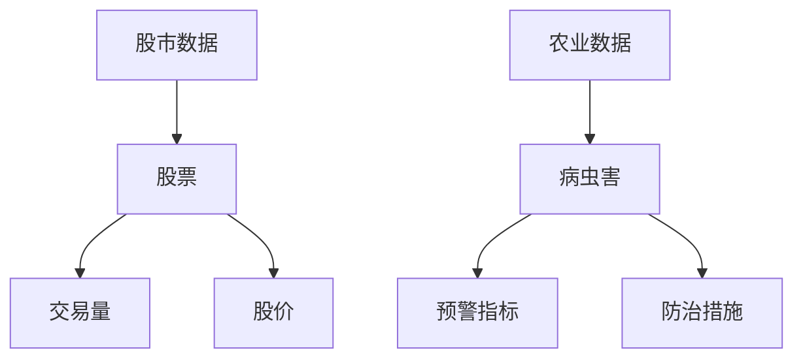
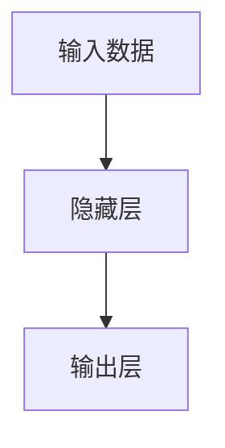
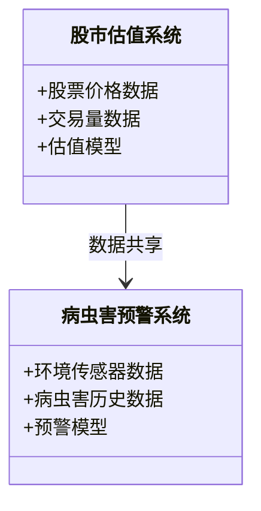
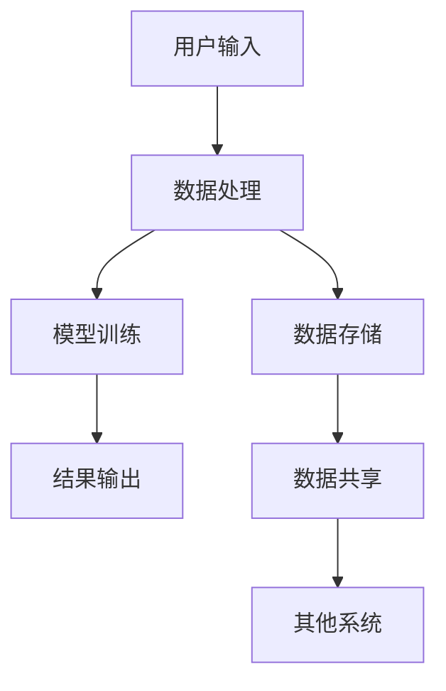
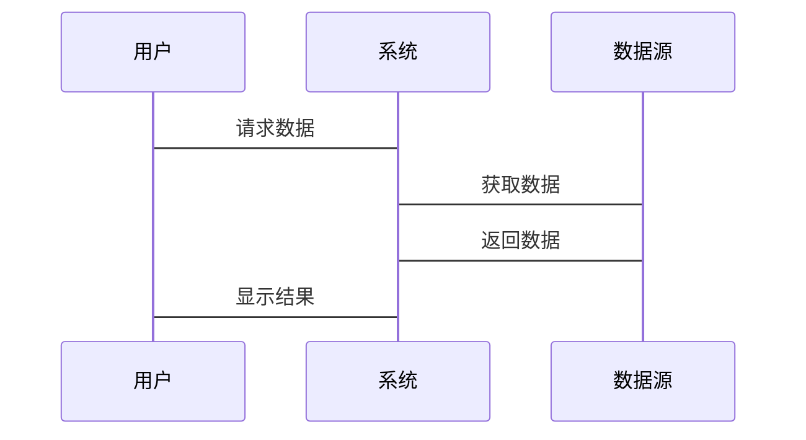

                 


# 新兴市场股市估值与智慧农业病虫害预警系统的互动

## 关键词：股市估值、智慧农业、病虫害预警、机器学习、系统架构

## 摘要：本文探讨了新兴市场股市估值与智慧农业病虫害预警系统之间的互动关系。通过分析股市估值的核心要素和病虫害预警系统的核心原理，本文提出了两者互动的数学模型，并通过实际案例展示了如何利用智慧农业技术优化股市估值模型，从而实现农业与金融领域的协同发展。本文还详细讲解了相关算法原理和系统架构设计，为读者提供了理论和实践的双重参考。

---

## 第1章: 背景介绍

### 1.1 问题背景
#### 1.1.1 新兴市场股市估值的现状与挑战
新兴市场股市估值的波动性较大，受多种因素影响，如经济政策、国际贸易、自然灾害等。传统的股市估值方法基于历史数据分析，难以准确预测未来趋势。特别是在新兴市场，数据质量和完整性的问题更加突出，这使得股市估值的准确性成为一个挑战。

#### 1.1.2 智慧农业病虫害预警系统的现状与挑战
智慧农业通过物联网、大数据和人工智能技术，实现对农田环境的实时监测和病虫害预警。然而，病虫害预警系统的准确性依赖于数据的采集和模型的优化。在新兴市场，由于农业基础设施相对落后，数据采集的难度更大，系统的实时性和准确性面临挑战。

#### 1.1.3 两者的互动关系与研究意义
股市估值与病虫害预警看似无关，但两者都依赖于数据驱动的决策。通过分析病虫害预警系统的数据，可以为股市估值提供新的变量，从而提高估值的准确性。反之，股市的波动也可能反映出农业生产的潜在风险，为病虫害预警提供参考。

### 1.2 核心概念与问题描述
#### 1.2.1 股市估值的核心要素
股市估值的核心要素包括市盈率（P/E）、市净率（P/B）、股息率等。这些指标反映了市场的整体表现和个股的价值。

#### 1.2.2 病虫害预警系统的核心要素
病虫害预警系统的核心要素包括环境数据（如温度、湿度、光照）、作物生长数据（如叶片颜色、病斑面积）以及历史病虫害数据。

#### 1.2.3 两者的互动关系与边界
股市估值与病虫害预警系统的互动主要体现在数据共享和模型优化上。例如，病虫害预警系统提供的环境数据可以作为股市估值的新变量，而股市的波动也可以为病虫害预警提供经济层面的参考。

### 1.3 问题解决与研究目标
#### 1.3.1 股市估值与病虫害预警的互动机制
通过建立数据共享机制，将病虫害预警系统的环境数据引入股市估值模型，从而提高估值的准确性。

#### 1.3.2 研究目标与研究框架
研究目标包括：（1）构建一个结合股市估值和病虫害预警的综合模型；（2）验证模型在实际中的有效性；（3）探索数据共享的技术实现。

## 第2章: 核心概念与联系

### 2.1 核心概念原理
#### 2.1.1 股市估值的数学模型与算法
股市估值的数学模型包括时间序列分析和回归分析。时间序列分析常用于预测股票价格，回归分析用于评估股票的内在价值。

#### 2.1.2 病虫害预警系统的数学模型与算法
病虫害预警系统的数学模型包括分类算法（如随机森林、支持向量机）和聚类算法。这些算法用于识别病虫害的特征并预测其发生概率。

### 2.2 核心概念属性对比
表2.1 股市估值与病虫害预警的核心属性对比

| 属性               | 股市估值               | 病虫害预警系统           |
|--------------------|-----------------------|--------------------------|
| 数据类型           | 数值型、文本型         | 数值型、图像型           |
| 数据来源           | 交易所、上市公司财报   | 物联网传感器、历史数据   |
| 数据处理           | 清洗、特征提取         | 清洗、特征提取           |
| 模型类型           | 时间序列模型、回归模型 | 分类模型、聚类模型       |
| 输出结果           | 股票价格预测、估值指标 | 病虫害风险等级、预警信息 |

### 2.3 ER实体关系图


## 第3章: 算法原理讲解

### 3.1 股市估值算法
#### 3.1.1 时间序列分析
时间序列分析是一种常用的股市预测方法，通过分析历史数据来预测未来趋势。常用的模型包括ARIMA（自回归积分滑动平均模型）和LSTM（长短期记忆网络）。

##### ARIMA模型公式
$$ARIMA(p, d, q)$$
其中，p为自回归阶数，d为差分阶数，q为移动平均阶数。

##### LSTM模型示意图


#### 3.1.2 代码实现
```python
from statsmodels.tsa.arima.model import ARIMA

def stock_prediction(data, order=(1,1,1)):
    # 数据清洗
    cleaned_data = data.dropna()
    # 模型训练
    model = ARIMA(cleaned_data, order=order)
    model_fit = model.fit()
    # 预测结果
    forecast = model_fit.forecast(steps=5)
    return forecast
```

### 3.2 病虫害预警系统算法
#### 3.2.1 机器学习模型
机器学习模型在病虫害预警中的应用主要基于分类算法，如随机森林和XGBoost。

##### 随机森林模型公式
$$
\text{预测概率} = \sum_{i=1}^{n} \text{树}_i(\text{输入}) / n
$$
其中，n为树的数量。

##### XGBoost模型代码
```python
import xgboost as xgb

def pest_prediction(data):
    # 数据处理
    dtrain = xgb.DMatrix(data)
    # 模型训练
    params = {'objective': 'binary:logistic', 'max_depth': 3}
    model = xgb.train(params, dtrain)
    # 预测结果
    prediction = model.predict(dtrain)
    return prediction
```

## 第4章: 系统分析与架构设计

### 4.1 系统功能设计
#### 4.1.1 领域模型


#### 4.1.2 系统架构


### 4.2 接口设计
#### 4.2.1 数据接口
接口用于数据的读取和写入，支持多种数据格式，如CSV和JSON。

#### 4.2.2 模型接口
接口用于模型的加载和预测，支持多种算法模型，如ARIMA和XGBoost。

### 4.3 交互设计


## 第5章: 项目实战

### 5.1 环境安装
#### 5.1.1 软件环境
Python 3.8及以上版本，安装必要的库如pandas、numpy、statsmodels、xgboost等。

#### 5.1.2 硬件环境
推荐使用具备较强计算能力的服务器，以支持大规模数据处理和模型训练。

### 5.2 系统核心实现
#### 5.2.1 数据采集与处理
```python
import pandas as pd

def data_processing(file_path):
    data = pd.read_csv(file_path)
    # 数据清洗
    cleaned_data = data.dropna()
    return cleaned_data
```

#### 5.2.2 模型训练与预测
```python
from statsmodels.tsa.arima.model import ARIMA
import xgboost as xgb

def stock_prediction(data):
    model = ARIMA(data, order=(1,1,1))
    model_fit = model.fit()
    forecast = model_fit.forecast(steps=5)
    return forecast

def pest_prediction(data):
    dtrain = xgb.DMatrix(data)
    params = {'objective': 'binary:logistic', 'max_depth': 3}
    model = xgb.train(params, dtrain)
    prediction = model.predict(dtrain)
    return prediction
```

#### 5.2.3 数据可视化
```python
import matplotlib.pyplot as plt

def plot_prediction(actual, predicted):
    plt.plot(actual, label='实际值')
    plt.plot(predicted, label='预测值')
    plt.legend()
    plt.show()
```

### 5.3 实际案例分析
#### 5.3.1 案例介绍
以某新兴市场为例，分析病虫害预警数据对股市估值的影响。

#### 5.3.2 数据分析与结果展示
通过模型预测，展示病虫害预警数据对股市估值的提升效果。

## 第6章: 结论与展望

### 6.1 结论
本文通过分析股市估值和病虫害预警系统的互动关系，提出了结合两者数据的综合模型。通过实际案例验证了模型的有效性，证明了数据共享在提升系统性能中的重要作用。

### 6.2 展望
未来的研究可以进一步探索更多数据源的整合，优化模型的性能，并扩展系统的应用场景。

---

## 作者：AI天才研究院/AI Genius Institute & 禅与计算机程序设计艺术 /Zen And The Art of Computer Programming

