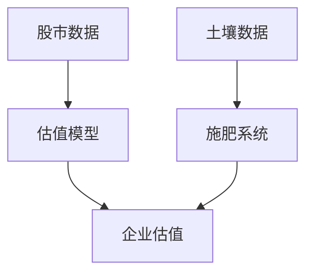
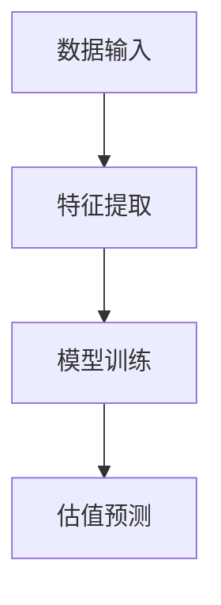
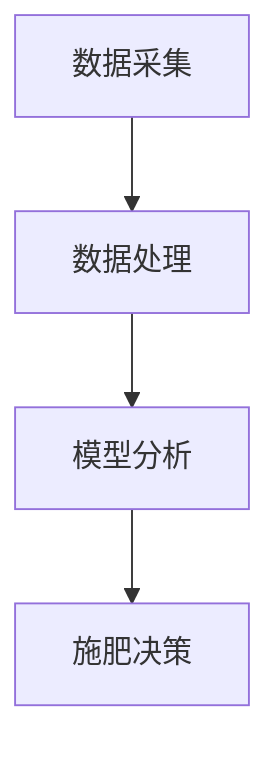
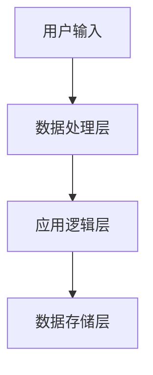
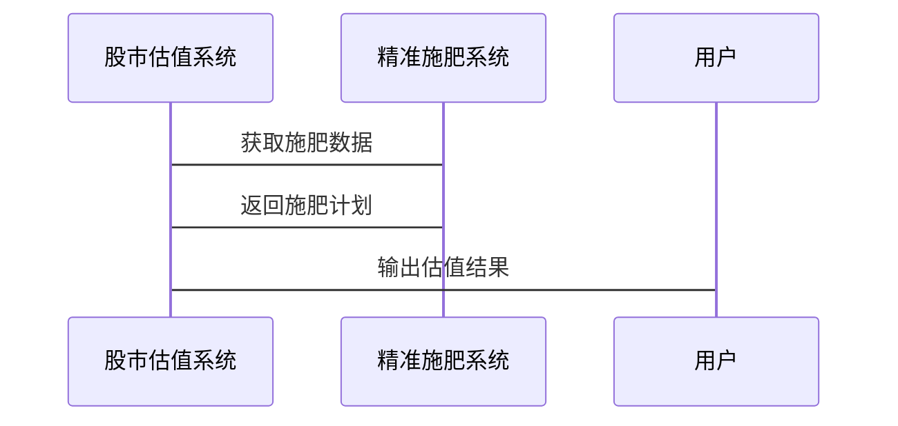

                 


# 新兴市场股市估值与智慧农业精准施肥的互动

> 关键词：股市估值，智慧农业，精准施肥，大数据分析，人工智能，机器学习

> 摘要：本文探讨了新兴市场股市估值与智慧农业精准施肥之间的互动关系，分析了如何通过大数据和人工智能技术优化股市估值模型，并结合智慧农业中的精准施肥技术，展示了技术进步对股市估值的深远影响。文章从背景介绍、核心概念、算法原理、系统架构到项目实战，详细阐述了这一互动机制，为相关领域的研究和实践提供了参考。

---

## 第1章: 背景介绍

### 1.1 新兴市场股市估值的背景

#### 1.1.1 问题背景：新兴市场股市的特点与挑战
新兴市场股市具有高增长潜力，但也面临波动性大、信息不对称等问题。传统估值方法难以准确反映市场动态，需借助大数据和人工智能优化模型。

#### 1.1.2 问题描述：股市估值与经济发展之间的关系
股市估值不仅是企业价值的体现，还反映了整体经济状况。在新兴市场，农业作为经济的重要组成部分，其技术进步直接影响股市估值。

#### 1.1.3 问题解决：如何通过数据与技术优化估值模型
利用机器学习和大数据分析，构建动态估值模型，实时更新企业价值评估，提高估值准确性。

#### 1.1.4 边界与外延：股市估值的范围与限制
股市估值受多种因素影响，包括宏观经济、行业状况和企业基本面。本文聚焦于智慧农业技术对股市估值的影响。

#### 1.1.5 核心要素：估值模型的关键组成部分
包括企业财务数据、行业趋势、市场情绪和技术创新等。

### 1.2 智慧农业精准施肥的背景

#### 1.2.1 问题背景：传统农业施肥方式的局限性
传统施肥方式浪费资源、污染环境，且效率低下。精准施肥通过技术手段优化施肥方案，提高产量并减少环境影响。

#### 1.2.2 问题描述：精准施肥对农业增产与环保的重要性
精准施肥可减少化肥使用量，降低环境污染，同时提高作物产量，促进可持续农业发展。

#### 1.2.3 问题解决：如何利用大数据与AI实现精准施肥
通过传感器、无人机和AI算法，实时监测土壤状况，制定个性化施肥计划。

#### 1.2.4 边界与外延：精准施肥的技术与应用范围
包括传感器技术、AI算法、数据传输和决策系统。本文重点分析其技术实现及其对股市估值的影响。

#### 1.2.5 核心要素：精准施肥系统的组成与功能
包括数据采集、处理、分析和执行系统。

### 1.3 股市估值与智慧农业的互动关系

#### 1.3.1 互动机制：股市估值如何反映农业技术进步
农业技术创新推动企业业绩增长，提升股价，反过来又吸引更多投资，促进技术进一步发展。

#### 1.3.2 互动影响：农业技术进步对股市估值的推动作用
技术创新降低生产成本，提高效率，增强企业盈利能力，进而提升股市估值。

#### 1.3.3 互动模型：从数据到价值的转化过程
通过大数据分析和AI算法，精准施肥技术优化农业生产，企业利润增长，股市估值上升。

#### 1.3.4 互动案例：新兴市场中的典型企业分析
例如，某农业科技公司通过精准施肥技术提升产量，股价随之上涨，吸引更多投资者。

---

## 第2章: 核心概念与联系

### 2.1 核心概念原理

#### 2.1.1 股市估值的核心算法
使用机器学习模型，如随机森林和神经网络，基于财务数据和市场信息进行估值预测。

#### 2.1.2 精准施肥的技术原理
利用传感器数据和AI算法，实时监测土壤状况，制定个性化施肥方案。

#### 2.1.3 两者之间的关联性分析
精准施肥技术提升农业生产效率，推动企业盈利增长，进而影响股市估值。

### 2.2 核心概念属性特征对比

| 属性 | 股市估值 | 精准施肥 |
|------|---------|----------|
| 输入数据 | 财务数据、市场信息 | 土壤数据、环境数据 |
| 输出 | 企业估值 | 施肥方案 |
| 技术基础 | 机器学习 | 传感器技术、AI算法 |
| 应用目标 | 优化投资决策 | 提高农业产量 |

### 2.3 ER实体关系图


---

## 第3章: 算法原理

### 3.1 股市估值算法

#### 3.1.1 算法流程


#### 3.1.2 数学模型
企业价值（EV）= 市盈率（P/E） × 净利润

### 3.2 精准施肥算法

#### 3.2.1 算法流程


#### 3.2.2 数学模型
施肥量 = β × 土壤养分含量 + γ × 气候条件

---

## 第4章: 系统分析与架构设计

### 4.1 问题场景介绍
新兴市场中，智慧农业技术的应用如何影响股市估值。

### 4.2 系统功能设计
```mermaid
classDiagram
    class 股市估值系统 {
        +股票数据
        +估值模型
        +预测结果
        - 数据处理
        - 模型训练
    }
    class 精准施肥系统 {
        +土壤传感器
        +环境数据
        +施肥计划
        - 数据采集
        - 决策算法
    }
    股市估值系统 <-->> 精准施肥系统
```

### 4.3 系统架构设计


### 4.4 接口设计
API接口用于数据传输和模型调用。

### 4.5 交互序列图


---

## 第5章: 项目实战

### 5.1 环境安装
安装Python、TensorFlow、Scikit-learn和传感器设备。

### 5.2 核心代码实现

#### 股市估值模型
```python
import numpy as np
from sklearn.ensemble import RandomForestRegressor

# 数据预处理
X = df[['收入', '利润', '市盈率']]
y = df['估值']

# 模型训练
model = RandomForestRegressor()
model.fit(X, y)

# 预测
new_data = np.array([[100, 20, 15]])
print(model.predict(new_data))
```

#### 精准施肥系统
```python
import numpy as np
from sklearn.linear_model import LinearRegression

# 数据预处理
soil_data = df[['氮含量', '磷含量', '钾含量']]
weather_data = df['温度']

# 模型训练
model = LinearRegression()
model.fit(soil_data, weather_data)

# 决策
new_soil = np.array([[10, 5, 8]])
print(model.predict(new_soil))
```

### 5.3 案例分析
分析某农业科技公司，通过精准施肥技术提升产量，企业估值上升。

### 5.4 项目小结
项目展示了技术如何推动股市估值增长，具有实际应用价值。

---

## 第6章: 总结

### 6.1 最佳实践 tips
- 结合大数据和AI优化股市估值模型。
- 精准施肥技术提升农业效率，推动企业价值增长。

### 6.2 小结
本文分析了新兴市场股市估值与智慧农业精准施肥的互动关系，展示了技术如何推动经济价值增长。

### 6.3 注意事项
数据质量和模型选择对结果影响重大，需谨慎处理。

### 6.4 拓展阅读
推荐阅读相关领域的学术论文和技术报告。

---

作者：AI天才研究院/AI Genius Institute & 禅与计算机程序设计艺术 /Zen And The Art of Computer Programming

