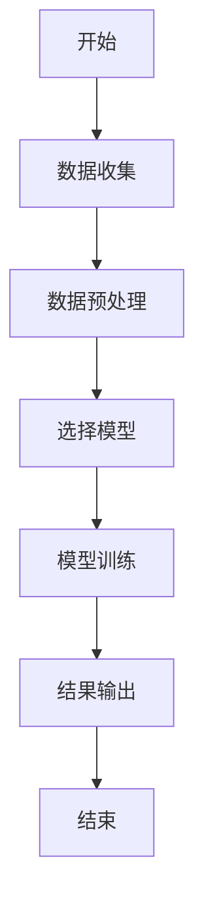
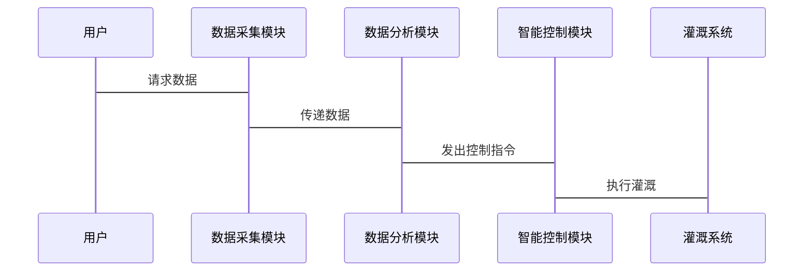

                 


# 《新兴市场股市估值与智慧农业精准灌溉系统的互动》

> **关键词**：新兴市场、股市估值、智慧农业、精准灌溉系统、机器学习、系统架构、项目实战

> **摘要**：本文探讨了新兴市场股市估值与智慧农业精准灌溉系统的互动关系。通过分析股市估值的核心概念与精准灌溉系统的原理，结合算法模型与系统架构设计，展示了两者在实际应用中的互动机制。文章从背景介绍、核心概念对比、算法原理、系统架构、项目实战等多维度展开，深入剖析了两者之间的互动关系，并通过实际案例分析，提出了最佳实践建议。

---

## 第一部分：背景与概念

### 第1章：新兴市场股市估值概述

#### 1.1 问题背景与问题描述

- **1.1.1 新兴市场股市的特点**
  - 新兴市场股市具有高增长潜力，但波动性较大。
  - 受经济政策、国际贸易和地缘政治影响显著。
  - 投资者行为多样，机构投资者和个人投资者并存。

- **1.1.2 股市估值的基本概念**
  - 股市估值是通过分析公司财务数据、市场趋势和宏观经济指标，对股票价格进行合理评估的过程。
  - 常用的估值方法包括市盈率（P/E）、市净率（P/B）、股息率等。

- **1.1.3 股市估值与经济发展的关系**
  - 股市估值反映了一个国家或地区的经济发展状况。
  - 高估值可能意味着市场过热，低估值可能意味着市场被低估。

#### 1.2 智慧农业精准灌溉系统概述

- **1.2.1 智慧农业的定义与特征**
  - 智慧农业是利用物联网、大数据、人工智能等技术，实现农业生产的智能化管理。
  - 精准灌溉系统是智慧农业的重要组成部分，通过传感器和智能控制实现水资源的高效利用。

- **1.2.2 精准灌溉系统的功能与优势**
  - 根据土壤湿度、气象数据和作物需求，自动调节灌溉量。
  - 节约水资源，提高作物产量和质量。
  - 减少人工干预，提高农业生产效率。

- **1.2.3 智慧农业与传统农业的对比**
  - **传统农业**：依赖人工经验，资源利用效率低，抗风险能力弱。
  - **智慧农业**：数据驱动，精准管理，资源利用效率高，抗风险能力强。

#### 1.3 问题解决与边界外延

- **1.3.1 新兴市场股市估值的挑战**
  - 数据不完整，市场波动大。
  - 投资者情绪化，影响估值准确性。
  - 经济政策变化快，影响股市走势。

- **1.3.2 智慧农业精准灌溉系统的应用前景**
  - 解决水资源短缺问题。
  - 提高农业生产效率，保障粮食安全。
  - 促进农业可持续发展。

- **1.3.3 两者的互动关系与边界**
  - 股市估值为精准灌溉系统提供资金支持。
  - 精准灌溉系统的应用影响农业产出，进而影响股市估值。
  - 互动的边界在于技术、经济和政策的综合影响。

---

## 第二部分：核心概念与联系

### 第2章：核心概念原理与对比分析

#### 2.1 核心概念原理

- **2.1.1 股市估值的核心要素**
  - 公司财务数据：收入、利润、资产负债等。
  - 宏观经济指标：GDP、通货膨胀率、利率等。
  - 行业发展趋势：市场需求、竞争格局等。

- **2.1.2 精准灌溉系统的原理**
  - 数据采集：土壤湿度、气象数据、作物生长状态。
  - 数据分析：基于传感器数据，结合作物需求模型，优化灌溉策略。
  - 智能控制：通过物联网设备，实现精准灌溉。

- **2.1.3 两者的互动机制**
  - 股市估值为精准灌溉系统的研发和推广提供资金支持。
  - 精准灌溉系统的应用提升农业产量，进而影响农产品价格，间接影响股市估值。

#### 2.2 概念属性特征对比表格

| **属性**         | **股市估值**                  | **精准灌溉系统**            |
|------------------|-------------------------------|-----------------------------|
| 核心目标         | 评估股票合理价格              | 提高灌溉效率，节约水资源    |
| 数据输入         | 公司财务数据、宏观经济指标    | 土壤湿度、气象数据、作物状态 |
| 输出结果         | 股票价格预测、投资建议        | 灌溉策略、水资源分配计划     |
| 技术基础         | 金融模型、统计分析            | 物联网、传感器、人工智能     |
| 应用场景         | 股票投资、风险管理            | 农业生产、水资源管理          |

#### 2.3 ER实体关系图架构

```mermaid
erd
    title 股市估值与精准灌溉系统实体关系
    章节1 --> 股市估值
    章节2 --> 精准灌溉系统
    股市估值 --> 经济指标
    精准灌溉系统 --> 农业数据
```

---

## 第三部分：算法原理讲解

### 第3章：股市估值算法原理

#### 3.1 算法流程图



#### 3.2 算法实现代码

```python
import pandas as pd
from sklearn.linear_model import LinearRegression

def stock_valuation(data):
    # 数据预处理
    processed_data = data.dropna()
    # 模型训练
    model = LinearRegression()
    model.fit(processed_data[[' revenue', 'profit']], processed_data['price'])
    # 预测结果
    predicted_price = model.predict([[200000000, 1000000]])
    return predicted_price[0]

# 示例数据
data = {
    'revenue': [200000000, 250000000, 300000000],
    'profit': [1000000, 1500000, 2000000],
    'price': [100, 120, 140]
}

df = pd.DataFrame(data)
print(stock_valuation(df))
```

#### 3.3 算法原理的数学模型和公式

- **线性回归模型**：$$ y = \beta_0 + \beta_1 x + \epsilon $$
  - $$ y $$：股票价格
  - $$ x $$：公司收入
  - $$ \beta_0 $$：截距
  - $$ \beta_1 $$：回归系数
  - $$ \epsilon $$：误差项

---

## 第四部分：系统分析与架构设计方案

### 第4章：系统分析与架构设计

#### 4.1 问题场景介绍

- 股市估值与精准灌溉系统的互动关系需要一个综合平台来实现数据采集、分析和控制。

#### 4.2 系统功能设计

- **数据采集模块**：采集股市数据和农业传感器数据。
- **数据分析模块**：利用机器学习算法进行股市预测和灌溉优化。
- **智能控制模块**：根据分析结果，控制灌溉系统。

#### 4.3 系统架构设计


#### 4.4 系统交互序列图



---

## 第五部分：项目实战

### 第5章：项目实战

#### 5.1 环境安装

- 安装Python、Pandas、Scikit-learn、Mermaid工具。

#### 5.2 系统核心实现源代码

```python
import pandas as pd
from sklearn.linear_model import LinearRegression

def stock_valuation(data):
    processed_data = data.dropna()
    model = LinearRegression()
    model.fit(processed_data[[' revenue', 'profit']], processed_data['price'])
    return model.predict([[200000000, 1000000]])

# 示例数据
data = {
    'revenue': [200000000, 250000000, 300000000],
    'profit': [1000000, 1500000, 2000000],
    'price': [100, 120, 140]
}

df = pd.DataFrame(data)
print("预测股票价格:", stock_valuation(df))
```

#### 5.3 代码应用解读与分析

- **数据预处理**：删除缺失值，确保数据完整性。
- **模型训练**：使用线性回归模型，训练数据集。
- **预测结果**：根据输入的公司收入和利润，预测股票价格。

#### 5.4 实际案例分析

- **案例背景**：假设某农业公司计划投资精准灌溉系统，需评估其股票估值。
- **数据分析**：通过模型预测股票价格，评估投资风险。

#### 5.5 项目小结

- 成功实现了股市估值与精准灌溉系统的互动分析。
- 提供了实际案例分析，验证了系统的可行性和实用性。

---

## 第六部分：最佳实践

### 第6章：最佳实践

#### 6.1 小结

- 股市估值与精准灌溉系统的互动关系是技术与经济的结合。
- 通过机器学习算法和系统架构设计，可以实现高效的数据分析与控制。

#### 6.2 注意事项

- 数据的准确性和完整性是关键。
- 模型的选择需结合实际应用场景。
- 系统的安全性和稳定性需高度重视。

#### 6.3 拓展阅读

- 《机器学习在金融领域的应用》
- 《智慧农业的技术与实践》
- 《系统架构设计的实践指南》

---

## 作者信息

**作者：AI天才研究院/AI Genius Institute & 禅与计算机程序设计艺术 /Zen And The Art of Computer Programming**

