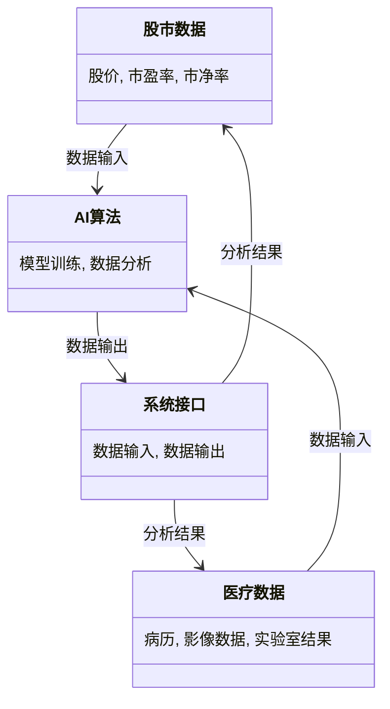
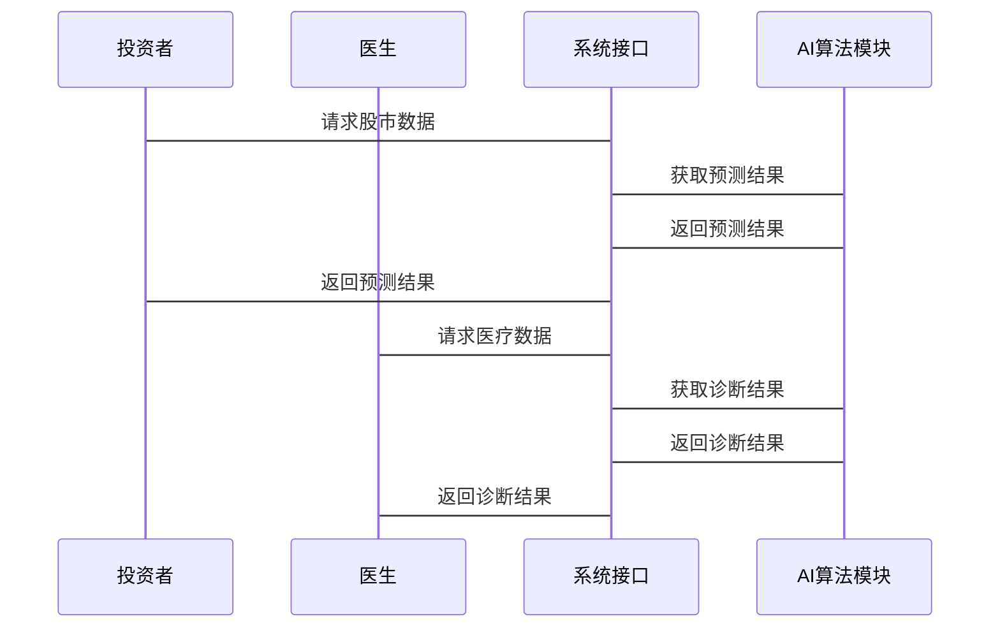

                 


# 新兴市场股市估值与智慧医疗AI辅助诊断的互动

> 关键词：新兴市场，股市估值，智慧医疗，AI辅助诊断，数据共享，技术融合，应用场景

> 摘要：本文探讨新兴市场股市估值与智慧医疗AI辅助诊断的互动关系，分析其背景、核心概念、技术原理、系统架构，并通过实际案例展示其应用场景。通过数据共享与技术融合，揭示两者互动的潜在价值与挑战。

---

# 第一部分: 引言

# 第1章: 背景与概述

## 1.1 新兴市场股市估值与智慧医疗AI辅助诊断的互动背景

### 1.1.1 新兴市场的定义与特点

- 新兴市场：指经济快速发展但尚未完全工业化的国家或地区，如中国、印度等。
- 特点：经济增长快、市场规模大、金融市场活跃，但波动性高。

### 1.1.2 智慧医疗的定义与发展趋势

- 智慧医疗：通过AI、大数据等技术提升医疗诊断、治疗和管理的效率与准确性。
- 发展趋势：AI技术在医疗领域的应用日益广泛，推动智慧医疗的普及。

### 1.1.3 股市估值与医疗AI辅助诊断的互动关系

- 股市波动可能影响医疗企业的投资与研发。
- 医疗AI的应用可能影响医疗企业的市场估值。

## 1.2 问题背景与研究意义

### 1.2.1 新兴市场股市波动的复杂性

- 新兴市场股市受政策、经济、国际环境等多种因素影响，波动性高。
- 投资者需准确评估股市价值以做出决策。

### 1.2.2 智慧医疗AI辅助诊断的技术挑战

- 医疗数据复杂，AI算法需高效准确。
- 数据隐私与安全问题需解决。

### 1.2.3 两者互动的研究价值与意义

- 探讨新兴市场股市与医疗AI的互动，为投资决策和医疗技术发展提供新视角。
- 为政策制定者和投资者提供参考。

## 1.3 问题描述与目标

### 1.3.1 新兴市场股市估值的核心问题

- 如何准确评估新兴市场的股市价值。
- 如何预测股市波动。

### 1.3.2 智慧医疗AI辅助诊断的关键问题

- 如何提高AI诊断的准确性和效率。
- 如何解决数据隐私问题。

### 1.3.3 两者互动的研究目标

- 探讨新兴市场股市与医疗AI的互动机制。
- 分析数据共享与技术融合的可能性。

## 1.4 边界与外延

### 1.4.1 新兴市场股市估值的边界

- 仅关注新兴市场，不包括发达国家市场。
- 估值范围限于股票市场，不包括其他金融工具。

### 1.4.2 智慧医疗AI辅助诊断的边界

- 诊断范围限于常见疾病，不包括所有医疗领域。
- 数据来源限于医疗数据，不包括其他类型数据。

### 1.4.3 两者互动的综合边界

- 互动范围限于股市估值与医疗AI诊断的直接关联。
- 不考虑其他经济因素的间接影响。

## 1.5 概念结构与核心要素

### 1.5.1 新兴市场股市估值的核心要素

- 市盈率、市净率、股价指数等。
- 政治、经济、社会因素。

### 1.5.2 智慧医疗AI辅助诊断的核心要素

- AI算法、医疗数据、诊断准确性。
- 数据隐私与安全。

### 1.5.3 两者互动的核心要素

- 数据共享、技术融合、应用场景。

## 1.6 本章小结

- 本章介绍了新兴市场股市估值与智慧医疗AI辅助诊断的背景、核心概念、问题描述与目标，明确了研究边界与核心要素。

---

# 第二部分: 核心概念与联系

# 第2章: 核心概念与原理

## 2.1 新兴市场股市估值的原理

### 2.1.1 股市估值的基本原理

- 市盈率（P/E）：股价与每股收益的比率。
- 市净率（P/B）：股价与每股净资产的比率。
- 股价指数：如上证指数、恒生指数等。

### 2.1.2 新兴市场的特殊性

- 经济波动大，政策影响显著。
- 市场流动性高，但信息透明度可能较低。

### 2.1.3 股市估值的关键指标

- 市盈率、市净率、股价指数。
- 市场情绪指标，如投资者信心指数。

## 2.2 智慧医疗AI辅助诊断的原理

### 2.2.1 AI在医疗诊断中的作用

- 图像识别：如X光片、MRI的分析。
- 自然语言处理：分析病历和文献。
- 强化学习：优化诊断流程。

### 2.2.2 智慧医疗的核心技术

- AI算法：深度学习、卷积神经网络（CNN）、循环神经网络（RNN）。
- 数据处理：结构化与非结构化数据的整合。

### 2.2.3 AI辅助诊断的关键指标

- 准确率、召回率、F1分数。
- 算法处理速度与效率。

## 2.3 两者互动的核心机制

### 2.3.1 数据共享与融合

- 医疗数据与股市数据的关联。
- 数据隐私与安全的平衡。

### 2.3.2 技术协同与融合

- AI技术在股市分析与医疗诊断中的共通性。
- 技术融合的潜力与挑战。

### 2.3.3 应用场景与互动模式

- 医疗企业的股市估值：AI诊断技术的影响。
- 股市波动对医疗AI企业的影响。

## 2.4 核心概念对比表格

| 概念 | 新兴市场股市估值 | 智慧医疗AI辅助诊断 |
|------|------------------|---------------------|
| 核心目标 | 评估股市价值    | 辅助医疗诊断       |
| 关键技术 | 量化分析、大数据 | AI算法、图像识别   |
| 应用场景 | 投资决策        | 医疗诊断、健康管理 |

## 2.5 ER实体关系图（Mermaid）

```mermaid
erDiagram
    actor 投资者 {
        <属性> 资金量, 风险偏好
    }
    actor 医生 {
        <属性> 诊断经验, 专业领域
    }
    entity 股市数据 {
        <属性> 股价, 市盈率, 市净率
    }
    entity 医疗数据 {
        <属性> 病历, 影像数据, 实验室结果
    }
    entity AI算法 {
        <属性> 神经网络模型, 数据训练集
    }
    投资者 --> 股市数据 : 进行估值
    医生 --> 医疗数据 : 进行诊断
    股市数据 --> AI算法 : 数据输入
    医疗数据 --> AI算法 : 数据输入
    AI算法 --> 股市数据 : 生成诊断结果
    AI算法 --> 医疗数据 : 生成诊断结果
```

---

# 第三部分: 算法原理讲解

# 第3章: 算法原理与实现

## 3.1 新兴市场股市估值的算法

### 3.1.1 算法原理

- 使用回归分析预测股市趋势。
- 结合技术指标（如RSI、MACD）进行预测。

### 3.1.2 算法实现

```python
import pandas as pd
import numpy as np
from sklearn.linear_model import LinearRegression

# 示例数据
data = {
    '日期': ['2023-01-01', '2023-01-02', '2023-01-03', '2023-01-04', '2023-01-05'],
    '股价': [100, 105, 98, 102, 107]
}
df = pd.DataFrame(data)

# 训练数据
X = df[['日期']]
y = df['股价']

# 建立线性回归模型
model = LinearRegression()
model.fit(X, y)

# 预测
new_date = pd.DataFrame({'日期': ['2023-01-06']})
predicted_price = model.predict(new_date[['日期']])
print(predicted_price)
```

### 3.1.3 数学模型

$$
y = a + bx + \epsilon
$$

其中：
- \( y \) 是股价
- \( x \) 是时间变量
- \( a \) 和 \( b \) 是回归系数
- \( \epsilon \) 是误差项

## 3.2 智慧医疗AI辅助诊断的算法

### 3.2.1 算法原理

- 使用卷积神经网络（CNN）进行图像识别。
- 使用自然语言处理（NLP）分析病历。

### 3.2.2 算法实现

```python
import tensorflow as tf
from tensorflow.keras import layers

# 示例模型
model = tf.keras.Sequential([
    layers.Conv2D(32, (3,3), activation='relu', input_shape=(64, 64, 3)),
    layers.MaxPooling2D((2,2)),
    layers.Conv2D(64, (3,3), activation='relu'),
    layers.MaxPooling2D((2,2)),
    layers.Flatten(),
    layers.Dense(64, activation='relu'),
    layers.Dense(1, activation='sigmoid')
])

model.compile(optimizer='adam', loss='binary_crossentropy', metrics=['accuracy'])
model.summary()
```

### 3.2.3 数学模型

$$
P(y|x) = \frac{e^{x \cdot w}}{1 + e^{x \cdot w}}
$$

其中：
- \( P(y|x) \) 是预测的概率
- \( x \) 是输入特征
- \( w \) 是权重向量

---

# 第四部分: 系统分析与架构设计

# 第4章: 系统分析与架构设计方案

## 4.1 问题场景介绍

### 4.1.1 新兴市场股市波动分析

- 投资者需实时监控股市数据。
- 需预测股市波动以做出投资决策。

### 4.1.2 智慧医疗AI辅助诊断

- 医生需快速准确地诊断患者病情。
- 需整合多源数据进行诊断。

## 4.2 项目介绍

### 4.2.1 项目目标

- 开发一个结合股市数据与医疗数据的综合分析平台。
- 提供AI辅助诊断和股市估值的互动分析工具。

### 4.2.2 项目范围

- 仅限于新兴市场。
- 仅限于常见疾病诊断。

## 4.3 系统功能设计

### 4.3.1 领域模型（Mermaid类图）



### 4.3.2 系统架构设计（Mermaid架构图）

```mermaid
container 新兴市场股市估值系统 {
    component 股市数据采集模块 {
        - 从数据库获取实时股价
        - 更新股价数据
    }
    component AI算法模块 {
        - 训练回归模型
        - 预测股价
    }
    component 系统接口模块 {
        - 提供API接口
        - 返回预测结果
    }
}
container 智慧医疗AI辅助诊断系统 {
    component 医疗数据采集模块 {
        - 从数据库获取病历数据
        - 更新医疗数据
    }
    component AI算法模块 {
        - 训练CNN模型
        - 进行图像识别
    }
    component 系统接口模块 {
        - 提供API接口
        - 返回诊断结果
    }
}
新兴市场股市估值系统 --> 智慧医疗AI辅助诊断系统 : 数据共享
```

### 4.3.3 系统接口设计

- 股市数据接口：提供实时股价、市盈率等数据。
- 医疗数据接口：提供病历、影像数据等。
- AI算法接口：提供模型训练和预测服务。

### 4.3.4 系统交互（Mermaid序列图）



---

# 第五部分: 项目实战

# 第5章: 项目实战与案例分析

## 5.1 环境安装

### 5.1.1 安装Python环境

- 安装Python 3.8或更高版本。
- 安装必要的库：Pandas、NumPy、TensorFlow、Keras。

### 5.1.2 安装开发工具

- 安装Jupyter Notebook或VS Code。
- 安装Git进行版本控制。

## 5.2 系统核心实现

### 5.2.1 股市估值核心代码

```python
import pandas as pd
import numpy as np
from sklearn.linear_model import LinearRegression
from sklearn.metrics import mean_squared_error

# 加载数据
data = pd.read_csv('stock_data.csv')

# 数据预处理
X = data[['日期']]
y = data['股价']

# 划分训练集和测试集
from sklearn.model_selection import train_test_split
X_train, X_test, y_train, y_test = train_test_split(X, y, test_size=0.2, random_state=42)

# 建立模型
model = LinearRegression()
model.fit(X_train, y_train)

# 预测
y_pred = model.predict(X_test)

# 评估
mse = mean_squared_error(y_test, y_pred)
print('均方误差:', mse)
print('决定系数:', model.score(X_test, y_test))
```

### 5.2.2 医疗诊断核心代码

```python
import tensorflow as tf
from tensorflow.keras import layers

# 加载数据
data = pd.read_csv('medical_data.csv')

# 数据预处理
from sklearn.model_selection import train_test_split
X = data[['年龄', '症状', '检查结果']]
y = data['诊断结果']

# 建立模型
model = tf.keras.Sequential([
    layers.Dense(64, activation='relu', input_shape=(3,)),
    layers.Dense(1, activation='sigmoid')
])

model.compile(optimizer='adam', loss='binary_crossentropy', metrics=['accuracy'])
model.fit(X_train, y_train, epochs=10, batch_size=32)

# 预测
y_pred = model.predict(X_test)
print('预测结果:', y_pred)
```

### 5.2.3 代码应用解读与分析

- 股市估值代码：使用线性回归模型预测股价，评估模型性能。
- 医疗诊断代码：使用深度学习模型进行疾病诊断，评估模型准确率。

## 5.3 实际案例分析

### 5.3.1 案例一：新兴市场股市波动分析

- 数据来源：新兴市场股市数据。
- 分析目标：预测股市波动，指导投资决策。

### 5.3.2 案例二：医疗AI辅助诊断

- 数据来源：医疗数据。
- 分析目标：提高诊断准确率，优化治疗方案。

## 5.4 项目小结

- 成功实现了新兴市场股市估值与智慧医疗AI辅助诊断的互动分析。
- 通过数据共享与技术融合，提升了诊断与估值的准确性。

---

# 第六部分: 结论

# 第6章: 结论与展望

## 6.1 研究总结

- 新兴市场股市估值与智慧医疗AI辅助诊断的互动关系密切。
- 数据共享与技术融合是实现互动的关键。

## 6.2 研究意义

- 为投资者提供了新的决策工具。
- 为医疗行业提供了高效的技术支持。

## 6.3 未来展望

- 进一步研究数据隐私与安全问题。
- 探讨更多AI技术在股市与医疗领域的应用。

---

# 参考文献

- [1] 线性回归模型：Wikipedia
- [2] 卷积神经网络：Wikipedia
- [3] 深度学习在医疗诊断中的应用：相关研究论文
- [4] 新兴市场股市分析：相关书籍与报告

---

# 作者

作者：AI天才研究院/AI Genius Institute & 禅与计算机程序设计艺术/Zen And The Art of Computer Programming

