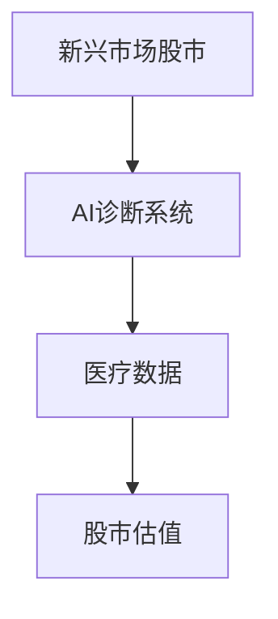
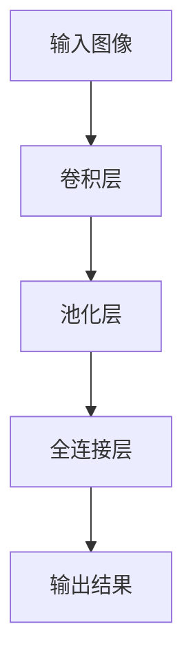
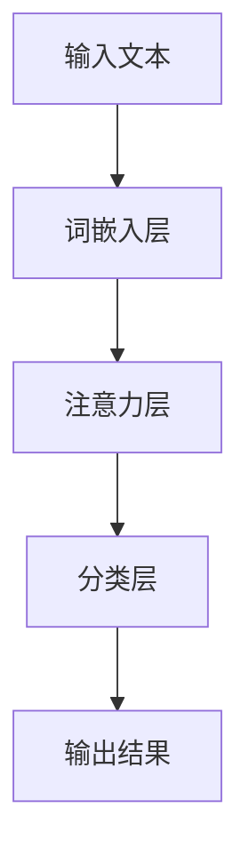
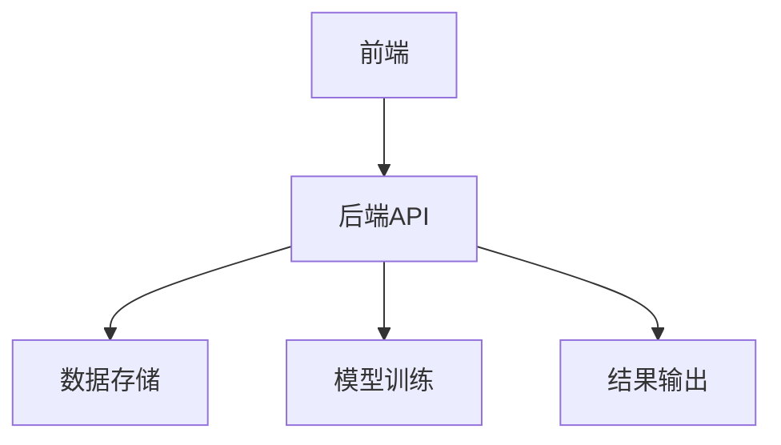

                 


# 新兴市场股市估值与智慧医疗AI辅助诊断系统的互动

> 关键词：新兴市场，股市估值，智慧医疗，AI辅助诊断系统，互动机制

> 摘要：本文探讨了新兴市场股市估值与智慧医疗AI辅助诊断系统的互动关系，分析了AI技术在股市估值和医疗诊断中的应用，构建了两者互动的模型，并通过实际案例展示了其在现实中的应用价值。

---

## 第1章: 新兴市场股市估值概述

### 1.1 新兴市场的定义与特点

#### 1.1.1 新兴市场的定义
新兴市场是指那些经济快速发展、产业结构逐步升级的国家或地区的金融市场。这些市场通常具有较高的增长潜力，但也伴随着较高的风险。

#### 1.1.2 新兴市场的经济特征
- 经济快速增长，但波动性较大。
- 产业结构转型，制造业和服务业并重。
- 外资流入增加，但市场流动性不足。

#### 1.1.3 新兴市场的股市特点
- 市场规模较小，流动性较低。
- 市场参与者以散户为主，机构投资者较少。
- 股价波动较大，受政策和外部环境影响显著。

### 1.2 股市估值的核心概念

#### 1.2.1 股市估值的基本原理
股市估值是通过对企业的财务数据和市场环境进行分析，估算其股票的内在价值。常用的方法包括市盈率、市净率、现金流折现法等。

#### 1.2.2 常用的估值方法
- **市盈率（P/E）**：股票价格与每股收益的比值。
- **市净率（P/B）**：股票价格与每股净资产的比值。
- **现金流折现法（DCF）**：通过未来现金流的现值估算企业价值。

#### 1.2.3 新兴市场股市估值的特殊性
新兴市场的股市估值受到政策、经济环境和市场情绪的影响较大。此外，由于信息不对称和数据不透明，估值难度较高。

---

## 第2章: 智慧医疗AI辅助诊断系统概述

### 2.1 智慧医疗的定义与特点

#### 2.1.1 智慧医疗的定义
智慧医疗是指利用人工智能、大数据、物联网等技术，优化医疗资源分配、提升诊断效率和准确性的医疗模式。

#### 2.1.2 智慧医疗的核心技术
- 人工智能（AI）：用于医疗影像识别、疾病预测和辅助诊断。
- 大数据：用于分析海量医疗数据，支持个性化治疗。
- 物联网（IoT）：用于医疗设备的实时监控和远程诊疗。

#### 2.1.3 智慧医疗的应用场景
- 医疗影像诊断：如X光片、MRI图像的自动分析。
- 疾病预测：基于基因数据和生活习惯预测疾病风险。
- 远程医疗：通过互联网实现远程诊断和治疗。

### 2.2 AI辅助诊断系统的原理

#### 2.2.1 AI在医疗诊断中的作用
AI通过深度学习算法分析医疗数据，辅助医生进行诊断。例如，AI可以自动识别CT图像中的肿瘤病变。

#### 2.2.2 常用的AI诊断技术
- **图像识别**：使用卷积神经网络（CNN）分析医疗影像。
- **自然语言处理（NLP）**：用于分析病历文本，提取关键信息。
- **机器学习**：用于预测疾病风险和治疗方案。

#### 2.2.3 AI诊断系统的优缺点
- 优点：提高诊断效率和准确性，减少人为错误。
- 缺点：依赖数据质量，可能存在过拟合和模型偏差。

---

## 第3章: 新兴市场股市估值与智慧医疗AI诊断系统的互动关系

### 3.1 互动的核心概念

#### 3.1.1 股市估值与医疗诊断的关联性
新兴市场的医疗科技公司股票价格可能受到智慧医疗技术发展的影响。例如，一家开发AI诊断系统的公司，其股票价值可能因技术创新而上升。

#### 3.1.2 AI技术在股市估值中的应用
AI可以通过分析历史股价、市场情绪和外部事件，预测股市走势。例如，使用自然语言处理技术分析新闻标题，预测市场情绪对股价的影响。

#### 3.1.3 医疗数据对股市估值的影响
医疗数据（如药品销售数据、医院就诊量）可以反映市场需求，从而影响相关企业的股票估值。

### 3.2 互动机制的实体关系图



---

## 第4章: 新兴市场股市估值与智慧医疗AI诊断系统的互动模型

### 4.1 互动模型的构建

#### 4.1.1 数据流的双向互动
- 医疗数据影响股市估值。
- 股价数据反过来影响医疗科技企业的研发投入和市场表现。

#### 4.1.2 AI算法的协同作用
AI技术在股市估值和医疗诊断中的应用具有相似性，例如都使用深度学习算法分析数据。

#### 4.1.3 互动模型的数学表达

$$
\text{互动模型} = f(\text{股市数据}, \text{医疗数据}, \text{AI算法})
$$

### 4.2 互动模型的数学公式

$$
\text{股票价值} = \alpha \times \text{医疗数据} + \beta \times \text{AI技术进步} + \gamma \times \text{市场情绪}
$$

---

## 第5章: 新兴市场股市估值与智慧医疗AI诊断系统的算法原理

### 5.1 新兴市场股市估值算法

#### 5.1.1 常用估值算法

- **市盈率模型**：$P = E \times \text{PE ratio}$
- **市净率模型**：$P = B \times \text{PB ratio}$
- **现金流折现模型**：$P = \sum_{t=1}^{n} \frac{CF_t}{(1 + r)^t}$

#### 5.1.2 基于AI的股市估值算法

- **机器学习模型**：使用历史股价数据训练回归模型，预测未来股价。
- **深度学习模型**：使用LSTM网络捕捉股价的时间序列特征。

### 5.2 智慧医疗AI诊断算法

#### 5.2.1 图像识别算法



#### 5.2.2 自然语言处理算法



---

## 第6章: 新兴市场股市估值与智慧医疗AI诊断系统的系统分析与架构设计

### 6.1 系统功能设计

- **数据采集**：收集股市数据和医疗数据。
- **数据处理**：清洗和预处理数据。
- **模型训练**：训练AI模型进行估值和诊断。
- **结果输出**：显示估值结果和诊断建议。

### 6.2 系统架构设计



---

## 第7章: 新兴市场股市估值与智慧医疗AI诊断系统的项目实战

### 7.1 环境安装

- 安装Python和必要的库（如TensorFlow、Pandas）。
- 配置开发环境（如Jupyter Notebook）。

### 7.2 核心代码实现

```python
import pandas as pd
import numpy as np
from tensorflow.keras.models import Sequential
from tensorflow.keras.layers import Dense, Conv2D, MaxPooling2D, Flatten

# 加载数据
data = pd.read_csv('data.csv')

# 数据预处理
X = data.iloc[:, 1:-1].values
y = data.iloc[:, -1].values

# 构建模型
model = Sequential()
model.add(Conv2D(32, (3, 3), activation='relu', input_shape=(64, 64, 3)))
model.add(MaxPooling2D((2, 2)))
model.add(Flatten())
model.add(Dense(128, activation='relu'))
model.add(Dense(1, activation='sigmoid'))

model.compile(optimizer='adam', loss='binary_crossentropy', metrics=['accuracy'])
model.fit(X, y, epochs=10, batch_size=32)
```

### 7.3 案例分析

假设我们有一个新兴市场的医疗科技公司，其股票价格受到AI诊断技术的影响。通过训练模型，我们可以预测其股票价格走势，并为投资决策提供依据。

---

## 第8章: 总结与展望

### 8.1 总结
本文探讨了新兴市场股市估值与智慧医疗AI辅助诊断系统的互动关系，分析了AI技术在股市估值和医疗诊断中的应用，构建了互动模型，并通过实际案例展示了其在现实中的应用价值。

### 8.2 未来研究方向
- 探讨更多AI技术在股市和医疗领域的应用。
- 提升模型的泛化能力和鲁棒性。
- 推动AI技术在新兴市场的普及和应用。

---

## 作者

作者：AI天才研究院/AI Genius Institute & 禅与计算机程序设计艺术 /Zen And The Art of Computer Programming

