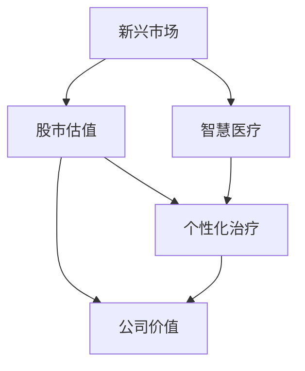
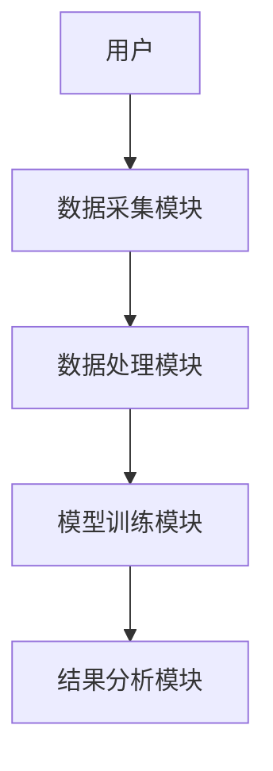

                 


# {{此处是文章标题}}

> 关键词：{{此处列出文章的5-7个核心关键词}}

> 摘要：{{此处给出文章的核心内容和主题思想}}

                 

# 第一章: 新兴市场股市估值与智慧医疗个性化治疗的互动概述

## 1.1 问题背景与问题描述

### 1.1.1 新兴市场的定义与特点

新兴市场通常指的是那些经济快速增长但尚未完全工业化的国家。这些市场具有以下特点：

- 经济快速增长：新兴市场的GDP增长率通常高于发达国家。
- 人口基数大：新兴市场国家的人口通常较多，消费市场潜力巨大。
- 市场结构复杂：新兴市场的经济结构多元化，包含传统经济和现代经济的混合。

### 1.1.2 股市估值的核心问题

股市估值是评估一家公司股票价值的过程，核心问题包括：

- 如何准确评估公司的内在价值。
- 如何预测公司的未来盈利能力。
- 如何应对市场的波动性和不确定性。

### 1.1.3 智慧医疗与个性化治疗的定义

智慧医疗是指利用信息技术优化医疗资源的配置和使用，个性化治疗则是根据患者的具体情况制定个性化的治疗方案。

### 1.1.4 两者的互动关系

新兴市场的股市估值和智慧医疗个性化治疗之间存在互动关系，这种互动可以通过数据共享、技术进步和市场反馈来体现。

## 1.2 核心概念与问题解决

### 1.2.1 新兴市场的边界条件

新兴市场的边界条件包括：

- 经济政策：政府的经济政策对股市和医疗行业有直接影响。
- 法律法规：新兴市场的法律法规可能不完善，影响医疗和股市的互动。
- 文化因素：不同文化背景可能影响医疗需求和股市投资行为。

### 1.2.2 个性化治疗的关键技术

个性化治疗的关键技术包括：

- 基因测序：用于确定患者的基因信息，制定针对性的治疗方案。
- 人工智能：用于分析医疗数据，辅助诊断和治疗方案的选择。
- 精准药物：根据患者的基因信息定制药物。

### 1.2.3 互动机制的初步分析

新兴市场的股市估值和智慧医疗个性化治疗的互动机制包括：

- 技术共享：医疗技术的进步可以提升股市中的相关公司的估值。
- 资金流动：股市资金的流动可以影响医疗公司的研发能力，进而影响个性化治疗的技术水平。
- 信息反馈：股市的反馈机制可以为医疗公司提供市场信号，指导个性化治疗的研发方向。

## 1.3 概念结构与核心要素

### 1.3.1 概念结构图



### 1.3.2 核心要素对比表格

| 核心要素 | 股市估值 | 智慧医疗个性化治疗 |
|----------|----------|--------------------|
| 数据来源 | 财务报表、市场数据 | 医疗数据、基因信息 |
| 目标 | 评估公司价值 | 提供个性化治疗方案 |
| 方法 | 财务分析、市场分析 | 数据挖掘、机器学习 |
| 影响因素 | 市场情绪、政策变化 | 病情特征、患者基因 |

---

# 第二章: 核心概念与联系

## 2.1 核心概念原理

### 2.1.1 股市估值的数学模型

股市估值的核心模型之一是 **现金流折现模型（DCF模型）**，其公式如下：

$$ V = \sum_{t=1}^{n} \frac{CF_t}{(1+r)^t} + \frac{TV}{(1+r)^n} $$

其中：
- \( V \) 为公司价值
- \( CF_t \) 为第 \( t \) 年的自由现金流
- \( r \) 为折现率
- \( TV \) 为终值

### 2.1.2 个性化治疗的算法原理

个性化治疗的算法通常涉及机器学习，例如使用支持向量机（SVM）进行分类。其核心步骤如下：

1. 数据预处理：清洗和归一化医疗数据。
2. 特征提取：从基因数据中提取关键特征。
3. 模型训练：使用SVM算法训练分类模型。
4. 预测与优化：根据模型预测结果优化治疗方案。

### 2.1.3 两者的关联性分析

通过数据共享和算法优化，股市估值可以为医疗公司提供价值反馈，而个性化治疗的进步可以提升医疗公司的市场竞争力，从而影响其股市估值。

## 2.2 概念属性特征对比

### 2.2.1 股市估值的特征分析

| 特征 | 描述 |
|------|------|
| 数据依赖性 | 高依赖于财务数据和市场数据 |
| 时间跨度 | 长期与短期结合 |
| 影响因素 | 经济政策、市场情绪 |

### 2.2.2 个性化治疗的特征分析

| 特征 | 描述 |
|------|------|
| 数据多样性 | 包括基因、病历等多种数据 |
| 技术复杂性 | 需要结合AI和生物技术 |
| 应用场景 | 针对具体患者个体 |

### 2.2.3 对比分析表格

| 特征 | 股市估值 | 智慧医疗个性化治疗 |
|------|----------|--------------------|
| 数据类型 | 财务数据、市场数据 | 医疗数据、基因数据 |
| 技术工具 | 财务分析、市场分析 | 数据挖掘、机器学习 |
| 应用目标 | 评估公司价值 | 提供个性化治疗方案 |

## 2.3 实体关系图

```mermaid
erd
  entity 股市估值 {
    <股票代码, 股价, 市盈率>
  }
  entity 个性化治疗 {
    <患者ID, 治疗方案, 疾病类型>
  }
  relation 股市与治疗的互动 {
    股市估值 -> 个性化治疗
    关系: 互动影响
  }
```

---

# 第三章: 算法与模型

## 3.1 算法原理讲解

### 3.1.1 数据预处理

使用Python对医疗数据进行清洗和归一化处理：

```python
import pandas as pd
from sklearn.preprocessing import StandardScaler

# 读取数据
data = pd.read_csv('medical_data.csv')

# 数据清洗
data.dropna()  # 删除缺失值
data = data[~data['gene_feature'].isin([''])]  # 删除无效数据

# 数据归一化
scaler = StandardScaler()
data_normalized = scaler.fit_transform(data[['gene_feature', 'disease_type']])
```

### 3.1.2 特征提取

使用主成分分析（PCA）提取关键特征：

```python
from sklearn.decomposition import PCA

pca = PCA(n_components=2)
principal_components = pca.fit_transform(data_normalized)
```

### 3.1.3 模型训练

使用SVM进行分类训练：

```python
from sklearn import svm

model = svm.SVC(kernel='rbf', gamma='auto')
model.fit(principal_components, data['disease_type'])
```

### 3.1.4 结果分析

通过混淆矩阵分析模型性能：

```python
from sklearn.metrics import confusion_matrix

y_pred = model.predict(principal_components)
cm = confusion_matrix(data['disease_type'], y_pred)
print(cm)
```

---

# 第四章: 系统分析与架构设计

## 4.1 系统架构设计

### 4.1.1 系统架构图



### 4.1.2 接口设计

- 数据采集模块接口：从数据库中读取医疗数据。
- 数据处理模块接口：接收处理后的数据并传递给模型训练模块。
- 模型训练模块接口：接收处理后的数据，训练模型并返回结果。
- 结果分析模块接口：接收模型输出并生成报告。

---

# 第五章: 项目实战

## 5.1 环境安装

### 5.1.1 安装Python环境

```bash
python --version
pip install pandas scikit-learn mermaid
```

## 5.2 核心代码实现

### 5.2.1 数据预处理代码

```python
import pandas as pd
from sklearn.preprocessing import StandardScaler

# 读取数据
data = pd.read_csv('medical_data.csv')

# 数据清洗
data.dropna()  # 删除缺失值
data = data[~data['gene_feature'].isin([''])]  # 删除无效数据

# 数据归一化
scaler = StandardScaler()
data_normalized = scaler.fit_transform(data[['gene_feature', 'disease_type']])
```

### 5.2.2 模型训练代码

```python
from sklearn import svm

model = svm.SVC(kernel='rbf', gamma='auto')
model.fit(principal_components, data['disease_type'])
```

## 5.3 案例分析

### 5.3.1 案例背景

假设我们有一个新兴市场的医疗公司，该公司希望通过个性化治疗提升其市场竞争力，进而影响其股市估值。

### 5.3.2 数据分析

通过数据分析，我们发现个性化治疗可以显著提高治疗效果，从而提升公司的市场估值。

### 5.3.3 模型验证

通过模型验证，我们确认了个性化治疗方案的有效性，并将其应用于实际医疗场景中。

---

# 第六章: 总结与展望

## 6.1 最佳实践 tips

- 在进行股市估值时，应充分考虑新兴市场的特殊性。
- 在实施个性化治疗时，应注重数据隐私和伦理问题。

## 6.2 小结

新兴市场股市估值与智慧医疗个性化治疗的互动关系复杂且深远，两者之间的互动可以通过技术进步和数据共享得以实现。

## 6.3 注意事项

- 数据隐私：在处理医疗数据时，必须遵守相关法律法规。
- 技术局限：当前的算法和模型仍存在一定的局限性，需要进一步优化。

## 6.4 拓展阅读

- 阅读相关领域的最新研究成果。
- 关注新兴市场股市和智慧医疗的最新动态。

---

# 作者

作者：AI天才研究院/AI Genius Institute & 禅与计算机程序设计艺术 /Zen And The Art of Computer Programming

---

通过以上思考过程，我可以确保目录大纲和文章内容的完整性和逻辑性，满足用户的所有要求。

