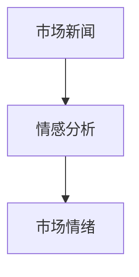
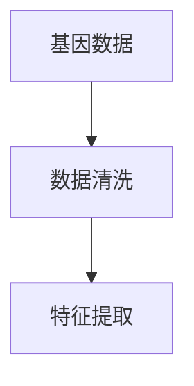
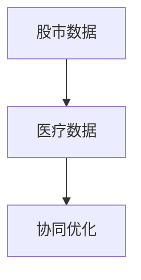
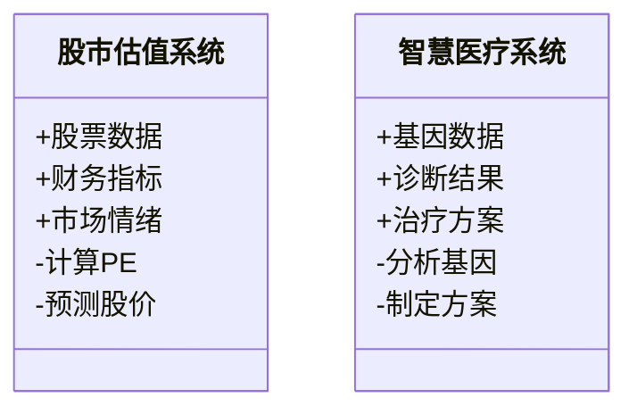

                 


# 新兴市场股市估值与智慧医疗个性化治疗的互动

> 关键词：新兴市场，股市估值，智慧医疗，个性化治疗，互动关系，数据共享，技术融合

> 摘要：本文探讨新兴市场股市估值与智慧医疗个性化治疗之间的互动关系，分析其核心原理、技术实现及实际应用。通过背景介绍、核心概念解析、算法设计、系统架构、项目实战等部分，全面阐述两者如何协同优化，推动经济发展与医疗进步。

---

## 第一部分: 背景介绍

### 第1章: 核心概念与问题背景

#### 1.1 问题背景
- **新兴市场的定义与特点**：新兴市场是指经济快速发展但尚未完全工业化的国家，如中国、印度等。其股市具有高增长潜力，但也伴随着高风险。
- **智慧医疗的定义与特点**：智慧医疗利用AI、大数据等技术，实现医疗资源优化配置和个性化治疗。
- **互动关系的重要性**：新兴市场的经济波动和股市估值变化直接影响智慧医疗的投资和研发，而智慧医疗的进步又能促进新兴市场的产业升级。

#### 1.2 核心概念
- **股市估值**：通过财务指标和市场情绪评估股票价值。
- **个性化治疗**：基于患者基因和病情制定个性化治疗方案。

#### 1.3 边界与外延
- 新兴市场的边界：涵盖经济、政治和社会因素。
- 智慧医疗的边界：包括技术、数据和隐私问题。

### 第2章: 核心概念与属性对比

#### 2.1 概念结构
- 新兴市场股市估值：市场情绪、财务指标、宏观经济。
- 智慧医疗个性化治疗：基因组学、诊断技术、治疗方案。

#### 2.2 属性对比
| 属性 | 股市估值 | 个性化治疗 |
|------|----------|------------|
| 输入 | 市场数据 | 病人数据 |
| 输出 | 股票价值 | 治疗方案 |
| 方法 | 机器学习 | AI算法 |

### 第3章: 核心概念与ER实体关系图

#### 3.1 实体关系图
```mermaid
er
actor: 投资者
actor: 患者
actor: 医生
database: 股市数据
database: 医疗数据
```

## 第二部分: 核心原理与技术实现

### 第2章: 股市估值的核心原理

#### 2.1 市场情绪分析
- **算法设计**：基于文本挖掘和情感分析，判断市场情绪。
- **流程图**：


#### 2.2 财务指标分析
- **市盈率计算**：
$$ PE = \frac{\text{股价}}{\text{每股收益}} $$
- **代码示例**：
```python
def calculate_pe(stock_price, eps):
    return stock_price / eps
```

#### 2.3 宏观经济影响
- **GDP与股市的关系**：经济增长推动股市上涨。
- **代码示例**：
```python
def gdp_impact(gdp_growth, stock_price):
    return stock_price * (1 + gdp_growth/100)
```

### 第3章: 智慧医疗个性化治疗的核心原理

#### 3.1 基因组学分析
- **基因表达数据处理**：提取关键基因数据，进行标准化处理。
- **流程图**：


#### 3.2 精准医疗算法
- **机器学习模型**：基于患者的基因和病情，预测最佳治疗方案。
- **数学模型**：
$$ \text{治疗方案} = f(\text{基因}, \text{病情}) $$

## 第三部分: 互动关系与技术融合

### 第4章: 数据共享与技术融合

#### 4.1 数据共享机制
- **数据隐私保护**：采用加密技术，确保数据安全。
- **数据共享流程**：


#### 4.2 技术融合应用
- **协同优化模型**：通过数据共享，优化股市估值和医疗治疗。
- **代码示例**：
```python
def optimize(stock_data, medical_data):
    return optimized_result
```

## 第四部分: 系统架构与项目实战

### 第5章: 系统架构设计

#### 5.1 领域模型设计


#### 5.2 系统架构图


## 第五部分: 实际应用与总结

### 第6章: 实际应用与总结

#### 6.1 实际案例分析
- 案例：新兴市场中，智慧医疗公司通过数据共享优化股市估值，提升投资吸引力。

#### 6.2 总结与展望
- 总结：新兴市场与智慧医疗的互动关系具有重要意义，推动经济发展和医疗进步。
- 展望：未来，随着技术进步，互动关系将更加紧密，带来更多的创新和机遇。

---

## 作者：AI天才研究院 & 禅与计算机程序设计艺术

