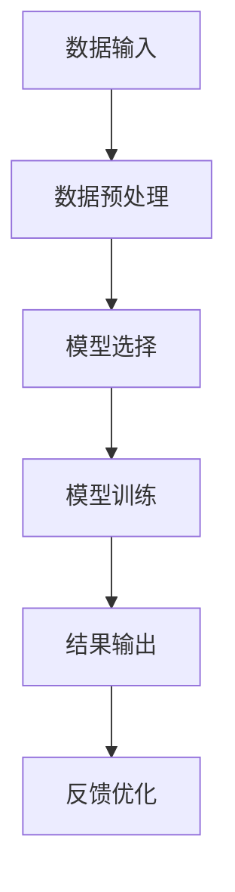
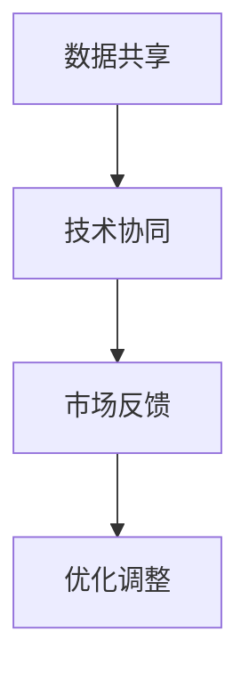
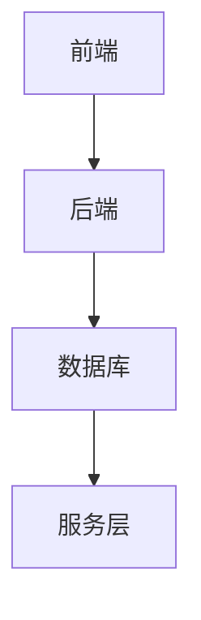
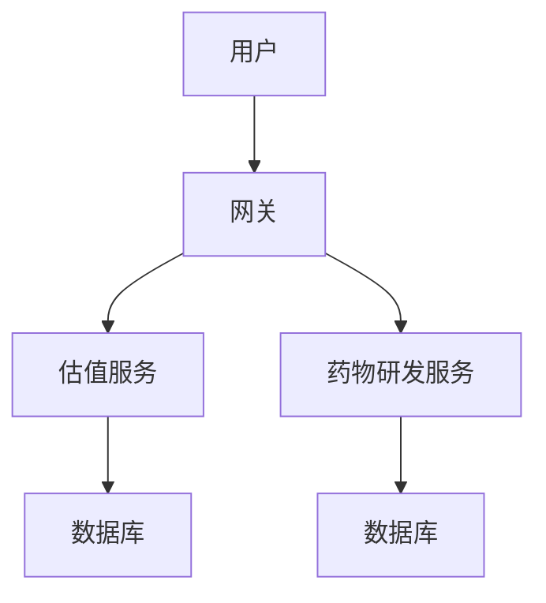

                 


# 新兴市场股市估值与智慧医疗个性化药物研发的互动

> 关键词：新兴市场股市估值、智慧医疗、个性化药物研发、数据共享、协同优化、算法设计、系统架构

> 摘要：本文探讨了新兴市场股市估值与智慧医疗个性化药物研发之间的互动关系，分析了两者的核心概念、算法原理和系统架构，并通过实际案例展示了如何通过数据共享与协同优化实现两者的互动。文章最后总结了互动机制的最佳实践和未来发展方向。

---

## 第一部分: 背景介绍与核心概念

### 第1章: 新兴市场股市估值与智慧医疗个性化药物研发的互动概述

#### 1.1 背景介绍
##### 1.1.1 新兴市场股市估值的现状与挑战
新兴市场股市估值的波动性较大，受政策、经济和市场情绪的影响显著。投资者需要通过量化模型来评估股票的内在价值，但数据的不完整性、市场的不确定性和信息不对称性给估值带来了挑战。

##### 1.1.2 智慧医疗个性化药物研发的现状与趋势
智慧医疗通过大数据和人工智能技术，推动个性化药物研发的精准化和高效化。个性化药物研发的核心是基于患者基因、生活习惯和疾病特征的定制化治疗方案，但研发周期长、成本高，需要借助技术创新来优化流程。

##### 1.1.3 两者互动的背景与意义
股市估值与个性化药物研发的互动源于数据的共享与技术的协同。股市估值的波动可以为药物研发提供市场反馈，而药物研发的进展可以为股市提供新的投资机会。通过互动，可以实现资源的优化配置和技术创新的加速。

#### 1.2 核心概念与问题描述
##### 1.2.1 股市估值的核心要素
- 股票价格：反映市场对公司的整体评估。
- 市盈率：股价与每股收益的比值，用于衡量股票的估值水平。
- 现金流：企业未来现金流的折现值是股票估值的重要依据。
- 风险因素：宏观经济、行业风险和公司特有风险影响股票估值。

##### 1.2.2 个性化药物研发的关键环节
- 数据收集：整合患者的基因组数据、疾病数据和治疗数据。
- 模型构建：基于机器学习算法建立疾病预测和药物筛选模型。
- 临床试验：通过小样本试验验证药物的有效性和安全性。
- 生产与上市：优化生产工艺并完成监管审批。

##### 1.2.3 两者互动的潜在问题与边界
- 数据隐私：个性化药物研发涉及患者隐私数据，需确保数据的安全性。
- 市场波动：股市估值的波动可能对药物研发的融资和投资产生影响。
- 技术协同：互动需要数据共享和算法协同，但存在技术壁垒和合作成本。

---

### 第2章: 核心概念与联系

#### 2.1 核心概念的原理
##### 2.1.1 股市估值的数学模型
- 市盈率模型：$P/E = \frac{P}{E}$，其中$P$为股票价格，$E$为每股收益。
- 现金流折现模型：股票价值 = $\sum_{t=1}^{n} \frac{CF_t}{(1+r)^t}$，其中$CF_t$为第$t$年的现金流，$r$为折现率。
- 风险调整模型：考虑宏观经济风险和行业风险对股票估值的影响。

##### 2.1.2 个性化药物研发的算法原理
- 药物筛选模型：基于机器学习算法（如随机森林、神经网络）筛选潜在药物分子。
- 疾病预测模型：利用深度学习算法预测患者疾病风险。
- 药效评估模型：通过强化学习优化药物剂量和给药方案。

##### 2.1.3 两者互动的机制
- 数据共享：个性化药物研发产生的患者数据可以为股市估值提供新的参考维度。
- 技术协同：股市估值的算法优化可以为药物研发的模型训练提供借鉴。
- 市场反馈：股市的波动可以为药物研发的投融资提供信号。

#### 2.2 核心概念对比分析
##### 2.2.1 股市估值与个性化药物研发的特征对比
| 特征维度 | 股市估值 | 个性化药物研发 |
|----------|----------|----------------|
| 数据类型 | 数值型（股价、市盈率） | 多模态（基因数据、疾病数据） |
| 目标 | 评估股票价值 | 优化药物研发流程 |
| 时间跨度 | 短期波动与长期趋势 | 长期研发周期 |

##### 2.2.2 两者在数据需求上的差异
- 股市估值依赖历史价格数据和财务数据。
- 个性化药物研发依赖患者的基因数据、疾病数据和治疗数据。
- 互动需要整合两者数据，构建跨领域的知识图谱。

##### 2.2.3 互动中的协同效应与冲突
- 协同效应：数据共享可以提高估值的准确性，加速药物研发的进程。
- 冲突：数据隐私和商业机密的保护可能限制互动的深度。

---

### 第3章: 核心概念的ER实体关系图

#### 3.1 股市估值的ER图
```mermaid
erDiagram
    customer(C_id, C_name, C_balance)
    stock(St_id, St_name, St_price)
    transaction(T_id, T_time, T_amount)
    customer-C_stock : { ownership }
    stock-C_transaction : { trade }
```

#### 3.2 个性化药物研发的ER图
```mermaid
erDiagram
    patient(P_id, P_genome, P_disease)
    drug(D_id, D_formula, D_effect)
    trial(T_id, T_duration, T_outcome)
    patient-Drug : { participation }
    drug-Trial : { testing }
```

#### 3.3 互动机制的ER图
```mermaid
erDiagram
    customer(C_id, C_name, C_balance)
    stock(St_id, St_name, St_price)
    transaction(T_id, T_time, T_amount)
    customer-C_stock : { ownership }
    stock-C_transaction : { trade }
    patient(P_id, P_genome, P_disease)
    drug(D_id, D_formula, D_effect)
    trial(T_id, T_duration, T_outcome)
    patient-Drug : { participation }
    drug-Trial : { testing }
```

---

## 第二部分: 核心算法原理与数学模型

### 第4章: 股市估值的算法原理

#### 4.1 股市估值的数学模型
##### 4.1.1 市盈率模型
$$P = \frac{P/E}{E}$$
其中，$P$为股票价格，$E$为每股收益。

##### 4.1.2 现金流折现模型
$$\text{股票价值} = \sum_{t=1}^{n} \frac{CF_t}{(1+r)^t}$$
其中，$CF_t$为第$t$年的现金流，$r$为折现率。

##### 4.1.3 风险调整模型
$$\text{调整后的价值} = \text{基础价值} \times \text{风险调整因子}$$

#### 4.2 算法流程图


---

### 第5章: 个性化药物研发的算法原理

#### 5.1 药物研发的数学模型
##### 5.1.1 药物筛选模型
$$\text{筛选概率} = f(\text{分子结构}, \text{活性数据})$$
其中，$f$为机器学习模型。

##### 5.1.2 疾病预测模型
$$\text{疾病风险} = g(\text{基因数据}, \text{生活习惯})$$
其中，$g$为深度学习模型。

##### 5.1.3 药效评估模型
$$\text{药效评分} = h(\text{药物剂量}, \text{临床数据})$$
其中，$h$为强化学习模型。

#### 5.2 算法流程图


---

### 第6章: 互动机制的算法模型

#### 6.1 互动机制的数学模型
##### 6.1.1 数据共享模型
$$\text{共享数据} = \text{隐私保护} \cap \text{数据需求}$$

##### 6.1.2 技术协同模型
$$\text{协同优化} = \text{算法改进} \times \text{数据共享}$$

##### 6.1.3 市场反馈模型
$$\text{市场信号} = \text{股价波动} + \text{投资者情绪}$$

#### 6.2 互动机制的流程图


---

## 第三部分: 系统分析与架构设计

### 第7章: 系统分析与架构方案

#### 7.1 问题场景介绍
##### 7.1.1 新兴市场的股市特点
- 波动性大
- 信息不对称
- 投资者行为复杂

##### 7.1.2 智慧医疗的个性化需求
- 数据多样性
- 技术复杂性
- 成本高昂

##### 7.1.3 互动中的数据安全问题
- 数据隐私
- 商业机密
- 法律合规

#### 7.2 系统功能设计
##### 7.2.1 股市估值模块
- 数据采集与处理
- 模型计算与优化
- 结果可视化与反馈

##### 7.2.2 药物研发模块
- 数据整合与预处理
- 模型训练与优化
- 临床试验与结果分析

##### 7.2.3 互动机制模块
- 数据共享与协同
- 技术协同与优化
- 市场反馈与调整

#### 7.3 系统架构设计
##### 7.3.1 分层架构


##### 7.3.2 微服务架构


##### 7.3.3 数据共享与隐私
- 数据加密
- 访问控制
- 数据脱敏

---

## 结语

通过系统的分析与设计，我们揭示了新兴市场股市估值与智慧医疗个性化药物研发之间的互动关系。未来，随着技术的不断进步，两者将更加紧密地结合，为投资者和患者带来更大的价值。

作者：AI天才研究院/AI Genius Institute & 禅与计算机程序设计艺术 /Zen And The Art of Computer Programming

