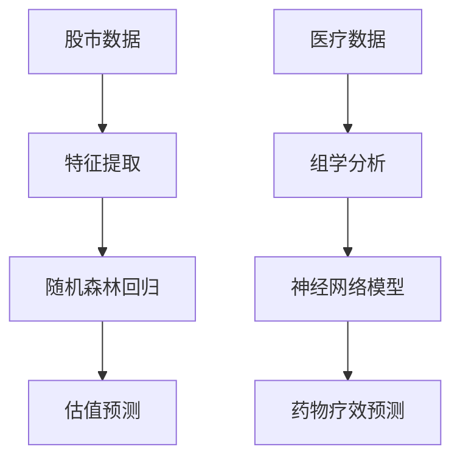

                 


# 新兴市场股市估值与智慧医疗个性化药物研发的互动

> **关键词**: 新兴市场股市估值, 智慧医疗, 个性化药物研发, 数据共享, 人工智能

> **摘要**: 本文探讨新兴市场股市估值与智慧医疗个性化药物研发之间的互动关系。通过分析股市估值的核心原理、个性化药物研发的科学基础，结合数学模型、机器学习算法和系统架构设计，提出两者的互动机制，并通过项目实战展示其应用潜力。最后，总结互动带来的机遇与挑战，展望未来研究方向。

---

## 第一部分: 新兴市场股市估值与智慧医疗个性化药物研发的互动概述

### 第1章: 背景介绍

#### 1.1 核心概念与问题背景
- **股市估值**：评估企业价值的过程，包括市盈率、市净率等指标。
- **个性化药物研发**：基于患者基因、环境等因素定制药物，提高疗效和安全性。

#### 1.2 互动背景与意义
新兴市场中，股市估值为个性化药物研发提供资金支持，而后者推动医疗技术进步，提升企业价值。

#### 1.3 问题边界与外延
- 股市估值关注企业短期表现，个性化药物研发注重长期价值。
- 互动涉及数据共享、技术融合等复杂因素。

---

## 第二部分: 核心概念与联系

### 第2章: 股市估值的核心原理

#### 2.1 统计模型
- **市盈率（P/E）**：公式为$$P/E = \frac{Market\ Value}{Net\ Income}$$。
- **市净率（P/B）**：公式为$$P/B = \frac{Market\ Value}{Book\ Value}$$。

#### 2.2 机器学习算法
- **随机森林回归**：通过特征重要性分析预测股价。
- **神经网络模型**：使用LSTM预测股票趋势。

### 第3章: 个性化药物研发的科学基础

#### 3.1 药效学模型
- 基于患者基因组数据，构建个体化药物反应模型。

#### 3.2 组学数据分析模型
- 利用机器学习分析基因组、转录组数据，预测药物疗效。

---

## 第三部分: 数学模型与算法原理

### 第4章: 互动机制的系统分析

#### 4.1 数据共享
- 股市数据与医疗数据的融合，为个性化药物研发提供支持。

#### 4.2 技术融合
- 人工智能在股市估值和药物研发中的应用，提升效率。

### 第5章: 算法流程图



---

## 第四部分: 系统分析与架构设计

### 第6章: 架构设计方案

#### 6.1 系统架构


#### 6.2 接口设计
- RESTful API：`GET /api/stock` 返回股票数据。

---

## 第五部分: 项目实战

### 第7章: 综合案例分析

#### 7.1 环境配置
- Python 3.8+
- 库：pandas, scikit-learn, tensorflow

#### 7.2 核心代码实现
```python
import pandas as pd
from sklearn.ensemble import RandomForestRegressor

# 加载数据
data = pd.read_csv('data.csv')

# 特征选择
features = data.drop('target', axis=1)
target = data['target']

# 训练模型
model = RandomForestRegressor()
model.fit(features, target)

# 预测
predictions = model.predict(features)
```

---

## 第六部分: 总结与展望

### 第8章: 结论

互动机制为新兴市场股市估值和智慧医疗带来新机遇，但需解决数据隐私和模型泛化问题。

### 第9章: 最佳实践

- 数据共享需遵循隐私保护法规。
- 技术融合需跨学科合作。

---

**作者：AI天才研究院 & 禅与计算机程序设计艺术**

