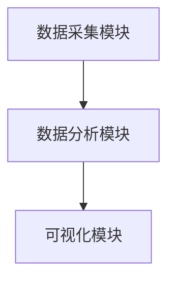

                 


# 新兴市场股市估值与智慧医疗保险的互动

> 关键词：新兴市场、股市估值、智慧医疗保险、互动机制、数学模型

> 摘要：本文探讨新兴市场股市估值与智慧医疗保险之间的互动关系，分析其核心概念、数学模型、算法原理、系统架构及项目实战，揭示两者如何相互影响，为相关领域研究和实践提供参考。

---

# 第一部分: 新兴市场股市估值与智慧医疗保险的互动概述

## 第1章: 新兴市场股市估值概述

### 1.1 股市估值的基本概念

#### 1.1.1 股市估值的定义
股市估值是通过对公司财务数据、市场环境和行业趋势的分析，评估股票的内在价值和市场价值。在新兴市场，由于市场波动大、信息不透明，股市估值更具挑战性。

#### 1.1.2 股市估值的核心要素
- **公司基本面**：收入、利润、资产负债表。
- **市场环境**：宏观经济指标、政策、行业趋势。
- **市场情绪**：投资者情绪、市场参与度。

#### 1.1.3 新兴市场股市估值的独特性
新兴市场通常具有较高的波动性和不确定性，股市估值需要考虑更多非传统因素，如政治风险、基础设施差异等。

### 1.2 智慧医疗保险的发展现状

#### 1.2.1 智慧医疗保险的定义
智慧医疗保险通过大数据、人工智能和区块链等技术，优化医疗资源配置、提升医疗服务质量、降低医疗成本。

#### 1.2.2 智慧医疗保险的主要模式
- **在线问诊**：通过互联网平台提供医疗服务。
- **健康管理**：利用智能设备监测健康状况。
- **保险支付**：优化医疗保险支付流程。

#### 1.2.3 新兴市场智慧医疗保险的发展趋势
随着互联网和移动支付的普及，智慧医疗保险在新兴市场快速渗透，特别是在印度、东南亚等地。

### 1.3 新兴市场股市估值与智慧医疗保险的互动关系

#### 1.3.1 互动关系的定义
新兴市场股市估值与智慧医疗保险的互动关系指两者在数据共享、市场行为和政策制定等方面的相互影响。

#### 1.3.2 互动关系的核心要素
- **数据共享**：智慧医疗保险的数据可用于股市估值。
- **市场行为**：股市波动影响智慧医疗保险公司的估值。
- **政策制定**：政府政策同时影响股市和医疗保险行业。

#### 1.3.3 ER实体关系图架构
```mermaid
erDiagram
    customer[患者] {
        <属性>
        id : 整数
        name : 字符串
        age : 整数
    }
    insurance[保险公司] {
        <属性>
        id : 整数
        name : 字符串
        policy : 文本
    }
    stock_market[股市] {
        <属性>
        id : 整数
        company : 字符串
        value : 浮点数
    }
    customer --> insurance : 参保
    insurance --> stock_market : 投资
```

---

## 第2章: 新兴市场股市估值与智慧医疗保险的互动机制

### 2.1 互动机制的定义与分类

#### 2.1.1 互动机制的定义
互动机制是新兴市场股市估值与智慧医疗保险之间相互作用的方式，包括数据共享、市场反馈和政策调整。

#### 2.1.2 互动机制的分类
- **直接互动**：数据共享和市场行为直接影响。
- **间接互动**：政策调整间接影响。

### 2.2 股市估值与智慧医疗保险的互动模型

#### 2.2.1 模型的构建过程
1. 收集数据：包括股市数据和医疗保险数据。
2. 数据清洗：处理缺失值和异常值。
3. 建立模型：使用回归分析或时间序列分析。
4. 模型验证：通过历史数据验证模型准确性。

#### 2.2.2 模型的数学表达式
$$\text{股票价值} = \alpha \times \text{收入} + \beta \times \text{利润} + \gamma \times \text{市场情绪}$$

#### 2.2.3 模型的验证与优化
通过回测和参数调整，优化模型的准确性。

### 2.3 互动机制的数学模型与公式

#### 2.3.1 股市估值的数学模型
$$\text{股票价格} = \text{内在价值} + \text{市场情绪}$$

#### 2.3.2 智慧医疗保险的数学模型
$$\text{保险费用} = \text{健康风险} \times \text{保险覆盖范围}$$

#### 2.3.3 互动机制的数学公式
$$\text{互动影响} = \text{股市波动} \times \text{保险渗透率}$$

---

## 第3章: 新兴市场股市估值与智慧医疗保险的互动分析

### 3.1 数据采集与处理

#### 3.1.1 数据来源与采集方法
- **股市数据**：来自交易所和金融数据供应商。
- **医疗保险数据**：来自保险公司和健康管理平台。

#### 3.1.2 数据清洗与预处理
- 处理缺失值：使用均值或中位数填充。
- 标准化：将数据标准化为统一格式。

#### 3.1.3 数据分析与可视化
使用Python的Matplotlib和Pandas进行数据分析和可视化。

### 3.2 互动机制的算法原理

#### 3.2.1 算法原理的定义与特征
- **定义**：算法用于分析股市和医疗保险数据的互动。
- **特征**：高精度、实时性、可扩展性。

#### 3.2.2 算法原理的数学模型
$$\text{互动指数} = \sum (\text{股市指标} \times \text{保险指标})$$

#### 3.2.3 算法实现的Python代码
```python
import pandas as pd
import numpy as np

# 示例数据
stock_data = pd.DataFrame({'price': [100, 105, 98, 102, 101]})
insurance_data = pd.DataFrame({'cost': [50, 55, 52, 58, 53]})

# 计算互动指数
interaction_index = np.dot(stock_data['price'], insurance_data['cost'])
print(interaction_index)
```

### 3.3 互动机制的系统架构设计

#### 3.3.1 系统功能设计
- 数据采集模块：收集股市和保险数据。
- 数据分析模块：分析数据并计算互动指数。
- 可视化模块：展示分析结果。

#### 3.3.2 系统架构图


### 3.4 项目实战

#### 3.4.1 环境安装
安装Python、Pandas、Matplotlib和Scikit-learn。

#### 3.4.2 系统核心实现源代码
```python
import pandas as pd
import matplotlib.pyplot as plt

# 示例数据
stock_data = pd.DataFrame({'date': ['2023-01', '2023-02', '2023-03', '2023-04', '2023-05'],
                            'price': [100, 105, 98, 102, 101]})
insurance_data = pd.DataFrame({'date': ['2023-01', '2023-02', '2023-03', '2023-04', '2023-05'],
                               'cost': [50, 55, 52, 58, 53]})

# 计算互动指数
interaction_index = stock_data['price'] * insurance_data['cost']
plt.plot(interaction_index)
plt.title('互动指数变化图')
plt.show()
```

#### 3.4.3 实际案例分析
分析新兴市场某国股市与智慧医疗保险的互动指数，展示其波动和趋势。

#### 3.4.4 项目小结
通过实际案例分析，验证模型的有效性，并总结经验教训。

---

## 第4章: 最佳实践与拓展阅读

### 4.1 最佳实践
- 数据质量管理：确保数据准确性和完整性。
- 模型优化：定期更新模型参数，提高准确性。

### 4.2 小结
本文系统地分析了新兴市场股市估值与智慧医疗保险的互动关系，揭示了其潜在的互动机制和数学模型。

### 4.3 注意事项
- 数据隐私保护：确保数据处理符合隐私法规。
- 模型局限性：互动模型可能存在局限性，需谨慎应用。

### 4.4 拓展阅读
建议阅读相关领域的学术论文和行业报告，深入研究互动机制的应用场景。

---

作者：AI天才研究院 & 禅与计算机程序设计艺术

