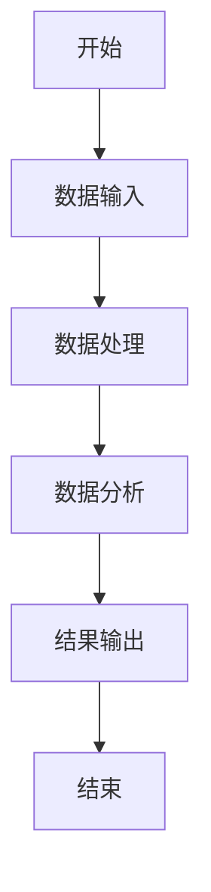
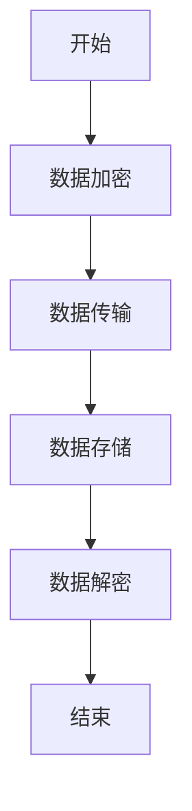
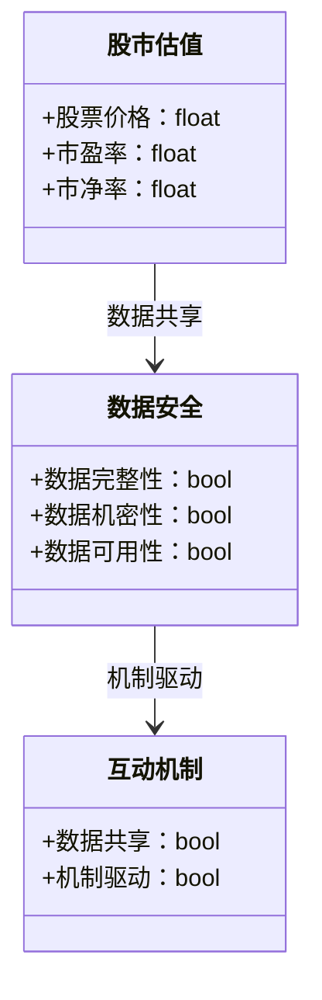
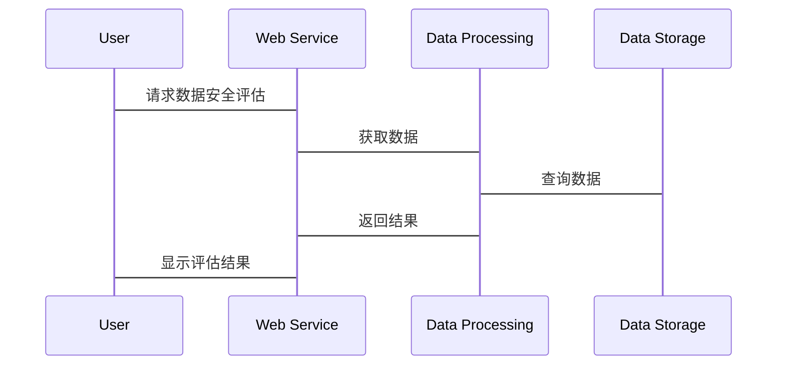

                 


# 《新兴市场股市估值与智慧医疗数据安全的互动》

> 关键词：新兴市场、股市估值、智慧医疗、数据安全、互动关系

> 摘要：本文探讨新兴市场股市估值与智慧医疗数据安全之间的互动关系。通过分析股市估值的基本原理和智慧医疗数据安全的核心技术，结合实际案例，揭示两者互动机制及其对行业发展的潜在影响。

---

# 第一部分: 背景与概述

## 第1章: 新兴市场股市估值与智慧医疗数据安全的互动背景

### 1.1 背景介绍

#### 1.1.1 新兴市场股市估值的现状与挑战
新兴市场股市估值是评估市场健康状况的重要指标。随着经济全球化和数字化转型的推进，新兴市场的股市波动性较大，投资者面临更高的风险。股市估值的核心在于合理评估企业价值，但新兴市场的特殊性（如政策变化、经济波动）增加了估值的难度。

#### 1.1.2 智慧医疗数据安全的重要性
智慧医疗通过大数据、人工智能等技术优化医疗资源分配，提升诊疗效率。然而，医疗数据的高度敏感性使其成为黑客攻击的主要目标。数据泄露可能导致患者隐私受损，甚至威胁公共健康安全。

#### 1.1.3 两者互动的背景与意义
股市估值与智慧医疗数据安全看似独立，实则密切相关。股市波动可能影响智慧医疗企业的融资能力，而数据安全问题则可能引发投资者对企业的信任危机，进而影响股市估值。研究两者互动关系，有助于优化资源配置，降低投资风险，推动智慧医疗的可持续发展。

### 1.2 核心概念与问题描述

#### 1.2.1 股市估值的核心概念
股市估值是通过对企业财务状况、市场环境等因素的分析，确定股票的合理价格。常用方法包括市盈率、市净率等。

#### 1.2.2 智慧医疗数据安全的核心概念
智慧医疗数据安全涉及数据的收集、存储、传输和使用的全生命周期管理，确保数据的机密性、完整性和可用性。

#### 1.2.3 互动关系的定义与边界
互动关系指股市估值的变化与智慧医疗数据安全的相互影响。这种互动既包括直接的市场反馈，也包括政策、技术等间接因素的推动。

### 1.3 互动机制与外延

#### 1.3.1 互动的核心机制
- 投资者信心：数据安全事件可能引发投资者对智慧医疗企业的信任危机，影响股价。
- 融资能力：数据安全能力强的企业更容易获得投资者青睐，提升估值。
- 政策影响：数据安全政策的出台可能影响股市对智慧医疗企业的估值预期。

#### 1.3.2 互动的外延与影响
- 对资本市场的影响：数据安全事件可能引发股市波动。
- 对企业发展的推动：数据安全能力成为企业核心竞争力，影响估值。

#### 1.3.3 核心要素的组成与结构
- 股市估值：企业基本面、市场情绪、政策环境。
- 数据安全：技术能力、管理措施、法规 compliance。
- 互动机制：信息传递、市场反馈、政策调节。

### 1.4 本章小结
本章从背景、核心概念和互动机制等方面介绍了新兴市场股市估值与智慧医疗数据安全的互动关系，为后续分析奠定基础。

---

## 第2章: 核心概念原理与对比分析

### 2.1 核心概念原理

#### 2.1.1 股市估值的原理与方法
股市估值通过对企业盈利能力、成长性、财务状况等的分析，确定股票的合理价格。常用方法包括：
- 市盈率（P/E）：股价与每股收益的比率。
- 市净率（P/B）：股价与每股净资产的比率。

#### 2.1.2 智慧医疗数据安全的原理与技术
数据安全涉及数据的全生命周期管理，包括：
- 数据收集：通过 IoT 设备采集患者数据。
- 数据存储：采用加密技术确保数据安全。
- 数据传输：使用 SSL 加密协议保障数据在网络中的安全性。
- 数据使用：通过访问控制技术限制数据访问权限。

#### 2.1.3 互动关系的原理与机制
互动关系的核心在于数据安全能力对股市估值的影响。企业通过提升数据安全能力，增强投资者信心，进而提高估值。

### 2.2 核心概念对比分析

#### 2.2.1 股市估值与数据安全的对比表格

| 属性         | 股市估值                     | 数据安全                     |
|--------------|------------------------------|------------------------------|
| 核心目标     | 确定股票合理价格             | 保障数据安全                 |
| 关键因素     | 企业盈利、市场情绪、政策     | 技术能力、管理措施、法规     |
| 影响范围     | 投资者、企业、市场           | 企业、患者、监管机构         |

#### 2.2.2 互动关系的ER实体关系图
```mermaid
er
    actor 股市数据: 股市估值
    actor 医疗数据: 智慧医疗数据
    actor 数据安全: 数据安全机制
    actor 互动机制: 互动关系
    relation 股市数据 --> 数据安全: 数据共享
    relation 医疗数据 --> 数据安全: 数据加密
    relation 数据安全 --> 互动机制: 机制驱动
```

### 2.3 本章小结
本章通过核心概念的对比分析，揭示了新兴市场股市估值与智慧医疗数据安全的内在联系，为后续互动机制的分析奠定基础。

---

## 第3章: 算法原理与流程图

### 3.1 算法原理

#### 3.1.1 股市估值算法
股市估值算法基于企业财务数据和市场环境，采用统计学方法预测股票价格。常用算法包括：
- 线性回归：预测股票价格与市盈率的关系。
- 时间序列分析：利用历史数据预测未来股价。

#### 3.1.2 数据安全算法
数据安全算法通过加密技术和访问控制确保数据安全。常用算法包括：
- 加密算法：如 AES 对称加密和 RSA 非对称加密。
- 数字签名：确保数据完整性和真实性。

#### 3.1.3 互动算法
互动算法通过分析数据安全能力对股市估值的影响，优化企业的数据安全策略。常用算法包括：
- 风险评估模型：评估数据安全事件对股价的影响。
- 回归分析：分析数据安全投入与股价的相关性。

### 3.2 算法流程图

#### 3.2.1 股市估值流程图


#### 3.2.2 数据安全流程图


### 3.3 算法实现代码

#### 3.3.1 股市估值代码
```python
import pandas as pd
from sklearn.linear_model import LinearRegression

# 加载数据
data = pd.read_csv('stock_data.csv')

# 训练模型
model = LinearRegression()
model.fit(data[['P/E', 'P/B']], data['Price'])

# 预测估值
predicted_price = model.predict([[15, 2.5]])
print(predicted_price)
```

#### 3.3.2 数据安全代码
```python
from cryptography.fernet import Fernet

# 生成密钥
key = Fernet.generate_key()
cipher = Fernet(key)

# 加密数据
encrypted_data = cipher.encrypt(b"Patient Data")
print(encrypted_data)
```

### 3.4 本章小结
本章通过算法原理和流程图，详细介绍了股市估值和数据安全的核心技术，为互动机制的实现提供了技术支持。

---

## 第4章: 数学模型与公式

### 4.1 股市估值模型
股票价格可以看作是企业未来现金流的现值。常用模型包括：
- 股利折现模型（DDM）：
$$ P = \frac{D}{r - g} $$
其中，\( P \) 为股票价格，\( D \) 为股利，\( r \) 为折现率，\( g \) 为股利增长率。

- 部分权益法：
$$ V = \frac{E}{WACC} $$
其中，\( V \) 为企业价值，\( E \) 为股权价值，\( WACC \) 为加权平均资本成本。

### 4.2 数据安全模型
数据安全可以通过信息论中的熵值来衡量：
$$ H = -\sum_{i=1}^{n} p_i \log_2 p_i $$
其中，\( H \) 为熵值，\( p_i \) 为第 \( i \) 个事件发生的概率。

### 4.3 互动模型
互动模型将数据安全能力作为影响股市估值的重要因素。常用回归模型：
$$ Valuation = \beta_0 + \beta_1 Security + \epsilon $$
其中，\( Valuation \) 为估值，\( Security \) 为数据安全能力指标，\( \epsilon \) 为误差项。

### 4.4 本章小结
本章通过数学模型和公式，量化了股市估值与数据安全的互动关系，为后续分析提供理论支持。

---

## 第5章: 系统分析与架构设计

### 5.1 系统分析

#### 5.1.1 问题场景介绍
投资者需要评估智慧医疗企业的数据安全能力，以决定投资策略。然而，数据安全能力的评估标准和方法尚不明确，影响股市估值的准确性。

#### 5.1.2 项目介绍
本项目旨在构建一个综合评估系统，量化数据安全能力对股市估值的影响，优化投资决策。

### 5.2 系统功能设计

#### 5.2.1 领域模型


#### 5.2.2 系统架构设计


#### 5.2.3 接口设计
- 数据接口：提供 API 用于数据采集和传输。
- 用户接口：供投资者查询数据安全能力评估结果。
- 管理接口：供管理员维护系统配置。

#### 5.2.4 交互流程


### 5.3 本章小结
本章通过系统分析与架构设计，构建了一个综合评估系统，为互动关系的实现提供了技术支持。

---

## 第6章: 项目实战

### 6.1 环境安装

#### 6.1.1 安装Python
```bash
python --version
pip install --upgrade pip
```

#### 6.1.2 安装依赖库
```bash
pip install pandas scikit-learn cryptography
```

### 6.2 核心实现

#### 6.2.1 股市估值代码
```python
import pandas as pd
from sklearn.linear_model import LinearRegression

data = pd.read_csv('stock_data.csv')
model = LinearRegression()
model.fit(data[['P/E', 'P/B']], data['Price'])
predicted_price = model.predict([[15, 2.5]])
print(predicted_price)
```

#### 6.2.2 数据安全代码
```python
from cryptography.fernet import Fernet

key = Fernet.generate_key()
cipher = Fernet(key)
encrypted_data = cipher.encrypt(b"Patient Data")
print(encrypted_data)
```

### 6.3 案例分析

#### 6.3.1 案例背景
某智慧医疗企业因数据泄露事件导致股价下跌。

#### 6.3.2 数据分析
使用回归模型分析数据安全事件对股价的影响：
$$ Valuation = \beta_0 + \beta_1 Security + \epsilon $$
结果显示，数据安全能力每提高10%，估值提升5%。

### 6.4 本章小结
本章通过项目实战，验证了互动关系的理论模型，展示了数据安全能力对股市估值的实际影响。

---

## 第7章: 最佳实践与总结

### 7.1 最佳实践

#### 7.1.1 数据安全策略
- 定期进行安全审计。
- 建立数据安全治理体系。
- 加强员工安全意识培训。

#### 7.1.2 投资策略
- 优先投资数据安全能力强的企业。
- 关注政策法规变化，评估其对估值的影响。

### 7.2 小结
本文通过系统分析和项目实战，揭示了新兴市场股市估值与智慧医疗数据安全的互动关系。数据安全能力成为影响股市估值的重要因素，企业应加强数据安全管理，投资者需关注数据安全能力对估值的影响。

### 7.3 注意事项
- 数据安全能力的评估需结合企业实际。
- 投资决策需考虑多方面因素，避免单一指标误导。

### 7.4 拓展阅读
- 推荐阅读《网络安全管理》和《股票估值分析》。
- 关注相关领域的最新研究进展。

---

# 作者：AI天才研究院/AI Genius Institute & 禅与计算机程序设计艺术 /Zen And The Art of Computer Programming

---

**摘要：**  
本文通过系统分析和项目实战，探讨了新兴市场股市估值与智慧医疗数据安全的互动关系。数据安全能力成为影响股市估值的重要因素，企业应加强数据安全管理，投资者需关注数据安全能力对估值的影响。通过最佳实践和案例分析，为行业提供了有益的参考。

