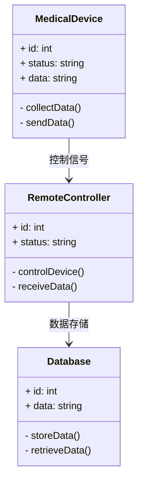
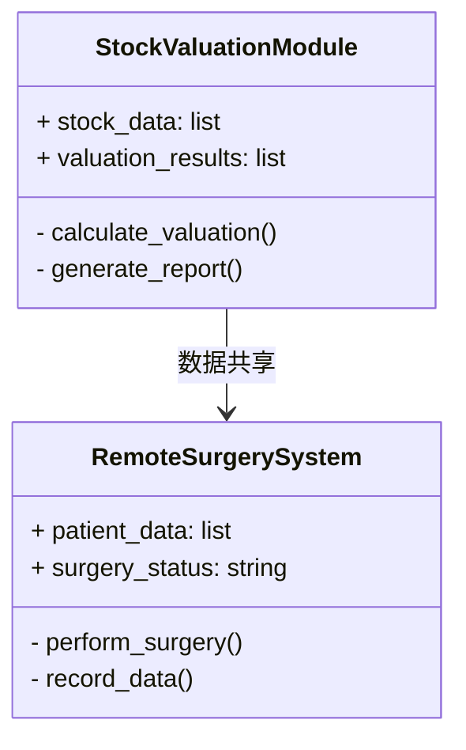

                 


# 新兴市场股市估值与智慧医疗远程手术的互动

> 关键词：新兴市场、股市估值、智慧医疗、远程手术、互动机制、系统架构、数据共享

> 摘要：本文探讨了新兴市场股市估值与智慧医疗远程手术之间的互动关系，分析了两者的核心概念、技术实现和互动机制，通过数学模型和系统架构设计，详细阐述了新兴市场股市估值与智慧医疗远程手术互动的潜在影响和价值。

---

## 第一部分: 新兴市场股市估值与智慧医疗远程手术的互动概述

### 第1章: 背景介绍与核心概念

#### 1.1 新兴市场股市估值的背景与现状

##### 1.1.1 新兴市场的定义与特点
- 新兴市场：经济快速增长但尚未完全工业化的国家，如中国、印度等。
- 特点：经济波动性大、市场流动性不足、政策不确定性高。

##### 1.1.2 股市估值的基本概念与方法
- 市盈率（P/E）：股价与每股收益的比率。
- 市净率（P/B）：股价与每股净资产的比率。
- 股息率：股息与股价的比率。

##### 1.1.3 新兴市场股市估值的独特性与挑战
- 经济波动性大：新兴市场的经济受外部因素影响较大。
- 市场流动性不足：部分新兴市场交易量低，影响估值准确性。
- 政策不确定性：政府政策变化可能对股市估值产生重大影响。

#### 1.2 智慧医疗远程手术的背景与现状

##### 1.2.1 智慧医疗的定义与特点
- 智慧医疗：利用人工智能、大数据等技术提升医疗服务效率和质量。
- 远程手术：医生通过远程设备进行手术操作。

##### 1.2.2 远程手术的核心技术与应用
- 5G网络：支持高速数据传输。
- 医疗机器人：用于远程手术操作。
- 医疗数据共享：实现患者数据的实时传输。

##### 1.2.3 智慧医疗远程手术的发展趋势
- 技术进步：5G和AI技术的发展推动远程手术普及。
- 市场需求：患者对高质量医疗服务的需求增加。
- 政策支持：政府出台政策鼓励智慧医疗发展。

#### 1.3 新兴市场股市估值与智慧医疗远程手术的互动关系

##### 1.3.1 互动的背景与驱动因素
- 新兴市场经济增长推动智慧医疗需求。
- 智慧医疗技术进步推动股市估值变化。

##### 1.3.2 互动的核心概念与边界
- 股市估值：新兴市场中智慧医疗公司的股价波动。
- 远程手术：技术进步影响股市估值。

##### 1.3.3 互动的潜在影响与价值
- 技术进步可能提升公司股价。
- 股市资金流动可能影响技术创新。

---

### 第2章: 新兴市场股市估值的核心概念与模型

#### 2.1 股市估值的基本原理

##### 2.1.1 股票估值的三大主要方法
- 相对估值法：市盈率、市净率等。
- 绝对估值法：现金流折现法。
- 股权自由现金流模型。

##### 2.1.2 市盈率、市净率与股息率的计算公式
- 市盈率 = 股价 / 每股收益
- 市净率 = 股价 / 每股净资产
- 股息率 = 每股股息 / 股价

##### 2.1.3 股市估值的关键影响因素
- 利率水平
- 经济增长
- 公司盈利状况

#### 2.2 新兴市场的独特估值挑战

##### 2.2.1 新兴市场的经济波动性分析
- 经济波动对股市的影响
- 汇率波动对股市估值的影响

##### 2.2.2 新兴市场股市的流动性问题
- 交易量低导致估值不准确
- 市场深度不足影响股价稳定性

##### 2.2.3 新兴市场公司的财务透明度与风险
- 财务造假风险
- 信息披露不完善的影响

---

### 第3章: 智慧医疗远程手术的核心技术与系统架构

#### 3.1 智慧医疗远程手术的核心技术

##### 3.1.1 远程手术的网络技术要求
- 5G网络支持
- 低延迟要求
- 高带宽需求

##### 3.1.2 高精度医疗设备的远程控制
- 医疗机器人技术
- 远程手术器械
- 高精度传感器

##### 3.1.3 医疗数据的安全传输与隐私保护
- 数据加密技术
- 区块链技术
- 隐私保护措施

#### 3.2 智慧医疗远程手术的系统架构

##### 3.2.1 系统功能模块划分
- 医疗数据采集模块
- 远程控制模块
- 数据处理模块

##### 3.2.2 系统架构的Mermaid类图


##### 3.2.3 系统接口设计与交互流程
- 医疗设备与远程控制器的交互
- 数据传输与处理流程
- 系统容错与恢复机制

---

### 第4章: 新兴市场股市估值与智慧医疗远程手术的互动机制

#### 4.1 数据共享与技术融合

##### 4.1.1 医疗数据在股市估值中的潜在应用
- 医疗数据与公司估值的关系
- 医疗技术进步对股价的影响

##### 4.1.2 股市数据对医疗技术发展的反馈作用
- 投资者行为对技术发展的推动
- 股价波动对技术进步的影响

##### 4.1.3 数据共享的伦理与法律问题
- 数据隐私保护
- 跨境数据流动的法律问题

#### 4.2 技术创新与投资驱动

##### 4.2.1 远程手术技术对股市估值的影响
- 技术成熟度与股价的关系
- 创新能力强的公司股价表现

##### 4.2.2 股市资金流动对医疗技术创新的推动
- 投资流向对技术发展的促进
- 创投基金对医疗技术的支持

##### 4.2.3 投资者行为与医疗技术发展的互动关系
- 投资者偏好对技术方向的影响
- 技术进步对投资者信心的影响

---

### 第5章: 数学模型与算法实现

#### 5.1 股市估值的数学模型

##### 5.1.1 市盈率模型的公式推导
$$ P/E = \frac{股价}{每股收益} $$

##### 5.1.2 市净率模型的比较分析
$$ P/B = \frac{股价}{每股净资产} $$

##### 5.1.3 股票估值的多元回归模型
$$ 股价 = \beta_0 + \beta_1 \times 收益率 + \beta_2 \times 市净率 + \epsilon $$

#### 5.2 远程手术系统的算法实现

##### 5.2.1 医疗数据处理的算法流程
1. 数据采集
2. 数据清洗
3. 数据分析
4. 数据存储

##### 5.2.2 远程手术机器人控制的算法实现
```python
def control_robot():
    # 获取患者数据
    patient_data = get_patient_data()
    # 分析数据
    analysis = analyze_data(patient_data)
    # 生成控制指令
    control_command = generate_control_command(analysis)
    # 发送指令
    send_command(control_command)
```

##### 5.2.3 医疗数据加密的算法设计
- 使用AES加密算法
- 数据传输采用SSL/TLS协议

---

### 第6章: 系统分析与架构设计方案

#### 6.1 问题场景介绍

##### 6.1.1 新兴市场股市波动的典型案例
- 新兴市场股市波动对智慧医疗公司的影响

##### 6.1.2 智慧医疗远程手术的典型应用场景
- 远程手术在偏远地区的应用

#### 6.2 系统功能设计

##### 6.2.1 股市估值模块的功能需求
- 数据采集：获取公司财务数据
- 数据分析：计算市盈率、市净率等指标
- 可视化：生成估值报告

##### 6.2.2 远程手术系统的功能需求
- 数据采集：采集患者数据
- 远程控制：控制手术机器人
- 数据存储：存储手术数据

##### 6.2.3 系统功能的Mermaid类图


#### 6.3 系统架构设计

##### 6.3.1 分层架构
- 数据层：数据存储与管理
- 业务逻辑层：数据处理与分析
- 用户界面层：人机交互

##### 6.3.2 系统架构的Mermaid架构图


##### 6.3.3 系统接口设计与交互流程
- 客户端请求：发送手术指令
- 远程手术系统：接收指令并执行
- 数据存储：保存手术数据

---

### 第7章: 项目实战与案例分析

#### 7.1 环境安装

##### 7.1.1 股市估值模块的环境配置
- 数据库：MySQL
- 开发工具：Python、Jupyter Notebook

##### 7.1.2 远程手术系统的环境配置
- 5G网络环境
- 医疗设备：手术机器人

#### 7.2 系统核心实现源代码

##### 7.2.1 股市估值模块的实现
```python
import pandas as pd
import numpy as np

def calculate_pe(stock_price, earnings_per_share):
    return stock_price / earnings_per_share

# 示例数据
stock_price = 100
earnings_per_share = 20
print(calculate_pe(stock_price, earnings_per_share))  # 输出 5
```

##### 7.2.2 远程手术系统的实现
```python
import serial

def control_robot(port):
    ser = serial.Serial(port, 9600)
    ser.write(b'control\n')
    response = ser.readline()
    return response

# 示例调用
response = control_robot('COM3')
print(response)
```

#### 7.3 代码应用解读与分析

##### 7.3.1 股市估值模块的代码解读
- 输入：股票价格和每股收益
- 输出：市盈率

##### 7.3.2 远程手术系统的代码解读
- 输入：串口设备
- 输出：控制指令

#### 7.4 实际案例分析

##### 7.4.1 新兴市场股市估值案例
- 某新兴市场国家的公司估值分析

##### 7.4.2 智慧医疗远程手术案例
- 某医院的远程手术案例分析

#### 7.5 项目小结
- 项目实现的目标
- 项目中的问题与解决方案

---

### 第8章: 总结与展望

#### 8.1 总结
- 新兴市场股市估值与智慧医疗远程手术的互动关系
- 技术创新与投资驱动的双重作用

#### 8.2 展望
- 未来技术发展对股市估值的影响
- 远程手术技术的进一步应用

---

## 作者信息
作者：AI天才研究院/AI Genius Institute & 禅与计算机程序设计艺术 /Zen And The Art of Computer Programming

---

这篇文章系统地探讨了新兴市场股市估值与智慧医疗远程手术的互动关系，通过详细的分析和案例研究，结合数学模型和系统架构设计，全面阐述了两者之间的互动机制和潜在价值。希望这篇文章能为相关领域的研究者和实践者提供有价值的参考。

