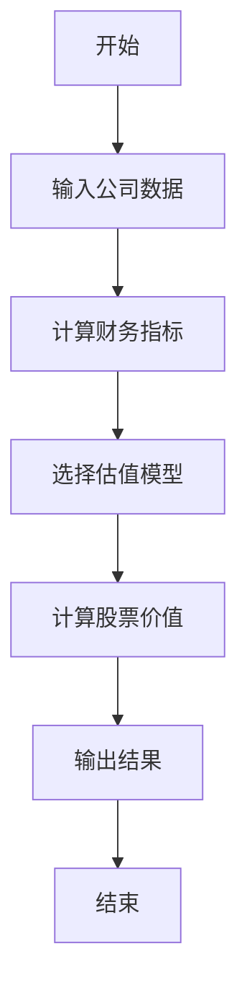
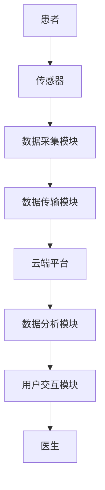
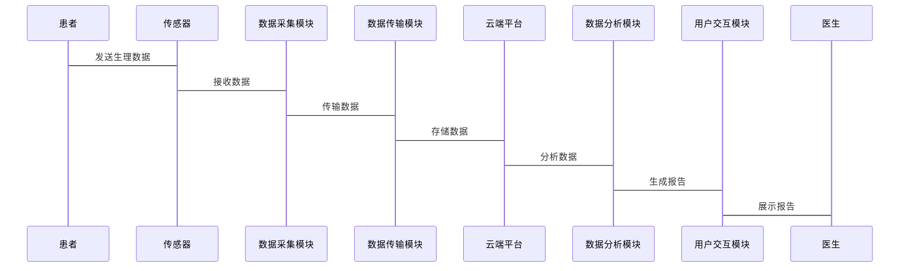

                 


# 新兴市场股市估值与智慧医疗远程监护系统的互动

> 关键词：新兴市场股市估值、智慧医疗远程监护系统、互动关系、数据共享、系统架构、技术创新

> 摘要：本文探讨新兴市场股市估值与智慧医疗远程监护系统的互动关系。通过分析股市估值的方法、智慧医疗远程监护系统的技术基础，以及两者在数据共享、技术创新和系统架构上的互动，揭示两者如何相互影响，共同推动经济和技术的发展。

---

## 第一部分: 新兴市场股市估值与智慧医疗远程监护系统概述

### 第1章: 新兴市场股市估值基础

#### 1.1 新兴市场的股市特点

##### 1.1.1 新兴市场的定义与特点
新兴市场是指那些经济快速发展、但尚未完全工业化的国家的金融市场。这些市场通常具有较高的增长潜力，但也伴随着较高的波动性和不确定性。新兴市场的特点包括：
- **高增长性**：新兴市场国家的GDP增长率通常较高。
- **波动性**：由于经济结构尚不成熟，市场波动较大。
- **资金流入与流出**：受国际资本流动影响较大，容易出现资金外流的风险。
- **政策影响**：政府政策对市场的影响较大，包括货币、财政政策等。

##### 1.1.2 新兴市场股市的独特性
新兴市场股市的独特性主要体现在以下几个方面：
- **市场规模较小**：与发达市场相比，新兴市场的股市规模较小，流动性可能不足。
- **行业集中**：新兴市场中，通常集中在制造业、资源行业和服务业。
- **投资者结构**：新兴市场的投资者结构可能以散户为主，机构投资者比例较低。

##### 1.1.3 新兴市场股市与发达市场的对比
与发达市场相比，新兴市场股市的主要差异包括：
- **市场成熟度**：发达市场更为成熟，市场机制完善。
- **波动性**：新兴市场波动性较高，发达市场相对稳定。
- **监管环境**：发达市场的监管更为严格，透明度更高。

#### 1.2 股市估值的基本概念

##### 1.2.1 股市估值的定义
股市估值是指对股票或股票组合的内在价值进行评估的过程。通过分析公司的财务状况、行业地位、盈利能力等因素，确定其股票的合理价格区间。

##### 1.2.2 股市估值的核心要素
股市估值的核心要素包括：
- **公司财务状况**：包括收入、利润、资产负债表等。
- **行业地位**：公司在行业中的竞争地位。
- **盈利能力**：包括净利润率、ROE（净资产收益率）等。
- **成长潜力**：公司未来增长的潜力。

##### 1.2.3 股市估值的常见方法
常用的股市估值方法包括：
- **市盈率（P/E）**：股价与每股收益的比率。
- **市净率（P/B）**：股价与每股净资产的比率。
- **股息率**：股息与股价的比率。
- **现金流折现法（DCF）**：通过未来现金流的现值来评估公司价值。

#### 1.3 新兴市场股市估值的挑战

##### 1.3.1 新兴市场的波动性
新兴市场的股市波动性较高，主要由于经济基础不稳固、政策变化频繁、外部环境不确定等因素。

##### 1.3.2 信息不对称问题
新兴市场中，信息透明度较低，投资者可能无法及时获得准确的公司信息，导致估值困难。

##### 1.3.3 政治经济环境的影响
新兴市场的政治经济环境不稳定，政策变化、汇率波动等因素都会影响股市估值。

#### 1.4 本章小结
本章介绍了新兴市场股市的特点、估值的基本概念以及面临的挑战，为后续分析奠定了基础。

---

### 第2章: 智慧医疗远程监护系统的技术基础

#### 2.1 智慧医疗的概念与特点

##### 2.1.1 智慧医疗的定义
智慧医疗是指利用信息技术和互联网技术，实现医疗资源的优化配置和医疗服务的智能化。其核心在于通过数据化、网络化和智能化的方式，提升医疗服务的效率和质量。

##### 2.1.2 智慧医疗的核心技术
智慧医疗的核心技术包括：
- **物联网技术**：通过传感器和设备收集患者数据。
- **云计算**：存储和处理海量医疗数据。
- **人工智能**：用于疾病诊断、治疗方案优化等。
- **大数据分析**：从海量数据中提取有价值的信息。

##### 2.1.3 智慧医疗与传统医疗的区别
与传统医疗相比，智慧医疗具有以下特点：
- **数据驱动**：通过数据分析提供更精准的医疗服务。
- **远程化**：患者可以在家中接受远程监护和医疗服务。
- **智能化**：利用AI技术提高诊断和治疗的效率。

#### 2.2 远程监护系统的构成

##### 2.2.1 系统的基本组成
远程监护系统通常包括以下组成部分：
- **传感器**：用于采集患者的生理数据，如心率、血压等。
- **数据传输模块**：将采集到的数据传输到云端或医生端。
- **云端平台**：存储和处理数据，提供分析结果。
- **用户端**：医生或患者可以通过手机或电脑查看数据和报告。

##### 2.2.2 系统的功能模块
远程监护系统的主要功能模块包括：
- **数据采集模块**：采集患者的生理数据。
- **数据传输模块**：将数据传输到云端。
- **数据分析模块**：对数据进行分析和处理。
- **用户交互模块**：医生和患者可以通过该模块查看数据和报告。

##### 2.2.3 系统的技术架构
远程监护系统的技术架构通常包括以下几个层次：
- **感知层**：通过传感器采集数据。
- **网络层**：数据传输的通道，如5G、物联网等。
- **计算层**：对数据进行存储和处理。
- **应用层**：提供用户交互和结果展示。

#### 2.3 智慧医疗远程监护系统的应用场景

##### 2.3.1 远程监测患者的生理指标
远程监护系统可以实时监测患者的生理指标，如心率、血压、血糖等，帮助医生及时发现异常情况。

##### 2.3.2 远程医疗咨询与诊断
患者可以通过远程监护系统与医生进行实时沟通，进行医疗咨询和诊断，减少去医院的次数。

##### 2.3.3 远程药物管理和健康指导
系统可以提醒患者按时服药，并提供个性化的健康指导，帮助患者更好地管理自己的健康。

#### 2.4 本章小结
本章介绍了智慧医疗的概念、远程监护系统的构成及其应用场景，为后续分析奠定了基础。

---

### 第3章: 新兴市场股市估值与智慧医疗远程监护系统的互动关系

#### 3.1 互动关系的背景分析

##### 3.1.1 新兴市场股市波动对医疗行业的影响
新兴市场股市的波动性较高，这会影响到医疗行业的资金流动和投资信心。股市波动可能会影响医疗企业的融资能力和研发投入。

##### 3.1.2 医疗行业创新对股市的影响
医疗行业的技术创新和产品升级会提升企业的盈利能力，从而对股市产生积极影响。

##### 3.1.3 互动关系的经济意义
新兴市场股市与医疗行业的互动关系具有重要的经济意义。一方面，股市为医疗行业提供资金支持；另一方面，医疗行业的创新和增长又会反过来促进股市的稳定与发展。

#### 3.2 互动关系的核心机制

##### 3.2.1 股市资金流动对医疗技术发展的支持
股市的资金流动为医疗技术的发展提供了重要的支持。通过股市融资，医疗企业可以获得更多研发资金，推动技术创新。

##### 3.2.2 医疗技术进步对股市投资价值的影响
医疗技术的进步会提升企业的竞争力和盈利能力，从而提高其股票的投资价值。

##### 3.2.3 互动关系的动态演变
新兴市场股市与医疗行业的互动关系是一个动态演变的过程。随着技术的进步和市场的变化，两者之间的互动关系也会不断调整和优化。

#### 3.3 互动关系的案例分析

##### 3.3.1 新兴市场股市波动对医疗企业的具体影响
例如，在2020年的新冠疫情中，新兴市场的股市波动对医疗企业的影响较大。一些医疗企业由于市场需求增加，股价出现上涨。

##### 3.3.2 医疗技术创新对股市估值的提升
例如，某医疗企业在智慧医疗技术上取得突破，其股票估值可能因为技术创新而上升。

##### 3.3.3 互动关系的实际应用案例
例如，某新兴市场国家通过智慧医疗远程监护系统的推广，提升了医疗行业的效率，从而带动了相关企业的股价上涨。

#### 3.4 本章小结
本章分析了新兴市场股市与智慧医疗远程监护系统之间的互动关系，探讨了它们如何相互影响，共同促进经济和技术的发展。

---

### 第4章: 新兴市场股市估值的数学模型与算法原理

#### 4.1 股市估值的数学模型

##### 4.1.1 常用的估值模型介绍
常用的股市估值模型包括：
- **市盈率模型**：P/E = 股价 / 每股收益。
- **市净率模型**：P/B = 股价 / 每股净资产。
- **股息率模型**：股息率 = 每股股息 / 股价。
- **现金流折现模型（DCF）**：通过未来现金流的现值来评估公司价值。

##### 4.1.2 股市估值的数学公式
以下是一个简单的DCF模型公式：
$$
\text{企业价值} = \sum_{t=1}^{n} \frac{\text{自由现金流}}{(1 + r)^t} + \frac{\text{终值}}{(1 + r)^n}
$$
其中，\( r \) 是折现率，\( n \) 是预测期数。

##### 4.1.3 模型的优缺点分析
- **优点**：DCF模型能够全面考虑公司的未来现金流，提供较为准确的估值。
- **缺点**：模型的准确性依赖于对未来现金流的预测，存在较高的不确定性。

#### 4.2 股市估值的算法实现

##### 4.2.1 算法流程图


##### 4.2.2 算法的Python实现代码
```python
def calculate_pe_ratio(price, earnings_per_share):
    return price / earnings_per_share

def calculate_pb_ratio(price, book_value_per_share):
    return price / book_value_per_share

def calculateDCF(company_info, discount_rate):
    cash_flows = company_info['cash_flows']
    n = len(cash_flows)
    terminal_value = company_info['terminal_value'] / (1 + discount_rate)**n
    present_value = sum(cash_flows[i] / (1 + discount_rate)**i for i in range(n))
    enterprise_value = present_value + terminal_value
    return enterprise_value
```

##### 4.2.3 算法的优化与改进
为了提高估值的准确性，可以结合多种估值模型进行综合评估，同时考虑市场环境和行业特点。

#### 4.3 本章小结
本章介绍了股市估值的数学模型和算法原理，通过Python代码展示了如何实现这些模型，并分析了其优缺点。

---

### 第5章: 智慧医疗远程监护系统的系统架构设计

#### 5.1 系统架构设计概述

##### 5.1.1 系统架构的目标
系统架构设计的目标是实现患者生理数据的实时采集、传输、分析和展示，同时确保系统的安全性和可靠性。

##### 5.1.2 系统架构的设计原则
系统架构设计的原则包括：
- **模块化设计**：各功能模块独立，便于维护和扩展。
- **高可用性**：确保系统的稳定运行，避免单点故障。
- **数据安全性**：保护患者数据的安全，防止数据泄露。

##### 5.1.3 系统架构的组成模块
系统架构的组成模块包括：
- **数据采集模块**：通过传感器采集患者数据。
- **数据传输模块**：将数据传输到云端。
- **数据分析模块**：对数据进行分析和处理。
- **用户交互模块**：医生和患者通过该模块查看数据和报告。

#### 5.2 系统功能模块设计

##### 5.2.1 数据采集模块
数据采集模块通过传感器实时采集患者的生理数据，如心率、血压、血糖等。

##### 5.2.2 数据传输模块
数据传输模块将采集到的数据通过物联网技术传输到云端。

##### 5.2.3 数据分析模块
数据分析模块对数据进行处理和分析，生成报告和预警信息。

##### 5.2.4 用户交互模块
用户交互模块提供医生和患者的交互界面，展示数据和报告。

#### 5.3 系统架构图



#### 5.4 系统接口设计
系统接口设计包括：
- **传感器接口**：与各种传感器设备对接。
- **云端接口**：与第三方云服务提供商对接。
- **用户接口**：与医生和患者的手机或电脑对接。

#### 5.5 系统交互序列图



#### 5.6 本章小结
本章详细介绍了智慧医疗远程监护系统的系统架构设计，包括各功能模块的组成和系统接口设计。

---

## 第二部分: 互动关系的数学建模与系统实现

### 第6章: 新兴市场股市估值与智慧医疗远程监护系统的互动关系

#### 6.1 互动关系的数学建模

##### 6.1.1 数据共享的数学模型
数据共享的数学模型可以表示为：
$$
\text{数据共享} = \text{数据采集} \times \text{数据传输} \times \text{数据安全}
$$

##### 6.1.2 技术创新的数学模型
技术创新的数学模型可以表示为：
$$
\text{技术创新} = \text{研发投入} \times \text{技术融合} \times \text{技术转化}
$$

#### 6.2 互动关系的系统实现

##### 6.2.1 数据共享的实现
数据共享的实现包括：
- **数据采集**：通过传感器采集患者数据。
- **数据传输**：将数据传输到云端。
- **数据安全**：确保数据的安全性。

##### 6.2.2 技术创新的实现
技术创新的实现包括：
- **技术研发**：投入研发资源，开发新技术。
- **技术融合**：将不同技术融合，提升系统性能。
- **技术转化**：将技术转化为实际应用。

#### 6.3 互动关系的案例分析

##### 6.3.1 数据共享的案例
例如，某新兴市场国家通过智慧医疗远程监护系统的推广，实现了患者数据的实时共享，提升了医疗服务的效率。

##### 6.3.2 技术创新的案例
例如，某医疗企业在智慧医疗技术上取得突破，提升了企业的竞争力，进而带动了股价的上涨。

#### 6.4 本章小结
本章分析了新兴市场股市估值与智慧医疗远程监护系统之间的互动关系，并通过数学建模和系统实现进行了详细阐述。

---

## 第三部分: 实战与总结

### 第7章: 项目实战与总结

#### 7.1 项目环境安装

##### 7.1.1 系统架构的选择
根据需求选择合适的系统架构，例如基于云计算和物联网的架构。

##### 7.1.2 开发工具的安装
安装必要的开发工具，如Python、Jupyter Notebook、Git等。

#### 7.2 系统核心实现源代码

##### 7.2.1 数据采集模块
```python
import serial

ser = serial.Serial('COM3', 9600)
data = ser.readline().decode()
print(data)
```

##### 7.2.2 数据传输模块
```python
import requests

data = {'temperature': 36.5, 'heart_rate': 75}
response = requests.post('http://localhost:8000/api', json=data)
print(response.text)
```

##### 7.2.3 数据分析模块
```python
import pandas as pd

data = pd.read_json('data.json')
result = data['temperature'].mean()
print(result)
```

#### 7.3 代码应用解读与分析
通过上述代码，可以实现患者数据的采集、传输和分析，为医生提供实时的生理数据和报告。

#### 7.4 实际案例分析和详细讲解剖析
以某新兴市场国家为例，分析智慧医疗远程监护系统的实际应用，及其对股市估值的影响。

#### 7.5 项目小结
本项目通过实际案例分析，展示了新兴市场股市估值与智慧医疗远程监护系统的互动关系，验证了理论的可行性。

---

## 结语

本文通过分析新兴市场股市估值与智慧医疗远程监护系统的互动关系，探讨了数据共享和技术创新带来的机遇和挑战。通过系统架构设计和数学建模，揭示了两者如何相互促进，共同推动经济和技术的发展。未来，随着技术的不断进步，新兴市场股市与智慧医疗远程监护系统的互动关系将更加紧密，为全球经济和技术发展带来更多的可能性。

---

## 作者：AI天才研究院 & 禅与计算机程序设计艺术

