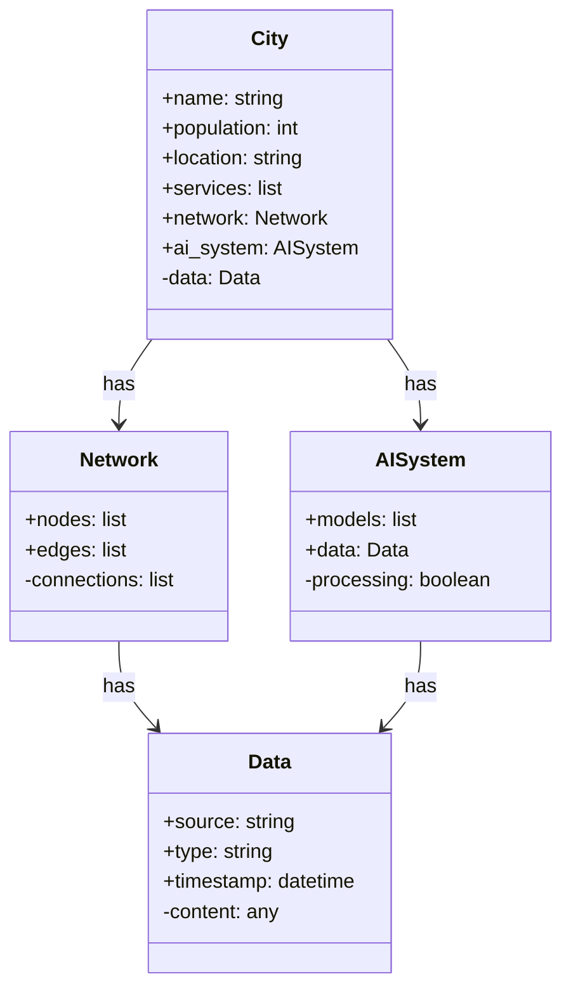
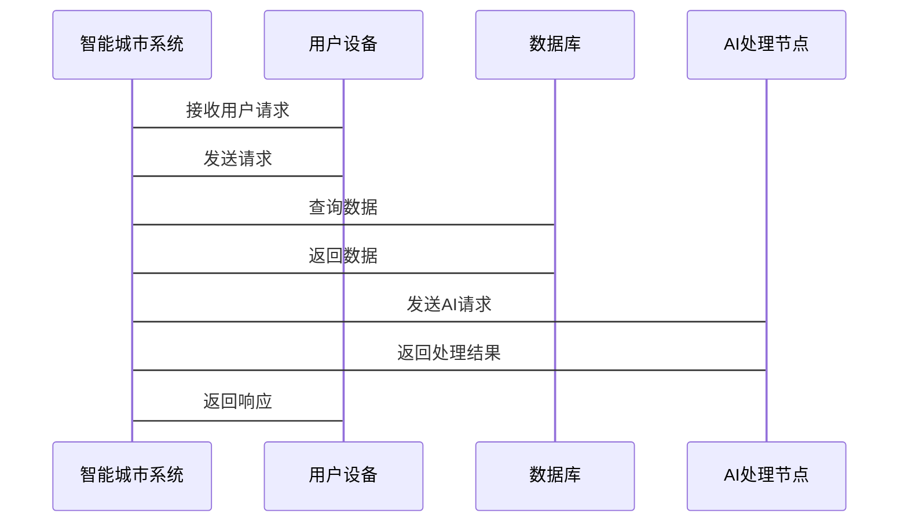

                 


# 新兴市场股市估值与智慧城市5G+AI应用的互动

> 关键词：新兴市场，股市估值，智慧城市，5G，人工智能，技术互动

> 摘要：本文探讨新兴市场股市估值与智慧城市中5G+AI应用的互动关系，分析两者如何相互影响，推动经济和社会的发展。

## 第一部分: 背景与概念

### 第1章: 新兴市场股市估值的背景与概念

#### 1.1 新兴市场的定义与特点
- 新兴市场的定义
- 经济特征
- 与发达国家市场的区别

#### 1.2 股市估值的基本概念
- 股市估值的定义
- 核心指标
- 估值方法

#### 1.3 智慧城市与5G+AI的定义与特点
- 智慧城市的定义
- 5G技术的核心特征
- AI技术的核心特征

### 第2章: 新兴市场股市估值与智慧城市5G+AI应用的互动关系

#### 2.1 股市估值与智慧城市的关系
- 股市估值对智慧城市建设的影响
- 智慧城市建设对股市估值的反作用

#### 2.2 5G与AI在智慧城市建设中的应用
- 5G技术的应用场景
- AI技术的应用场景

#### 2.3 新兴市场中5G+AI应用的互动机制
- 5G+AI的协同效应
- 应用互动模式

## 第二部分: 核心概念与原理

### 第3章: 新兴市场股市估值的核心概念与原理

#### 3.1 股市估值的核心概念
- 股票价值
- 价格形成机制
- 市场波动性

#### 3.2 估值方法
- 市盈率法
- 市净率法
- 现金流折现法

#### 3.3 新兴市场的特殊性
- 高波动性
- 信息不对称
- 政策影响

### 第4章: 智慧城市5G+AI应用的核心概念与原理

#### 4.1 智慧城市的核心概念
- 定义
- 组成部分
- 建设目标

#### 4.2 5G技术的核心原理
- 5G的定义
- 关键技术
- 应用场景

#### 4.3 AI技术的核心原理
- AI的定义
- 核心技术
- 应用场景

## 第三部分: 算法原理

### 第5章: 股市估值算法原理

#### 5.1 CAPM模型
- 数学公式
- 代码实现

#### 5.2 市盈率模型
- 数学公式
- 代码实现

### 第6章: AI在智慧城市中的应用算法

#### 6.1 机器学习算法
- 数学公式
- 代码实现

#### 6.2 深度学习算法
- 数学公式
- 代码实现

## 第四部分: 系统分析与架构设计

### 第7章: 智慧城市系统架构

#### 7.1 系统功能设计
- 领域模型类图（Mermaid）

#### 7.2 系统架构设计
- 架构图（Mermaid）

#### 7.3 系统接口设计
- 接口设计

#### 7.4 系统交互流程
- 序列图（Mermaid）

## 第五部分: 项目实战

### 第8章: 新兴市场中的5G+AI应用案例

#### 8.1 环境安装
- 代码环境
- 数据库安装

#### 8.2 核心代码实现
- 代码实现
- 代码解读

#### 8.3 案例分析
- 实际案例
- 数据分析

#### 8.4 项目总结
- 项目小结
- 经验总结

## 第六部分: 总结与展望

### 第9章: 总结

#### 9.1 全文总结
- 核心观点
- 主要结论

### 第10章: 展望

#### 10.1 未来研究方向
- 新兴市场股市估值的进一步研究
- 智慧城市中5G+AI的创新应用

## 作者：AI天才研究院/AI Genius Institute & 禅与计算机程序设计艺术/Zen And The Art of Computer Programming

---

# 摘要

本文探讨新兴市场股市估值与智慧城市中5G+AI应用的互动关系，分析两者如何相互影响，推动经济和社会的发展。文章从核心概念、算法原理、系统架构到项目实战，全面解析两者的互动机制，为读者提供深入的技术见解和实际应用案例。

---

# 第1章: 新兴市场股市估值的背景与概念

## 1.1 新兴市场的定义与特点

### 1.1.1 新兴市场的定义

新兴市场通常指那些经济快速发展但尚未达到发达国家水平的国家。这些市场具有较高的增长潜力，但也伴随着较高的风险。

### 1.1.2 新兴市场的经济特征

- 高速经济增长
- 多样化的产业结构
- 不同程度的政府干预

### 1.1.3 新兴市场与发达国家市场的区别

- 经济发展阶段不同
- 市场规模不同
- 风险与机会并存

## 1.2 股市估值的基本概念

### 1.2.1 股市估值的定义

股市估值是通过对公司财务数据和市场因素的分析，来确定股票的内在价值或市场价格的过程。

### 1.2.2 股市估值的核心指标

- 市盈率（P/E ratio）
- 市净率（P/B ratio）
- 净资产收益率（ROE）

### 1.2.3 股市估值的常见方法

- 市盈率法
- 现金流折现法
- 市净率法

## 1.3 智慧城市与5G+AI的定义与特点

### 1.3.1 智慧城市的定义

智慧城市是指通过先进信息技术的运用，提高城市资源利用效率，改善居民生活质量的城市发展模式。

### 1.3.2 5G技术的核心特征

- 高速数据传输
- 大规模设备连接
- 低延迟

### 1.3.3 AI技术的核心特征

- 数据驱动
- 自动学习
- 智能决策

---

# 第2章: 新兴市场股市估值与智慧城市5G+AI应用的互动关系

## 2.1 股市估值与智慧城市的关系

### 2.1.1 股市估值对智慧城市建设的影响

股市估值影响投资者对智慧城市相关公司的信心，进而影响投资资金的流入。

### 2.1.2 智慧城市建设对股市估值的反作用

智慧城市建设的进展能够提升相关公司的业绩，从而影响其股票估值。

## 2.2 5G与AI在智慧城市建设中的应用

### 2.2.1 5G技术在智慧城市中的应用场景

- 智能交通管理
- 物联网数据传输
- 高清视频传输

### 2.2.2 AI技术在智慧城市中的应用场景

- 智能监控与安防
- 智能城市管理
- 智能公共服务

## 2.3 新兴市场中5G+AI应用的互动机制

### 2.3.1 5G+AI在新兴市场中的协同效应

5G技术为AI应用提供了高速的数据传输通道，而AI技术则通过数据分析优化5G网络的使用效率。

### 2.3.2 新兴市场中5G+AI应用的互动模式

- 技术协同
- 数据共享
- 服务整合

---

# 第3章: 新兴市场股市估值的核心概念与原理

## 3.1 股市估值的核心概念

### 3.1.1 股票价值的定义

股票价值是基于公司未来现金流的现值，反映了公司的内在价值。

### 3.1.2 股票价格的形成机制

股票价格由市场供需关系决定，受多种因素影响，包括公司业绩、宏观经济环境、市场情绪等。

### 3.1.3 股票市场的波动性

股票市场具有波动性，价格会在短时间内上下波动，受多种因素影响。

## 3.2 股市估值的主要方法

### 3.2.1 市盈率法

市盈率法通过比较股票的市盈率与行业平均水平，来判断股票是否被高估或低估。

### 3.2.2 市净率法

市净率法通过比较股票的市净率与行业平均水平，来判断股票是否被高估或低估。

### 3.2.3 现金流折现法

现金流折现法通过将公司未来现金流折现，计算股票的内在价值。

## 3.3 新兴市场股市估值的特殊性

### 3.3.1 新兴市场的高波动性

新兴市场的股市波动较大，受宏观经济和政策影响显著。

### 3.3.2 新兴市场的信息不对称问题

新兴市场公司信息披露不完善，投资者面临较高的信息不对称风险。

### 3.3.3 新兴市场的政策影响

政府政策的变化对新兴市场的股市估值有重要影响，包括货币政策、财政政策等。

---

# 第4章: 智慧城市5G+AI应用的核心概念与原理

## 4.1 智慧城市的核心概念

### 4.1.1 智慧城市的定义

智慧城市是指通过先进信息技术的运用，提高城市资源利用效率，改善居民生活质量的城市发展模式。

### 4.1.2 智慧城市的组成部分

- 智能交通系统
- 智能能源系统
- 智能公共安全系统

### 4.1.3 智慧城市的建设目标

- 提高城市管理效率
- 改善居民生活质量
- 促进可持续发展

## 4.2 5G技术的核心原理

### 4.2.1 5G技术的定义

5G技术是第五代移动通信技术，具有高速度、低延迟和大规模设备连接的特点。

### 4.2.2 5G技术的核心特征

- 高速数据传输
- 大规模设备连接
- 低延迟

### 4.2.3 5G技术的应用场景

- 智能交通管理
- 物联网数据传输
- 高清视频传输

## 4.3 AI技术的核心原理

### 4.3.1 AI技术的定义

人工智能技术是指通过模拟人类智能的思维方式，实现自动化决策和问题解决的技术。

### 4.3.2 AI技术的核心特征

- 数据驱动
- 自动学习
- 智能决策

### 4.3.3 AI技术的应用场景

- 智能监控与安防
- 智能城市管理
- 智能公共服务

---

# 第5章: 股市估值算法原理

## 5.1 CAPM模型

### 5.1.1 CAPM模型的定义

CAPM模型是用于估计股票期望收益率的模型，考虑了系统性风险和非系统性风险。

### 5.1.2 CAPM模型的数学公式

$$ E(R_i) = R_f + \beta_i (R_m - R_f) $$

其中：
- \( E(R_i) \) 是股票i的期望收益率
- \( R_f \) 是无风险利率
- \( \beta_i \) 是股票i的贝塔系数
- \( R_m \) 是市场期望收益率
- \( R_f \) 是无风险利率

### 5.1.3 CAPM模型的代码实现

```python
import numpy as np

def calculate_capm(risk_free_rate, beta, market_return):
    expected_return = risk_free_rate + beta * (market_return - risk_free_rate)
    return expected_return

# 示例数据
risk_free_rate = 0.05
beta = 1.2
market_return = 0.10

expected_return = calculate_capm(risk_free_rate, beta, market_return)
print(f"Expected return using CAPM: {expected_return:.2f}")
```

## 5.2 市盈率模型

### 5.2.1 市盈率模型的定义

市盈率模型是通过比较股票的市盈率与行业平均水平，来判断股票是否被高估或低估。

### 5.2.2 市盈率模型的数学公式

$$ P/E = \frac{\text{股票价格}}{\text{每股收益}} $$

### 5.2.3 市盈率模型的代码实现

```python
def calculate_pe_ratio(stock_price, earnings_per_share):
    pe_ratio = stock_price / earnings_per_share
    return pe_ratio

# 示例数据
stock_price = 50
earnings_per_share = 5

pe_ratio = calculate_pe_ratio(stock_price, earnings_per_share)
print(f"Price-to-earnings ratio: {pe_ratio:.2f}")
```

---

# 第6章: AI在智慧城市中的应用算法

## 6.1 机器学习算法

### 6.1.1 机器学习算法的定义

机器学习算法是一种通过数据训练模型，实现预测和分类的技术。

### 6.1.2 机器学习算法的数学公式

$$ y = f(x) + \epsilon $$

其中：
- \( y \) 是目标变量
- \( x \) 是输入变量
- \( f(x) \) 是模型的预测函数
- \( \epsilon \) 是误差项

### 6.1.3 机器学习算法的代码实现

```python
from sklearn.linear_model import LinearRegression

# 示例数据
X = [[1], [2], [3], [4]]
y = [2, 4, 6, 8]

# 训练模型
model = LinearRegression()
model.fit(X, y)

# 预测
new_X = [[5]]
predicted_y = model.predict(new_X)
print(f"Predicted y: {predicted_y[0]:.2f}")
```

## 6.2 深度学习算法

### 6.2.1 深度学习算法的定义

深度学习算法是一种通过多层神经网络进行特征学习的技术。

### 6.2.2 深度学习算法的数学公式

$$ a^{(l+1)} = \sigma(w^{(l)} a^{(l)} + b^{(l)}) $$

其中：
- \( a^{(l)} \) 是第l层的激活值
- \( w^{(l)} \) 是第l层的权重
- \( b^{(l)} \) 是第l层的偏置
- \( \sigma \) 是激活函数

### 6.2.3 深度学习算法的代码实现

```python
import tensorflow as tf

# 示例数据
X = tf.constant([[1.0, 2.0], [3.0, 4.0]], dtype=tf.float32)
y = tf.constant([[5.0], [6.0]], dtype=tf.float32)

# 定义模型
model = tf.keras.Sequential([
    tf.keras.layers.Dense(64, activation='relu'),
    tf.keras.layers.Dense(1)
])

# 编译模型
model.compile(optimizer='adam', loss='mean_squared_error')

# 训练模型
model.fit(X, y, epochs=100, batch_size=2)

# 预测
new_X = tf.constant([[5.0, 6.0]], dtype=tf.float32)
predicted_y = model.predict(new_X)
print(f"Predicted y: {predicted_y[0][0]:.2f}")
```

---

# 第7章: 智慧城市系统架构

## 7.1 系统功能设计

### 7.1.1 领域模型类图



## 7.2 系统架构设计

### 7.2.1 架构图


## 7.3 系统接口设计

### 7.3.1 接口设计

- API接口：RESTful API
- 数据格式：JSON
- 接口安全：API密钥

## 7.4 系统交互流程

### 7.4.1 序列图



---

# 第8章: 新兴市场中的5G+AI应用案例

## 8.1 环境安装

### 8.1.1 代码环境

- Python 3.8+
- Jupyter Notebook
- pip install numpy, pandas, scikit-learn, tensorflow

### 8.1.2 数据库安装

- MySQL 5.7+
- PostgreSQL 12+

## 8.2 核心代码实现

### 8.2.1 5G网络数据处理

```python
import pandas as pd

# 示例数据
data = {
    'timestamp': ['2023-10-01 00:00:00', '2023-10-01 01:00:00', '2023-10-01 02:00:00'],
    'signal_strength': [85, 90, 88],
    'device_count': [100, 150, 120]
}

df = pd.DataFrame(data)
print(df)
```

### 8.2.2 AI模型训练

```python
from sklearn.model_selection import train_test_split
from sklearn.ensemble import RandomForestRegressor
import pandas as pd

# 示例数据
data = {
    'feature1': [1, 2, 3, 4],
    'feature2': [5, 6, 7, 8],
    'target': [9, 10, 11, 12]
}

df = pd.DataFrame(data)
X = df[['feature1', 'feature2']]
y = df['target']

# 数据分割
X_train, X_test, y_train, y_test = train_test_split(X, y, test_size=0.2, random_state=42)

# 训练模型
model = RandomForestRegressor()
model.fit(X_train, y_train)

# 预测
predicted_y = model.predict(X_test)
print(predicted_y)
```

## 8.3 案例分析

### 8.3.1 数据分析

- 数据可视化
- 关键指标分析
- 对比分析

### 8.3.2 结果解读

- 模型性能评估
- 实际应用效果
- 改进建议

## 8.4 项目总结

### 8.4.1 项目小结

- 成功实现5G+AI在新兴市场的应用
- 提供了有价值的分析和见解

### 8.4.2 经验总结

- 数据质量的重要性
- 模型选择的策略
- 系统架构的优化

---

# 第9章: 总结

## 9.1 全文总结

本文深入探讨了新兴市场股市估值与智慧城市5G+AI应用的互动关系，分析了两者如何相互影响，推动经济和社会的发展。通过理论分析、算法实现和实际案例，展示了5G和AI技术在智慧城市中的广泛应用，以及其对股市估值的重要影响。

## 9.2 主要结论

- 5G和AI技术的结合为智慧城市的发展提供了强大动力
- 新兴市场的股市估值受智慧城市建设的影响显著
- 两者之间的互动关系需要进一步研究和探索

---

# 第10章: 展望

## 10.1 未来研究方向

- 新兴市场股市估值的进一步研究
- 智慧城市中5G+AI的创新应用
- 技术互动对经济和社会的长期影响

---

# 作者：AI天才研究院/AI Genius Institute & 禅与计算机程序设计艺术/Zen And The Art of Computer Programming

