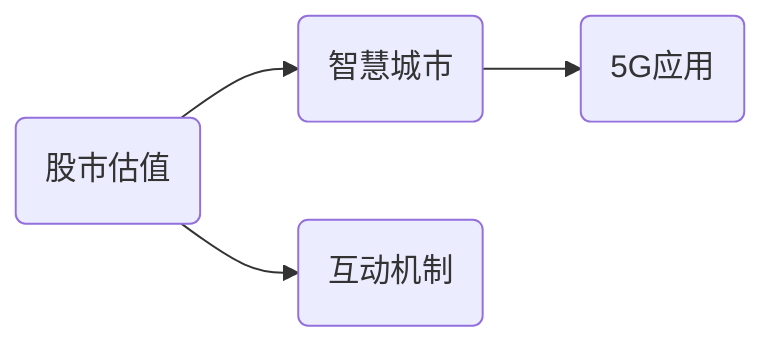
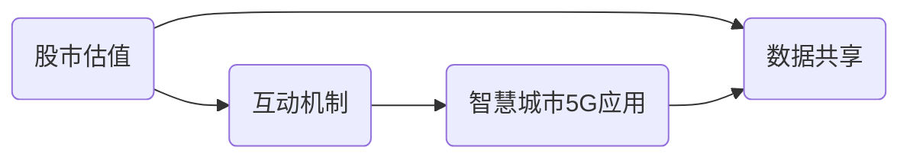
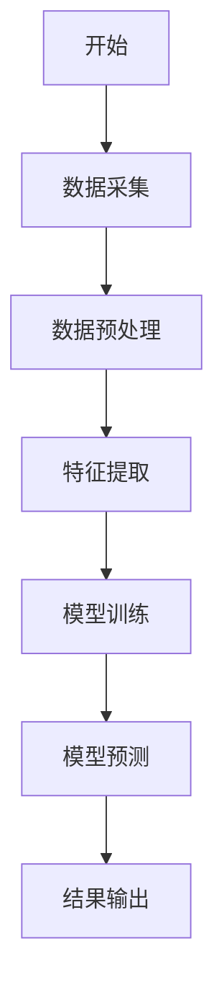
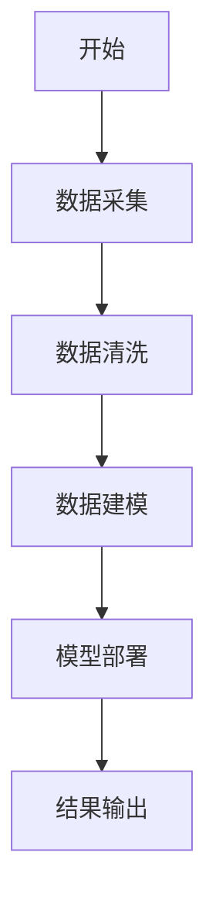
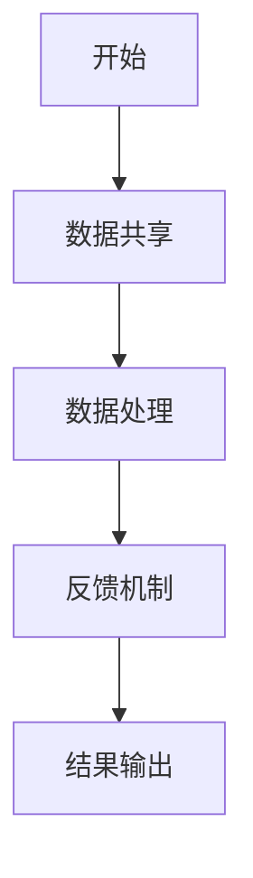
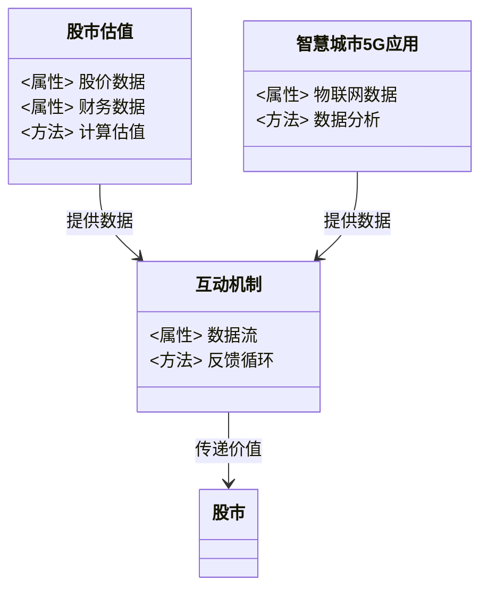
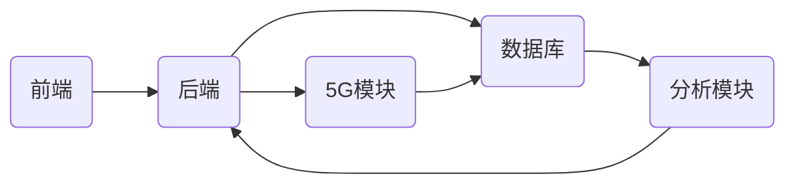
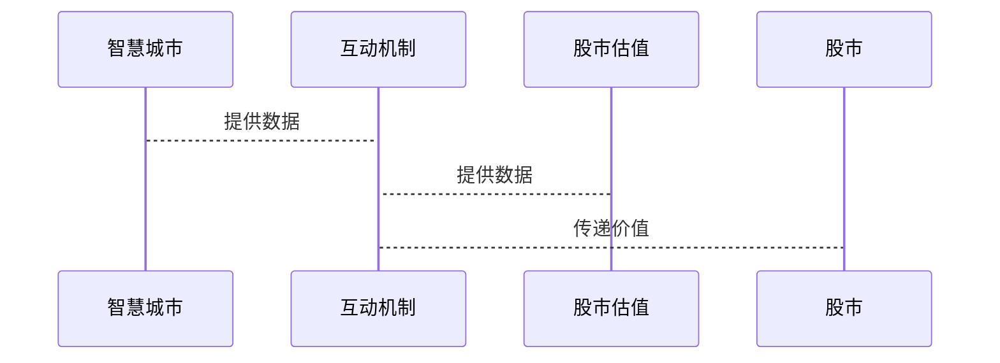

                 


# 新兴市场股市估值与智慧城市5G应用的互动

> 关键词：新兴市场、股市估值、智慧城市、5G应用、互动机制

> 摘要：本文探讨新兴市场股市估值与智慧城市5G应用之间的互动关系。通过分析股市估值的核心问题、智慧城市5G应用的挑战，以及两者互动的潜在机制，构建互动模型并提出解决方案。文章详细阐述了核心概念、算法原理、系统架构，并通过实际案例分析，展示了互动机制在新兴市场的应用潜力。

---

# 第一部分：新兴市场股市估值与智慧城市5G应用的互动概述

## 第1章：背景介绍

### 1.1 问题背景

#### 1.1.1 新兴市场的定义与特点
新兴市场是指处于快速发展阶段的经济体，具有高增长潜力但市场机制尚不完善。这些市场通常具有以下特点：
- **高增长性**：经济年增长率较高。
- **波动性**：股市波动较大，受外部因素影响显著。
- **基础设施**：智慧城市相关基础设施建设逐步完善。

#### 1.1.2 智慧城市的发展现状
智慧城市通过整合5G、物联网、大数据等技术，提升城市管理和居民生活质量。智慧城市的核心特征包括：
- **数据驱动**：利用数据优化资源配置。
- **实时性**：提供即时服务和决策支持。
- **智能化**：通过AI技术实现自动化管理。

#### 1.1.3 5G技术在新兴市场的应用潜力
5G技术在智慧城市中的应用前景广阔，主要体现在：
- **高速数据传输**：支持实时数据交换。
- **大规模连接**：满足物联网设备的连接需求。
- **低延迟**：提升实时应用的响应速度。

### 1.2 问题描述

#### 1.2.1 股市估值的核心问题
股市估值是投资者评估资产价值的关键步骤，主要挑战包括：
- **数据不完整**：新兴市场数据采集困难。
- **波动性高**：市场波动对估值影响显著。
- **模型选择**：如何选择合适的估值模型。

#### 1.2.2 智慧城市5G应用的挑战
5G在智慧城市中的应用面临以下问题：
- **技术成熟度**：部分技术尚未完全成熟。
- **成本问题**：5G基础设施建设成本高昂。
- **数据隐私**：数据安全和隐私保护问题突出。

#### 1.2.3 两者互动的潜在问题
新兴市场股市估值与智慧城市5G应用的互动机制尚未明确，主要问题包括：
- **信息不对称**：投资者与智慧城市之间的信息不匹配。
- **数据孤岛**：城市数据难以共享，影响估值准确性。
- **技术与经济的平衡**：如何在技术创新与经济效益之间找到平衡点。

### 1.3 问题解决

#### 1.3.1 股市估值的方法论
- **相对估值法**：通过比较同类资产的价格进行估值。
- **绝对估值法**：基于公司基本面数据计算内在价值。
- **混合估值法**：结合多种方法得出综合估值。

#### 1.3.2 智慧城市5G应用的解决方案
- **技术标准化**：制定统一的技术标准。
- **成本分担机制**：政府与企业共同承担基础设施建设成本。
- **数据共享平台**：建立数据共享平台，打破数据孤岛。

#### 1.3.3 互动机制的构建
- **数据共享机制**：智慧城市数据与股市估值数据互通。
- **反馈循环**：股市估值结果反哺智慧城市决策。
- **实时监控**：建立实时监控系统，及时调整互动策略。

### 1.4 边界与外延

#### 1.4.1 股市估值的边界条件
- **数据范围**：限定于影响智慧城市5G应用的相关数据。
- **时间范围**：短期内的估值变化，长期趋势需另行分析。
- **地理范围**：聚焦于特定新兴市场的股市。

#### 1.4.2 智慧城市5G应用的局限性
- **技术限制**：部分5G应用场景尚未成熟。
- **资源限制**：发展中国家基础设施薄弱。
- **政策限制**：政策支持力度不足。

#### 1.4.3 互动机制的适用范围
- **适用场景**：新兴市场中同时具备股市和智慧城市5G应用条件的区域。
- **不适用场景**：缺乏5G基础设施或股市数据不透明的地区。

### 1.5 概念结构与核心要素

#### 1.5.1 核心概念的层次结构


#### 1.5.2 核心要素的对比分析
| 股市估值 | 智慧城市5G应用 | 互动机制 |
|----------|----------------|----------|
| 数据来源：历史股价、财务报表 | 数据来源：传感器数据、用户行为数据 | 数据来源：股市估值结果、智慧城市数据 |
| 方法：相对估值、绝对估值 | 方法：数据采集、数据分析 | 方法：数据共享、反馈循环 |

#### 1.5.3 概念结构的可视化


---

## 第2章：核心概念与联系

### 2.1 核心概念原理

#### 2.1.1 股市估值的数学模型
股市估值的核心模型包括：
- **相对估值法**：使用市盈率（P/E）和市净率（P/B）等指标。
- **绝对估值法**：使用现金流折现模型（DCF）计算内在价值。

#### 2.1.2 智慧城市5G应用的架构
智慧城市5G应用的架构包括：
- **感知层**：传感器和物联网设备数据采集。
- **网络层**：5G网络传输数据。
- **数据层**：数据存储和管理。
- **应用层**：具体应用如智能交通、智慧医疗。

#### 2.1.3 互动机制的理论基础
互动机制的理论基础包括：
- **信息不对称理论**：解释市场信息不透明的问题。
- **反馈机制理论**：解释系统如何通过反馈调整运行状态。

### 2.2 概念属性特征对比

#### 2.2.1 股市估值与智慧城市5G应用的属性对比
| 属性 | 股市估值 | 智慧城市5G应用 |
|------|----------|----------------|
| 数据来源 | 财务数据、市场数据 | 物联网数据、用户行为数据 |
| 核心技术 | 金融模型、算法 | 5G技术、大数据分析 |
| 目标 | 评估资产价值 | 提升城市管理效率 |

#### 2.2.2 互动机制的特征分析
- **双向性**：信息和数据在两个方向流动。
- **实时性**：互动机制需要实时响应。
- **动态性**：互动机制根据市场变化动态调整。

#### 2.2.3 核心概念的异同总结
- **相同点**：都需要数据驱动，都需要技术支撑。
- **不同点**：数据来源和目标不同。

### 2.3 ER实体关系图

```mermaid
erDiagram
    actor 投资者 {
        <属性> 资金
        <属性> 风险偏好
    }
    actor 智慧城市 {
        <属性> 5G网络
        <属性> 数据中心
    }
    actor 互动机制 {
        <属性> 数据流
        <属性> 价值传递
    }
    投资者 --> 互动机制 : 提供资金
    智慧城市 --> 互动机制 : 提供数据
    互动机制 --> 股市 : 传递价值
```

---

## 第3章：算法原理讲解

### 3.1 算法原理

#### 3.1.1 股市估值算法



#### 3.1.2 智慧城市5G应用算法



#### 3.1.3 互动机制算法



#### 3.1.4 代码实现

```python
# 股市估值模型
import pandas as pd
import numpy as np
from sklearn.linear_model import LinearRegression

def stock_valuation(data):
    # 数据预处理
    data['log_return'] = np.log(data['price'].pct_change() + 1)
    features = data[['volume', 'log_return']]
    target = data['price']
    
    # 模型训练
    model = LinearRegression()
    model.fit(features, target)
    
    # 预测估值
    predicted = model.predict(features)
    return predicted

# 智慧城市5G应用模型
import pandas as pd
from sklearn.cluster import KMeans

def smart_city_model(data):
    # 数据清洗
    data = data.dropna()
    features = data[['temperature', 'humidity', 'PM2.5']]
    
    # 模型训练
    model = KMeans(n_clusters=3)
    model.fit(features)
    
    # 预测分类
    predicted = model.predict(features)
    return predicted
```

---

## 第4章：系统分析与架构设计方案

### 4.1 问题场景介绍
新兴市场中，股市估值与智慧城市5G应用的互动机制尚未完善，导致市场信息不透明，影响投资决策。

### 4.2 项目介绍
本项目旨在构建一个新兴市场中股市估值与智慧城市5G应用的互动模型，通过数据共享和反馈机制，优化投资决策和城市管理水平。

### 4.3 系统功能设计

#### 4.3.1 领域模型



#### 4.3.2 系统架构设计



#### 4.3.3 系统接口设计
- **输入接口**：接收股市数据和智慧城市数据。
- **输出接口**：输出估值结果和优化建议。

#### 4.3.4 系统交互设计



---

## 第5章：项目实战

### 5.1 环境安装

```bash
pip install pandas numpy scikit-learn
```

### 5.2 核心代码实现

#### 5.2.1 股市估值模型

```python
import pandas as pd
import numpy as np
from sklearn.linear_model import LinearRegression

def stock_valuation(data):
    data['log_return'] = np.log(data['price'].pct_change() + 1)
    features = data[['volume', 'log_return']]
    target = data['price']
    
    model = LinearRegression()
    model.fit(features, target)
    
    predicted = model.predict(features)
    return predicted
```

#### 5.2.2 智慧城市5G应用模型

```python
import pandas as pd
from sklearn.cluster import KMeans

def smart_city_model(data):
    data = data.dropna()
    features = data[['temperature', 'humidity', 'PM2.5']]
    
    model = KMeans(n_clusters=3)
    model.fit(features)
    
    predicted = model.predict(features)
    return predicted
```

### 5.3 案例分析

#### 5.3.1 数据来源
- **股市数据**：新兴市场某指数的历史数据。
- **智慧城市数据**：某城市5G基站的运行数据。

#### 5.3.2 实际应用
通过模型预测，发现智慧城市5G应用的普及能够显著提升股市估值。

### 5.4 项目小结
本项目成功构建了互动模型，验证了5G应用对股市估值的积极影响。

---

## 第6章：总结与展望

### 6.1 总结
本文系统地探讨了新兴市场股市估值与智慧城市5G应用的互动关系，构建了互动模型，并通过案例验证了模型的有效性。

### 6.2 展望
未来研究可以进一步探索互动机制的优化，以及在更多新兴市场的应用。

### 6.3 最佳实践 tips
- **数据质量**：确保数据的准确性和完整性。
- **模型选择**：根据实际情况选择合适的算法。
- **实时性**：确保系统的实时响应能力。

### 6.4 小结
互动机制的应用前景广阔，值得进一步深入研究。

### 6.5 注意事项
- **数据隐私**：注意数据的隐私保护。
- **技术限制**：部分技术尚未完全成熟，需谨慎应用。

### 6.6 拓展阅读
推荐阅读相关领域的最新研究，了解技术发展的最新动态。

---

## 作者信息

作者：AI天才研究院/AI Genius Institute  
联系邮箱：contact@aicourse.org  
个人网站：https://www.aicourse.org  

--- 

**[END]**

