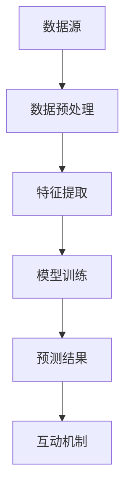
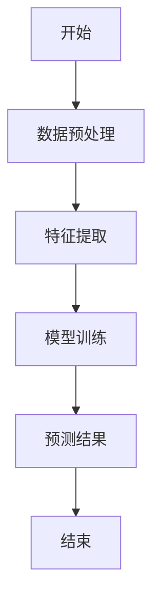
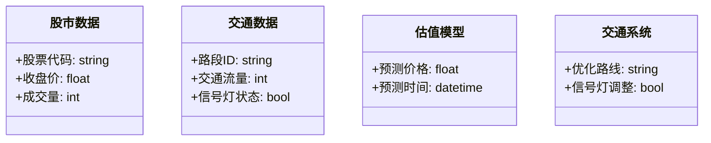
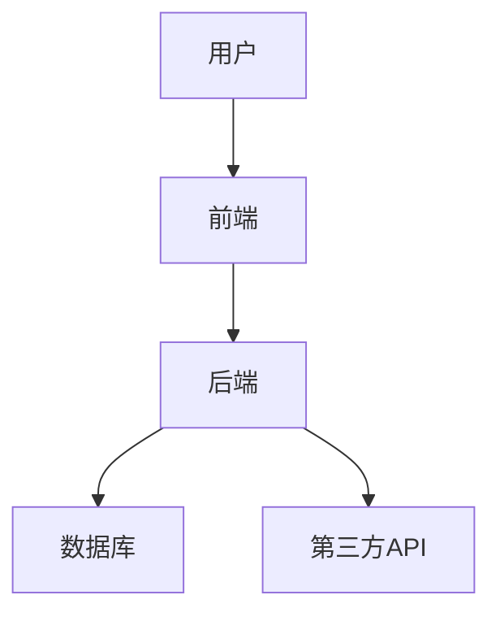
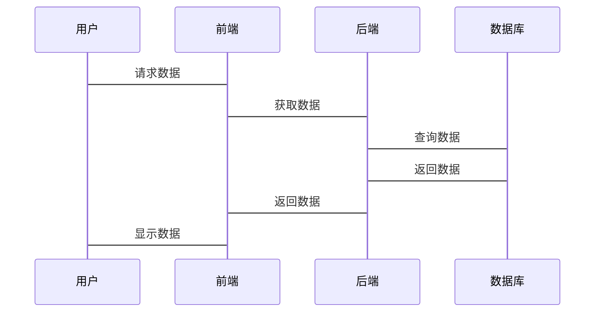

                 


# 新兴市场股市估值与智慧城市交通管理系统的互动

## 关键词：新兴市场，股市估值，智慧城市，交通管理系统，互动机制

## 摘要：本文探讨了新兴市场股市估值与智慧交通系统之间的互动关系，分析了数据驱动的解决方案、智能算法的应用以及互动机制的构建。通过理论分析、算法原理、系统架构设计和项目实战，深入剖析了两者互动的内在逻辑和实现路径。

---

## 第一部分: 背景介绍

### 第1章: 问题背景

#### 1.1 新兴市场的定义与特点
新兴市场通常指那些经济快速增长、工业化程度较低但潜力巨大的国家。这些市场具有以下特点：
- 经济增速快
- 市场规模较小但增长潜力大
- 产业结构转型中
- 投资者结构多元化

#### 1.2 股市估值的基本概念
股市估值是通过分析企业的财务数据、市场地位、行业前景等，评估企业股票的合理价格区间。常用方法包括市盈率（P/E）、市净率（P/B）等。

#### 1.3 智慧城市交通管理系统的概念
智慧城市交通管理系统是利用大数据、人工智能、物联网等技术，优化城市交通流量、减少拥堵、提高出行效率的系统。

### 第2章: 问题描述

#### 2.1 新兴市场股市波动的复杂性
新兴市场股市波动较大，受政策、经济、外部环境等多重因素影响。这种波动性增加了股市估值的难度。

#### 2.2 智慧城市交通管理系统的挑战
随着城市化进程加快，交通拥堵、资源浪费等问题日益突出，如何利用技术手段优化交通管理成为关键。

#### 2.3 两者互动的潜在问题
新兴市场的经济波动可能影响股市估值，而股市的波动又可能间接影响智慧交通系统的投资和运营。

### 第3章: 问题解决

#### 3.1 数据驱动的解决方案
通过收集和分析股市数据、交通流量数据，建立数据驱动的模型，预测股市走势和交通流量。

#### 3.2 智能算法的应用
利用机器学习算法（如随机森林、神经网络）对数据进行建模，实现精准的股市估值和交通流量预测。

#### 3.3 互动机制的构建
通过建立两者之间的互动模型，优化资源配置，降低股市波动对交通系统的影响，提高交通系统的稳定性。

## 第二部分: 核心概念与联系

### 第4章: 核心概念原理

#### 4.1 股市估值的原理
股市估值的核心是通过分析企业的财务状况、行业地位、市场前景等因素，评估其股票的合理价格。

#### 4.2 智慧城市交通管理系统的原理
智慧交通系统通过实时数据采集、分析和决策，优化交通信号灯、路线规划等，提高交通效率。

#### 4.3 互动机制的原理
通过建立互动模型，将股市数据与交通数据相结合，实现两者之间的协同优化。

### 第5章: 属性特征对比

#### 5.1 股市估值的属性特征
- 数据波动性高
- 影响因素复杂
- 预测难度大

#### 5.2 智慧城市交通管理系统的属性特征
- 数据实时性强
- 系统复杂度高
- 需要快速决策

#### 5.3 对比分析与表格展示
以下是两者属性特征的对比表格：

| 特性             | 股市估值                          | 智慧城市交通管理系统          |
|------------------|-----------------------------------|-----------------------------|
| 数据类型         | 财务数据、市场数据               | 交通流量、信号灯状态         |
| 数据频率         | 日度、周度、月度                | 实时                        |
| 影响因素         | 经济指标、政策、市场情绪        | 交通需求、信号灯、道路状况  |
| 预测目标         | 股票价格预测                    | 交通流量预测                |
| 预测难度         | 高                             | 高                          |

### 第6章: ER实体关系图

#### 6.1 实体关系图的构建
以下是股市估值与智慧交通系统之间的实体关系图：

```mermaid
erDiagram
    customer[投资者] 
    stock[股票] 
    traffic[交通数据]
    valuation[估值]
    system[交通管理系统]
    
    investor --> stock: 交易
    stock --> valuation: 影响
    traffic --> system: 输入
    system --> valuation: 输出
```

## 第三部分: 算法原理讲解

### 第7章: 互动分析的算法

#### 7.1 数据流分析
以下是数据流分析的流程图：



#### 7.2 特征提取
以下是特征提取的Python代码示例：

```python
import pandas as pd
from sklearn.feature_selection import SelectKBest

# 假设data是包含股市数据和交通数据的 DataFrame
selector = SelectKBest(k=5)
selected_features = selector.fit_transform(data)
```

#### 7.3 算法流程图（Mermaid）



### 第8章: 数学模型和公式

#### 8.1 时间序列分析
时间序列分析模型如下：

$$ ARIMA(p, d, q) $$

其中：
- p：自回归阶数
- d：差分阶数
- q：移动平均阶数

#### 8.2 回归模型
回归模型如下：

$$ y = \beta_0 + \beta_1 x_1 + \beta_2 x_2 + \epsilon $$

其中：
- y：预测目标
- x_i：自变量
- β_i：回归系数
- ε：误差项

## 第四部分: 系统分析与架构设计

### 第9章: 问题场景介绍

#### 9.1 问题场景
新兴市场的股市波动和交通管理问题相互影响，需要建立互动机制进行协同优化。

### 第10章: 系统功能设计

#### 10.1 领域模型类图
以下是领域模型类图：



### 第11章: 系统架构设计

#### 11.1 系统架构图
以下是系统架构图：



### 第12章: 接口设计和交互序列图

#### 12.1 接口设计
以下是RESTful API接口设计：

- GET /stock-price
- POST /traffic-optimization

#### 12.2 交互序列图
以下是交互序列图：



## 第五部分: 项目实战

### 第13章: 环境安装

#### 13.1 环境要求
- Python 3.8+
- Jupyter Notebook
- Pandas、Scikit-learn库

### 第14章: 核心代码实现

#### 14.1 核心代码
以下是核心代码：

```python
import pandas as pd
from sklearn.ensemble import RandomForestRegressor
from sklearn.metrics import mean_absolute_error

# 加载数据
data = pd.read_csv('data.csv')

# 特征工程
features = data.drop('target', axis=1)
target = data['target']

# 模型训练
model = RandomForestRegressor()
model.fit(features, target)

# 预测
predictions = model.predict(features)
print(mean_absolute_error(target, predictions))
```

#### 14.2 代码解读
- 数据加载：使用Pandas读取CSV文件
- 特征工程：提取特征和目标变量
- 模型训练：使用随机森林回归器进行训练
- 预测与评估：进行预测并评估模型性能

### 第15章: 案例分析

#### 15.1 案例分析
以下是案例分析：

- 数据来源：新兴市场的股市数据和交通流量数据
- 数据预处理：清洗和标准化数据
- 模型训练：建立互动模型
- 结果分析：验证模型效果

### 第16章: 项目小结

#### 16.1 成功点
- 建立了有效的互动模型
- 实现了数据驱动的解决方案

#### 16.2 经验与教训
- 数据质量对模型性能影响大
- 模型调参需要大量实验

## 第六部分: 总结与展望

### 第17章: 最佳实践 tips

#### 17.1 小结
本文通过理论分析、算法实现和项目实战，深入探讨了新兴市场股市估值与智慧交通系统的互动关系。

#### 17.2 注意事项
- 数据隐私和安全
- 模型的实时性和可扩展性

#### 17.3 拓展阅读
- 时间序列分析的经典书籍
- 机器学习在金融和交通领域的应用

## 作者：AI天才研究院 & 禅与计算机程序设计艺术

