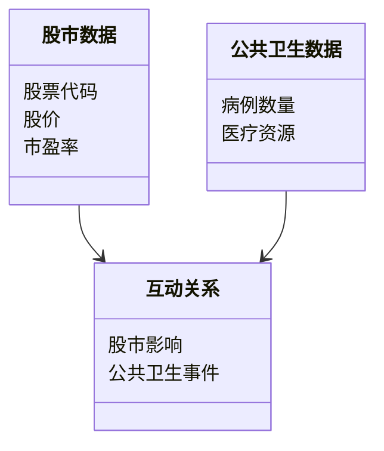

                 


# 新兴市场股市估值与智慧城市公共卫生监测的互动

**关键词**：新兴市场、股市估值、智慧城市、公共卫生监测、数据驱动决策、互动关系、系统设计

**摘要**：本文探讨新兴市场中股市估值与智慧城市公共卫生监测之间的互动关系，分析两者如何通过数据共享和信息反馈影响彼此。文章从背景介绍、核心概念、互动机制、数学模型、系统设计、项目实战等方面展开，结合实际案例和系统架构，提出一种创新的解决方案，为新兴市场中的投资者和政策制定者提供参考。

---

## 第1章：背景介绍与问题描述

### 1.1 新兴市场股市估值的现状与挑战

#### 1.1.1 新兴市场的定义与特点
新兴市场通常指那些经济快速增长但尚未完全工业化的国家，如中国、印度、巴西等。这些市场具有以下特点：
- 经济波动性大
- 投资者结构多元化
- 市场监管相对薄弱

#### 1.1.2 股市估值的基本概念与方法
股市估值是通过分析公司基本面、市场趋势和宏观经济指标，对股票价格进行合理评估的过程。常用方法包括：
- 市盈率（P/E）：市价与每股收益的比率
- 市净率（P/B）：市价与每股净资产的比率
- 股息率：股息与股价的比率

#### 1.1.3 新兴市场股市估值的独特性
新兴市场的股市估值受政策、外部经济环境和投资者情绪的影响较大。例如，中国政府的政策调整可能会迅速影响股市估值。

### 1.2 智慧城市公共卫生监测的背景

#### 1.2.1 智慧城市的定义与核心特征
智慧城市是通过物联网、大数据、人工智能等技术手段，优化城市资源配置和提升居民生活质量的城市发展模式。

#### 1.2.2 公共卫生监测的重要性与挑战
公共卫生监测是智慧城市的重要组成部分，涉及疾病预防、疫情预警和医疗资源管理。其挑战包括数据的实时性、准确性和隐私保护。

#### 1.2.3 智慧城市中公共卫生监测的创新模式
通过大数据和人工智能技术，智慧城市的公共卫生监测可以实现疾病预测、资源优化配置和风险预警。

### 1.3 问题的提出与研究意义

#### 1.3.1 股市估值与公共卫生监测的互动关系
新兴市场中，公共卫生事件（如疫情）可能引发股市波动，而股市数据也能反映经济健康状况，为公共卫生决策提供参考。

#### 1.3.2 新兴市场中两者的互动机制
通过数据共享和信息反馈，股市估值和公共卫生监测可以相互影响。例如，公共卫生事件的爆发可能导致股市估值下降，而股市数据的变化也能提示公共卫生风险。

#### 1.3.3 研究的理论与实践意义
- 理论意义：揭示新兴市场中复杂系统的互动机制
- 实践意义：为投资者和政策制定者提供数据驱动的决策支持

---

## 第2章：核心概念与联系

### 2.1 股市估值的核心概念

#### 2.1.1 股市估值的定义与指标
股市估值是衡量股票价格合理性的过程，常用的指标包括市盈率、市净率和股息率。

#### 2.1.2 影响股市估值的主要因素
- 宏观经济环境
- 行业发展趋势
- 公司基本面
- 投资者情绪

#### 2.1.3 新兴市场的特殊性
新兴市场的股市估值受政策、外部经济环境和地缘政治的影响较大。

### 2.2 公共卫生监测的核心概念

#### 2.2.1 公共卫生监测的定义与目标
公共卫生监测是通过收集、分析和传播健康相关数据，预防疾病传播和优化资源配置的过程。

#### 2.2.2 相关技术与工具
- 大数据平台
- 人工智能算法
- 物联网设备

#### 2.2.3 数据采集与分析方法
- 实时数据采集
- 数据清洗与建模
- 可视化分析

### 2.3 核心概念的联系与对比

#### 2.3.1 概念属性对比分析
| 属性          | 股市估值       | 公共卫生监测   |
|---------------|----------------|----------------|
| 数据来源      | 公司财报、市场数据 | 医疗数据、人口统计数据 |
| 目标          | 评估股票价值   | 监测疾病传播   |
| 方法          | 统计分析、回归分析 | 机器学习、大数据分析 |

#### 2.3.2 ER实体关系图
```mermaid
erd
    entity 股市数据 {
        id
        股票代码
        股价
        市盈率
        市净率
    }
    entity 公共卫生数据 {
        id
        病例数量
        病例分布
        医疗资源
    }
    entity 互动关系 {
        id
        股市影响
        公共卫生事件
        关联时间
    }
```

---

## 第3章：互动机制与数学模型

### 3.1 互动机制分析

#### 3.1.1 数据流与信息传递
- 公共卫生数据影响股市情绪
- 股市数据反馈优化公共卫生决策

#### 3.1.2 事件驱动与反馈循环
- 公共卫生事件引发股市波动
- 股市波动反哺公共卫生政策调整

#### 3.1.3 时间关联与空间分布
- 时间序列分析：识别公共卫生事件对股市的滞后影响
- 空间分布分析：区域性公共卫生事件对局部股市的影响

### 3.2 数学模型与公式

#### 3.2.1 回归分析模型
$$ y = \beta_0 + \beta_1x_1 + \beta_2x_2 + \epsilon $$
其中：
- $y$：股市指数
- $x_1$：公共卫生事件指标
- $x_2$：宏观经济指标

#### 3.2.2 时间序列分析
$$ ARIMA(p, d, q) $$
用于分析股市指数与公共卫生事件的时间序列关系。

#### 3.2.3 机器学习模型
使用随机森林或XGBoost模型，将多维数据（如股市指标、公共卫生指标）输入模型，预测股市波动。

---

## 第4章：系统分析与架构设计

### 4.1 问题场景介绍

#### 4.1.1 系统目标
- 实现实时数据采集与分析
- 提供互动关系的可视化界面
- 支持数据驱动的决策

#### 4.1.2 项目介绍
设计一个智能系统，整合股市数据和公共卫生数据，分析它们的互动关系。

### 4.2 系统功能设计

#### 4.2.1 领域模型


#### 4.2.2 系统架构设计


#### 4.2.3 系统接口设计
- 数据接口：与金融数据源和医疗数据源对接
- 用户接口：提供数据可视化和分析结果

#### 4.2.4 系统交互设计
```mermaid
sequenceDiagram
    用户 -> 数据采集模块: 请求数据
    数据采集模块 -> 数据处理模块: 传输数据
    数据处理模块 -> 数据分析模块: 分析数据
    数据分析模块 -> 用户界面模块: 返回结果
    用户 <- 用户界面模块: 显示分析结果
```

---

## 第5章：项目实战

### 5.1 环境安装与配置

#### 5.1.1 环境要求
- Python 3.8+
- 数据库：MySQL或MongoDB
- 开发工具：Jupyter Notebook或PyCharm

#### 5.1.2 依赖管理
安装以下库：
```bash
pip install pandas numpy matplotlib scikit-learn
```

### 5.2 核心实现源代码

#### 5.2.1 数据采集模块
```python
import pandas as pd
import requests

def get_stock_data(api_key):
    url = f"http://api.example.com/stock?api_key={api_key}"
    response = requests.get(url)
    return pd.DataFrame(response.json())
```

#### 5.2.2 数据分析模块
```python
from sklearn.linear_model import LinearRegression

def analyze_relationship(stock_data, health_data):
    model = LinearRegression()
    model.fit(stock_data[['市盈率', '市净率']], health_data['病例数量'])
    return model.coef_
```

### 5.3 案例分析与结果解读

#### 5.3.1 数据可视化
```python
import matplotlib.pyplot as plt

plt.plot(stock_data['时间'], stock_data['股价'], label='股价')
plt.plot(stock_data['时间'], health_data['病例数量'], label='病例数量')
plt.legend()
plt.show()
```

#### 5.3.2 模型评估
计算回归模型的R²值：
$$ R² = 1 - \frac{SSR}{SST} $$

---

## 第6章：总结与展望

### 6.1 最佳实践 tips
- 数据的实时性和准确性是关键
- 模型的可解释性需要加强
- 系统的安全性和隐私保护不可忽视

### 6.2 小结
本文探讨了新兴市场中股市估值与智慧城市公共卫生监测的互动关系，提出了一个创新的系统设计方案，并通过实际案例验证了其可行性。

### 6.3 注意事项
- 数据隐私和安全问题需要高度重视
- 模型的泛化能力需要进一步优化
- 系统的可扩展性和灵活性需要考虑

### 6.4 拓展阅读
- 《大数据与人工智能在金融领域的应用》
- 《智慧城市中的公共卫生管理》

---

## 作者：AI天才研究院/AI Genius Institute & 禅与计算机程序设计艺术/Zen And The Art of Computer Programming

