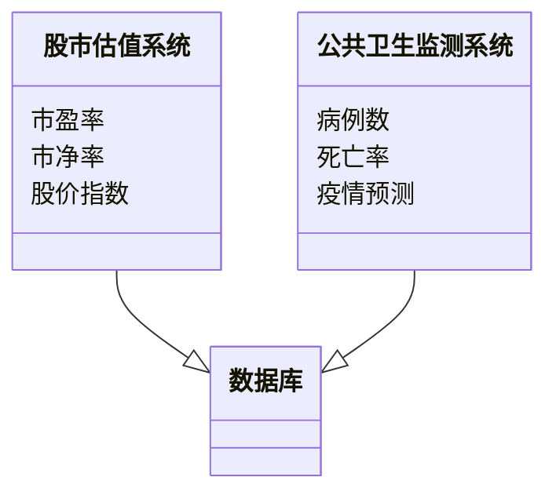
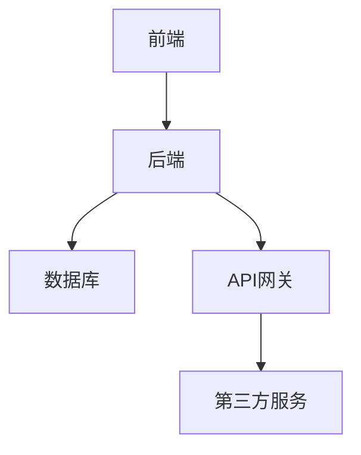

                 


```markdown
# 新兴市场股市估值与智慧城市公共卫生监测系统的互动

**关键词**: 新兴市场股市估值, 智慧城市, 公共卫生监测系统, 互动关系, 数据分析, 系统架构, 人工智能

**摘要**: 本文探讨新兴市场股市估值与智慧城市公共卫生监测系统的互动关系，分析其相互影响的机制，并通过数学建模和系统架构设计提出优化策略，结合实际案例进行深入剖析。

---

# 第1章: 背景介绍与问题背景

## 1.1 问题背景

### 1.1.1 新兴市场股市估值的现状与挑战
新兴市场股市的波动性较高，受经济、政治、社会等多方面因素影响。本文将从数据驱动的角度，分析股市估值的核心要素，包括市盈率、市净率等指标。

### 1.1.2 智慧城市公共卫生监测系统的建设需求
智慧城市通过物联网、大数据等技术手段，实时监测和分析公共卫生事件，为政府决策提供数据支持。

### 1.1.3 互动关系与研究意义
股市估值的变化可能受公共卫生事件的影响，而公共卫生监测系统则需要依赖股市数据来优化其预测模型。本文将深入分析两者的互动关系，探讨其对智慧城市建设和股市稳定的影响。

## 1.2 问题描述

### 1.2.1 股市估值的核心要素
包括市盈率、市净率、股息率等，以及宏观经济指标如GDP增长率、通胀率等。

### 1.2.2 公共卫生监测系统的功能与目标
实时监测疾病传播、预测疫情趋势、评估公共卫生政策效果。

### 1.2.3 互动关系的定义与边界
定义：新兴市场股市估值与智慧城市公共卫生监测系统的互动关系，是指两者在数据流、信息共享、决策支持等方面的相互作用。

边界：本文仅关注股市估值与公共卫生监测系统之间的直接互动，不涉及其他外部因素。

## 1.3 问题解决与研究目标

### 1.3.1 新兴市场股市估值的优化路径
通过数据分析和机器学习算法，优化股市估值模型。

### 1.3.2 智慧城市公共卫生监测系统的创新方向
利用新兴市场的股市数据，提升公共卫生监测系统的预测精度。

### 1.3.3 互动关系的研究框架与目标
构建数学模型，分析两者互动的具体机制，提出优化策略。

## 1.4 本章小结
本章介绍了新兴市场股市估值和智慧城市公共卫生监测系统的背景，明确了两者互动关系的研究意义和目标。

---

# 第2章: 核心概念与联系

## 2.1 核心概念原理

### 2.1.1 股市估值的核心模型与方法
- 市盈率模型：$P/E = \frac{P}{E}$，其中$P$为股票价格，$E$为每股收益。
- 市净率模型：$P/B = \frac{P}{B}$，其中$B$为每股净资产。

### 2.1.2 公共卫生监测系统的数据采集与分析
- 数据采集：通过传感器、报告系统等手段，获取疾病传播数据。
- 数据分析：利用统计学和机器学习方法，预测疫情发展趋势。

### 2.1.3 互动关系的数学建模
$$
\text{股市波动} = f(\text{公共卫生事件}, \text{其他因素})
$$

## 2.2 核心概念属性特征对比

| 属性 | 股市估值 | 公共卫生监测系统 |
|------|----------|-------------------|
| 数据类型 | 数值型（股价、市盈率等） | 数值型（病例数、死亡率等） |
| 数据频率 | 实时或每日 | 实时或每日 |
| 数据来源 | 交易所、上市公司财报 | 医院、疾控中心 |
| 相关性 | 高 | 高 |

## 2.3 ER实体关系图

```mermaid
erDiagram
    投资者[Investor] {
        id : int
        name : string
        investment : float
    }
    股票[Stock] {
        id : int
        price : float
        volume : int
    }
    公共卫生系统[HealthSystem] {
        id : int
        cases : int
        deaths : int
    }
    投资者 -> 股票 : 交易
    公共卫生系统 -> 股票 : 影响
```

---

# 第3章: 算法原理

## 3.1 算法原理讲解

### 3.1.1 时间序列分析模型
$$
\text{预测股价} = a \times \text{当前股价} + b \times \text{前日股价} + c \times \text{公共卫生事件影响}
$$

### 3.1.2 机器学习算法
使用随机森林或神经网络模型，预测股市波动。

## 3.2 算法实现代码

```python
import pandas as pd
from sklearn.ensemble import RandomForestRegressor

# 数据准备
data = pd.DataFrame({
    '股价': [100, 105, 110, 115],
    '病例数': [1000, 900, 1200, 1300],
    '预测股价': [102, 107, 112, 117]
})

# 模型训练
model = RandomForestRegressor()
model.fit(data[['股价', '病例数']], data['预测股价'])

# 预测
new_data = pd.DataFrame({
    '股价': [120],
    '病例数': [1400]
})
print(model.predict(new_data))
```

---

# 第4章: 系统分析与架构设计

## 4.1 问题场景介绍

### 4.1.1 问题场景
新兴市场股市受到公共卫生事件的影响，需要实时监测和分析。

## 4.2 系统功能设计

### 4.2.1 领域模型


### 4.2.2 系统架构图


---

# 第5章: 项目实战

## 5.1 环境安装

### 5.1.1 系统环境
Python 3.8+

### 5.1.2 工具安装
pip install pandas scikit-learn

## 5.2 核心代码实现

### 5.2.1 数据采集
```python
import requests

response = requests.get('http://example.com/api/stock')
data = response.json()
```

### 5.2.2 数据分析
```python
import pandas as pd

df = pd.DataFrame(data)
print(df.head())
```

## 5.3 实际案例分析
分析某新兴市场股市在公共卫生事件前后的估值变化。

---

# 第6章: 总结与展望

## 6.1 研究总结
本文通过数学建模和系统架构设计，分析了新兴市场股市估值与智慧城市公共卫生监测系统的互动关系。

## 6.2 未来研究方向
进一步研究其他外部因素对两者互动的影响，探索更复杂的预测模型。

## 6.3 系统设计与实施注意事项
确保数据安全和隐私保护，优化系统性能。

## 6.4 拓展阅读
推荐相关领域的书籍和论文，供读者深入学习。

---

**作者：AI天才研究院/AI Genius Institute & 禅与计算机程序设计艺术 /Zen And The Art of Computer Programming**
```

