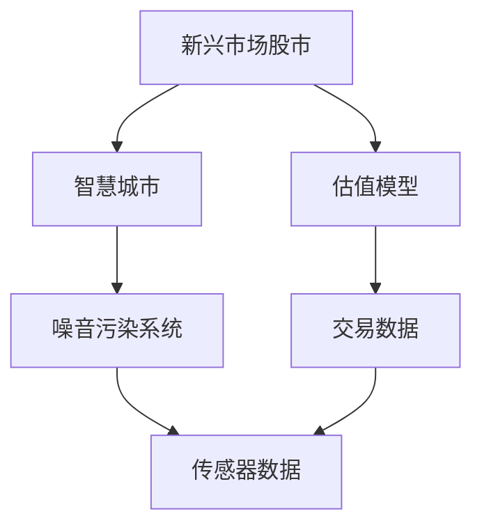
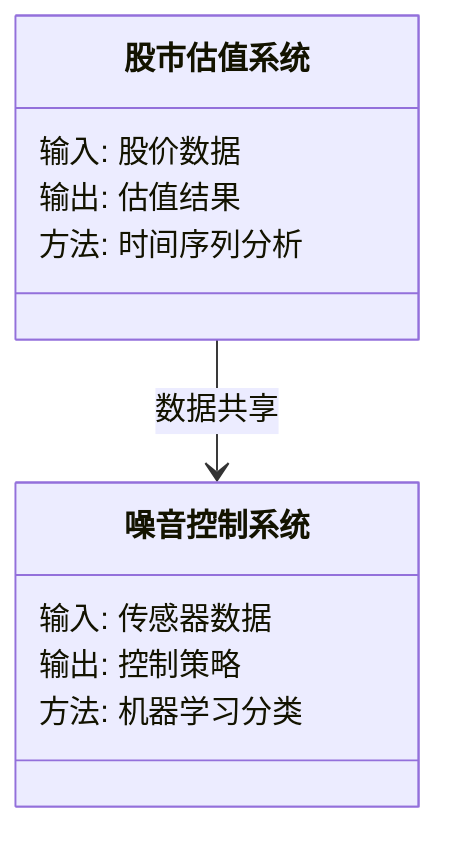
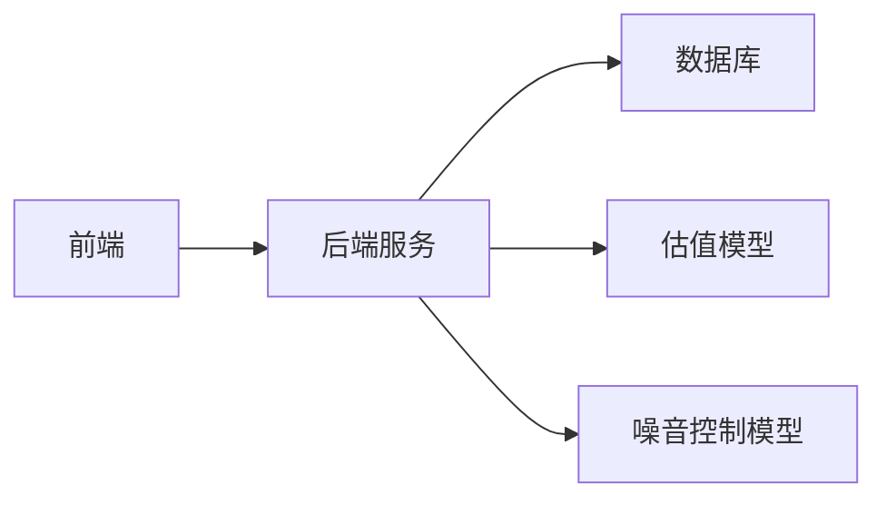

                 


# 新兴市场股市估值与智慧城市噪音污染控制系统的互动

> 关键词：新兴市场、股市估值、智慧城市、噪音污染、控制系统、互动关系

> 摘要：本文探讨新兴市场股市估值与智慧城市噪音污染控制系统之间的互动关系，分析其背后的数学模型、算法原理和系统架构，并通过实际案例展示其应用与优化。

---

## 第一部分: 背景介绍与核心概念

### 第1章: 背景与问题描述

#### 1.1 问题背景

- **新兴市场股市的特点与挑战**  
  新兴市场股市通常具有高波动性、信息不对称和市场不完善的特点。投资者需要通过精准的估值模型来捕捉市场机会，同时应对市场风险。

- **智慧城市中的噪音污染问题**  
  随着城市化进程的加快，交通、工业和建筑活动带来的噪音污染日益严重。智慧城市建设需要引入先进的技术手段，优化城市环境质量。

- **两者的互动关系与研究意义**  
  新兴市场股市的波动可能受到城市化进程和环境政策的影响，而智慧城市的建设又依赖于股市的资金支持。研究二者的互动关系，有助于优化城市治理和金融市场运作。

#### 1.2 问题描述

- **新兴市场股市估值的核心要素**  
  包括市盈率、市净率、股息率等传统指标，以及新兴市场的特殊因素，如政策风险和市场流动性。

- **智慧城市噪音污染控制系统的构成**  
  包括传感器网络、数据采集、噪音源识别和控制策略优化等模块。

- **互动机制与潜在影响**  
  城市环境质量的改善可能提升市民生活质量和企业生产效率，从而间接影响股市估值。反之，股市的资金流动又可以支持智慧城市的建设。

#### 1.3 问题解决与边界

- **新兴市场股市估值的优化方法**  
  引入机器学习算法，结合传统估值指标，构建多维度的估值模型。

- **智慧城市噪音污染控制的技术路径**  
  基于传感器数据，采用人工智能算法，实现噪音源识别和实时控制。

- **系统边界与外延**  
  本文研究的边界限于新兴市场股市和智慧城市的互动关系，不涉及其他领域（如交通系统或能源管理）。

### 第2章: 核心概念与联系

#### 2.1 核心概念原理

- **股市估值的数学模型**  
  基于时间序列分析和机器学习算法，构建股市价格预测模型。

- **噪音污染控制系统的原理**  
  通过传感器数据采集和算法分析，优化噪音源控制策略。

#### 2.2 核心概念对比分析

| **属性**            | **股市估值**           | **噪音污染控制系统**         |
|---------------------|----------------------|---------------------------|
| **输入数据**        | 股价、交易量、财务指标 | 噪音传感器数据、地理位置   |
| **输出结果**        | 估值、预测、投资建议 | 噪音等级、控制策略         |
| **算法依赖**        | 时间序列分析、机器学习 | 数据挖掘、机器学习         |
| **应用场景**        | 金融投资、风险控制   | 城市环境管理、公共健康     |

#### 2.3 实体关系图



---

## 第二部分: 算法原理与数学模型

### 第3章: 股市估值算法

#### 3.1 时间序列分析模型

- **ARIMA模型**  
  $$ ARIMA(p, d, q) $$
  其中，p为自回归阶数，d为差分阶数，q为移动平均阶数。

- **LSTM模型**  
  LSTM网络通过遗忘门和记忆单元，捕捉时间序列中的长期依赖关系。

#### 3.2 股市波动预测

- **数据预处理**  
  对历史股价数据进行标准化处理，去除异常值。

- **模型训练**  
  使用训练数据拟合模型，并通过验证集调整超参数。

- **预测结果与误差分析**  
  计算预测值与实际值的误差，评估模型性能。

### 第4章: 噪音污染控制系统算法

#### 4.1 基于机器学习的分类算法

- **K-近邻算法**  
  $$ K = \sqrt{n} $$$
  其中，n为训练样本数量。

- **随机森林算法**  
  使用决策树投票机制，提升分类准确率。

#### 4.2 噪音污染等级分类

- **数据特征提取**  
  提取传感器数据的时间序列特征和空间特征。

- **分类器训练**  
  使用交叉验证优化模型参数。

---

## 第三部分: 系统分析与架构设计

### 第5章: 系统分析与架构设计

#### 5.1 项目背景

- 智慧城市建设的核心目标是优化城市环境和提升市民生活质量。

#### 5.2 系统功能设计



#### 5.3 系统架构设计



---

## 第四部分: 项目实战

### 第6章: 项目实战

#### 6.1 环境安装

- Python版本：3.8及以上
- 库依赖：numpy、pandas、sklearn、keras

#### 6.2 核心代码实现

```python
import numpy as np
import pandas as pd
from sklearn.ensemble import RandomForestClassifier
from keras.models import Sequential
from keras.layers import LSTM, Dense

# 股市估值模型
def stock_valuation_model():
    model = Sequential()
    model.add(LSTM(50, input_shape=(1, 1)))
    model.add(Dense(1))
    model.compile(optimizer='adam', loss='mean_squared_error')
    return model

# 噪音污染分类模型
def noise_control_model():
    model = RandomForestClassifier(n_estimators=100)
    return model
```

---

## 第五部分: 最佳实践

### 第7章: 最佳实践

#### 7.1 小结

- 本文通过分析新兴市场股市估值与智慧城市噪音污染控制系统的互动关系，提出了基于机器学习的解决方案。

#### 7.2 注意事项

- 数据质量对模型性能影响重大，需注意数据清洗和特征工程。
- 模型部署需考虑计算资源和实时性要求。

#### 7.3 未来展望

- 结合区块链技术，构建去中心化的噪音污染控制系统。
- 引入强化学习算法，优化股市交易策略。

#### 7.4 拓展阅读

- 《时间序列分析与应用》
- 《机器学习实战》

---

## 作者

作者：AI天才研究院 & 禅与计算机程序设计艺术

