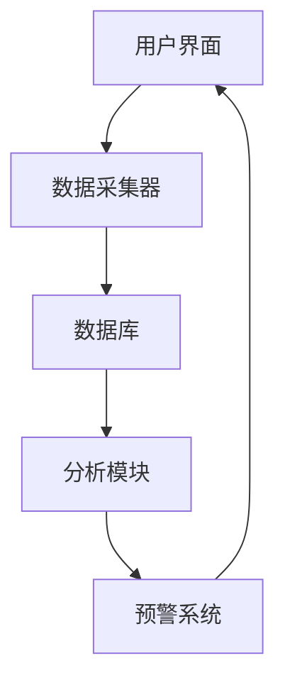

                 


# 《新兴市场股市估值与智慧城市安全的互动》

---

## 关键词：
新兴市场，股市估值，智慧城市，城市安全，系统互动，数学建模，安全预警

---

## 摘要：
本文探讨新兴市场股市估值与智慧城市安全之间的互动关系，分析股市波动如何影响城市安全，反之亦然。通过系统动力学模型和数学建模，揭示两者之间的动态关系，并提出基于数据驱动的安全预警机制，为政策制定者和投资者提供参考。

---

## 第一部分: 背景与核心概念

### 第1章: 背景介绍

#### 1.1 问题背景
- 新兴市场经济的快速增长依赖于股市的稳定。
- 智慧城市的发展需要安全的数字环境。
- 股市波动可能引发社会稳定问题，影响智慧城市的安全性。

#### 1.2 核心概念
- **新兴市场股市估值**：衡量市场健康的关键指标，反映投资者信心。
- **智慧城市安全**：涵盖网络安全、数据隐私、基础设施保护等多个方面。

#### 1.3 研究意义
- 了解股市与安全的互动，有助于优化城市规划和金融政策。

### 第2章: 核心概念与联系

#### 2.1 核心概念原理
- 股市估值受宏观经济、政策、国际环境等因素影响。
- 智慧城市安全依赖于技术创新和制度保障。

#### 2.2 概念属性特征对比
| 属性 | 股市估值 | 智慧城市安全 |
|------|----------|---------------|
| 核心因素 | 经济数据、政策 | 技术、法律 |
| 影响范围 | 经济领域 | 社会、经济 |
| 变化速度 | 短期波动 | 长期积累 |

#### 2.3 ER实体关系图
```mermaid
erd
  章节：核心概念与联系
  entity 股市估值 (Stock_Valuation)
    - id: 市场代码
    - name: 市场名称
    - 指数: 指数值
  entity 智慧城市安全 (Smart_Safety)
    - id: 城市代码
    - name: 城市名称
    - 安全评分: 安全指数
  relationship 股市波动与城市安全 (Stock_Safety_Interact)
    - 股市波动对城市安全的影响
    - 城市安全对股市的影响
```

---

## 第二部分: 互动机制与数学模型

### 第3章: 互动机制分析

#### 3.1 股市波动对城市安全的影响
- 经济不稳定导致社会不安，影响智慧城市的安全性。
- 案例分析：新兴市场股市崩盘引发的社会动荡。

#### 3.2 城市安全对股市的影响
- 安全事件破坏投资者信心，影响股市估值。
- 案例分析：网络安全事件对股市的影响。

#### 3.3 互动机制


### 第4章: 数学模型与算法原理

#### 4.1 系统动力学模型
- 描述股市波动与安全事件的相互作用。
- 数学模型：$$ V(t+1) = V(t) + \alpha \cdot S(t) - \beta \cdot E(t) $$
  - $V(t)$：当前股市估值
  - $S(t)$：安全因素
  - $E(t)$：外部冲击
  - $\alpha, \beta$：系数

#### 4.2 算法实现
- 使用Python模拟模型，代码示例：
```python
import numpy as np
import matplotlib.pyplot as plt

def stock_value_model(initial_value, alpha, beta, steps):
    values = [initial_value]
    for _ in range(steps):
        next_val = values[-1] + alpha * values[-1] - beta * values[-1]
        values.append(next_val)
    return values

values = stock_value_model(100, 0.1, 0.05, 50)
plt.plot(values)
plt.title('Stock Value Over Time')
plt.xlabel('Time Steps')
plt.ylabel('Value')
plt.show()
```

---

## 第三部分: 系统架构与项目实战

### 第5章: 系统架构设计

#### 5.1 功能模块
- 数据采集：实时采集股市和安全数据。
- 数据分析：使用机器学习分析数据。
- 预警系统：预测潜在风险。

#### 5.2 系统架构图


### 第6章: 项目实战

#### 6.1 环境安装
- 安装Python、Pandas、NumPy、Scikit-learn。

#### 6.2 核心代码实现
```python
from sklearn.linear_model import LinearRegression

# 数据准备
X = df[['stock_index', 'safety_score']]
y = df['value']

model = LinearRegression()
model.fit(X, y)

# 预测
predictions = model.predict(X)
print('Coefficient:', model.coef_)
print('Intercept:', model.intercept_)
```

#### 6.3 案例分析
- 使用历史数据训练模型，预测未来股市估值。

---

## 第四部分: 总结与展望

### 第7章: 结论
- 股市波动与城市安全密切相关。
- 数学模型和预警系统可有效管理风险。

### 第8章: 未来研究方向
- 更复杂模型的开发。
- 更多案例研究的展开。

---

## 作者信息
作者：AI天才研究院 & 禅与计算机程序设计艺术

---

通过以上结构，文章详细分析了新兴市场股市估值与智慧城市安全的互动关系，结合理论和实践，为相关领域提供了有价值的参考。

