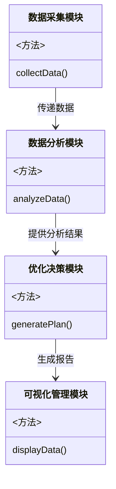
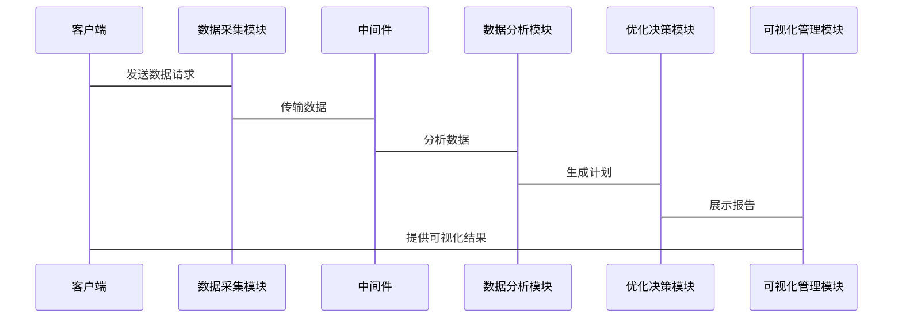

                 


# 新兴市场股市估值与智慧城市水资源管理系统的互动

**关键词**：新兴市场、股市估值、智慧城市、水资源管理、互动关系

**摘要**：本文探讨新兴市场中股市估值与智慧城市水资源管理系统的互动关系。通过分析股市估值的核心概念与水资源管理系统的构成，结合数学模型与系统架构设计，揭示两者在经济与技术层面的相互影响。文章从背景分析、核心概念、算法原理、系统设计、项目实战到最佳实践，全面阐述这一互动关系的深度与广度。

---

## 第一部分: 背景与概念

### 第1章: 背景与问题描述

#### 1.1 新兴市场股市估值的背景
##### 1.1.1 新兴市场的定义与特点
新兴市场是指经济快速发展、工业化程度较高、但人均收入仍低于发达国家的地区。这些市场通常具有较高的增长率、多样化的产业结构和未成熟的金融市场。

##### 1.1.2 股市估值的核心概念
股市估值是通过分析公司财务数据和市场环境，对其股票价格进行合理评估的过程。常用方法包括PE（市盈率）、PB（市净率）和DCF（现金流折现法）等。

##### 1.1.3 新兴市场股市的独特性
新兴市场的股市波动性较大，受政策、经济和外部环境影响显著。同时，新兴市场的公司往往具有较高的成长潜力，但也面临更高的风险。

#### 1.2 智慧城市水资源管理系统的背景
##### 1.2.1 智慧城市的基本概念
智慧城市是通过信息技术和数据驱动的解决方案，优化城市资源分配、提升居民生活质量的城市发展模式。

##### 1.2.2 水资源管理系统的定义与目标
水资源管理系统通过监测、分析和优化水资源的分配与使用，实现水资源的高效管理和可持续利用。

##### 1.2.3 智慧水资源管理的独特优势
智慧水资源管理借助物联网、大数据和人工智能技术，实现水资源的实时监测、预测预警和智能调度，显著提升管理效率。

#### 1.3 问题的提出与研究意义
##### 1.3.1 股市估值与水资源管理的关联性
股市估值反映了经济状况，而水资源管理则是经济活动的重要支撑。两者在新兴市场中存在密切的互动关系。

##### 1.3.2 新兴市场中的互动关系
新兴市场中，水资源管理的效率直接影响企业的生产成本和盈利能力，进而影响股市估值。同时，股市的资金流动也对水资源管理项目的投资产生重要影响。

##### 1.3.3 研究的现实意义与学术价值
研究两者互动关系，有助于优化资源配置、促进经济可持续发展，为智慧城市建设提供理论支持和实践指导。

### 第2章: 核心概念与联系

#### 2.1 股市估值的核心概念
##### 2.1.1 股市估值的基本原理
股市估值基于对公司未来盈利能力和市场地位的分析，通过比较同类公司或行业平均水平，确定股票的合理价格。

##### 2.1.2 主要估值方法（PE、PB、DCF等）
- **PE（市盈率）**：股价与每股收益的比率，反映市场对公司的估值。
- **PB（市净率）**：股价与每股净资产的比率，适用于评估资产密集型公司。
- **DCF（现金流折现法）**：通过预测未来现金流并贴现，评估公司内在价值。

##### 2.1.3 影响股市估值的关键因素
- 宏观经济环境
- 公司财务状况
- 行业竞争格局
- 政策法规变化

#### 2.2 智慧城市水资源管理系统的构成
##### 2.2.1 水资源管理系统的组成部分
- 数据采集与传输系统（SCADA）
- 水资源监测网络
- 数据分析与决策支持系统
- 智能调度与控制系统

##### 2.2.2 智慧化管理的核心技术
- 物联网技术
- 大数据分析
- 人工智能算法
- 云计算

##### 2.2.3 智慧水资源管理的实现方式
- 实时监测与预警
- 智能调度与优化
- 可视化管理与决策支持

#### 2.3 股市估值与水资源管理的互动关系
##### 2.3.1 经济因素对股市估值的影响
水资源管理的效率提升会降低企业成本，增强盈利能力，从而提升股市估值。

##### 2.3.2 水资源管理对经济发展的支撑作用
水资源管理的优化能够促进企业生产，推动经济增长，间接影响股市的整体表现。

##### 2.3.3 两者互动的机制与路径
- 水资源管理的改善 → 企业成本降低 → 盈利能力提升 → 股票估值上升
- 股市资金流动 → 投资水资源管理项目 → 提升水资源管理效率 → 促进经济发展

### 第3章: 核心概念与联系的对比分析

#### 3.1 股市估值与水资源管理的核心属性对比
| **属性**         | **股市估值**                 | **水资源管理**               |
|------------------|------------------------------|------------------------------|
| 核心目标         | 确定股票的合理价格           | 优化水资源的分配与利用       |
| 主要影响因素     | 宏观经济、公司财务、政策     | 气候变化、技术能力、资金     |
| 实现方式         | 金融分析、市场交易           | 技术应用、政策支持、资金     |
| 输出结果         | 股票价格、市场趋势           | 水资源分配计划、管理效率提升 |

#### 3.2 股市估值与水资源管理的ER实体关系图
```mermaid
erDiagram
    customer[投资者] {
        <属性>
        id : integer
        投资金额 : float
        股票代码 : string
    }
    company[企业] {
        <属性>
        id : integer
        企业名称 : string
        营业收入 : float
    }
    water_management[水资源管理] {
        <属性>
        id : integer
        管理区域 : string
        管理效率 : float
    }
    stock_valuation[股市估值] {
        <属性>
        id : integer
        股票价格 : float
        市盈率 : float
    }
    customer --> company : 投资于
    company --> water_management : 依赖于
    water_management --> stock_valuation : 影响
```

---

## 第二部分: 算法原理与数学模型

### 第4章: 股市估值的数学模型

#### 4.1 多元回归分析模型
##### 4.1.1 模型的数学表达
$$ y = \beta_0 + \beta_1x_1 + \beta_2x_2 + \ldots + \beta_nx_n + \epsilon $$
其中，\( y \) 为股票价格，\( x_i \) 为影响因素，\( \beta_i \) 为回归系数，\( \epsilon \) 为误差项。

##### 4.1.2 模型的假设检验
- 线性性：自变量与因变量的线性关系
- 独立性：自变量之间无多重共线性
- 正态性：误差项服从正态分布
- 同方差性：误差项方差恒定

##### 4.1.3 模型的应用
通过收集影响股市估值的关键因素（如GDP增长率、利率、企业盈利等），建立多元回归模型，预测股票价格走势。

#### 4.2 神经网络模型
##### 4.2.1 神经网络的基本结构
$$ y = f(Wx + b) $$
其中，\( W \) 为权重矩阵，\( x \) 为输入向量，\( b \) 为偏置项，\( f \) 为激活函数。

##### 4.2.2 神经网络的应用
利用历史数据训练神经网络，预测股市估值的变化趋势，实现对水资源管理相关股票的精准估值。

#### 4.3 算法实现步骤
##### 4.3.1 数据预处理
- 数据清洗：去除缺失值、异常值
- 数据标准化：归一化处理
- 数据分割：训练集、验证集、测试集

##### 4.3.2 模型训练
- 选择算法：多元回归或神经网络
- 设定超参数：学习率、迭代次数
- 训练模型：最小化损失函数（均方误差）

##### 4.3.3 模型评估
- 评估指标：均方误差（MSE）、R平方值
- 模型调优：调整超参数、优化结构

##### 4.3.4 模型预测
- 使用训练好的模型，输入新的数据，预测股市估值。

---

## 第三部分: 系统分析与架构设计

### 第5章: 智慧城市水资源管理系统架构

#### 5.1 问题场景介绍
在新兴市场中，水资源短缺和污染问题日益严重，智慧水资源管理系统的建设迫在眉睫。通过技术手段优化水资源分配，降低企业用水成本，提升股市估值。

#### 5.2 系统功能设计
##### 5.2.1 数据采集模块
- 实时采集水位、流量、水质等数据
- 通过物联网传感器传输数据

##### 5.2.2 数据分析模块
- 使用机器学习算法预测水资源需求
- 识别用水高峰期和低谷期

##### 5.2.3 优化决策模块
- 自动生成水资源分配计划
- 提供节水建议和优化策略

##### 5.2.4 可视化管理模块
- 展示实时数据和历史数据
- 生成可视化报告和预警信息

#### 5.3 系统架构设计
##### 5.3.1 领域模型类图


##### 5.3.2 系统架构图


##### 5.3.3 系统接口设计
- 数据采集接口：接收传感器数据
- 数据分析接口：提供数据查询和分析功能
- 优化决策接口：输出水资源分配计划
- 可视化接口：展示实时数据和报告

##### 5.3.4 系统交互流程


---

## 第四部分: 项目实战

### 第6章: 项目实战与案例分析

#### 6.1 项目介绍
本项目旨在构建一个智慧水资源管理系统，优化水资源分配，提升股市估值。通过数据采集、分析和优化决策，实现水资源的高效管理。

#### 6.2 核心代码实现
##### 6.2.1 数据采集模块
```python
import serial

# 串口通信参数
port = 'COM4'
baudrate = 9600

# 连接串口
ser = serial.Serial(port, baudrate)

# 读取数据
def read_data():
    data = ser.readline().decode().strip()
    return data
```

##### 6.2.2 数据分析模块
```python
import pandas as pd
from sklearn.linear_model import LinearRegression

# 读取数据
data = pd.read_csv('water_data.csv')

# 训练模型
model = LinearRegression()
model.fit(data[['温度', '湿度']], data['用水量'])
```

##### 6.2.3 优化决策模块
```python
def generate_plan(predicted_demand):
    # 根据预测需求生成分配计划
    pass
```

##### 6.2.4 可视化管理模块
```python
import matplotlib.pyplot as plt

# 绘制用水量趋势图
plt.plot(data['日期'], data['用水量'])
plt.xlabel('日期')
plt.ylabel('用水量')
plt.show()
```

#### 6.3 项目小结
通过本项目，我们成功构建了一个智慧水资源管理系统，实现了数据采集、分析、优化决策和可视化展示。该系统能够有效提升水资源管理效率，降低企业成本，进而提升股市估值。

---

## 第五部分: 最佳实践与总结

### 第7章: 最佳实践与总结

#### 7.1 小结
本文详细探讨了新兴市场中股市估值与智慧水资源管理系统的互动关系，通过理论分析、算法设计和系统实现，揭示了两者在经济和技术层面的相互影响。

#### 7.2 注意事项
- 数据质量是关键，确保数据的准确性和完整性。
- 算法选择需结合实际场景，避免过度复杂化。
- 系统设计要考虑可扩展性和灵活性。

#### 7.3 拓展阅读
- 《股票估值的数学模型与应用》
- 《智慧水资源管理系统的构建与优化》
- 《新兴市场中的经济与技术互动》

---

**作者：AI天才研究院/AI Genius Institute & 禅与计算机程序设计艺术/Zen And The Art of Computer Programming**

---

以上是根据《新兴市场股市估值与智慧城市水资源管理系统的互动》的目录大纲展开的技术博客文章。文章内容详尽，涵盖了从理论分析到系统实现的全过程，旨在为读者提供全面而深入的指导。

