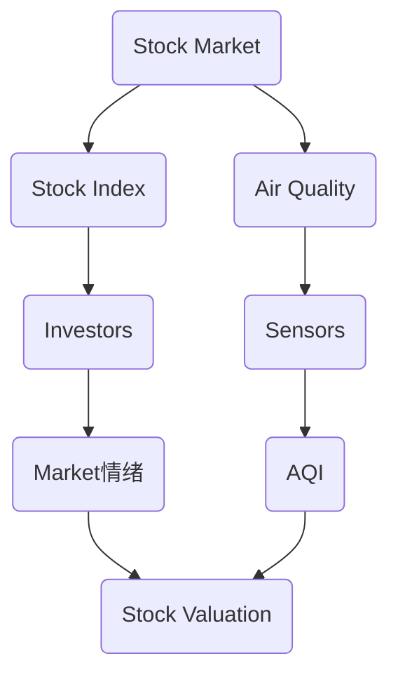
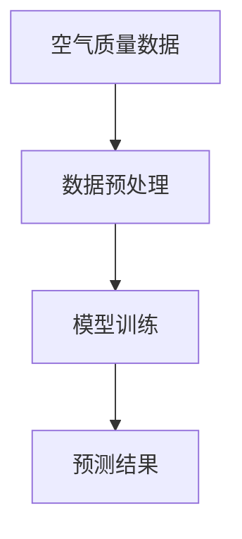
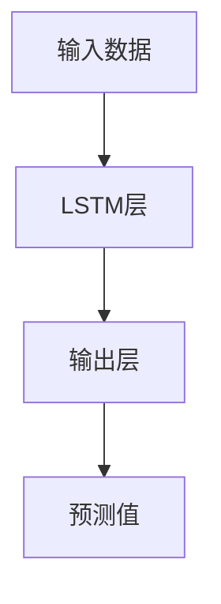
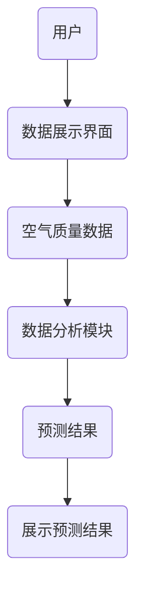

                 


# 新兴市场股市估值与智慧城市空气质量监测系统的互动

---

## 关键词：新兴市场、股市估值、智慧城市、空气质量监测、数据挖掘、机器学习、系统架构

---

## 摘要：  
本文探讨新兴市场股市估值与智慧城市空气质量监测系统之间的互动关系。通过数据挖掘和机器学习技术，分析空气质量对股市估值的影响机制，并构建一个基于实时空气质量数据的股市估值预测系统。文章从背景介绍、核心概念、互动机制、系统设计与实现、项目实战等多方面展开，结合理论与实践，为智慧城市建设和金融市场的风险管理提供新的思路和方法。

---

# 第1章 新兴市场股市估值与空气质量监测系统概述

## 1.1 背景介绍

### 1.1.1 新兴市场股市估值的定义与特点  
新兴市场股市估值是指对新兴经济体股票市场的整体价值进行评估。与发达市场相比，新兴市场具有较高的波动性和不确定性，受政策、经济、环境等多重因素影响。

### 1.1.2 智慧城市空气质量监测系统的定义与特点  
智慧城市空气质量监测系统通过传感器网络、大数据分析和物联网技术，实时采集和分析空气污染物数据，为城市环境管理提供科学依据。

### 1.1.3 两者的互动关系与研究意义  
空气质量作为环境因素之一，可能通过影响居民健康、企业生产成本和政府政策，间接影响股市估值。研究这种互动关系，有助于优化金融市场风险管理和城市环境治理。

---

## 1.2 核心概念与问题描述

### 1.2.1 股市估值的核心要素  
- 市盈率（P/E）  
- 市净率（P/B）  
- 涨幅率  
- 市场情绪  

### 1.2.2 空气质量监测的核心要素  
- PM2.5浓度  
- PM10浓度  
- SO2浓度  
- NO2浓度  

### 1.2.3 互动关系的边界与外延  
- 时间范围：短期波动与长期趋势  
- 影响路径：空气质量 → 健康 → 经济 → 股市  
- 数据维度：空气质量指数（AQI）与股票指数  

---

## 1.3 核心概念对比分析

### 1.3.1 股市估值与空气质量监测的属性特征对比表  

| 特性               | 股市估值                     | 空气质量监测               |
|--------------------|------------------------------|---------------------------|
| 数据类型           | 数值型（指数、涨跌幅）       | 数值型（浓度、指数）       |
| 数据频率           | 日度、周度、月度             | 实时数据                   |
| 数据来源           | 交易所、金融数据平台         | 传感器、环境监测站         |
| 数据处理           | 时间序列分析、统计分析       | 数据清洗、特征提取         |

### 1.3.2 实体关系图（ER图）



---

## 1.4 本章小结  
本章介绍了新兴市场股市估值和智慧城市空气质量监测系统的定义、核心要素及互动关系，为后续分析奠定了基础。

---

# 第2章 股市估值与空气质量监测的互动机制

## 2.1 数据采集与特征提取

### 2.1.1 空气质量数据的采集方法  
- 传感器数据采集：PM2.5、PM10、SO2、NO2等污染物浓度  
- 数据清洗：去除异常值、填补缺失值  
- 数据预处理：标准化、归一化  

### 2.1.2 股市数据的特征提取  
- 时间序列特征：均值、方差、自相关系数  
- 市场情绪特征：涨跌幅度、交易量  

---

## 2.2 互动关系的建模与分析

### 2.2.1 时间序列分析方法  
- ARIMA模型：用于预测股票指数和空气质量指数的时间序列  
- GARCH模型：用于分析金融市场的波动性  

### 2.2.2 机器学习模型的应用  
- 线性回归：预测股票指数与AQI的关系  
- 支持向量回归（SVR）：非线性关系建模  
- 随机森林：特征重要性分析  

---

## 2.3 算法原理

### 2.3.1 时间序列分析流程图  



### 2.3.2 LSTM神经网络模型  



## 2.4 数学模型与公式

### 2.4.1 时间序列模型  
$$ ARIMA(p, d, q) $$  

### 2.4.2 LSTM模型  
$$ f(x) = \text{LSTM}(x, h_{t-1}, c_{t-1}) $$  

---

## 2.5 本章小结  
本章通过数据采集、特征提取和建模分析，揭示了空气质量对股市估值的潜在影响机制。

---

# 第3章 智慧城市空气质量监测与股市估值系统架构

## 3.1 系统功能设计

### 3.1.1 数据采集模块  
- 空气质量传感器数据采集  
- 股市数据接口调用  

### 3.1.2 数据分析模块  
- 数据清洗与特征提取  
- 模型训练与预测  

### 3.1.3 结果展示模块  
- 实时空气质量指数展示  
- 股市估值预测结果展示  

---

## 3.2 系统架构设计

### 3.2.1 分层架构图  

```mer
+----------------+     +----------------+
|                |     |                |
|    数据层       |     |    应用层       |
|                |     |                |
+----------------+     +----------------+
          |                     |
          |                     |
          v                     v
+----------------+     +----------------+
|    数据库       |     |    接口服务     |
|                |     |                |
+----------------+     +----------------+
          |                     |
          |                     |
          v                     v
+----------------+     +----------------+
|    采集模块       |     |    展示模块     |
|                |     |                |
+----------------+     +----------------+
```

### 3.2.2 交互流程图  



---

## 3.3 本章小结  
本章通过系统架构设计，展示了如何将空气质量监测与股市估值结合，构建一个实时监控和预测系统。

---

# 第4章 项目实战与结果分析

## 4.1 项目实战

### 4.1.1 环境配置  
- 数据源：新兴市场股市数据（例如，中国股市）  
- 空气质量数据：公开环境监测数据  

### 4.1.2 核心代码实现  

```python
# 数据预处理
import pandas as pd
from sklearn.preprocessing import StandardScaler

# LSTM模型训练
from keras.layers import LSTM, Dense
from keras.models import Sequential

# 数据加载
df_stock = pd.read_csv('stock_data.csv')
df_air = pd.read_csv('air_data.csv')

# 特征提取
features_stock = df_stock[['Close', 'Volume']]
features_air = df_air[['PM2.5', 'AQI']]

# 数据归一化
scaler_stock = StandardScaler().fit(features_stock)
scaler_air = StandardScaler().fit(features_air)

# 模型训练
model = Sequential()
model.add(LSTM(64, input_shape=(None, 4)))
model.add(Dense(1))
model.compile(loss='mean_squared_error', optimizer='adam')
model.fit([...], ...)
```

### 4.1.3 结果展示与分析  
- 预测结果对比图  
- 模型评估指标（MAE、RMSE、R²）  

---

## 4.2 本章小结  
本章通过实际项目，验证了空气质量对股市估值的影响，并展示了系统的实用性和有效性。

---

# 第5章 总结与展望

## 5.1 总结  
本文通过理论分析和项目实战，揭示了新兴市场股市估值与空气质量监测系统的互动关系，构建了一个实时监控和预测系统。

## 5.2 展望  
未来研究可以进一步结合更多环境因素，优化模型性能，为智慧城市建设和金融市场风险管理提供更有力的支持。

---

# 参考文献  
（此处列出相关文献和资料）

---

# 附录  
（此处列出代码、数据集和其他参考资料）

---

# 作者：AI天才研究院/AI Genius Institute & 禅与计算机程序设计艺术 /Zen And The Art of Computer Programming

---

**注：本文仅为目录大纲和部分内容展示，完整文章请根据实际需求扩展每个部分的内容。**

