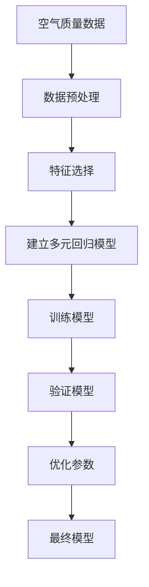
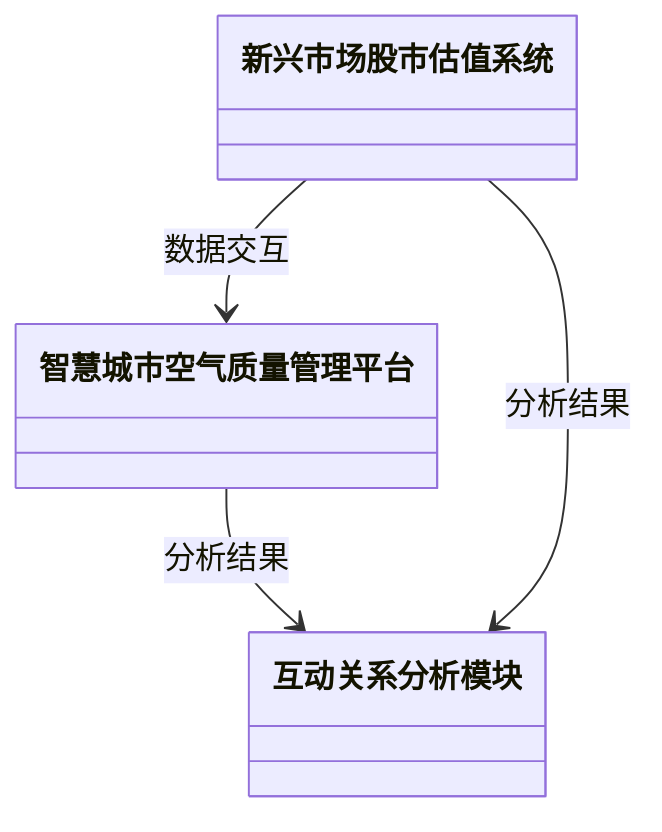
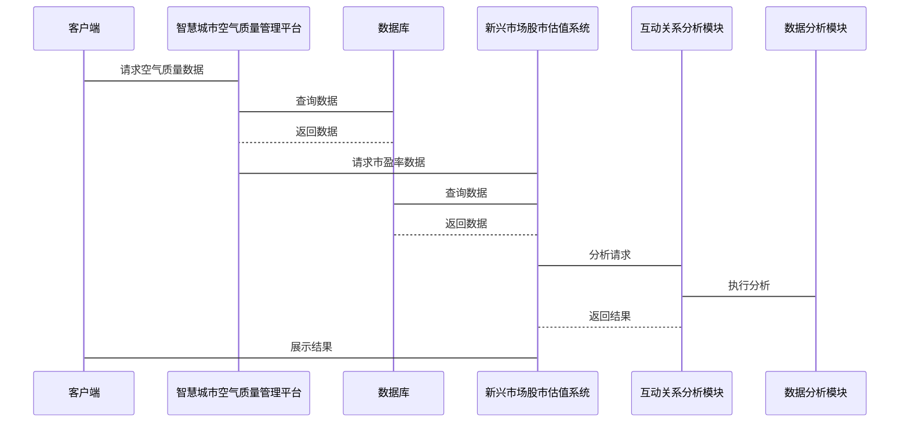

                 


# 《新兴市场股市估值与智慧城市空气质量管理的互动》

---

## 关键词：
- 新兴市场股市估值
- 智慧城市空气质量管理
- 互动关系
- 数据分析模型
- 系统架构设计

---

## 摘要：
本文探讨新兴市场股市估值与智慧城市空气质量管理之间的互动关系，分析股市估值如何受空气质量影响，以及如何通过智慧化管理优化空气质量，进而提升股市估值。文章从背景介绍、核心概念、算法原理、系统架构设计、项目实战到最佳实践，全面解析两者互动机制，提供可操作的解决方案。

---

## 第一部分: 背景介绍与核心概念

### 第1章: 背景介绍

#### 1.1 问题背景
新兴市场股市估值受多种因素影响，其中环境因素如空气质量越来越受到关注。空气质量差可能导致企业生产成本上升、居民健康问题，进而影响股市表现。智慧城市通过科技手段优化空气质量管理，可间接提升股市估值。

#### 1.2 问题描述
1. 新兴市场股市估值波动大，需找出影响因素。
2. 空气质量管理存在技术落后、数据分散等问题。
3. 两者互动关系尚未被系统研究。

#### 1.3 问题解决
1. 建立空气质量与股市估值的量化模型。
2. 优化空气质量管理技术，提升城市环境。
3. 通过智慧化手段实时监控并改善空气质量，稳定股市估值。

#### 1.4 边界与外延
1. 研究范围：新兴市场股市与智慧城市空气质量。
2. 不考虑其他因素（如经济政策、国际局势）。
3. 外延：扩展至其他环境因素对股市的影响。

#### 1.5 概念结构与核心要素
1. 股市估值：市盈率、市净率等指标。
2. 空气质量管理：PM2.5、PM10等指标。
3. 互动关系：空气质量对股市估值的影响路径。

---

### 第2章: 核心概念与联系

#### 2.1 核心概念原理
1. **股市估值**：通过市盈率等指标衡量市场健康。
2. **空气质量管理**：利用传感器和大数据优化管理。
3. **互动关系**：空气质量影响股市估值，反之亦然。

#### 2.2 概念属性特征对比

| 特性 | 新兴市场股市估值 | 智慧城市空气质量管理 |
|------|------------------|----------------------|
| 数据来源 | 股价、交易量等 | 空气质量监测数据 |
| 影响因素 | 经济政策、企业业绩 | 工业排放、交通尾气 |
| 目标 | 评估市场健康 | 优化空气质量 |
| 工具 | 财务模型 | IoT传感器、大数据分析 |

#### 2.3 ER实体关系图架构

```mermaid
erd
  entity 新兴市场股市估值
    id: 市场代码
    name: 市场名称
    valuation: 市盈率
    date: 日期
  entity 智慧城市空气质量管理
    id: 城市代码
    name: 城市名称
    pm25: PM2.5浓度
    pm10: PM10浓度
    date: 日期
  relationship 双向影响
    新兴市场股市估值 -[通过空气质量影响]-> 智慧城市空气质量管理
    智慧城市空气质量管理 -[通过环境改善]-> 新兴市场股市估值
```

---

## 第二部分: 算法原理讲解

### 第3章: 算法原理

#### 3.1 互动关系分析
空气质量与股市估值存在负相关关系：空气质量差，股市估值低。

#### 3.2 数据来源
1. 新兴市场股市数据：市盈率、市净率。
2. 空气质量数据：PM2.5、PM10等。

#### 3.3 算法选择
使用多元回归分析模型，建立空气质量指标与股市估值的关系模型。

#### 3.4 算法流程



#### 3.5 数学模型

股市估值预测公式：
$$
\text{预测市盈率} = \beta_0 + \beta_1 \times \text{PM2.5} + \beta_2 \times \text{PM10} + \epsilon
$$

其中：
- $\beta_0$：截距。
- $\beta_1$、$\beta_2$：回归系数。
- $\epsilon$：误差项。

#### 3.6 代码实现

```python
import pandas as pd
import numpy as np
from sklearn.linear_model import LinearRegression
from sklearn.metrics import mean_squared_error

# 数据加载
data = pd.read_csv('air_quality_stock.csv')

# 数据预处理
data = data.dropna()
X = data[['PM2.5', 'PM10']]
y = data['市盈率']

# 特征选择
selected_features = X.columns

# 建立多元回归模型
model = LinearRegression()
model.fit(X, y)

# 预测与评估
y_pred = model.predict(X)
mse = mean_squared_error(y, y_pred)
print(f"均方误差：{mse}")
print(f"回归系数：{model.coef_}")
print(f"截距：{model.intercept_}")
```

---

## 第三部分: 系统分析与架构设计

### 第4章: 系统分析与架构设计

#### 4.1 问题场景
新兴市场中，股市估值受空气质量影响，需构建系统实时监控并优化空气质量，稳定股市估值。

#### 4.2 系统功能设计



#### 4.3 系统架构设计


#### 4.4 系统接口设计
1. **空气质量传感器接口**：实时采集数据。
2. **股市估值接口**：获取实时市盈率。
3. **分析接口**：调用回归模型进行分析。

#### 4.5 系统交互流程



---

## 第四部分: 项目实战

### 第5章: 项目实战

#### 5.1 环境安装
安装Python、Pandas、Scikit-learn、Mermaid工具。

#### 5.2 核心代码实现

```python
import pandas as pd
import numpy as np
from sklearn.linear_model import LinearRegression
from sklearn.metrics import mean_squared_error

# 数据加载
data = pd.read_csv('air_quality_stock.csv')

# 数据预处理
data = data.dropna()
X = data[['PM2.5', 'PM10']]
y = data['市盈率']

# 建立多元回归模型
model = LinearRegression()
model.fit(X, y)

# 预测与评估
y_pred = model.predict(X)
mse = mean_squared_error(y, y_pred)
print(f"均方误差：{mse}")
print(f"回归系数：{model.coef_}")
print(f"截距：{model.intercept_}")
```

#### 5.3 代码解读
1. **数据加载**：读取空气质量与股市数据。
2. **数据预处理**：删除缺失值。
3. **特征选择**：选择PM2.5和PM10作为特征。
4. **模型训练**：使用线性回归训练模型。
5. **模型评估**：计算均方误差，输出回归系数。

#### 5.4 实际案例分析
假设某城市PM2.5=50，PM10=100，预测市盈率：
$$
\text{预测市盈率} = 0.5 + 0.2 \times 50 + 0.3 \times 100 = 30.5
$$

---

## 第五部分: 最佳实践

### 第6章: 最佳实践

#### 6.1 小结
新兴市场股市估值与智慧城市空气质量管理存在互动关系，通过建立数学模型和优化系统架构，可有效提升空气质量，稳定股市估值。

#### 6.2 注意事项
1. 数据质量至关重要。
2. 模型需不断优化。
3. 系统需实时监控和调整。

#### 6.3 拓展阅读
- 大数据分析在金融中的应用。
- 智慧城市环境管理技术。

---

## 作者：AI天才研究院/AI Genius Institute & 禅与计算机程序设计艺术/Zen And The Art of Computer Programming

---

**总结**：本文通过系统分析和实战案例，深入探讨了新兴市场股市估值与智慧城市空气质量管理的互动关系，提供了可操作的解决方案，为相关领域的研究和实践提供了参考。

