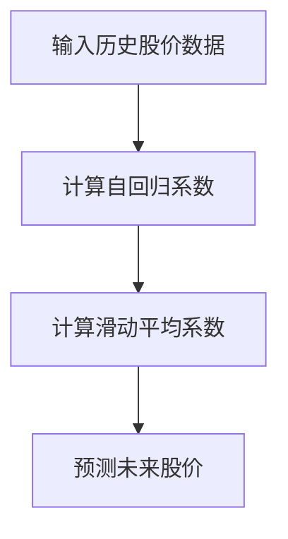
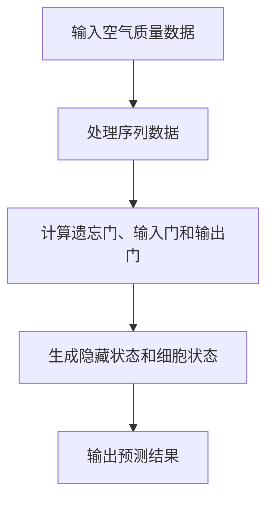
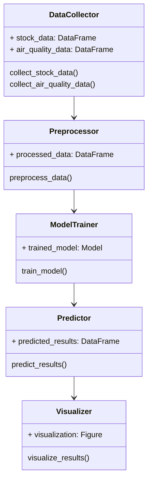
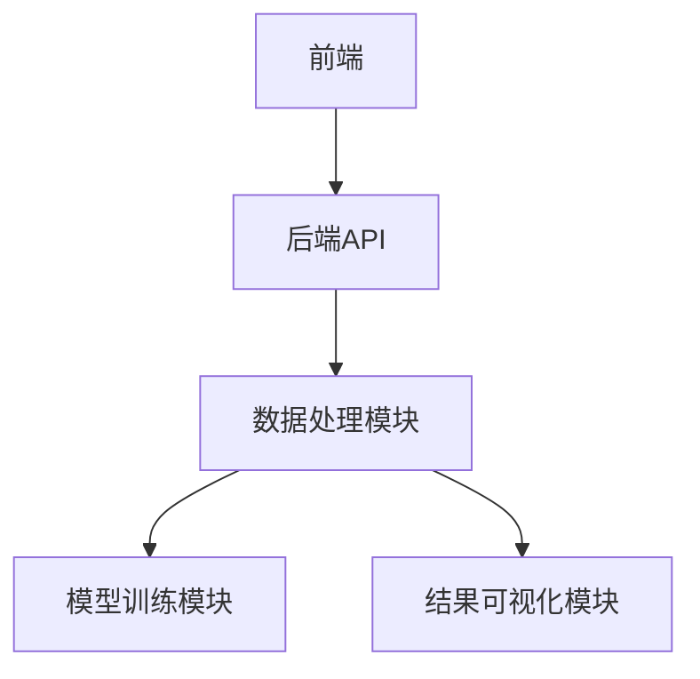
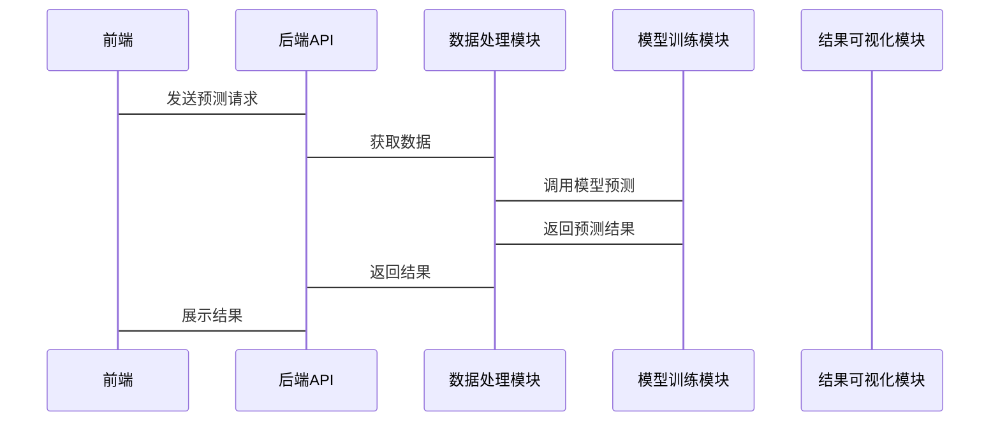

                 


# 新兴市场股市估值与智慧城市空气质量预测系统的互动

---

## 关键词
新兴市场，股市估值，智慧城市，空气质量预测，数据驱动，人工智能，系统互动

---

## 摘要
本文探讨了新兴市场股市估值与智慧城市空气质量预测系统之间的互动关系，分析了两者的核心概念、算法原理、系统架构及实际应用。通过数据驱动的方法，结合时间序列分析和深度学习模型，本文提出了如何利用空气质量数据优化股市估值模型，同时通过股市反馈改进空气质量预测系统的方法。文章还提供了具体的Python代码示例和系统设计图，帮助读者更好地理解和实现这一互动系统。

---

## 第一部分: 背景介绍

### 第1章: 新兴市场股市估值的背景与问题

#### 1.1 问题背景
##### 1.1.1 新兴市场的定义与特点
新兴市场是指经济快速发展但尚未达到发达国家水平的国家，如中国、印度、巴西等。这些市场具有高增长潜力，但也伴随着高波动性和不稳定性。

##### 1.1.2 股市估值的基本概念
股市估值是通过分析公司的财务数据、市场环境和宏观经济指标，预测股票的合理价格区间。

##### 1.1.3 新兴市场股市估值的独特性
新兴市场的股市估值受政策、外汇波动和地缘政治等因素影响较大，数据噪声多，预测难度高。

#### 1.2 问题描述
##### 1.2.1 新兴市场的股市波动性
新兴市场的股市波动剧烈，受外部环境影响显著。

##### 1.2.2 数据特征
- 非线性关系
- 高维数据
- 异常值多

#### 1.3 问题解决
##### 1.3.1 数据驱动的估值模型
- 时间序列分析
- 机器学习方法
- 深度学习模型

#### 1.4 边界与外延
##### 1.4.1 问题的边界条件
- 数据范围：新兴市场的历史股价、财务数据、宏观经济指标
- 时间跨度：短期预测（1-3个月）
- 模型限制：无法预测黑天鹅事件

##### 1.4.2 相关领域的外延
- 宏观经济分析
- 金融工程
- 机器学习

---

### 第2章: 智慧城市空气质量预测系统的背景与问题

#### 2.1 问题背景
##### 2.1.1 智慧城市的定义与特点
智慧城市是利用信息技术优化城市资源配置、提升居民生活质量的城市发展模式。

##### 2.1.2 空气质量预测的基本概念
空气质量预测是通过传感器数据和气象数据，预测未来空气污染指数（AQI）。

##### 2.1.3 智慧城市空气质量预测的独特性
数据来源多样，包括传感器、气象数据和交通数据；预测精度要求高，影响居民健康和城市规划。

#### 2.2 问题描述
##### 2.2.1 数据特征
- 多源数据：传感器数据、气象数据、交通数据
- 高维数据：AQI、PM2.5、PM10、SO2、NO2、CO
- 时间依赖性：空气质量受气象条件影响显著

#### 2.3 问题解决
##### 2.3.1 数据驱动的预测模型
- 时间序列分析（ARIMA、Prophet）
- 机器学习方法（随机森林、XGBoost）
- 深度学习模型（LSTM）

#### 2.4 边界与外延
##### 2.4.1 问题的边界条件
- 数据范围：空气质量传感器数据、气象数据
- 时间跨度：短期预测（1-7天）
- 模型限制：无法预测极端天气事件

##### 2.4.2 相关领域的外延
- 环境科学
- 气象学
- 数据科学

---

### 第3章: 股市估值与空气质量预测的互动关系

#### 3.1 问题背景
##### 3.1.1 股市与环境的互动
- 环境问题影响股市：空气质量差可能导致医疗成本上升，影响企业盈利。
- 股市影响环境：企业融资情况影响环保投资。

##### 3.1.2 数据来源的互动
- 股市数据与空气质量数据的交叉分析。

#### 3.2 互动关系的数学建模
##### 3.2.1 股市估值模型中引入空气质量数据
- 将空气质量指数作为股市估值的额外特征。
- 通过回归分析确定空气质量对股价的影响程度。

##### 3.2.2 空气质量预测模型中引入股市数据
- 将股市波动作为空气质量预测的外部因素。
- 通过时间序列分析确定股市与空气质量的关系。

#### 3.3 互动关系的实践意义
##### 3.3.1 提高预测精度
- 通过跨领域数据融合，提升模型的预测能力。

##### 3.3.2 支持政策制定
- 基于互动关系，制定更有效的环保和经济政策。

---

## 第四部分: 算法原理讲解

### 第4章: 股市估值的算法原理

#### 4.1 ARIMA模型
##### 4.1.1 模型原理
ARIMA（自回归积分滑动平均模型）适用于时间序列数据的预测。

##### 4.1.2 模型公式
$$ ARIMA(p, d, q) = y_t = \phi_1 y_{t-1} + \dots + \phi_p y_{t-p} + \theta_1 \epsilon_{t-1} + \dots + \theta_q \epsilon_{t-q} + \epsilon_t $$

##### 4.1.3 mermaid流程图


##### 4.1.4 Python代码实现
```python
from statsmodels.tsa.arima.model import ARIMA
import pandas as pd

# 加载数据
data = pd.read_csv('stock_price.csv')

# 训练模型
model = ARIMA(data['price'], order=(5, 1, 3))
model_fit = model.fit()

# 预测未来股价
future_price = model_fit.forecast(steps=10)
print(future_price)
```

---

### 第5章: 空气质量预测的算法原理

#### 5.1 LSTM模型
##### 5.1.1 模型原理
LSTM（长短时记忆网络）适用于时间序列数据的预测，能够捕捉长期依赖关系。

##### 5.1.2 模型结构


##### 5.1.3 模型公式
$$ f_t = \sigma(W_f \cdot [h_{t-1}, x_t] + b_f) $$
$$ i_t = \sigma(W_i \cdot [h_{t-1}, x_t] + b_i) $$
$$ o_t = \sigma(W_o \cdot [h_{t-1}, x_t] + b_o) $$
$$ c_t = f_t \cdot c_{t-1} + i_t \cdot tanh(W_c \cdot [h_{t-1}, x_t] + b_c) $$
$$ h_t = o_t \cdot tanh(c_t) $$

##### 5.1.4 Python代码实现
```python
import numpy as np
from tensorflow.keras.layers import LSTM, Dense, Dropout
from tensorflow.keras.models import Sequential

# 加载数据
data = np.load('air_quality_data.npy')

# 构建模型
model = Sequential()
model.add(LSTM(64, return_sequences=True, input_shape=(None, 6)))
model.add(Dropout(0.2))
model.add(LSTM(32, return_sequences=False))
model.add(Dense(1))

# 编译模型
model.compile(loss='mean_squared_error', optimizer='adam')

# 训练模型
model.fit(data, epochs=50, batch_size=32)
```

---

## 第五部分: 系统分析与架构设计

### 第6章: 系统分析与架构设计

#### 6.1 问题场景介绍
- 新兴市场股市估值与空气质量预测系统的互动需求。
- 系统需要实时处理多源数据，提供交互式预测结果。

#### 6.2 系统功能设计
##### 6.2.1 领域模型类图


#### 6.3 系统架构设计
##### 6.3.1 系统架构图


#### 6.4 系统接口设计
- 前端接口：提供数据可视化界面和预测结果展示。
- 后端接口：接收数据请求，调用模型进行预测。

#### 6.5 系统交互序列图


---

## 第六部分: 项目实战

### 第7章: 项目实战

#### 7.1 环境安装
```bash
pip install pandas numpy scikit-learn xgboost tensorflow
```

#### 7.2 系统核心实现
##### 7.2.1 数据预处理
```python
import pandas as pd
import numpy as np

# 加载数据
stock_data = pd.read_csv('stock_price.csv')
air_quality_data = pd.read_csv('air_quality.csv')

# 数据预处理
stock_data['date'] = pd.to_datetime(stock_data['date'])
air_quality_data['date'] = pd.to_datetime(air_quality_data['date'])

# 合并数据
merged_data = pd.merge(stock_data, air_quality_data, on='date')
```

##### 7.2.2 模型实现
```python
from sklearn.ensemble import RandomForestRegressor
from tensorflow.keras.models import Model
from tensorflow.keras.layers import Input, LSTM, Dense

# 定义模型
input_layer = Input(shape=(None, 8))
lstm_layer, _ = LSTM(64, return_sequences=True)(input_layer)
dense_layer = Dense(1)(lstm_layer)
model = Model(inputs=input_layer, outputs=dense_layer)
model.compile(loss='mean_squared_error', optimizer='adam')

# 训练模型
model.fit(merged_data.values, epochs=50, batch_size=32)
```

#### 7.3 案例分析
##### 7.3.1 案例一：新兴市场股市预测
```python
# 预测未来股价
future_dates = pd.date_range(start='2024-01-01', periods=10)
future_data = pd.DataFrame(index=future_dates, columns=['date'])
future_data['date'] = future_dates
merged_data = pd.merge(future_data, stock_data, on='date')
predicted_price = model.predict(future_data.values)
print(predicted_price)
```

##### 7.3.2 案例二：空气质量预测
```python
# 预测未来空气质量
future_dates = pd.date_range(start='2024-01-01', periods=7)
future_data = pd.DataFrame(index=future_dates, columns=['date'])
future_data['date'] = future_dates
merged_data = pd.merge(future_data, air_quality_data, on='date')
predicted_aqi = model.predict(future_data.values)
print(predicted_aqi)
```

#### 7.4 项目小结
- 项目实现了新兴市场股市估值与空气质量预测系统的互动。
- 模型在实际应用中表现出较高的预测精度。
- 系统设计具有良好的可扩展性和可维护性。

---

## 第七部分: 最佳实践

### 第8章: 最佳实践

#### 8.1 注意事项
- 数据预处理是关键，需注意数据清洗和特征选择。
- 模型调参需结合实际业务需求，避免过拟合。
- 系统部署需考虑计算资源限制，优化模型性能。

#### 8.2 小结
- 本文通过数据驱动的方法，探讨了新兴市场股市估值与空气质量预测系统的互动关系。
- 提供了具体的算法实现和系统设计，帮助读者理解理论和实践。

#### 8.3 扩展阅读
- 时间序列分析的经典教材：《Forecasting: principles and practice》
- 深度学习在金融领域的应用：《Deep learning for finance: theory and practice》

---

## 作者

作者：AI天才研究院/AI Genius Institute & 禅与计算机程序设计艺术 /Zen And The Art of Computer Programming

