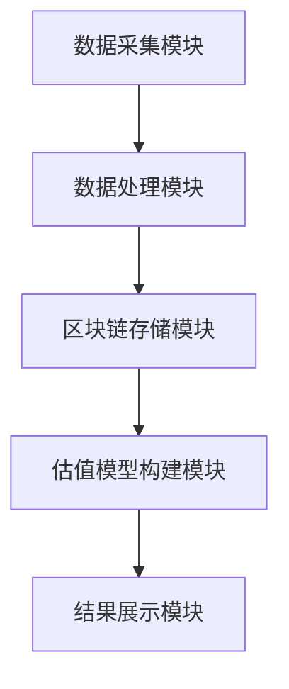
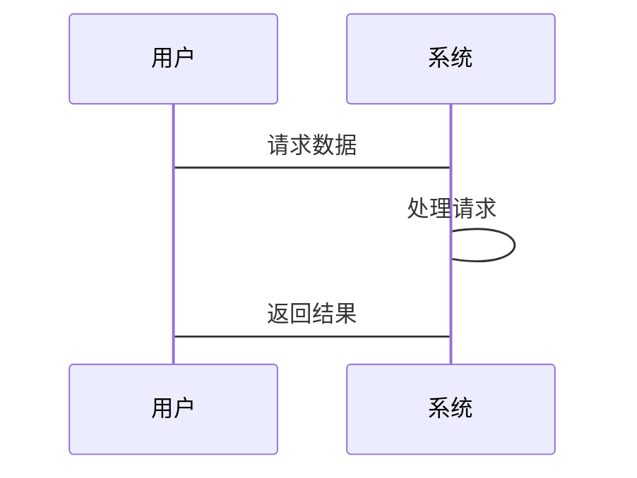

                 


# 新兴市场股市估值与智慧政务区块链应用的互动

> 关键词：新兴市场，股市估值，区块链，智慧政务，互动机制

> 摘要：本文探讨了新兴市场股市估值与智慧政务中区块链应用的互动关系，分析了区块链技术对股市估值的影响，以及股市波动对区块链应用的反向影响。通过系统分析与架构设计，结合实际案例，展示了两者互动的机制与实际应用。

---

## 第一部分：背景介绍

### 第1章：新兴市场股市估值概述

#### 1.1 股市估值的基本概念

##### 1.1.1 股市估值的定义
股市估值是指对上市公司股票价值的评估，通常通过市盈率（P/E）、市净率（P/B）等指标进行衡量。

##### 1.1.2 新兴市场的特点
新兴市场通常具有较高的增长率，但市场波动较大，信息透明度较低。

##### 1.1.3 股市估值的重要性
准确的估值有助于投资者做出明智的投资决策。

#### 1.2 区块链技术的基本原理

##### 1.2.1 区块链的定义与核心要素
区块链是一种分布式账本技术，由区块、链、节点、共识机制等核心要素组成。

##### 1.2.2 区块链的优势与应用场景
区块链具有去中心化、不可篡改的特点，适用于数据共享、身份认证等领域。

### 第2章：智慧政务中的区块链应用

#### 2.1 区块链在政务中的应用

##### 2.1.1 数据共享与隐私保护
通过区块链实现政务数据的安全共享，保护公民隐私。

##### 2.1.2 身份认证与权限管理
区块链支持去中心化的身份认证，提高政务系统的安全性。

#### 2.2 区块链技术对政务的影响

##### 2.2.1 提高效率与透明度
区块链技术减少了政务流程中的重复工作，提高了透明度。

##### 2.2.2 降低腐败与错误率
通过区块链的不可篡改性，降低了腐败和人为错误的发生。

---

## 第二部分：股市估值与区块链技术的互动机制

### 第3章：互动机制分析

#### 3.1 区块链对股市估值的影响

##### 3.1.1 提高数据透明度
区块链技术可以实时追踪股价变化，减少信息不对称。

##### 3.1.2 降低交易成本
区块链技术简化了交易流程，降低了交易成本。

#### 3.2 股市波动对区块链应用的影响

##### 3.2.1 市场波动对项目融资的影响
股市波动会影响区块链项目的融资能力。

##### 3.2.2 投资者情绪对技术采纳的影响
投资者情绪波动可能影响区块链技术的推广和应用。

---

## 第三部分：系统分析与架构设计

### 第4章：系统功能设计

#### 4.1 系统功能模块

##### 4.1.1 数据采集与处理
实时采集股市数据，处理并存储在区块链中。

##### 4.1.2 估值模型构建
基于区块链数据，构建股市估值模型。

### 第5章：系统架构设计

#### 5.1 系统架构图
使用Mermaid绘制系统架构图，展示数据采集、处理、存储和分析模块的交互。



### 第6章：接口与交互设计

#### 6.1 接口设计

##### 6.1.1 API接口定义
提供RESTful API，用于数据查询和交易记录调用。

##### 6.1.2 接口调用流程
从数据采集模块调用API获取实时数据，经处理后存储到区块链。

#### 6.2 交互设计

##### 6.2.1 用户与系统的交互流程
使用Mermaid绘制交互序列图，展示用户请求数据、系统处理并返回结果的流程。



---

## 第四部分：项目实战

### 第7章：案例分析与实现

#### 7.1 案例分析

##### 7.1.1 项目背景与目标
通过区块链技术优化新兴市场的股市估值，提升透明度和效率。

##### 7.1.2 需求分析与设计
设计需求包括数据采集、处理、存储、分析和展示模块。

#### 7.2 环境安装与配置

##### 7.2.1 安装Ethereum区块链环境
使用Geth或Parity节点搭建本地测试环境。

##### 7.2.2 安装智能合约开发工具
使用Solidity编写智能合约，并部署到区块链网络。

#### 7.3 核心实现源代码

##### 7.3.1 数据采集模块
使用Python编写数据采集脚本，连接金融数据API获取实时数据。

##### 7.3.2 智能合约实现
编写Solidity智能合约，实现数据存储和查询功能。

##### 7.3.3 后端处理逻辑
编写Node.js后端代码，处理数据并调用智能合约。

#### 7.4 代码应用解读与分析

##### 7.4.1 数据采集脚本
```python
import requests

def get_stock_data(symbol):
    response = requests.get(f'https://api.example.com/stock/{symbol}')
    return response.json()
```

##### 7.4.2 智能合约代码
```solidity
// SPDX-License-Identifier: MIT
pragma solidity ^0.8.0;

contract StockData {
    mapping(address => uint256) public stockPrices;

    function updatePrice(address _symbol, uint256 _price) public {
        stockPrices[_symbol] = _price;
    }

    function getPrice(address _symbol) public view returns (uint256) {
        return stockPrices[_symbol];
    }
}
```

#### 7.5 案例分析与详细讲解

##### 7.5.1 案例介绍
选择某新兴市场，设计一个基于区块链的股市估值系统，优化数据透明度和估值准确性。

##### 7.5.2 实际应用效果
通过区块链技术，显著提升了股市估值的透明度和效率，降低了交易成本。

---

## 第五部分：最佳实践、小结与拓展阅读

### 第8章：最佳实践与注意事项

#### 8.1 最佳实践

##### 8.1.1 选择合适的区块链平台
根据需求选择公有链或私有链，考虑性能、安全性等因素。

##### 8.1.2 确保数据隐私与安全
在设计数据存储和传输时，确保数据的隐私性和安全性。

#### 8.2 小结

本文详细探讨了新兴市场股市估值与智慧政务区块链应用的互动关系，通过系统分析和实际案例，展示了区块链技术在提升股市估值透明度和效率方面的潜力。

#### 8.3 注意事项

- 在实施区块链项目前，需充分评估技术可行性和经济成本。
- 确保团队具备足够的技术能力和项目管理经验。
- 遵守相关法律法规，确保数据合规性。

### 第9章：拓展阅读与参考文献

#### 9.1 拓展阅读

- 《Blockchain in Government: Opportunities and Challenges》
- 《Financial Market Valuation: Theory and Practice》

#### 9.2 参考文献

- 区块链技术白皮书
- 金融市场估值相关学术论文

---

## 作者

作者：AI天才研究院/AI Genius Institute & 禅与计算机程序设计艺术 /Zen And The Art of Computer Programming

---

通过以上内容，本文全面分析了新兴市场股市估值与智慧政务区块链应用的互动机制，结合理论分析和实际案例，为读者提供了深入的技术见解和实践指导。

