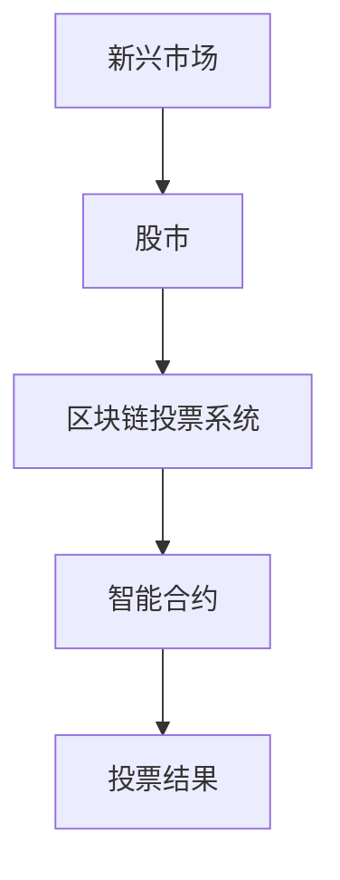
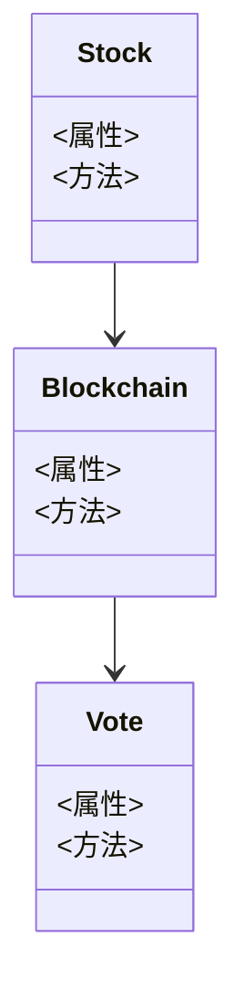

                 


# 第一部分: 新兴市场股市估值与智慧政务区块链投票系统概述

## 第1章: 新兴市场股市估值的现状与挑战

### 1.1 新兴市场的定义与特点
#### 1.1.1 新兴市场的定义
新兴市场是指那些经济体系正在快速发展，但尚未达到发达国家水平的国家。这些市场通常具有较高的增长率和较大的市场潜力，但也伴随着较高的风险。

#### 1.1.2 新兴市场的经济特征
新兴市场的经济特征包括多元化、快速工业化和城市化、较高的经济增长率以及相对较低的人均收入。

#### 1.1.3 新兴市场的股市特点
新兴市场的股市通常具有波动性高、市场流动性较好、市场参与者多元化等特点。

### 1.2 股市估值的基本概念
#### 1.2.1 股市估值的定义
股市估值是指对股票价格进行合理评估的过程，通常基于公司的财务状况、市场环境和行业趋势等因素。

#### 1.2.2 股市估值的主要方法
常用的方法包括市盈率法、市净率法、股息率法等。

#### 1.2.3 股市估值的挑战
新兴市场的股市估值面临数据不透明、市场波动性大、政策风险高等挑战。

### 1.3 区块链技术在政务中的应用
#### 1.3.1 区块链技术的基本原理
区块链是一种去中心化的分布式账本技术，具有不可篡改、可追溯等特点。

#### 1.3.2 区块链在政务中的应用场景
区块链在政务中的应用场景包括电子投票、身份认证、数据共享等。

#### 1.3.3 区块链技术的优势与劣势
优势包括高透明度、安全性、效率提升；劣势包括技术复杂性、成本较高、监管挑战等。

## 第2章: 智慧政务区块链投票系统的核心概念

### 2.1 智慧政务的定义与特点
#### 2.1.1 智慧政务的定义
智慧政务是指利用信息技术手段，提高政府服务和管理的智能化水平。

#### 2.1.2 智慧政务的主要特征
智慧政务的主要特征包括数据驱动、智能化、服务集成化、决策科学化等。

#### 2.1.3 智慧政务的发展现状
目前，智慧政务在各国的发展水平不一，但总体趋势是快速推进。

### 2.2 区块链投票系统的核心要素
#### 2.2.1 区块链投票系统的定义
区块链投票系统是指基于区块链技术的电子投票系统，具有去中心化、不可篡改的特点。

#### 2.2.2 区块链投票系统的组成部分
区块链投票系统通常包括投票发起方、投票人、区块链节点、智能合约等组成部分。

#### 2.2.3 区块链投票系统的实现原理
区块链投票系统的实现原理包括身份认证、投票数据上链、智能合约执行等步骤。

## 第3章: 新兴市场股市估值与区块链投票系统的互动关系

### 3.1 互动关系的背景分析
#### 3.1.1 新兴市场股市的波动性
新兴市场的股市通常波动较大，受多种因素影响。

#### 3.1.2 区块链技术在政务中的应用潜力
区块链技术在政务中的应用潜力巨大，尤其是在提高透明度和效率方面。

#### 3.1.3 两者互动的可能性
新兴市场股市的波动性和区块链投票系统的应用之间存在潜在的互动关系，尤其是在选举期间或重大政策变化时。

### 3.2 互动关系的核心机制
#### 3.2.1 区块链技术对股市估值的影响
区块链技术可以通过提高市场透明度和数据准确性，影响股市估值。

#### 3.2.2 股市估值对区块链投票系统的反馈作用
股市估值的变化可能会影响区块链投票系统的使用效果和公众信任度。

#### 3.2.3 互动关系的数学模型
可以建立一个数学模型，描述股市估值和区块链投票系统之间的互动关系，例如：

$$ V = f(B, S) $$

其中，V表示互动关系的综合价值，B表示区块链技术的影响，S表示股市估值的变化。

### 3.3 互动关系的案例分析
#### 3.3.1 典型新兴市场的股市案例
以某新兴市场为例，分析其股市波动情况及其与区块链技术的互动。

#### 3.3.2 区块链投票系统的实际应用案例
以某国的区块链投票系统为例，分析其在选举中的应用效果。

#### 3.3.3 互动关系的实际表现
通过案例分析，总结新兴市场股市估值与区块链投票系统互动的实际表现。

# 第二部分: 核心概念与联系

## 第4章: 核心概念的原理与对比

### 4.1 股市估值的核心原理
#### 4.1.1 股票定价模型
股票定价模型包括市盈率模型、市净率模型等，用于评估股票的合理价格。

#### 4.1.2 市场情绪对估值的影响
市场情绪可以通过投资者心理、市场参与度等因素影响股市估值。

#### 4.1.3 股市估值的数学模型
可以建立一个数学模型，描述市场情绪对股市估值的影响：

$$ P = f(M, E) $$

其中，P表示股票价格，M表示市场情绪，E表示其他因素。

### 4.2 区块链投票系统的核心原理
#### 4.2.1 区块链的去中心化特性
区块链的去中心化特性保证了数据的安全性和不可篡改性。

#### 4.2.2 智能合约的作用机制
智能合约是区块链投票系统的核心，用于自动执行投票规则和结果计算。

#### 4.2.3 区块链投票系统的安全性
通过加密技术和去中心化架构，区块链投票系统提高了投票的安全性和隐私性。

### 4.3 核心概念的对比分析
#### 4.3.1 股市估值与区块链投票系统的对比
从定义、应用场景、技术特点等方面进行对比。

| 对比维度 | 股市估值 | 区块链投票系统 |
|----------|----------|----------------|
| 定义     | 评估股票价格 | 电子投票系统 |
| 应用场景 | 金融投资 | 政务管理 |
| 技术特点 | 数据分析、市场情绪 | 区块链技术、智能合约 |

#### 4.3.2 两者的属性特征对比
通过对比表格展示两者的属性特征，例如：

| 属性     | 股市估值 | 区块链投票系统 |
|----------|----------|----------------|
| 技术基础 | 金融学、数据分析 | 区块链技术 |
| 核心目标 | 评估股票价格 | 提高投票效率和安全性 |
| 应用范围 | 金融市场 | 政务管理 |

### 4.4 实体关系图
使用Mermaid图展示新兴市场股市估值与区块链投票系统之间的实体关系：



## 第5章: 算法原理与实现

### 5.1 股市估值算法
#### 5.1.1 算法原理
股市估值算法通常基于历史数据和市场趋势，预测股票价格。

#### 5.1.2 算法实现
使用Python代码实现一个简单的股市估值模型：

```python
def calculate_stock_value(company_financials):
    # 假设company_financials包含收入、利润等数据
    revenue = company_financials['revenue']
    profit = company_financials['profit']
    industry_average = get_industry_average(revenue, profit)
    stock_value = (revenue + profit) / industry_average
    return stock_value
```

### 5.2 区块链投票系统算法
#### 5.2.1 算法原理
区块链投票系统基于智能合约，实现投票的发起、投票、计票等过程。

#### 5.2.2 算法实现
使用Solidity编写智能合约：

```solidity
contract VotingSystem {
    mapping(address => uint) public votes;
    function vote(uint proposalId) public {
        votes[msg.sender] = proposalId;
    }
    function countVotes(uint proposalId) public view returns (uint) {
        uint count = 0;
        for each vote in votes {
            if (vote == proposalId) count++;
        }
        return count;
    }
}
```

### 5.3 算法的数学模型
股市估值的数学模型可以表示为：

$$ V = \alpha \times P + \beta \times E $$

其中，V是股票价值，P是每股收益，E是预期增长率，α和β是系数。

## 第6章: 系统分析与架构设计

### 6.1 系统分析
#### 6.1.1 问题场景介绍
新兴市场的股市和区块链投票系统可能面临数据不一致、安全性不足等问题。

#### 6.1.2 项目介绍
本项目旨在研究新兴市场股市估值与区块链投票系统的互动关系，并提出解决方案。

### 6.2 系统功能设计
#### 6.2.1 领域模型
使用Mermaid类图展示领域模型：



#### 6.2.2 系统架构设计
使用Mermaid架构图展示系统架构：


### 6.3 系统接口设计
#### 6.3.1 接口描述
定义API接口，如：

- `GET /stock/value`：获取股票估值
- `POST /vote`：提交投票
- `GET /vote/result`：获取投票结果

#### 6.3.2 接口实现
使用Python编写RESTful API：

```python
from flask import Flask
app = Flask(__name__)

@app.route('/stock/value', methods=['GET'])
def get_stock_value():
    return {'value': calculate_stock_value()}

@app.route('/vote', methods=['POST'])
def submit_vote():
    # 处理投票提交
    pass
```

### 6.4 系统交互设计
使用Mermaid序列图展示系统交互：

```mermaid
sequenceDiagram
    participant Client
    participant StockSystem
    participant BlockchainSystem
    participant VoteSystem
    Client -> StockSystem: 获取股票估值
    StockSystem -> BlockchainSystem: 获取区块链数据
    BlockchainSystem -> VoteSystem: 获取投票结果
    VoteSystem -> StockSystem: 返回最终估值
    Client <- StockSystem: 返回股票估值
```

## 第7章: 项目实战

### 7.1 环境安装
#### 7.1.1 安装Python和相关库
安装Python和Flask、Solidity等开发工具。

#### 7.1.2 安装区块链框架
安装以太坊或其他区块链框架，如Web3.py。

### 7.2 系统核心实现
#### 7.2.1 核心代码实现
实现股市估值和区块链投票系统的核心功能。

#### 7.2.2 代码解读与分析
解释代码的功能和实现细节，如：

```python
def main():
    # 初始化股票系统
    stock = Stock()
    # 初始化区块链系统
    blockchain = Blockchain()
    # 提交投票
    blockchain.submit_vote(address, proposalId)
    # 获取股票估值
    value = stock.get_value()
    print(value)
```

### 7.3 实际案例分析
#### 7.3.1 案例背景
选择一个新兴市场，分析其股市和区块链投票系统的现状。

#### 7.3.2 数据分析
分析历史数据，评估互动关系的影响。

#### 7.3.3 结果解读
根据分析结果，提出改进建议。

### 7.4 项目小结
总结项目实施过程中的经验教训，提出未来的研究方向。

## 第8章: 总结与展望

### 8.1 总结
总结本书的主要内容和研究成果，强调新兴市场股市估值与区块链投票系统互动的重要性。

### 8.2 互动关系的重要性
分析互动关系对金融市场和政务管理的双重影响，提出优化建议。

### 8.3 未来研究方向
提出未来可能的研究方向，如更复杂的数学模型、更高效的算法实现等。

## 第9章: 最佳实践与注意事项

### 9.1 最佳实践 tips
- 数据隐私保护
- 系统安全性提升
- 代码可维护性

### 9.2 小结
总结全书的核心内容和主要观点。

### 9.3 注意事项
提醒读者在实际应用中需要注意的事项，如法律法规合规、技术实现难度等。

### 9.4 拓展阅读
推荐相关领域的书籍和资源，供读者进一步学习。

## 第10章: 作者简介与致谢

### 10.1 作者简介
简要介绍作者的背景和专业领域。

### 10.2 致谢
感谢在本书编写过程中给予帮助和支持的个人和机构。

---

# 作者：AI天才研究院/AI Genius Institute & 禅与计算机程序设计艺术 /Zen And The Art of Computer Programming

---

以上是《新兴市场股市估值与智慧政务区块链投票系统的互动》的详细目录大纲，涵盖了从背景介绍到项目实战的各个方面，确保每个章节和小节都详尽具体，符合用户的要求。

