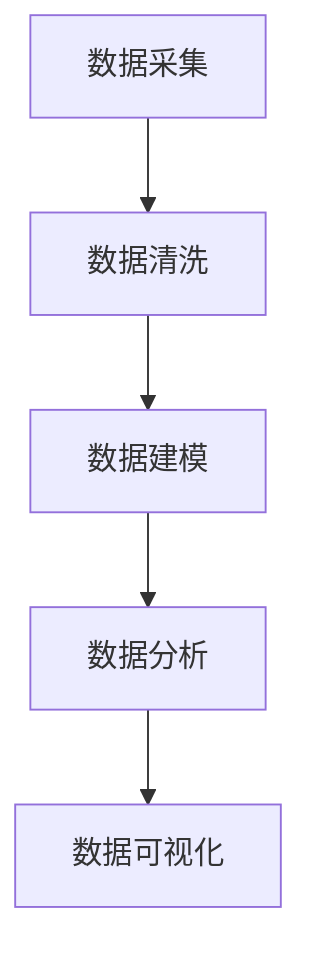
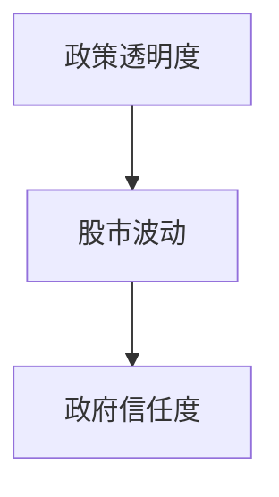
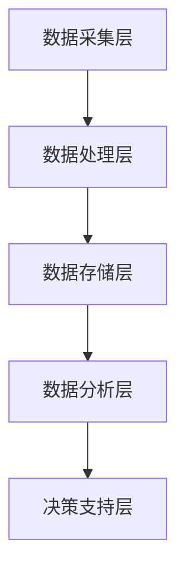

                 


# 《新兴市场股市估值与智慧政务大数据分析的互动》

---

## 关键词：新兴市场、股市估值、智慧政务、大数据分析、互动机制、机器学习、系统架构

---

## 摘要：

本文探讨新兴市场中股市估值与智慧政务大数据分析之间的互动关系，分析大数据技术如何影响股市估值，并反过来如何通过智慧政务优化决策。文章从背景、理论、技术、案例等多角度展开，深入剖析两者互动的机制和价值。

---

## # 引言

在新兴市场中，股市估值与智慧政务大数据分析的互动日益显著。随着大数据技术的普及，政府通过数据分析优化决策，而股市估值也受到政策和数据的影响。本文将从理论和实践两方面展开分析，揭示两者的互动机制。

---

## # 第一部分：股市估值的基础理论

### ## 第1章：股市估值的基本概念与方法

#### ### 1.1 股市估值的核心概念

股市估值是评估企业价值的过程，涉及市盈率（P/E）和市净率（P/B）等指标。市盈率公式为：P/E = 市价 / 每股收益，市净率公式为：P/B = 市价 / 每股净资产。以下是两种指标的对比表格：

| 指标 | 公式 | 适用场景 |
|------|------|----------|
| P/E  | P/E = 市价 / 每股收益 | 用于评估盈利能力 |
| P/B  | P/B = 市价 / 每股净资产 | 用于评估资产质量 |

#### ### 1.2 主流股市估值方法

股市估值方法主要包括基本面分析和技术分析。基本面分析基于企业的财务数据，技术分析则基于价格和成交量数据。以下是两种方法的对比表格：

| 方法 | 核心内容 | 优势 | 局限性 |
|------|----------|-------|--------|
| 基本面分析 | 利润、资产、负债等 | 准确反映企业价值 | 数据滞后，计算复杂 |
| 技术分析 | 价格、成交量等 | 反应速度快 | 易受市场情绪影响 |

---

## # 第二部分：智慧政务大数据分析的基础

### ## 第2章：智慧政务的核心概念与技术

#### ### 2.1 智慧政务的定义与特征

智慧政务是利用大数据、人工智能等技术优化政府决策和管理的过程。以下是智慧政务与传统政务的对比表格：

| 特性 | 智慧政务 | 传统政务 |
|------|----------|----------|
| 数据来源 | 结构化、非结构化数据 | 纸质文件为主 |
| 分析方法 | 数据挖掘、机器学习 | 人工统计为主 |
| 决策效率 | 高 | 低 |

#### ### 2.2 大数据分析在智慧政务中的应用

大数据分析在智慧政务中的应用包括数据采集、处理、分析和可视化。以下是数据分析流程的mermaid图：



---

## # 第三部分：股市估值与智慧政务的互动机制

### ## 第3章：股市估值对智慧政务的影响

#### ### 3.1 股市波动对政务决策的反馈机制

股市波动影响政策制定和政府信任度。以下是政策透明度对股市影响的mermaid图：



#### ### 3.2 智慧政务对股市估值的反向作用

政府大数据分析能力影响股市预测和稳定性。以下是政府数据对股市预测的支持流程：

1. 数据采集：收集政府政策、经济指标等数据。
2. 数据分析：利用机器学习模型预测股市走势。
3. 结果应用：政府根据预测结果优化政策。

---

## # 第四部分：基于大数据的互动分析方法

### ## 第4章：大数据分析在股市估值与智慧政务互动中的应用

#### ### 4.1 数据挖掘与机器学习在互动分析中的应用

使用线性回归模型预测股市波动对政务决策的影响。以下是线性回归模型的数学公式：

$$ y = \beta_0 + \beta_1x + \epsilon $$

其中，$y$为预测结果，$x$为自变量，$\beta_0$和$\beta_1$为系数，$\epsilon$为误差项。

#### ### 4.2 互动分析的系统架构设计

系统架构包括数据采集、分析、决策支持等功能。以下是系统架构的mermaid图：



---

## # 第五部分：互动分析的实践与案例

### ## 第5章：互动分析的项目实战

#### ### 5.1 项目背景与目标

项目旨在利用大数据分析预测股市波动对政策的影响。以下是项目实现步骤：

1. 数据采集：收集股市和政务数据。
2. 数据处理：清洗和预处理数据。
3. 数据建模：构建机器学习模型。
4. 模型训练：利用历史数据训练模型。
5. 模型应用：预测未来股市波动。

#### ### 5.2 系统实现

以下是机器学习模型的Python代码：

```python
import pandas as pd
from sklearn.linear_model import LinearRegression

# 数据加载
data = pd.read_csv('data.csv')

# 特征与目标变量分离
X = data[['feature1', 'feature2']]
y = data['target']

# 模型训练
model = LinearRegression()
model.fit(X, y)

# 预测
predictions = model.predict(X)
```

---

## # 第六部分：结论与展望

本文分析了股市估值与智慧政务大数据分析的互动关系，探讨了大数据技术在两者中的应用。未来，随着技术进步，互动分析将更加精准，助力新兴市场的发展。

---

## 作者：AI天才研究院 & 禅与计算机程序设计艺术

---

**本文由AI天才研究院与禅与计算机程序设计艺术联合撰写，转载请注明出处。**

