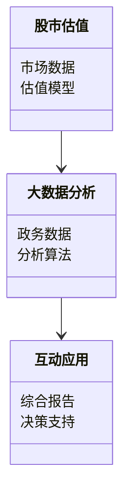

                 


# 新兴市场股市估值与智慧政务大数据应用的互动

> 关键词：新兴市场、股市估值、智慧政务、大数据应用、互动机制

> 摘要：本文探讨了新兴市场股市估值与智慧政务大数据应用之间的互动关系，分析了两者的核心概念、算法原理、系统架构及实际应用场景，最后提出了优化建议。

---

## 第1章: 新兴市场股市估值与智慧政务大数据的互动背景

### 1.1 问题背景

#### 1.1.1 新兴市场股市估值的现状与挑战
新兴市场通常具有高增长潜力，但也伴随着高波动性和信息不对称的问题。股市估值需要考虑多种因素，包括宏观经济指标、公司基本面和市场情绪等。

#### 1.1.2 智慧政务大数据的发展趋势
智慧政务通过大数据技术提高政府决策效率和公共服务质量。大数据在政务领域的应用日益广泛，涵盖了数据采集、处理、分析和可视化等多个环节。

#### 1.1.3 两者互动的必要性与潜在价值
股市估值与智慧政务大数据的互动可以通过数据共享和技术创新，提升股市分析的准确性，同时优化政府决策过程。

---

## 第2章: 核心概念与联系

### 2.1 核心概念原理

#### 2.1.1 股市估值的数学模型
常用的估值方法包括：
- **DCF模型**：$$DCF = \frac{CF}{(r - g)}$$
- **PE指标**：$$PE = \frac{Stock Price}{Earnings Per Share}$$
- **PEG指标**：$$PEG = \frac{PE}{Growth\ rate}$$

#### 2.1.2 智慧政务大数据的处理流程
1. 数据采集
2. 数据清洗
3. 数据分析
4. 数据可视化

### 2.2 概念属性特征对比

| 概念       | 特征                         |
|------------|------------------------------|
| 股市估值   | 数据来源：市场数据、公司财报 |
|            | 分析目标：股票价格预测       |
| 智慧政务大数据 | 数据来源：政府数据、社会数据 |
|             | 分析目标：政策优化、服务提升 |

### 2.3 ER实体关系图


---

## 第3章: 股市估值算法原理

### 3.1 算法原理

#### 3.1.1 基于DCF模型的改进算法
改进后的DCF模型结合了大数据分析，能够更好地预测未来现金流。

#### 3.1.2 基于机器学习的估值方法
使用支持向量回归（SVR）模型：
$$y = \omega \cdot x + b$$

### 3.2 实例分析

#### 3.2.1 新兴市场股市估值实战
以某新兴市场为例，通过大数据分析，发现市场波动与政策变化的相关性。

#### 3.2.2 大数据对估值的优化作用
通过大数据分析，优化了传统估值模型的预测精度。

---

## 第4章: 智慧政务大数据分析算法

### 4.1 数据预处理与清洗

#### 4.1.1 数据清洗流程
1. 去重
2. 填补缺失值
3. 标准化

### 4.2 数据挖掘与分析

#### 4.2.1 常见算法
- 聚类：K-means
- 分类：决策树、随机森林
- 回归：线性回归

#### 4.2.2 支持向量机（SVM）公式
$$\text{max} \frac{1}{2}||\omega||^2$$
$$\text{subject to} \ y_i(\omega \cdot x_i + b) \geq 1$$

---

## 第5章: 互动系统分析

### 5.1 问题场景

#### 5.1.1 新兴市场股市与政务大数据的互动需求
通过大数据分析，实时监控市场动态，辅助政府制定政策。

#### 5.1.2 互动中的数据共享与隐私保护
需要建立数据共享机制，同时确保数据隐私和安全。

### 5.2 系统架构设计

#### 5.2.1 分层架构


---

## 第6章: 项目实战

### 6.1 环境安装

```bash
pip install pandas numpy scikit-learn
```

### 6.2 核心实现

```python
import pandas as pd
from sklearn.svm import SVC

# 数据预处理
data = pd.read_csv('data.csv')
X = data.drop('target', axis=1)
y = data['target']

# 模型训练
model = SVC()
model.fit(X, y)

# 预测
print(model.predict(X))
```

### 6.3 案例分析

#### 6.3.1 新兴市场股市估值案例
通过大数据分析，发现某行业的平均PE值异常，预测行业趋势。

#### 6.3.2 智慧政务大数据应用案例
通过数据挖掘，优化政府资源配置，提升公共服务效率。

---

## 第7章: 最佳实践与总结

### 7.1 小结
股市估值与智慧政务大数据的互动能够提升市场分析的准确性，优化政府决策过程。

### 7.2 注意事项
- 数据安全与隐私保护
- 模型的可解释性和稳定性

### 7.3 未来展望
- 更多领域的大数据应用
- 更智能的互动机制

---

## 作者

作者：AI天才研究院/AI Genius Institute & 禅与计算机程序设计艺术 /Zen And The Art of Computer Programming

